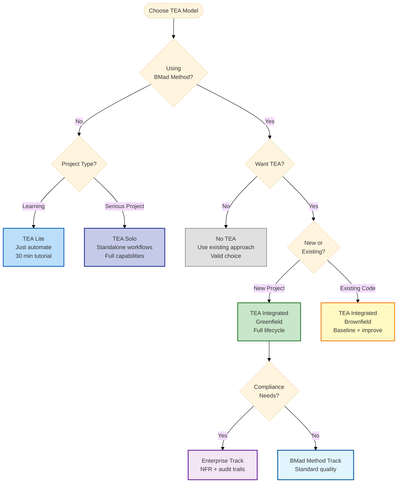
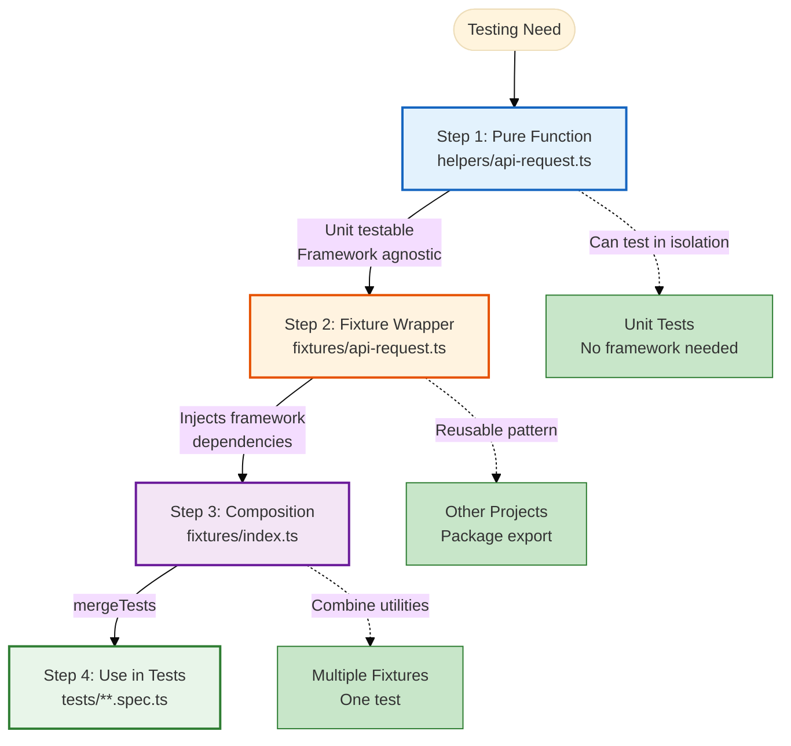
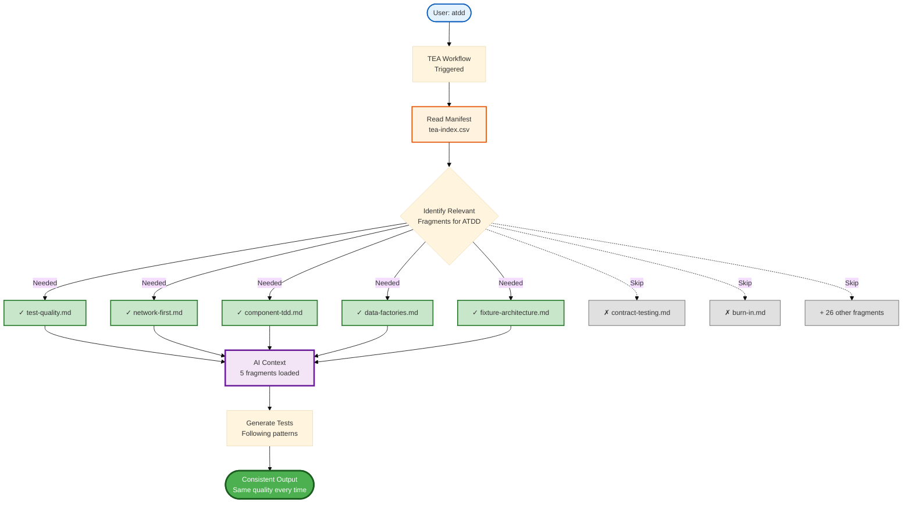
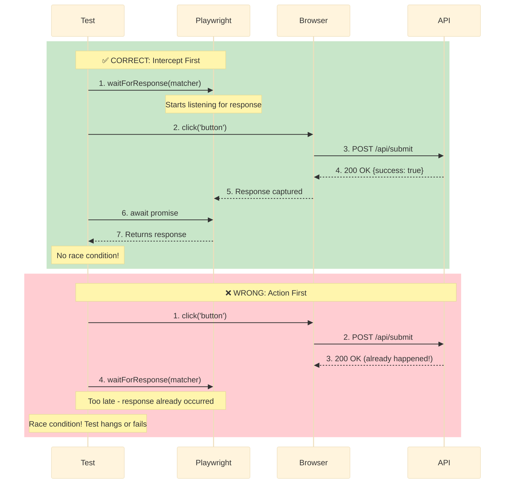
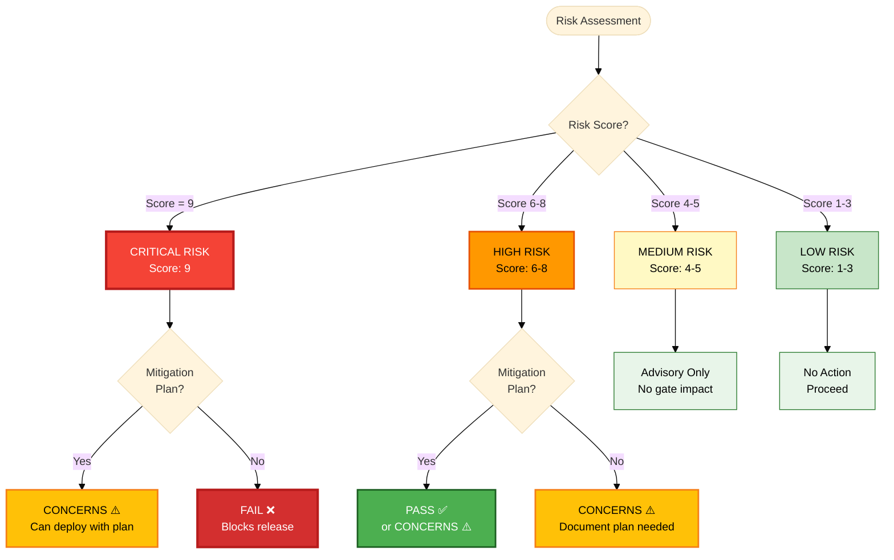
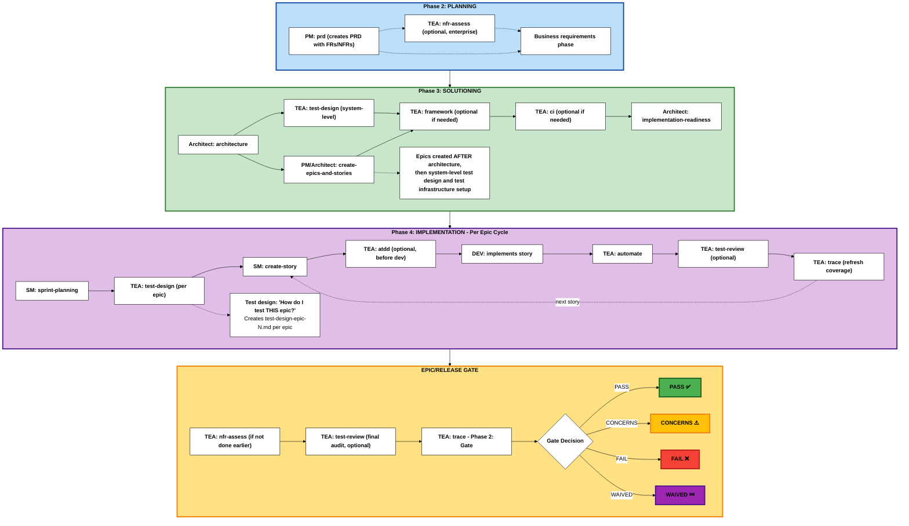
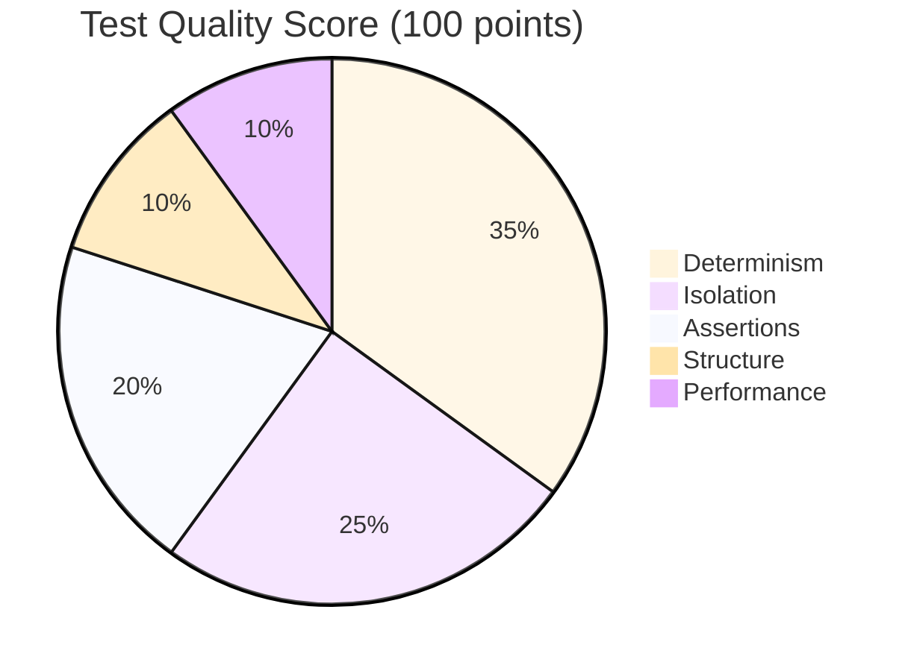
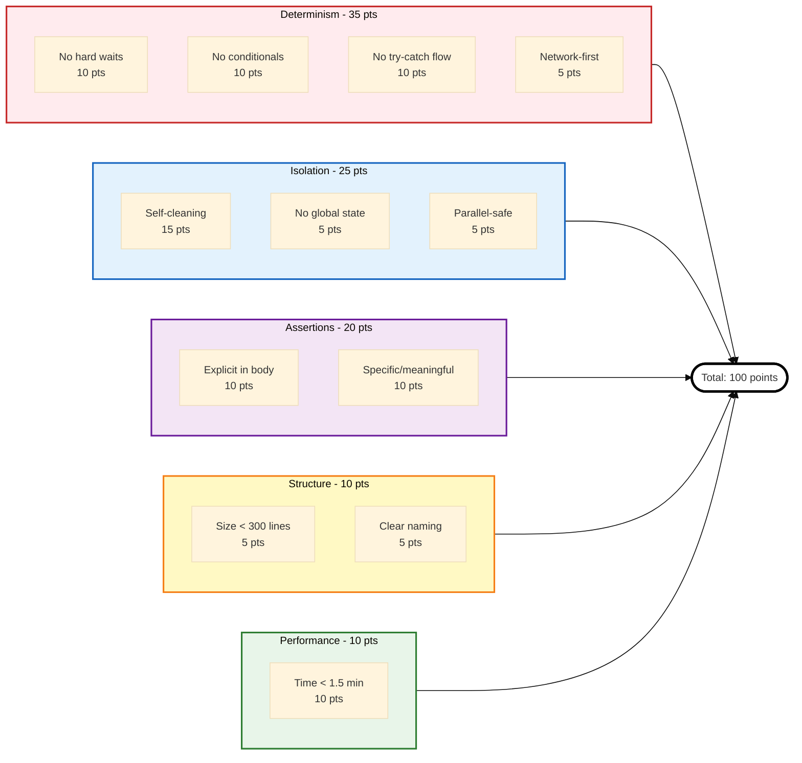

# Test Architect (TEA) Documentation (Full)

> Complete documentation for AI consumption
> Generated: 2026-03-27
> Repository: https://github.com/bmad-code-org/bmad-method-test-architecture-enterprise

<document path="404.md">
# Page Not Found

The page you're looking for doesn't exist.

## What can you do?

- Check the URL for typos
- Go back to the [home page](/)
- Browse the [documentation](/tutorials/tea-lite-quickstart)
- Search for what you need using the search bar above

## Need Help?

If you think this page should exist, please [open an issue](https://github.com/bmad-code-org/bmad-method-test-architecture-enterprise/issues) on GitHub.
</document>

<document path="explanation/engagement-models.md">
# TEA Engagement Models Explained

TEA is optional and flexible. There are five valid ways to engage with TEA - choose intentionally based on your project needs and methodology.

## Overview

**TEA is not mandatory.** Pick the engagement model that fits your context:

1. **No TEA** - Skip all TEA workflows, use existing testing approach
2. **TEA Solo** - Use TEA standalone without BMad Method
3. **TEA Lite** - Beginner approach using just `automate`
4. **TEA Integrated (Greenfield)** - Full BMad Method integration from scratch
5. **TEA Integrated (Brownfield)** - Full BMad Method integration with existing code

## The Problem

### One-Size-Fits-All Doesn't Work

**Traditional testing tools force one approach:**

- Must use entire framework
- All-or-nothing adoption
- No flexibility for different project types
- Teams abandon tool if it doesn't fit

**TEA recognizes:**

- Different projects have different needs
- Different teams have different maturity levels
- Different contexts require different approaches
- Flexibility increases adoption

## The Five Engagement Models

### Model 1: No TEA

**What:** Skip all TEA workflows, use your existing testing approach.

**When to Use:**

- Team has established testing practices
- Quality is already high
- Testing tools already in place
- TEA doesn't add value

**What You Miss:**

- Risk-based test planning
- Systematic quality review
- Gate decisions with evidence
- Knowledge base patterns

**What You Keep:**

- Full control
- Existing tools
- Team expertise
- No learning curve

**Example:**

```
Your team:
- 10-year veteran QA team
- Established testing practices
- High-quality test suite
- No problems to solve

Decision: Skip TEA, keep what works
```

**Verdict:** Valid choice if existing approach works.

---

### Model 2: TEA Solo

**What:** Use TEA workflows standalone without full BMad Method integration.

**When to Use:**

- Non-BMad projects
- Want TEA's quality operating model only
- Don't need full planning workflow
- Bring your own requirements

**Typical Sequence:**

```
1. `test-design` (system or epic)
2. `atdd` or `automate`
3. `test-review` (optional)
4. `trace` (coverage + gate decision)
```

**You Bring:**

- Requirements (user stories, acceptance criteria)
- Development environment
- Project context

**TEA Provides:**

- Risk-based test planning (`test-design`)
- Test generation (`atdd`, `automate`)
- Quality review (`test-review`)
- Coverage traceability (`trace`)

**Optional:**

- Framework setup (`framework`) if needed
- CI configuration (`ci`) if needed

**Example:**

```
Your project:
- Using Scrum (not BMad Method)
- Jira for story management
- Need better test strategy

Workflow:
1. Export stories from Jira
2. Run `test-design` on epic
3. Run `atdd` for each story
4. Implement features
5. Run `trace` for coverage
```

**Verdict:** Best for teams wanting TEA benefits without BMad Method commitment.

---

### Model 3: TEA Lite

**What:** Beginner approach using just `automate` to test existing features.

**When to Use:**

- Learning TEA fundamentals
- Want quick results
- Testing existing application
- No time for full methodology

**Workflow:**

```
1. `framework` (setup test infrastructure)
2. `test-design` (optional, risk assessment)
3. `automate` (generate tests for existing features)
4. Run tests (they pass immediately)
```

**Example:**

```
Beginner developer:
- Never used TEA before
- Want to add tests to existing app
- 30 minutes available

Steps:
1. Run `framework`
2. Run `automate` on TodoMVC demo
3. Tests generated and passing
4. Learn TEA basics
```

**What You Get:**

- Working test framework
- Passing tests for existing features
- Learning experience
- Foundation to expand

**What You Miss:**

- TDD workflow (ATDD)
- Risk-based planning (test-design depth)
- Quality gates (trace Phase 2)
- Full TEA capabilities

**Verdict:** Perfect entry point for beginners.

---

### Model 4: TEA Integrated (Greenfield)

**What:** Full BMad Method integration with TEA workflows across all phases.

**When to Use:**

- New projects starting from scratch
- Using BMad Method or Enterprise track
- Want complete quality operating model
- Testing is critical to success

**Lifecycle:**

**Phase 2: Planning**

- PM creates PRD with NFRs
- (Optional) TEA runs `nfr-assess` (Enterprise only)

**Phase 3: Solutioning**

- Architect creates architecture
- TEA runs `test-design` (system-level) → testability review
- TEA runs `framework` → test infrastructure
- TEA runs `ci` → CI/CD pipeline
- Architect runs `implementation-readiness` (fed by test design)

**Phase 4: Implementation (Per Epic)**

- SM runs `sprint-planning`
- TEA runs `test-design` (epic-level) → risk assessment for THIS epic
- SM creates stories
- (Optional) TEA runs `atdd` → failing tests before dev
- DEV implements story
- TEA runs `automate` → expand coverage
- (Optional) TEA runs `test-review` → quality audit
- TEA runs `trace` Phase 1 → refresh coverage

**Release Gate:**

- (Optional) TEA runs `test-review` → final audit
- (Optional) TEA runs `nfr-assess` → validate NFRs
- TEA runs `trace` Phase 2 → gate decision (PASS/CONCERNS/FAIL/WAIVED)

**What You Get:**

- Complete quality operating model
- Systematic test planning
- Risk-based prioritization
- Evidence-based gate decisions
- Consistent patterns across epics

**Example:**

```
New SaaS product:
- 50 stories across 8 epics
- Security critical
- Need quality gates

Workflow:
- Phase 2: Define NFRs in PRD
- Phase 3: Architecture → test design → framework → CI
- Phase 4: Per epic: test design → ATDD → dev → automate → review → trace
- Gate: NFR assess → trace Phase 2 → decision
```

**Verdict:** Most comprehensive TEA usage, best for structured teams.

---

### Model 5: TEA Integrated (Brownfield)

**What:** Full BMad Method integration with TEA for existing codebases.

**When to Use:**

- Existing codebase with legacy tests
- Want to improve test quality incrementally
- Adding features to existing application
- Need to establish coverage baseline

**Differences from Greenfield:**

**Phase 0: Documentation (if needed)**

```
- Run `document-project`
- Create baseline documentation
```

**Phase 2: Planning**

```
- TEA runs `trace` Phase 1 → establish coverage baseline
- PM creates PRD (with existing system context)
```

**Phase 3: Solutioning**

```
- Architect creates architecture (with brownfield constraints)
- TEA runs `test-design` (system-level) → testability review
- TEA runs `framework` (only if modernizing test infra)
- TEA runs `ci` (update existing CI or create new)
```

**Phase 4: Implementation**

```
- TEA runs `test-design` (epic-level) → focus on REGRESSION HOTSPOTS
- Per story: ATDD → dev → automate
- TEA runs `test-review` → improve legacy test quality
- TEA runs `trace` Phase 1 → track coverage improvement
```

**Brownfield-Specific:**

- Baseline coverage BEFORE planning
- Focus on regression hotspots (bug-prone areas)
- Incremental quality improvement
- Compare coverage to baseline (trending up?)

**Example:**

```
Legacy e-commerce platform:
- 200 existing tests (30% passing, 70% flaky)
- Adding new checkout flow
- Want to improve quality

Workflow:
1. Phase 2: `trace` baseline → 30% coverage
2. Phase 3: `test-design` → identify regression risks
3. Phase 4: Fix top 20 flaky tests + add tests for new checkout
4. Gate: `trace` → 60% coverage (2x improvement)
```

**Verdict:** Best for incrementally improving legacy systems.

---

## Decision Guide: Which Model?

### Quick Decision Tree



**Decision Path Examples:**

- Learning TEA → TEA Lite (blue)
- Non-BMad project → TEA Solo (purple)
- BMad + new project + compliance → Enterprise (purple)
- BMad + existing code → Brownfield (yellow)
- Don't want TEA → No TEA (gray)

### By Project Type

| Project Type                    | Recommended Model           | Why                                         |
| ------------------------------- | --------------------------- | ------------------------------------------- |
| **New SaaS product**            | TEA Integrated (Greenfield) | Full quality operating model from day one   |
| **Existing app + new feature**  | TEA Integrated (Brownfield) | Improve incrementally while adding features |
| **Bug fix**                     | TEA Lite or No TEA          | Quick flow, minimal overhead                |
| **Learning project**            | TEA Lite                    | Learn basics with immediate results         |
| **Non-BMad enterprise**         | TEA Solo                    | Quality model without full methodology      |
| **High-quality existing tests** | No TEA                      | Keep what works                             |

### By Team Maturity

| Team Maturity    | Recommended Model        | Why                              |
| ---------------- | ------------------------ | -------------------------------- |
| **Beginners**    | TEA Lite → TEA Solo      | Learn basics, then expand        |
| **Intermediate** | TEA Solo or Integrated   | Depends on methodology           |
| **Advanced**     | TEA Integrated or No TEA | Full model or existing expertise |

### By Compliance Needs

| Compliance                 | Recommended Model           | Why                           |
| -------------------------- | --------------------------- | ----------------------------- |
| **None**                   | Any model                   | Choose based on project needs |
| **Light** (internal audit) | TEA Solo or Integrated      | Gate decisions helpful        |
| **Heavy** (SOC 2, HIPAA)   | TEA Integrated (Enterprise) | NFR assessment mandatory      |

## Switching Between Models

### Can Change Models Mid-Project

**Scenario:** Start with TEA Lite, expand to TEA Solo

```
Week 1: TEA Lite
- Run `framework`
- Run `automate`
- Learn basics

Week 2: Expand to TEA Solo
- Add `test-design`
- Use `atdd` for new features
- Add `test-review`

Week 3: Continue expanding
- Add `trace` for coverage
- Setup `ci`
- Full TEA Solo workflow
```

**Benefit:** Start small, expand as comfortable.

### Can Mix Models

**Scenario:** TEA Integrated for main features, No TEA for bug fixes

```
Main features (epics):
- Use full TEA workflow
- Risk assessment, ATDD, quality gates

Bug fixes:
- Skip TEA
- Quick Flow + manual testing
- Move fast

Result: TEA where it adds value, skip where it doesn't
```

**Benefit:** Flexible, pragmatic, not dogmatic.

## Comparison Table

| Aspect                | No TEA  | TEA Lite  | TEA Solo   | Integrated (Green) | Integrated (Brown) |
| --------------------- | ------- | --------- | ---------- | ------------------ | ------------------ |
| **BMad Required**     | No      | No        | No         | Yes                | Yes                |
| **Learning Curve**    | None    | Low       | Medium     | High               | High               |
| **Setup Time**        | 0       | 30 min    | 2 hours    | 1 day              | 2 days             |
| **Workflows Used**    | 0       | 2-3       | 4-6        | 8                  | 8                  |
| **Test Planning**     | Manual  | Optional  | Yes        | Systematic         | + Regression focus |
| **Quality Gates**     | No      | No        | Optional   | Yes                | Yes + baseline     |
| **NFR Assessment**    | No      | No        | No         | Optional           | Recommended        |
| **Coverage Tracking** | Manual  | No        | Optional   | Yes                | Yes + trending     |
| **Best For**          | Experts | Beginners | Standalone | New projects       | Legacy code        |

## Real-World Examples

### Example 1: Startup (TEA Lite → TEA Integrated)

**Month 1:** TEA Lite

```
Team: 3 developers, no QA
Testing: Manual only
Decision: Start with TEA Lite

Result:
- Run `framework` (Playwright setup)
- Run `automate` (20 tests generated)
- Learning TEA basics
```

**Month 3:** TEA Solo

```
Team: Growing to 5 developers
Testing: Automated tests exist
Decision: Expand to TEA Solo

Result:
- Add `test-design` (risk assessment)
- Add `atdd` (TDD workflow)
- Add `test-review` (quality audits)
```

**Month 6:** TEA Integrated

```
Team: 8 developers, 1 QA
Testing: Critical to business
Decision: Full BMad Method + TEA Integrated

Result:
- Full lifecycle integration
- Quality gates before releases
- NFR assessment for enterprise customers
```

### Example 2: Enterprise (TEA Integrated - Brownfield)

**Project:** Legacy banking application

**Challenge:**

- 500 existing tests (50% flaky)
- Adding new features
- SOC 2 compliance required

**Model:** TEA Integrated (Brownfield)

**Phase 2:**

```
- `trace` baseline → 45% coverage (lots of gaps)
- Document current state
```

**Phase 3:**

```
- `test-design` (system) → identify regression hotspots
- `framework` → modernize test infrastructure
- `ci` → add selective testing
```

**Phase 4:**

```
Per epic:
- `test-design` → focus on regression + new features
- Fix top 10 flaky tests
- `atdd` for new features
- `automate` for coverage expansion
- `test-review` → track quality improvement
- `trace` → compare to baseline
```

**Result after 6 months:**

- Coverage: 45% → 85%
- Quality score: 52 → 82
- Flakiness: 50% → 2%
- SOC 2 compliant (traceability + NFR evidence)

### Example 3: Consultancy (TEA Solo)

**Context:** Testing consultancy working with multiple clients

**Challenge:**

- Different clients use different methodologies
- Need consistent testing approach
- Not always using BMad Method

**Model:** TEA Solo (bring to any client project)

**Workflow:**

```
Client project 1 (Scrum):
- Import Jira stories
- Run `test-design`
- Generate tests with `atdd`/`automate`
- Deliver quality report with `test-review`

Client project 2 (Kanban):
- Import requirements from Notion
- Same TEA workflow
- Consistent quality across clients

Client project 3 (Ad-hoc):
- Document requirements manually
- Same TEA workflow
- Same patterns, different context
```

**Benefit:** Consistent testing approach regardless of client methodology.

## Choosing Your Model

### Start Here Questions

**Question 1:** Are you using BMad Method?

- **No** → TEA Solo or TEA Lite or No TEA
- **Yes** → TEA Integrated or No TEA

**Question 2:** Is this a new project?

- **Yes** → TEA Integrated (Greenfield) or TEA Lite
- **No** → TEA Integrated (Brownfield) or TEA Solo

**Question 3:** What's your testing maturity?

- **Beginner** → TEA Lite
- **Intermediate** → TEA Solo or Integrated
- **Advanced** → TEA Integrated or No TEA (already expert)

**Question 4:** Do you need compliance/quality gates?

- **Yes** → TEA Integrated (Enterprise)
- **No** → Any model

**Question 5:** How much time can you invest?

- **30 minutes** → TEA Lite
- **Few hours** → TEA Solo
- **Multiple days** → TEA Integrated

### Recommendation Matrix

| Your Context                | Recommended Model           | Alternative                 |
| --------------------------- | --------------------------- | --------------------------- |
| BMad Method + new project   | TEA Integrated (Greenfield) | TEA Lite (learning)         |
| BMad Method + existing code | TEA Integrated (Brownfield) | TEA Solo                    |
| Non-BMad + need quality     | TEA Solo                    | TEA Lite                    |
| Just learning testing       | TEA Lite                    | No TEA (learn basics first) |
| Enterprise + compliance     | TEA Integrated (Enterprise) | TEA Solo                    |
| Established QA team         | No TEA                      | TEA Solo (supplement)       |

## Transitioning Between Models

### TEA Lite → TEA Solo

**When:** Outgrow beginner approach, need more workflows.

**Steps:**

1. Continue using `framework` and `automate`
2. Add `test-design` for planning
3. Add `atdd` for TDD workflow
4. Add `test-review` for quality audits
5. Add `trace` for coverage tracking

**Timeline:** 2-4 weeks of gradual expansion

### TEA Solo → TEA Integrated

**When:** Adopt BMad Method, want full integration.

**Steps:**

1. Install BMad Method (see installation guide)
2. Run planning workflows (PRD, architecture)
3. Integrate TEA into Phase 3 (system-level test design)
4. Follow integrated lifecycle (per epic workflows)
5. Add release gates (trace Phase 2)

**Timeline:** 1-2 sprints of transition

### TEA Integrated → TEA Solo

**When:** Moving away from BMad Method, keep TEA.

**Steps:**

1. Export BMad artifacts (PRD, architecture, stories)
2. Continue using TEA workflows standalone
3. Skip BMad-specific integration
4. Bring your own requirements to TEA

**Timeline:** Immediate (just skip BMad workflows)

## Common Patterns

### Pattern 1: TEA Lite for Learning, Then Choose

```
Phase 1 (Week 1-2): TEA Lite
- Learn with `automate` on demo app
- Understand TEA fundamentals
- Low commitment

Phase 2 (Week 3-4): Evaluate
- Try `test-design` (planning)
- Try `atdd` (TDD)
- See if value justifies investment

Phase 3 (Month 2+): Decide
- Valuable → Expand to TEA Solo or Integrated
- Not valuable → Stay with TEA Lite or No TEA
```

### Pattern 2: TEA Solo for Quality, Skip Full Method

```
Team decision:
- Don't want full BMad Method (too heavyweight)
- Want systematic testing (TEA benefits)

Approach: TEA Solo only
- Use existing project management (Jira, Linear)
- Use TEA for testing only
- Get quality without methodology commitment
```

### Pattern 3: Integrated for Critical, Lite for Non-Critical

```
Critical features (payment, auth):
- Full TEA Integrated workflow
- Risk assessment, ATDD, quality gates
- High confidence required

Non-critical features (UI tweaks):
- TEA Lite or No TEA
- Quick tests, minimal overhead
- Move fast
```

## Technical Implementation

Each model uses different TEA workflows. See:

- [TEA Overview](/docs/explanation/tea-overview.md) - Model details
- [TEA Command Reference](/docs/reference/commands.md) - Workflow reference
- [TEA Configuration](/docs/reference/configuration.md) - Setup options

## Related Concepts

**Core TEA Concepts:**

- [Risk-Based Testing](/docs/explanation/risk-based-testing.md) - Risk assessment in different models
- [Test Quality Standards](/docs/explanation/test-quality-standards.md) - Quality across all models
- [Knowledge Base System](/docs/explanation/knowledge-base-system.md) - Consistent patterns across models

**Technical Patterns:**

- [Fixture Architecture](/docs/explanation/fixture-architecture.md) - Infrastructure in different models
- [Network-First Patterns](/docs/explanation/network-first-patterns.md) - Reliability in all models

**Overview:**

- [TEA Overview](/docs/explanation/tea-overview.md) - 5 engagement models with cheat sheets
- [Testing as Engineering](/docs/explanation/testing-as-engineering.md) - Design philosophy

## Practical Guides

**Getting Started:**

- [TEA Lite Quickstart Tutorial](/docs/tutorials/tea-lite-quickstart.md) - Model 3: TEA Lite

**Use-Case Guides:**

- [Using TEA with Existing Tests](/docs/how-to/brownfield/use-tea-with-existing-tests.md) - Model 5: Brownfield
- [Running TEA for Enterprise](/docs/how-to/brownfield/use-tea-for-enterprise.md) - Enterprise integration

**All Workflow Guides:**

- [How to Run Test Design](/docs/how-to/workflows/run-test-design.md) - Used in TEA Solo and Integrated
- [How to Run ATDD](/docs/how-to/workflows/run-atdd.md)
- [How to Run Automate](/docs/how-to/workflows/run-automate.md)
- [How to Run Test Review](/docs/how-to/workflows/run-test-review.md)
- [How to Run Trace](/docs/how-to/workflows/run-trace.md)

## Reference

- [TEA Command Reference](/docs/reference/commands.md) - All workflows explained
- [TEA Configuration](/docs/reference/configuration.md) - Config per model
- [Glossary](/docs/glossary/index.md#test-architect-tea-concepts) - TEA Lite, TEA Solo, TEA Integrated terms

---

Generated with [BMad Method](https://bmad-method.org) - TEA (Test Engineering Architect)
</document>

<document path="explanation/fixture-architecture.md">
# Fixture Architecture Explained

Fixture architecture is TEA's pattern for building reusable, testable, and composable test utilities. The core principle: build pure functions first, wrap in framework fixtures second.

## Overview

**The Pattern:**

1. Write utility as pure function (unit-testable)
2. Wrap in framework fixture (Playwright, Cypress)
3. Compose fixtures with mergeTests (combine capabilities)
4. Package for reuse across projects

**Why this order?**

- Pure functions are easier to test
- Fixtures depend on framework (less portable)
- Composition happens at fixture level
- Reusability maximized

### Fixture Architecture Flow



**Benefits at Each Step:**

1. **Pure Function:** Testable, portable, reusable
2. **Fixture:** Framework integration, clean API
3. **Composition:** Combine capabilities, flexible
4. **Usage:** Simple imports, type-safe

## The Problem

### Framework-First Approach (Common Anti-Pattern)

```typescript
// ❌ Bad: Built as fixture from the start
export const test = base.extend({
  apiRequest: async ({ request }, use) => {
    await use(async (options) => {
      const response = await request.fetch(options.url, {
        method: options.method,
        data: options.data,
      });

      if (!response.ok()) {
        throw new Error(`API request failed: ${response.status()}`);
      }

      return response.json();
    });
  },
});
```

**Problems:**

- Cannot unit test (requires Playwright context)
- Tied to framework (not reusable in other tools)
- Hard to compose with other fixtures
- Difficult to mock for testing the utility itself

### Copy-Paste Utilities

```typescript
// test-1.spec.ts
test('test 1', async ({ request }) => {
  const response = await request.post('/api/users', { data: {...} });
  const body = await response.json();
  if (!response.ok()) throw new Error('Failed');
  // ... repeated in every test
});

// test-2.spec.ts
test('test 2', async ({ request }) => {
  const response = await request.post('/api/users', { data: {...} });
  const body = await response.json();
  if (!response.ok()) throw new Error('Failed');
  // ... same code repeated
});
```

**Problems:**

- Code duplication (violates DRY)
- Inconsistent error handling
- Hard to update (change 50 tests)
- No shared behavior

## The Solution: Three-Step Pattern

### Step 1: Pure Function

```typescript
// helpers/api-request.ts

/**
 * Make API request with automatic error handling
 * Pure function - no framework dependencies
 */
export async function apiRequest({
  request, // Passed in (dependency injection)
  method,
  url,
  data,
  headers = {},
}: ApiRequestParams): Promise<ApiResponse> {
  const response = await request.fetch(url, {
    method,
    data,
    headers,
  });

  if (!response.ok()) {
    throw new Error(`API request failed: ${response.status()}`);
  }

  return {
    status: response.status(),
    body: await response.json(),
  };
}

// ✅ Can unit test this function!
describe('apiRequest', () => {
  it('should throw on non-OK response', async () => {
    const mockRequest = {
      fetch: vi.fn().mockResolvedValue({ ok: () => false, status: () => 500 }),
    };

    await expect(
      apiRequest({
        request: mockRequest,
        method: 'GET',
        url: '/api/test',
      }),
    ).rejects.toThrow('API request failed: 500');
  });
});
```

**Benefits:**

- Unit testable (mock dependencies)
- Framework-agnostic (works with any HTTP client)
- Easy to reason about (pure function)
- Portable (can use in Node scripts, CLI tools)

### Step 2: Fixture Wrapper

```typescript
// fixtures/api-request.ts
import { test as base } from '@playwright/test';
import { apiRequest as apiRequestFn } from '../helpers/api-request';

/**
 * Playwright fixture wrapping the pure function
 */
export const test = base.extend<{ apiRequest: typeof apiRequestFn }>({
  apiRequest: async ({ request }, use) => {
    // Inject framework dependency (request)
    await use((params) => apiRequestFn({ request, ...params }));
  },
});

export { expect } from '@playwright/test';
```

**Benefits:**

- Fixture provides framework context (request)
- Pure function handles logic
- Clean separation of concerns
- Can swap frameworks (Cypress, etc.) by changing wrapper only

### Step 3: Composition with mergeTests

```typescript
// fixtures/index.ts
import { mergeTests } from '@playwright/test';
import { test as apiRequestTest } from './api-request';
import { test as authSessionTest } from './auth-session';
import { test as logTest } from './log';

/**
 * Compose all fixtures into one test
 */
export const test = mergeTests(apiRequestTest, authSessionTest, logTest);

export { expect } from '@playwright/test';
```

**Usage:**

```typescript
// tests/profile.spec.ts
import { test, expect } from '../support/fixtures';

test('should update profile', async ({ apiRequest, authToken, log }) => {
  log.info('Starting profile update test');

  // Use API request fixture (matches pure function signature)
  const { status, body } = await apiRequest({
    method: 'PATCH',
    url: '/api/profile',
    data: { name: 'New Name' },
    headers: { Authorization: `Bearer ${authToken}` },
  });

  expect(status).toBe(200);
  expect(body.name).toBe('New Name');

  log.info('Profile updated successfully');
});
```

**Note:** This example uses the vanilla pure function signature (`url`, `data`). Playwright Utils uses different parameter names (`path`, `body`). See [Integrate Playwright Utils](/docs/how-to/customization/integrate-playwright-utils.md) for the utilities API.

**Note:** `authToken` requires auth-session fixture setup with provider configuration. See [auth-session documentation](https://seontechnologies.github.io/playwright-utils/auth-session.html).

**Benefits:**

- Use multiple fixtures in one test
- No manual composition needed
- Type-safe (TypeScript knows all fixture types)
- Clean imports

## How It Works in TEA

### TEA Generates This Pattern

When you run `framework` with `tea_use_playwright_utils: true`:

**TEA scaffolds:**

```
tests/
├── support/
│   ├── helpers/           # Pure functions
│   │   ├── api-request.ts
│   │   └── auth-session.ts
│   └── fixtures/          # Framework wrappers
│       ├── api-request.ts
│       ├── auth-session.ts
│       └── index.ts       # Composition
└── e2e/
    └── example.spec.ts      # Uses composed fixtures
```

### TEA Reviews Against This Pattern

When you run `test-review`:

**TEA checks:**

- Are utilities pure functions? ✓
- Are fixtures minimal wrappers? ✓
- Is composition used? ✓
- Can utilities be unit tested? ✓

## Package Export Pattern

### Make Fixtures Reusable Across Projects

**Option 1: Build Your Own (Vanilla)**

```json
// package.json
{
  "name": "@company/test-utils",
  "exports": {
    "./api-request": "./fixtures/api-request.ts",
    "./auth-session": "./fixtures/auth-session.ts",
    "./log": "./fixtures/log.ts"
  }
}
```

**Usage:**

```typescript
import { test as apiTest } from '@company/test-utils/api-request';
import { test as authTest } from '@company/test-utils/auth-session';
import { mergeTests } from '@playwright/test';

export const test = mergeTests(apiTest, authTest);
```

**Option 2: Use Playwright Utils (Recommended)**

```bash
npm install -D @seontechnologies/playwright-utils
```

**Usage:**

```typescript
import { test as base } from '@playwright/test';
import { mergeTests } from '@playwright/test';
import { test as apiRequestFixture } from '@seontechnologies/playwright-utils/api-request/fixtures';
import { createAuthFixtures } from '@seontechnologies/playwright-utils/auth-session';

const authFixtureTest = base.extend(createAuthFixtures());
export const test = mergeTests(apiRequestFixture, authFixtureTest);
// Production-ready utilities, battle-tested!
```

**Note:** Auth-session requires provider configuration. See [auth-session setup guide](https://seontechnologies.github.io/playwright-utils/auth-session.html).

**Why Playwright Utils:**

- Already built, tested, and maintained
- Consistent patterns across projects
- 11 utilities available (API, auth, network, logging, files)
- Community support and documentation
- Regular updates and improvements

**When to Build Your Own:**

- Company-specific patterns
- Custom authentication systems
- Unique requirements not covered by utilities

## Comparison: Good vs Bad Patterns

### Anti-Pattern: God Fixture

```typescript
// ❌ Bad: Everything in one fixture
export const test = base.extend({
  testUtils: async ({ page, request, context }, use) => {
    await use({
      // 50 different methods crammed into one fixture
      apiRequest: async (...) => { },
      login: async (...) => { },
      createUser: async (...) => { },
      deleteUser: async (...) => { },
      uploadFile: async (...) => { },
      // ... 45 more methods
    });
  }
});
```

**Problems:**

- Cannot test individual utilities
- Cannot compose (all-or-nothing)
- Cannot reuse specific utilities
- Hard to maintain (1000+ line file)

### Good Pattern: Single-Concern Fixtures

```typescript
// ✅ Good: One concern per fixture

// api-request.ts
export const test = base.extend({ apiRequest });

// auth-session.ts
export const test = base.extend({ authSession });

// log.ts
export const test = base.extend({ log });

// Compose as needed
import { mergeTests } from '@playwright/test';
export const test = mergeTests(apiRequestTest, authSessionTest, logTest);
```

**Benefits:**

- Each fixture is unit-testable
- Compose only what you need
- Reuse individual fixtures
- Easy to maintain (small files)

## Technical Implementation

For detailed fixture architecture patterns, see the knowledge base:

- [Knowledge Base Index - Architecture & Fixtures](/docs/reference/knowledge-base.md)
- [Complete Knowledge Base Index](/docs/reference/knowledge-base.md)

## When to Use This Pattern

### Always Use For:

**Reusable utilities:**

- API request helpers
- Authentication handlers
- File operations
- Network mocking

**Test infrastructure:**

- Shared fixtures across teams
- Packaged utilities (playwright-utils)
- Company-wide test standards

### Consider Skipping For:

**One-off test setup:**

```typescript
// Simple one-time setup - inline is fine
test.beforeEach(async ({ page }) => {
  await page.goto('/');
  await page.click('#accept-cookies');
});
```

**Test-specific helpers:**

```typescript
// Used in one test file only - keep local
function createTestUser(name: string) {
  return { name, email: `${name}@test.com` };
}
```

## Related Concepts

**Core TEA Concepts:**

- [Test Quality Standards](/docs/explanation/test-quality-standards.md) - Quality standards fixtures enforce
- [Knowledge Base System](/docs/explanation/knowledge-base-system.md) - Fixture patterns in knowledge base

**Technical Patterns:**

- [Network-First Patterns](/docs/explanation/network-first-patterns.md) - Network fixtures explained
- [Risk-Based Testing](/docs/explanation/risk-based-testing.md) - Fixture complexity matches risk

**Overview:**

- [TEA Overview](/docs/explanation/tea-overview.md) - Fixture architecture in workflows
- [Testing as Engineering](/docs/explanation/testing-as-engineering.md) - Why fixtures matter

## Practical Guides

**Setup Guides:**

- [How to Set Up Test Framework](/docs/how-to/workflows/setup-test-framework.md) - TEA scaffolds fixtures
- [Integrate Playwright Utils](/docs/how-to/customization/integrate-playwright-utils.md) - Production-ready fixtures

**Workflow Guides:**

- [How to Run ATDD](/docs/how-to/workflows/run-atdd.md) - Using fixtures in tests
- [How to Run Automate](/docs/how-to/workflows/run-automate.md) - Fixture composition examples

## Reference

- [TEA Command Reference](/docs/reference/commands.md) - `framework` command
- [Knowledge Base Index](/docs/reference/knowledge-base.md) - Fixture architecture fragments
- [Glossary](/docs/glossary/index.md#test-architect-tea-concepts) - Fixture architecture term

---

Generated with [BMad Method](https://bmad-method.org) - TEA (Test Engineering Architect)
</document>

<document path="explanation/knowledge-base-system.md">
# Knowledge Base System Explained

TEA's knowledge base system is how context engineering works - automatically loading domain-specific standards into AI context so tests are consistently high-quality regardless of prompt variation.

## Overview

**The Problem:** AI without context produces inconsistent results.

**Traditional approach:**

```
User: "Write tests for login"
AI: [Generates tests with random quality]
- Sometimes uses hard waits
- Sometimes uses good patterns
- Inconsistent across sessions
- Quality depends on prompt
```

**TEA with knowledge base:**

```
User: "Write tests for login"
TEA: [Loads test-quality.md, network-first.md, auth-session.md]
TEA: [Generates tests following established patterns]
- Always uses network-first patterns
- Always uses proper fixtures
- Consistent across all sessions
- Quality independent of prompt
```

**Result:** Systematic quality, not random chance.

## The Problem

### Prompt-Driven Testing = Inconsistency

**Session 1:**

```
User: "Write tests for profile editing"

AI: [No context loaded]
// Generates test with hard waits
await page.waitForTimeout(3000);
```

**Session 2:**

```
User: "Write comprehensive tests for profile editing with best practices"

AI: [Still no systematic context]
// Generates test with some improvements, but still issues
await page.waitForSelector('.success', { timeout: 10000 });
```

**Session 3:**

```
User: "Write tests using network-first patterns and proper fixtures"

AI: [Better prompt, but still reinventing patterns]
// Generates test with network-first, but inconsistent with other tests
```

**Problem:** Quality depends on prompt engineering skill, no consistency.

### Knowledge Drift

Without a knowledge base:

- Team A uses pattern X
- Team B uses pattern Y
- Both work, but inconsistent
- No single source of truth
- Patterns drift over time

## The Solution: tea-index.csv Manifest

### How It Works

**1. Manifest Defines Fragments**

`src/agents/bmad-tea/resources/tea-index.csv`:

```csv
id,name,description,tags,tier,fragment_file
test-quality,Test Quality,Execution limits and isolation rules,"quality,standards",knowledge/test-quality.md
network-first,Network-First Safeguards,Intercept-before-navigate workflow,"network,stability",knowledge/network-first.md
fixture-architecture,Fixture Architecture,Composable fixture patterns,"fixtures,architecture",knowledge/fixture-architecture.md
```

**2. Workflow Loads Relevant Fragments**

When user runs `atdd`:

```
TEA reads tea-index.csv
Identifies fragments needed for ATDD:
- test-quality.md (quality standards)
- network-first.md (avoid flakiness)
- component-tdd.md (TDD patterns)
- fixture-architecture.md (reusable fixtures)
- data-factories.md (test data)

Loads only these 5 fragments (not all 42)
Generates tests following these patterns
```

**3. Consistent Output**

Every time `atdd` runs:

- Same fragments loaded
- Same patterns applied
- Same quality standards
- Consistent test structure

**Result:** Tests look like they were written by the same expert, every time.

### Knowledge Base Loading Diagram



## Fragment Structure

For a deeper look at the actual fragments, see [Fragment Categories](/reference/knowledge-base/#fragment-categories).

### Anatomy of a Fragment

Each fragment follows this structure:

````markdown
# Fragment Name

## Principle

[One sentence - what is this pattern?]

## Rationale

[Why use this instead of alternatives?]
Why this pattern exists
Problems it solves
Benefits it provides

## Pattern Examples

### Example 1: Basic Usage

```code
[Runnable code example]
```
````

[Explanation of example]

### Example 2: Advanced Pattern

```code
[More complex example]
```

[Explanation]

## Anti-Patterns

### Don't Do This

```code
[Bad code example]
```

[Why it's bad]
[What breaks]

## Related Patterns

- [Link to related fragment]

````

<!-- markdownlint-disable MD024 -->
### Example: test-quality.md Fragment

```markdown
# Test Quality

## Principle
Tests must be deterministic, isolated, explicit, focused, and fast.

## Rationale
Tests that fail randomly, depend on each other, or take too long lose team trust.
[... detailed explanation ...]

## Pattern Examples

### Example 1: Deterministic Test
```typescript
// ✅ Wait for actual response, not timeout
const promise = page.waitForResponse(matcher);
await page.click('button');
await promise;
````

### Example 2: Isolated Test

```typescript
// ✅ Self-cleaning test
test('test', async ({ page }) => {
  const userId = await createTestUser();
  // ... test logic ...
  await deleteTestUser(userId); // Cleanup
});
```

## Anti-Patterns

### Hard Waits

```typescript
// ❌ Non-deterministic
await page.waitForTimeout(3000);
```

[Why this causes flakiness]

```

**Total:** 24.5 KB, 12 code examples
<!-- markdownlint-enable MD024 -->

## How TEA Uses the Knowledge Base

### Workflow-Specific Loading

**Different workflows load different fragments:**

| Workflow | Fragments Loaded | Purpose |
|----------|-----------------|---------|
| `framework` | fixture-architecture, playwright-config, fixtures-composition | Infrastructure patterns |
| `test-design` | test-quality, test-priorities-matrix, risk-governance | Planning standards |
| `atdd` | test-quality, component-tdd, network-first, data-factories | TDD patterns |
| `automate` | test-quality, test-levels-framework, selector-resilience | Comprehensive generation |
| `test-review` | All quality/resilience/debugging fragments | Full audit patterns |
| `ci` | ci-burn-in, burn-in, selective-testing | CI/CD optimization |

**Benefit:** Only load what's needed (focused context, no bloat).

### Dynamic Fragment Selection

TEA doesn't load all 42 fragments at once:

```

User runs: atdd for authentication feature

TEA analyzes context:

- Feature type: Authentication
- Relevant fragments:
  - test-quality.md (always loaded)
  - auth-session.md (auth patterns)
  - network-first.md (avoid flakiness)
  - email-auth.md (if email-based auth)
  - data-factories.md (test users)

Skips:

- contract-testing.md (not relevant)
- feature-flags.md (not relevant)
- file-utils.md (not relevant)

Result: 5 relevant fragments loaded, 37 skipped

```

**Benefit:** Focused context = better results, lower token usage.

## Context Engineering in Practice

### Example: Consistent Test Generation

**Without Knowledge Base (Vanilla Playwright, Random Quality):**
```

Session 1: User runs atdd
AI: [Guesses patterns from general knowledge]

Generated:
test('api test', async ({ request }) => {
const response = await request.get('/api/users');
await page.waitForTimeout(2000); // Hard wait
const users = await response.json();
// Random quality
});

Session 2: User runs atdd (different day)
AI: [Different random patterns]

Generated:
test('api test', async ({ request }) => {
const response = await request.get('/api/users');
const users = await response.json();
// Better but inconsistent
});

Result: Inconsistent quality, random patterns

```

**With Knowledge Base (TEA + Playwright Utils):**
```

Session 1: User runs atdd
TEA: [Loads test-quality.md, network-first.md, api-request.md from tea-index.csv]

Generated:
import { test } from '@seontechnologies/playwright-utils/api-request/fixtures';

test('should fetch users', async ({ apiRequest }) => {
const { status, body } = await apiRequest({
method: 'GET',
path: '/api/users'
}).validateSchema(UsersSchema); // Chained validation

expect(status).toBe(200);
expect(body).toBeInstanceOf(Array);
});

Session 2: User runs atdd (different day)
TEA: [Loads same fragments from tea-index.csv]

Generated: Identical pattern, same quality

Result: Systematic quality, established patterns (ALWAYS uses apiRequest utility when playwright-utils enabled)

```

**Key Difference:**
- **Without KB:** Random patterns, inconsistent APIs
- **With KB:** Always uses `apiRequest` utility, always validates schemas, always returns `{ status, body }`

### Example: Test Review Consistency

**Without Knowledge Base:**
```

test-review session 1:
"This test looks okay" [50 issues missed]

test-review session 2:
"This test has some issues" [Different issues flagged]

Result: Inconsistent feedback

```

**With Knowledge Base:**
```

test-review session 1:
[Loads all quality fragments]
Flags: 12 hard waits, 5 conditionals (based on test-quality.md)

test-review session 2:
[Loads same fragments]
Flags: Same issues with same explanations

Result: Consistent, reliable feedback

````

## Maintaining the Knowledge Base

### When to Add a Fragment

**Good reasons:**
- Pattern is used across multiple workflows
- Standard is non-obvious (needs documentation)
- Team asks "how should we handle X?" repeatedly
- New tool integration (e.g., new testing library)

**Bad reasons:**
- One-off pattern (document in test file instead)
- Obvious pattern (everyone knows this)
- Experimental (not proven yet)

### Fragment Quality Standards

**Good fragment:**
- Principle stated in one sentence
- Rationale explains why clearly
- 3+ pattern examples with code
- Anti-patterns shown (what not to do)
- Self-contained (minimal dependencies)

**Example size:** 10-30 KB optimal

### Updating Existing Fragments

**When to update:**
- Pattern evolved (better approach discovered)
- Tool updated (new Playwright API)
- Team feedback (pattern unclear)
- Bug in example code

**How to update:**
1. Edit fragment markdown file
2. Update examples
3. Test with affected workflows
4. Ensure no breaking changes

**No need to update tea-index.csv** unless description/tags change.

## Benefits of Knowledge Base System

### 1. Consistency

**Before:** Test quality varies by who wrote it
**After:** All tests follow same patterns (TEA-generated or reviewed)

### 2. Onboarding

**Before:** New team member reads 20 documents, asks 50 questions
**After:** New team member runs `atdd`, sees patterns in generated code, learns by example

### 3. Quality Gates

**Before:** "Is this test good?" → subjective opinion
**After:** `test-review` → objective score against knowledge base

### 4. Pattern Evolution

**Before:** Update tests manually across 100 files
**After:** Update fragment once, all new tests use new pattern

### 5. Cross-Project Reuse

**Before:** Reinvent patterns for each project
**After:** Same fragments across all BMad projects (consistency at scale)

## Comparison: With vs Without Knowledge Base

### Scenario: Testing Async Background Job

**Without Knowledge Base:**

Developer 1:
```typescript
// Uses hard wait
await page.click('button');
await page.waitForTimeout(10000);  // Hope job finishes
````

Developer 2:

```typescript
// Uses polling
await page.click('button');
for (let i = 0; i < 10; i++) {
  const status = await page.locator('.status').textContent();
  if (status === 'complete') break;
  await page.waitForTimeout(1000);
}
```

Developer 3:

```typescript
// Uses waitForSelector
await page.click('button');
await page.waitForSelector('.success', { timeout: 30000 });
```

**Result:** 3 different patterns, all suboptimal.

**With Knowledge Base (recurse.md fragment):**

All developers:

```typescript
import { test } from '@seontechnologies/playwright-utils/fixtures';

test('job completion', async ({ apiRequest, recurse }) => {
  // Start async job
  const { body: job } = await apiRequest({
    method: 'POST',
    path: '/api/jobs',
  });

  // Poll until complete (correct API: command, predicate, options)
  const result = await recurse(
    () => apiRequest({ method: 'GET', path: `/api/jobs/${job.id}` }),
    (response) => response.body.status === 'completed', // response.body from apiRequest
    {
      timeout: 30000,
      interval: 2000,
      log: 'Waiting for job to complete',
    },
  );

  expect(result.body.status).toBe('completed');
});
```

**Result:** Consistent pattern using correct playwright-utils API (command, predicate, options).

## Technical Implementation

For details on the knowledge base index, see:

- [Knowledge Base Index](/docs/reference/knowledge-base.md)
- [TEA Configuration](/docs/reference/configuration.md)

## Related Concepts

**Core TEA Concepts:**

- [Test Quality Standards](/docs/explanation/test-quality-standards.md) - Standards in knowledge base
- [Risk-Based Testing](/docs/explanation/risk-based-testing.md) - Risk patterns in knowledge base
- [Engagement Models](/docs/explanation/engagement-models.md) - Knowledge base across all models

**Technical Patterns:**

- [Fixture Architecture](/docs/explanation/fixture-architecture.md) - Fixture patterns in knowledge base
- [Network-First Patterns](/docs/explanation/network-first-patterns.md) - Network patterns in knowledge base

**Overview:**

- [TEA Overview](/docs/explanation/tea-overview.md) - Knowledge base in workflows
- [Testing as Engineering](/docs/explanation/testing-as-engineering.md) - **Foundation: Context engineering philosophy** (why knowledge base solves AI test problems)

## Practical Guides

**All Workflow Guides Use Knowledge Base:**

- [How to Run Test Design](/docs/how-to/workflows/run-test-design.md)
- [How to Run ATDD](/docs/how-to/workflows/run-atdd.md)
- [How to Run Automate](/docs/how-to/workflows/run-automate.md)
- [How to Run Test Review](/docs/how-to/workflows/run-test-review.md)

**Integration:**

- [Integrate Playwright Utils](/docs/how-to/customization/integrate-playwright-utils.md) - PW-Utils in knowledge base

## Reference

- [Knowledge Base Index](/docs/reference/knowledge-base.md) - Complete fragment index
- [TEA Command Reference](/docs/reference/commands.md) - Which workflows load which fragments
- [TEA Configuration](/docs/reference/configuration.md) - Config affects fragment loading
- [Glossary](/docs/glossary/index.md#test-architect-tea-concepts) - Context engineering, knowledge fragment terms

---

Generated with [BMad Method](https://bmad-method.org) - TEA (Test Engineering Architect)
</document>

<document path="explanation/network-first-patterns.md">
# Network-First Patterns Explained

Network-first patterns are TEA's solution to test flakiness. Instead of guessing how long to wait with fixed timeouts, wait for the actual network event that causes UI changes.

## Overview

**The Core Principle:**
UI changes because APIs respond. Wait for the API response, not an arbitrary timeout.

**Traditional approach:**

```typescript
await page.click('button');
await page.waitForTimeout(3000); // Hope 3 seconds is enough
await expect(page.locator('.success')).toBeVisible();
```

**Network-first approach:**

```typescript
const responsePromise = page.waitForResponse((resp) => resp.url().includes('/api/submit') && resp.ok());
await page.click('button');
await responsePromise; // Wait for actual response
await expect(page.locator('.success')).toBeVisible();
```

**Result:** Deterministic tests that wait exactly as long as needed.

## The Problem

### Hard Waits Create Flakiness

```typescript
// ❌ The flaky test pattern
test('should submit form', async ({ page }) => {
  await page.fill('#name', 'Test User');
  await page.click('button[type="submit"]');

  await page.waitForTimeout(2000); // Wait 2 seconds

  await expect(page.locator('.success')).toBeVisible();
});
```

**Why this fails:**

- **Fast network:** Wastes 1.5 seconds waiting
- **Slow network:** Not enough time, test fails
- **CI environment:** Slower than local, fails randomly
- **Under load:** API takes 3 seconds, test fails

**Result:** "Works on my machine" syndrome, flaky CI.

### The Timeout Escalation Trap

```typescript
// Developer sees flaky test
await page.waitForTimeout(2000); // Failed in CI

// Increases timeout
await page.waitForTimeout(5000); // Still fails sometimes

// Increases again
await page.waitForTimeout(10000); // Now it passes... slowly

// Problem: Now EVERY test waits 10 seconds
// Suite that took 5 minutes now takes 30 minutes
```

**Result:** Slow, still-flaky tests.

### Race Conditions

```typescript
// ❌ Navigate-then-wait race condition
test('should load dashboard data', async ({ page }) => {
  await page.goto('/dashboard'); // Navigation starts

  // Race condition! API might not have responded yet
  await expect(page.locator('.data-table')).toBeVisible();
});
```

**What happens:**

1. `goto()` starts navigation
2. Page loads HTML
3. JavaScript requests `/api/dashboard`
4. Test checks for `.data-table` BEFORE API responds
5. Test fails intermittently

**Result:** "Sometimes it works, sometimes it doesn't."

## The Solution: Intercept-Before-Navigate

### Wait for Response Before Asserting

```typescript
// ✅ Good: Network-first pattern
test('should load dashboard data', async ({ page }) => {
  // Set up promise BEFORE navigation
  const dashboardPromise = page.waitForResponse((resp) => resp.url().includes('/api/dashboard') && resp.ok());

  // Navigate
  await page.goto('/dashboard');

  // Wait for API response
  const response = await dashboardPromise;
  const data = await response.json();

  // Now assert UI
  await expect(page.locator('.data-table')).toBeVisible();
  await expect(page.locator('.data-table tr')).toHaveCount(data.items.length);
});
```

**Why this works:**

- Wait set up BEFORE navigation (no race)
- Wait for actual API response (deterministic)
- No fixed timeout (fast when API is fast)
- Validates API response (catch backend errors)

**With Playwright Utils (Even Cleaner):**

```typescript
import { test } from '@seontechnologies/playwright-utils/fixtures';
import { expect } from '@playwright/test';

test('should load dashboard data', async ({ page, interceptNetworkCall }) => {
  // Set up interception BEFORE navigation
  const dashboardCall = interceptNetworkCall({
    method: 'GET',
    url: '**/api/dashboard',
  });

  // Navigate
  await page.goto('/dashboard');

  // Wait for API response (automatic JSON parsing)
  const { status, responseJson: data } = await dashboardCall;

  // Validate API response
  expect(status).toBe(200);
  expect(data.items).toBeDefined();

  // Assert UI matches API data
  await expect(page.locator('.data-table')).toBeVisible();
  await expect(page.locator('.data-table tr')).toHaveCount(data.items.length);
});
```

**Playwright Utils Benefits:**

- Automatic JSON parsing (no `await response.json()`)
- Returns `{ status, responseJson, requestJson }` structure
- Cleaner API (no need to check `resp.ok()`)
- Same intercept-before-navigate pattern

### Intercept-Before-Navigate Pattern

**Key insight:** Set up wait BEFORE triggering the action.

```typescript
// ✅ Pattern: Intercept → Action → Await

// 1. Intercept (set up wait)
const promise = page.waitForResponse(matcher);

// 2. Action (trigger request)
await page.click('button');

// 3. Await (wait for actual response)
await promise;
```

**Why this order:**

- `waitForResponse()` starts listening immediately
- Then trigger the action that makes the request
- Then wait for the promise to resolve
- No race condition possible

#### Intercept-Before-Navigate Flow



**Correct Order (Green):**

1. Set up listener (`waitForResponse`)
2. Trigger action (`click`)
3. Wait for response (`await promise`)

**Wrong Order (Red):**

1. Trigger action first
2. Set up listener too late
3. Response already happened - missed!

## How It Works in TEA

### TEA Generates Network-First Tests

**Vanilla Playwright:**

```typescript
// When you run `atdd` or `automate`, TEA generates:

test('should create user', async ({ page }) => {
  // TEA automatically includes network wait
  const createUserPromise = page.waitForResponse(
    (resp) => resp.url().includes('/api/users') && resp.request().method() === 'POST' && resp.ok(),
  );

  await page.fill('#name', 'Test User');
  await page.click('button[type="submit"]');

  const response = await createUserPromise;
  const user = await response.json();

  // Validate both API and UI
  expect(user.id).toBeDefined();
  await expect(page.locator('.success')).toContainText(user.name);
});
```

**With Playwright Utils (if `tea_use_playwright_utils: true`):**

```typescript
import { test } from '@seontechnologies/playwright-utils/fixtures';
import { expect } from '@playwright/test';

test('should create user', async ({ page, interceptNetworkCall }) => {
  // TEA uses interceptNetworkCall for cleaner interception
  const createUserCall = interceptNetworkCall({
    method: 'POST',
    url: '**/api/users',
  });

  await page.getByLabel('Name').fill('Test User');
  await page.getByRole('button', { name: 'Submit' }).click();

  // Wait for response (automatic JSON parsing)
  const { status, responseJson: user } = await createUserCall;

  // Validate both API and UI
  expect(status).toBe(201);
  expect(user.id).toBeDefined();
  await expect(page.locator('.success')).toContainText(user.name);
});
```

**Playwright Utils Benefits:**

- Automatic JSON parsing (`responseJson` ready to use)
- No manual `await response.json()`
- Returns `{ status, responseJson }` structure
- Cleaner, more readable code

### TEA Reviews for Hard Waits

When you run `test-review`:

````markdown
## Critical Issue: Hard Wait Detected

**File:** tests/e2e/submit.spec.ts:45
**Issue:** Using `page.waitForTimeout(3000)`
**Severity:** Critical (causes flakiness)

**Current Code:**

```typescript
await page.click('button');
await page.waitForTimeout(3000); // ❌
```
````

**Fix:**

```typescript
const responsePromise = page.waitForResponse((resp) => resp.url().includes('/api/submit') && resp.ok());
await page.click('button');
await responsePromise; // ✅
```

**Why:** Hard waits are non-deterministic. Use network-first patterns.

````

## Pattern Variations

### Basic Response Wait

**Vanilla Playwright:**
```typescript
// Wait for any successful response
const promise = page.waitForResponse(resp => resp.ok());
await page.click('button');
await promise;
````

**With Playwright Utils:**

```typescript
import { test } from '@seontechnologies/playwright-utils/fixtures';

test('basic wait', async ({ page, interceptNetworkCall }) => {
  const responseCall = interceptNetworkCall({ url: '**' }); // Match any
  await page.click('button');
  const { status } = await responseCall;
  expect(status).toBe(200);
});
```

---

### Specific URL Match

**Vanilla Playwright:**

```typescript
// Wait for specific endpoint
const promise = page.waitForResponse((resp) => resp.url().includes('/api/users/123'));
await page.goto('/user/123');
await promise;
```

**With Playwright Utils:**

```typescript
test('specific URL', async ({ page, interceptNetworkCall }) => {
  const userCall = interceptNetworkCall({ url: '**/api/users/123' });
  await page.goto('/user/123');
  const { status, responseJson } = await userCall;
  expect(status).toBe(200);
});
```

---

### Method + Status Match

**Vanilla Playwright:**

```typescript
// Wait for POST that returns 201
const promise = page.waitForResponse(
  (resp) => resp.url().includes('/api/users') && resp.request().method() === 'POST' && resp.status() === 201,
);
await page.click('button[type="submit"]');
await promise;
```

**With Playwright Utils:**

```typescript
test('method and status', async ({ page, interceptNetworkCall }) => {
  const createCall = interceptNetworkCall({
    method: 'POST',
    url: '**/api/users',
  });
  await page.click('button[type="submit"]');
  const { status, responseJson } = await createCall;
  expect(status).toBe(201); // Explicit status check
});
```

---

### Multiple Responses

**Vanilla Playwright:**

```typescript
// Wait for multiple API calls
const [usersResp, postsResp] = await Promise.all([
  page.waitForResponse((resp) => resp.url().includes('/api/users')),
  page.waitForResponse((resp) => resp.url().includes('/api/posts')),
  page.goto('/dashboard'), // Triggers both requests
]);

const users = await usersResp.json();
const posts = await postsResp.json();
```

**With Playwright Utils:**

```typescript
test('multiple responses', async ({ page, interceptNetworkCall }) => {
  const usersCall = interceptNetworkCall({ url: '**/api/users' });
  const postsCall = interceptNetworkCall({ url: '**/api/posts' });

  await page.goto('/dashboard'); // Triggers both

  const [{ responseJson: users }, { responseJson: posts }] = await Promise.all([usersCall, postsCall]);

  expect(users).toBeInstanceOf(Array);
  expect(posts).toBeInstanceOf(Array);
});
```

---

### Validate Response Data

**Vanilla Playwright:**

```typescript
// Verify API response before asserting UI
const promise = page.waitForResponse((resp) => resp.url().includes('/api/checkout') && resp.ok());

await page.click('button:has-text("Complete Order")');

const response = await promise;
const order = await response.json();

// Response validation
expect(order.status).toBe('confirmed');
expect(order.total).toBeGreaterThan(0);

// UI validation
await expect(page.locator('.order-confirmation')).toContainText(order.id);
```

**With Playwright Utils:**

```typescript
test('validate response data', async ({ page, interceptNetworkCall }) => {
  const checkoutCall = interceptNetworkCall({
    method: 'POST',
    url: '**/api/checkout',
  });

  await page.click('button:has-text("Complete Order")');

  const { status, responseJson: order } = await checkoutCall;

  // Response validation (automatic JSON parsing)
  expect(status).toBe(200);
  expect(order.status).toBe('confirmed');
  expect(order.total).toBeGreaterThan(0);

  // UI validation
  await expect(page.locator('.order-confirmation')).toContainText(order.id);
});
```

## Advanced Patterns

### HAR Recording for Offline Testing

**Vanilla Playwright (Manual HAR Handling):**

```typescript
// First run: Record mode (saves HAR file)
test('offline testing - RECORD', async ({ page, context }) => {
  // Record mode: Save network traffic to HAR
  await context.routeFromHAR('./hars/dashboard.har', {
    url: '**/api/**',
    update: true, // Update HAR file
  });

  await page.goto('/dashboard');
  // All network traffic saved to dashboard.har
});

// Subsequent runs: Playback mode (uses saved HAR)
test('offline testing - PLAYBACK', async ({ page, context }) => {
  // Playback mode: Use saved network traffic
  await context.routeFromHAR('./hars/dashboard.har', {
    url: '**/api/**',
    update: false, // Use existing HAR, no network calls
  });

  await page.goto('/dashboard');
  // Uses recorded responses, no backend needed
});
```

**With Playwright Utils (Automatic HAR Management):**

```typescript
import { test } from '@seontechnologies/playwright-utils/network-recorder/fixtures';

// Record mode: Set environment variable
process.env.PW_NET_MODE = 'record';

test('should work offline', async ({ page, context, networkRecorder }) => {
  await networkRecorder.setup(context); // Handles HAR automatically

  await page.goto('/dashboard');
  await page.click('#add-item');
  // All network traffic recorded, CRUD operations detected
});
```

**Switch to playback:**

```bash
# Playback mode (offline)
PW_NET_MODE=playback npx playwright test
# Uses HAR file, no backend needed!
```

**Playwright Utils Benefits:**

- Automatic HAR file management (naming, paths)
- CRUD operation detection (stateful mocking)
- Environment variable control (easy switching)
- Works for complex interactions (create, update, delete)
- No manual route configuration

### Network Request Interception

**Vanilla Playwright:**

```typescript
test('should handle API error', async ({ page }) => {
  // Manual route setup
  await page.route('**/api/users', (route) => {
    route.fulfill({
      status: 500,
      body: JSON.stringify({ error: 'Internal server error' }),
    });
  });

  await page.goto('/users');

  const response = await page.waitForResponse('**/api/users');
  const error = await response.json();

  expect(error.error).toContain('Internal server');
  await expect(page.locator('.error-message')).toContainText('Server error');
});
```

**With Playwright Utils:**

```typescript
import { test } from '@seontechnologies/playwright-utils/fixtures';

test('should handle API error', async ({ page, interceptNetworkCall }) => {
  // Stub API to return error (set up BEFORE navigation)
  const usersCall = interceptNetworkCall({
    method: 'GET',
    url: '**/api/users',
    fulfillResponse: {
      status: 500,
      body: { error: 'Internal server error' },
    },
  });

  await page.goto('/users');

  // Wait for mocked response and access parsed data
  const { status, responseJson } = await usersCall;

  expect(status).toBe(500);
  expect(responseJson.error).toContain('Internal server');
  await expect(page.locator('.error-message')).toContainText('Server error');
});
```

**Playwright Utils Benefits:**

- Automatic JSON parsing (`responseJson` ready to use)
- Returns promise with `{ status, responseJson, requestJson }`
- No need to pass `page` (auto-injected by fixture)
- Glob pattern matching (simpler than regex)
- Single declarative call (setup + wait in one)

## Comparison: Traditional vs Network-First

### Loading Dashboard Data

**Traditional (Flaky):**

```typescript
test('dashboard loads data', async ({ page }) => {
  await page.goto('/dashboard');
  await page.waitForTimeout(2000); // ❌ Magic number
  await expect(page.locator('table tr')).toHaveCount(5);
});
```

**Failure modes:**

- API takes 2.5s → test fails
- API returns 3 items not 5 → hard to debug (which issue?)
- CI slower than local → fails in CI only

**Network-First (Deterministic):**

```typescript
test('dashboard loads data', async ({ page }) => {
  const apiPromise = page.waitForResponse((resp) => resp.url().includes('/api/dashboard') && resp.ok());

  await page.goto('/dashboard');

  const response = await apiPromise;
  const { items } = await response.json();

  // Validate API response
  expect(items).toHaveLength(5);

  // Validate UI matches API
  await expect(page.locator('table tr')).toHaveCount(items.length);
});
```

**Benefits:**

- Waits exactly as long as needed (100ms or 5s, doesn't matter)
- Validates API response (catch backend errors)
- Validates UI matches API (catch frontend bugs)
- Works in any environment (local, CI, staging)

**With Playwright Utils (Even Better):**

```typescript
import { test } from '@seontechnologies/playwright-utils/fixtures';

test('dashboard loads data', async ({ page, interceptNetworkCall }) => {
  const dashboardCall = interceptNetworkCall({
    method: 'GET',
    url: '**/api/dashboard',
  });

  await page.goto('/dashboard');

  const {
    status,
    responseJson: { items },
  } = await dashboardCall;

  // Validate API response (automatic JSON parsing)
  expect(status).toBe(200);
  expect(items).toHaveLength(5);

  // Validate UI matches API
  await expect(page.locator('table tr')).toHaveCount(items.length);
});
```

**Additional Benefits:**

- No manual `await response.json()` (automatic parsing)
- Cleaner destructuring of nested data
- Consistent API across all network calls

---

### Form Submission

**Traditional (Flaky):**

```typescript
test('form submission', async ({ page }) => {
  await page.fill('#email', 'test@example.com');
  await page.click('button[type="submit"]');
  await page.waitForTimeout(3000); // ❌ Hope it's enough
  await expect(page.locator('.success')).toBeVisible();
});
```

**Network-First (Deterministic):**

```typescript
test('form submission', async ({ page }) => {
  const submitPromise = page.waitForResponse(
    (resp) => resp.url().includes('/api/submit') && resp.request().method() === 'POST' && resp.ok(),
  );

  await page.fill('#email', 'test@example.com');
  await page.click('button[type="submit"]');

  const response = await submitPromise;
  const result = await response.json();

  expect(result.success).toBe(true);
  await expect(page.locator('.success')).toBeVisible();
});
```

**With Playwright Utils:**

```typescript
import { test } from '@seontechnologies/playwright-utils/fixtures';

test('form submission', async ({ page, interceptNetworkCall }) => {
  const submitCall = interceptNetworkCall({
    method: 'POST',
    url: '**/api/submit',
  });

  await page.getByLabel('Email').fill('test@example.com');
  await page.getByRole('button', { name: 'Submit' }).click();

  const { status, responseJson: result } = await submitCall;

  // Automatic JSON parsing, no manual await
  expect(status).toBe(200);
  expect(result.success).toBe(true);
  await expect(page.locator('.success')).toBeVisible();
});
```

**Progression:**

- Traditional: Hard waits (flaky)
- Network-First (Vanilla): waitForResponse (deterministic)
- Network-First (PW-Utils): interceptNetworkCall (deterministic + cleaner API)

---

## Common Misconceptions

### "I Already Use waitForSelector"

```typescript
// This is still a hard wait in disguise
await page.click('button');
await page.waitForSelector('.success', { timeout: 5000 });
```

**Problem:** Waiting for DOM, not for the API that caused DOM change.

**Better:**

```typescript
await page.waitForResponse(matcher); // Wait for root cause
await page.waitForSelector('.success'); // Then validate UI
```

### "My Tests Are Fast, Why Add Complexity?"

**Short-term:** Tests are fast locally

**Long-term problems:**

- Different environments (CI slower)
- Under load (API slower)
- Network variability (random)
- Scaling test suite (100 → 1000 tests)

**Network-first prevents these issues before they appear.**

### "Too Much Boilerplate"

**Problem:** `waitForResponse` is verbose, repeated in every test.

**Solution:** Use Playwright Utils `interceptNetworkCall` - built-in fixture that reduces boilerplate.

**Vanilla Playwright (Repetitive):**

```typescript
test('test 1', async ({ page }) => {
  const promise = page.waitForResponse((resp) => resp.url().includes('/api/submit') && resp.ok());
  await page.click('button');
  await promise;
});

test('test 2', async ({ page }) => {
  const promise = page.waitForResponse((resp) => resp.url().includes('/api/load') && resp.ok());
  await page.click('button');
  await promise;
});
// Repeated pattern in every test
```

**With Playwright Utils (Cleaner):**

```typescript
import { test } from '@seontechnologies/playwright-utils/fixtures';

test('test 1', async ({ page, interceptNetworkCall }) => {
  const submitCall = interceptNetworkCall({ url: '**/api/submit' });
  await page.click('button');
  const { status, responseJson } = await submitCall;
  expect(status).toBe(200);
});

test('test 2', async ({ page, interceptNetworkCall }) => {
  const loadCall = interceptNetworkCall({ url: '**/api/load' });
  await page.click('button');
  const { responseJson } = await loadCall;
  // Automatic JSON parsing, cleaner API
});
```

**Benefits:**

- Less boilerplate (fixture handles complexity)
- Automatic JSON parsing
- Glob pattern matching (`**/api/**`)
- Consistent API across all tests

See [Integrate Playwright Utils](/docs/how-to/customization/integrate-playwright-utils.md#intercept-network-call) for setup.

## Technical Implementation

For detailed network-first patterns, see the knowledge base:

- [Knowledge Base Index - Network & Reliability](/docs/reference/knowledge-base.md)
- [Complete Knowledge Base Index](/docs/reference/knowledge-base.md)

## Related Concepts

**Core TEA Concepts:**

- [Test Quality Standards](/docs/explanation/test-quality-standards.md) - Determinism requires network-first
- [Risk-Based Testing](/docs/explanation/risk-based-testing.md) - High-risk features need reliable tests

**Technical Patterns:**

- [Fixture Architecture](/docs/explanation/fixture-architecture.md) - Network utilities as fixtures
- [Knowledge Base System](/docs/explanation/knowledge-base-system.md) - Network patterns in knowledge base

**Overview:**

- [TEA Overview](/docs/explanation/tea-overview.md) - Network-first in workflows
- [Testing as Engineering](/docs/explanation/testing-as-engineering.md) - Why flakiness matters

## Practical Guides

**Workflow Guides:**

- [How to Run Test Review](/docs/how-to/workflows/run-test-review.md) - Review for hard waits
- [How to Run ATDD](/docs/how-to/workflows/run-atdd.md) - Generate network-first tests
- [How to Run Automate](/docs/how-to/workflows/run-automate.md) - Expand with network patterns

**Use-Case Guides:**

- [Using TEA with Existing Tests](/docs/how-to/brownfield/use-tea-with-existing-tests.md) - Fix flaky legacy tests

**Customization:**

- [Integrate Playwright Utils](/docs/how-to/customization/integrate-playwright-utils.md) - Network utilities (recorder, interceptor, error monitor)

## Reference

- [TEA Command Reference](/docs/reference/commands.md) - All workflows use network-first
- [Knowledge Base Index](/docs/reference/knowledge-base.md) - Network-first fragment
- [Glossary](/docs/glossary/index.md#test-architect-tea-concepts) - Network-first pattern term

---

Generated with [BMad Method](https://bmad-method.org) - TEA (Test Engineering Architect)
</document>

<document path="explanation/risk-based-testing.md">
# Risk-Based Testing Explained

Risk-based testing is TEA's core principle: testing depth scales with business impact. Instead of testing everything equally, focus effort where failures hurt most.

## Overview

Traditional testing approaches treat all features equally:

- Every feature gets same test coverage
- Same level of scrutiny regardless of impact
- No systematic prioritization
- Testing becomes checkbox exercise

**Risk-based testing asks:**

- What's the probability this will fail?
- What's the impact if it does fail?
- How much testing is appropriate for this risk level?

**Result:** Testing effort matches business criticality.

## The Problem

### Equal Testing for Unequal Risk

```markdown
Feature A: User login (critical path, millions of users)
Feature B: Export to PDF (nice-to-have, rarely used)

Traditional approach:

- Both get 10 tests
- Both get same review scrutiny
- Both take same development time

Problem: Wasting effort on low-impact features while under-testing critical paths.
```

### No Objective Prioritization

```markdown
PM: "We need more tests for checkout"
QA: "How many tests?"
PM: "I don't know... a lot?"
QA: "How do we know when we have enough?"
PM: "When it feels safe?"

Problem: Subjective decisions, no data, political debates.
```

## The Solution: Probability × Impact Scoring

### Risk Score = Probability × Impact

**Probability** (How likely to fail?)

- **1 (Low):** Stable, well-tested, simple logic
- **2 (Medium):** Moderate complexity, some unknowns
- **3 (High):** Complex, untested, many edge cases

**Impact** (How bad if it fails?)

- **1 (Low):** Minor inconvenience, few users affected
- **2 (Medium):** Degraded experience, workarounds exist
- **3 (High):** Critical path broken, business impact

**Score Range:** 1-9

#### Risk Scoring Matrix

```mermaid
%%{init: {'theme':'base', 'themeVariables': { 'fontSize':'14px'}}}%%
graph TD
    subgraph Matrix[" "]
        direction TB
        subgraph Impact3["Impact: HIGH (3)"]
            P1I3["Score: 3<br/>Low Risk"]
            P2I3["Score: 6<br/>HIGH RISK<br/>Mitigation Required"]
            P3I3["Score: 9<br/>CRITICAL<br/>Blocks Release"]
        end
        subgraph Impact2["Impact: MEDIUM (2)"]
            P1I2["Score: 2<br/>Low Risk"]
            P2I2["Score: 4<br/>Medium Risk"]
            P3I2["Score: 6<br/>HIGH RISK<br/>Mitigation Required"]
        end
        subgraph Impact1["Impact: LOW (1)"]
            P1I1["Score: 1<br/>Low Risk"]
            P2I1["Score: 2<br/>Low Risk"]
            P3I1["Score: 3<br/>Low Risk"]
        end
    end

    Prob1["Probability: LOW (1)"] -.-> P1I1
    Prob1 -.-> P1I2
    Prob1 -.-> P1I3

    Prob2["Probability: MEDIUM (2)"] -.-> P2I1
    Prob2 -.-> P2I2
    Prob2 -.-> P2I3

    Prob3["Probability: HIGH (3)"] -.-> P3I1
    Prob3 -.-> P3I2
    Prob3 -.-> P3I3

    style P3I3 fill:#f44336,stroke:#b71c1c,stroke-width:3px,color:#fff
    style P2I3 fill:#ff9800,stroke:#e65100,stroke-width:2px,color:#000
    style P3I2 fill:#ff9800,stroke:#e65100,stroke-width:2px,color:#000
    style P2I2 fill:#fff9c4,stroke:#f57f17,stroke-width:1px,color:#000
    style P1I1 fill:#c8e6c9,stroke:#2e7d32,stroke-width:1px,color:#000
    style P2I1 fill:#c8e6c9,stroke:#2e7d32,stroke-width:1px,color:#000
    style P3I1 fill:#c8e6c9,stroke:#2e7d32,stroke-width:1px,color:#000
    style P1I2 fill:#c8e6c9,stroke:#2e7d32,stroke-width:1px,color:#000
    style P1I3 fill:#c8e6c9,stroke:#2e7d32,stroke-width:1px,color:#000
```



**Legend:**

- 🔴 Red (Score 9): CRITICAL - Blocks release
- 🟠 Orange (Score 6-8): HIGH RISK - Mitigation required
- 🟡 Yellow (Score 4-5): MEDIUM - Mitigation recommended
- 🟢 Green (Score 1-3): LOW - Optional mitigation

### Scoring Examples

**Score 9 (Critical):**

```
Feature: Payment processing
Probability: 3 (complex third-party integration)
Impact: 3 (broken payments = lost revenue)
Score: 3 × 3 = 9

Action: Extensive testing required
- E2E tests for all payment flows
- API tests for all payment scenarios
- Error handling for all failure modes
- Security testing for payment data
- Load testing for high traffic
- Monitoring and alerts
```

**Score 1 (Low):**

```
Feature: Change profile theme color
Probability: 1 (simple UI toggle)
Impact: 1 (cosmetic only)
Score: 1 × 1 = 1

Action: Minimal testing
- One E2E smoke test
- Skip edge cases
- No API tests needed
```

**Score 6 (Medium-High):**

```
Feature: User profile editing
Probability: 2 (moderate complexity)
Impact: 3 (users can't update info)
Score: 2 × 3 = 6

Action: Focused testing
- E2E test for happy path
- API tests for CRUD operations
- Validation testing
- Skip low-value edge cases
```

## How It Works in TEA

### 1. Risk Categories

TEA assesses risk across 6 categories:

**TECH** - Technical debt, architecture fragility

```
Example: Migrating from REST to GraphQL
Probability: 3 (major architectural change)
Impact: 3 (affects all API consumers)
Score: 9 - Extensive integration testing required
```

**SEC** - Security vulnerabilities

```
Example: Adding OAuth integration
Probability: 2 (third-party dependency)
Impact: 3 (auth breach = data exposure)
Score: 6 - Security testing mandatory
```

**PERF** - Performance degradation

```
Example: Adding real-time notifications
Probability: 2 (WebSocket complexity)
Impact: 2 (slower experience)
Score: 4 - Load testing recommended
```

**DATA** - Data integrity, corruption

```
Example: Database migration
Probability: 2 (schema changes)
Impact: 3 (data loss unacceptable)
Score: 6 - Data validation tests required
```

**BUS** - Business logic errors

```
Example: Discount calculation
Probability: 2 (business rules complex)
Impact: 3 (wrong prices = revenue loss)
Score: 6 - Business logic tests mandatory
```

**OPS** - Operational issues

```
Example: Logging system update
Probability: 1 (straightforward)
Impact: 2 (debugging harder without logs)
Score: 2 - Basic smoke test sufficient
```

### 2. Test Priorities (P0-P3)

Risk scores inform test priorities (but aren't the only factor):

**P0 - Critical Path**

- **Risk Scores:** Typically 6-9 (high risk)
- **Other Factors:** Revenue impact, security-critical, regulatory compliance, frequent usage
- **Coverage Target:** 100%
- **Test Levels:** E2E + API
- **Example:** Login, checkout, payment processing

**P1 - High Value**

- **Risk Scores:** Typically 4-6 (medium-high risk)
- **Other Factors:** Core user journeys, complex logic, integration points
- **Coverage Target:** 90%
- **Test Levels:** API + selective E2E
- **Example:** Profile editing, search, filters

**P2 - Medium Value**

- **Risk Scores:** Typically 2-4 (medium risk)
- **Other Factors:** Secondary features, admin functionality, reporting
- **Coverage Target:** 50%
- **Test Levels:** API happy path only
- **Example:** Export features, advanced settings

**P3 - Low Value**

- **Risk Scores:** Typically 1-2 (low risk)
- **Other Factors:** Rarely used, nice-to-have, cosmetic
- **Coverage Target:** 20% (smoke test)
- **Test Levels:** E2E smoke test only
- **Example:** Theme customization, experimental features

**Note:** Priorities consider risk scores plus business context (usage frequency, user impact, etc.). See [Test Priorities Matrix](/docs/reference/knowledge-base.md#quality-standards) for complete criteria.

### 3. Mitigation Plans

**Scores ≥6 require documented mitigation:**

```markdown
## Risk Mitigation

**Risk:** Payment integration failure (Score: 9)

**Mitigation Plan:**

- Create comprehensive test suite (20+ tests)
- Add payment sandbox environment
- Implement retry logic with idempotency
- Add monitoring and alerts
- Document rollback procedure

**Owner:** Backend team lead
**Deadline:** Before production deployment
**Status:** In progress
```

**Gate Rules:**

- **Score = 9** (Critical): Mandatory FAIL - blocks release without mitigation
- **Score 6-8** (High): Requires mitigation plan, becomes CONCERNS if incomplete
- **Score 4-5** (Medium): Mitigation recommended but not required
- **Score 1-3** (Low): No mitigation needed

## Comparison: Traditional vs Risk-Based

### Traditional Approach

```typescript
// Test everything equally
describe('User profile', () => {
  test('should display name');
  test('should display email');
  test('should display phone');
  test('should display address');
  test('should display bio');
  test('should display avatar');
  test('should display join date');
  test('should display last login');
  test('should display theme preference');
  test('should display language preference');
  // 10 tests for profile display (all equal priority)
});
```

**Problems:**

- Same effort for critical (name) vs trivial (theme)
- No guidance on what matters
- Wastes time on low-value tests

### Risk-Based Approach

```typescript
// Test based on risk

describe('User profile - Critical (P0)', () => {
  test('should display name and email'); // Score: 9 (identity critical)
  test('should allow editing name and email');
  test('should validate email format');
  test('should prevent unauthorized edits');
  // 4 focused tests on high-risk areas
});

describe('User profile - High Value (P1)', () => {
  test('should upload avatar'); // Score: 6 (users care about this)
  test('should update bio');
  // 2 tests for high-value features
});

// P2: Theme preference - single smoke test
// P3: Last login display - skip (read-only, low value)
```

**Benefits:**

- 6 focused tests vs 10 unfocused tests
- Effort matches business impact
- Clear priorities guide development
- No wasted effort on trivial features

## When to Use Risk-Based Testing

### Always Use For:

**Enterprise projects:**

- High stakes (revenue, compliance, security)
- Many features competing for test effort
- Need objective prioritization

**Large codebases:**

- Can't test everything exhaustively
- Need to focus limited QA resources
- Want data-driven decisions

**Regulated industries:**

- Must justify testing decisions
- Auditors want risk assessments
- Compliance requires evidence

### Consider Skipping For:

**Tiny projects:**

- 5 features total
- Can test everything thoroughly
- Risk scoring is overhead

**Prototypes:**

- Throw-away code
- Speed over quality
- Learning experiments

## Real-World Example

### Scenario: E-Commerce Checkout Redesign

**Feature:** Redesigning checkout flow from 5 steps to 3 steps

**Risk Assessment:**

| Component                 | Probability | Impact | Score | Priority | Testing               |
| ------------------------- | ----------- | ------ | ----- | -------- | --------------------- |
| **Payment processing**    | 3           | 3      | 9     | P0       | 15 E2E + 20 API tests |
| **Order validation**      | 2           | 3      | 6     | P1       | 5 E2E + 10 API tests  |
| **Shipping calculation**  | 2           | 2      | 4     | P1       | 3 E2E + 8 API tests   |
| **Promo code validation** | 2           | 2      | 4     | P1       | 2 E2E + 5 API tests   |
| **Gift message**          | 1           | 1      | 1     | P3       | 1 E2E smoke test      |

**Test Budget:** 40 hours

**Allocation:**

- Payment (Score 9): 20 hours (50%)
- Order validation (Score 6): 8 hours (20%)
- Shipping (Score 4): 6 hours (15%)
- Promo codes (Score 4): 4 hours (10%)
- Gift message (Score 1): 2 hours (5%)

**Result:** 50% of effort on highest-risk feature (payment), proportional allocation for others.

### Without Risk-Based Testing:

**Equal allocation:** 8 hours per component = wasted effort on gift message, under-testing payment.

**Result:** Payment bugs slip through (critical), perfect testing of gift message (trivial).

## Mitigation Strategies by Risk Level

### Score 9: Mandatory Mitigation (Blocks Release)

```markdown
**Gate Impact:** FAIL - Cannot deploy without mitigation

**Actions:**

- Comprehensive test suite (E2E, API, security)
- Multiple test environments (dev, staging, prod-mirror)
- Load testing and performance validation
- Security audit and penetration testing
- Monitoring and alerting
- Rollback plan documented
- On-call rotation assigned

**Cannot deploy until score is mitigated below 9.**
```

### Score 6-8: Required Mitigation (Gate: CONCERNS)

```markdown
**Gate Impact:** CONCERNS - Can deploy with documented mitigation plan

**Actions:**

- Targeted test suite (happy path + critical errors)
- Test environment setup
- Monitoring plan
- Document mitigation and owners

**Can deploy with approved mitigation plan.**
```

### Score 4-5: Recommended Mitigation

```markdown
**Gate Impact:** Advisory - Does not affect gate decision

**Actions:**

- Basic test coverage
- Standard monitoring
- Document known limitations

**Can deploy, mitigation recommended but not required.**
```

### Score 1-3: Optional Mitigation

```markdown
**Gate Impact:** None

**Actions:**

- Smoke test if desired
- Feature flag for easy disable (optional)

**Can deploy without mitigation.**
```

## Technical Implementation

For detailed risk governance patterns, see the knowledge base:

- [Knowledge Base Index - Risk & Gates](/docs/reference/knowledge-base.md)
- [TEA Command Reference - `test-design`](/docs/reference/commands.md#test-design)

### Risk Scoring Matrix

TEA uses this framework in `test-design`:

```
           Impact
           1    2    3
      ┌────┬────┬────┐
    1 │ 1  │ 2  │ 3  │ Low risk
P   2 │ 2  │ 4  │ 6  │ Medium risk
r   3 │ 3  │ 6  │ 9  │ High risk
o     └────┴────┴────┘
b      Low  Med  High
```

### Gate Decision Rules

| Score   | Mitigation Required       | Gate Impact            |
| ------- | ------------------------- | ---------------------- |
| **9**   | Mandatory, blocks release | FAIL if no mitigation  |
| **6-8** | Required, documented plan | CONCERNS if incomplete |
| **4-5** | Recommended               | Advisory only          |
| **1-3** | Optional                  | No impact              |

#### Gate Decision Flow



## Common Misconceptions

### "Risk-based = Less Testing"

**Wrong:** Risk-based testing often means MORE testing where it matters.

**Example:**

- Traditional: 50 tests spread equally
- Risk-based: 70 tests focused on P0/P1 (more total, better allocated)

### "Low Priority = Skip Testing"

**Wrong:** P3 still gets smoke tests.

**Correct:**

- P3: Smoke test (feature works at all)
- P2: Happy path (feature works correctly)
- P1: Happy path + errors
- P0: Comprehensive (all scenarios)

### "Risk Scores Are Permanent"

**Wrong:** Risk changes over time.

**Correct:**

- Initial launch: Payment is Score 9 (untested integration)
- After 6 months: Payment is Score 6 (proven in production)
- Re-assess risk quarterly

## Related Concepts

**Core TEA Concepts:**

- [Test Quality Standards](/docs/explanation/test-quality-standards.md) - Quality complements risk assessment
- [Engagement Models](/docs/explanation/engagement-models.md) - When risk-based testing matters most
- [Knowledge Base System](/docs/explanation/knowledge-base-system.md) - How risk patterns are loaded

**Technical Patterns:**

- [Fixture Architecture](/docs/explanation/fixture-architecture.md) - Building risk-appropriate test infrastructure
- [Network-First Patterns](/docs/explanation/network-first-patterns.md) - Quality patterns for high-risk features

**Overview:**

- [TEA Overview](/docs/explanation/tea-overview.md) - Risk assessment in TEA lifecycle
- [Testing as Engineering](/docs/explanation/testing-as-engineering.md) - Design philosophy

## Practical Guides

**Workflow Guides:**

- [How to Run Test Design](/docs/how-to/workflows/run-test-design.md) - Apply risk scoring
- [How to Run Trace](/docs/how-to/workflows/run-trace.md) - Gate decisions based on risk
- [How to Run NFR Assessment](/docs/how-to/workflows/run-nfr-assess.md) - NFR risk assessment

**Use-Case Guides:**

- [Running TEA for Enterprise](/docs/how-to/brownfield/use-tea-for-enterprise.md) - Enterprise risk management

## Reference

- [TEA Command Reference](/docs/reference/commands.md) - `test-design`, `nfr-assess`, `trace`
- [Knowledge Base Index](/docs/reference/knowledge-base.md) - Risk governance fragments
- [Glossary](/docs/glossary/index.md#test-architect-tea-concepts) - Risk-based testing term

---

Generated with [BMad Method](https://bmad-method.org) - TEA (Test Engineering Architect)
</document>

<document path="explanation/step-file-architecture.md">
# TEA Step-File Architecture

**Version**: 1.0
**Date**: 2026-01-27
**Purpose**: Explain step-file architecture for 100% LLM compliance

---

## Why Step Files?

### The Problem

Traditional workflow instructions suffer from "too much context" syndrome:

- **LLM Improvisation**: When given large instruction files, LLMs often improvise or skip steps
- **Non-Compliance**: Instructions like "analyze codebase then generate tests" are too vague
- **Context Overload**: 5000-word instruction files overwhelm the 200k context window
- **Unpredictable Output**: Same workflow produces different results each run

### The Solution: Step Files

**Step files** break workflows into granular, self-contained instruction units:

- **One Step = One Clear Action**: Each step file contains exactly one task
- **Explicit Exit Conditions**: LLM knows exactly when to proceed to next step
- **Context Injection**: Each step repeats necessary information (no assumptions)
- **Prevents Improvisation**: Strict "ONLY do what this step says" enforcement

**Result**: **100% LLM compliance** - workflows produce consistent, predictable, high-quality output every time.

---

## Architecture Overview

### Before Step Files (Monolithic)

```
workflow/
├── workflow.yaml          # Metadata
├── instructions.md        # 5000 words of instructions ⚠️
├── checklist.md          # Validation checklist
└── templates/            # Output templates
```

**Problems**:

- Instructions too long → LLM skims or improvises
- No clear stopping points → LLM keeps going
- Vague instructions → LLM interprets differently each time

### After Step Files (Granular)

```
workflow/
├── workflow.yaml          # Metadata (points to step files)
├── checklist.md          # Validation checklist
├── templates/            # Output templates
└── steps/
    ├── step-1-setup.md          # 200-500 words, one action
    ├── step-2-analyze.md        # 200-500 words, one action
    ├── step-3-generate.md       # 200-500 words, one action
    └── step-4-validate.md       # 200-500 words, one action
```

**Benefits**:

- Granular instructions → LLM focuses on one task
- Clear exit conditions → LLM knows when to stop
- Repeated context → LLM has all necessary info
- Subagent support → Parallel execution possible

---

## Step File Principles

### 1. Just-In-Time Loading

**Only load the current step file** - never load all steps at once.

```yaml
# workflow.yaml
steps:
  - file: steps/step-1-setup.md
    next: steps/step-2-analyze.md
  - file: steps/step-2-analyze.md
    next: steps/step-3-generate.md
```

**Enforcement**: Agent reads **one step file**, executes it, then loads **next step file**.

### 2. Context Injection

**Each step repeats necessary context** - no assumptions about what LLM remembers.

Example (step-3-generate.md):

```markdown
## Context (from previous steps)

You have:

- Analyzed codebase and identified 3 features: Auth, Checkout, Profile
- Loaded knowledge fragments: fixture-architecture, api-request, network-first
- Determined test framework: Playwright with TypeScript

## Your Task (Step 3 Only)

Generate API tests for the 3 features identified above...
```

### 3. Explicit Exit Conditions

**Each step clearly states when to proceed** - no ambiguity.

Example:

```markdown
## Exit Condition

You may proceed to Step 4 when:

- ✅ All API tests generated and saved to files
- ✅ Test files use knowledge fragment patterns
- ✅ All tests have .spec.ts extension
- ✅ Tests are syntactically valid TypeScript

Do NOT proceed until all conditions met.
```

### 4. Strict Action Boundaries

**Each step forbids actions outside its scope** - prevents LLM wandering.

Example:

```markdown
## What You MUST Do

- Generate API tests only (not E2E, not fixtures)
- Use patterns from loaded knowledge fragments
- Save to tests/api/ directory

## What You MUST NOT Do

- ❌ Do NOT generate E2E tests (that's Step 4)
- ❌ Do NOT run tests yet (that's Step 5)
- ❌ Do NOT refactor existing code
- ❌ Do NOT add features not requested
```

### 5. Subagent Support

**Independent steps can run in parallel subagents** - massive performance gain.

Example (automate workflow):

```
Step 1-2: Sequential (setup)
Step 3: Subagent A (API tests) + Subagent B (E2E tests) - PARALLEL
Step 4: Sequential (aggregate)
```

See [subagent-architecture.md](./subagent-architecture.md) for details.

---

## TEA Workflow Step-File Patterns

### Pattern 1: Sequential Steps (Simple Workflows)

**Used by**: framework, ci

```
Step 1: Setup → Step 2: Configure → Step 3: Generate → Step 4: Validate
```

**Characteristics**:

- Each step depends on previous step output
- No parallelization possible
- Simpler, run-once workflows

### Pattern 2: Parallel Generation (Test Workflows)

**Used by**: automate, atdd

```
Step 1: Setup
Step 2: Load knowledge
Step 3: PARALLEL
  ├── Subagent A: Generate API tests
  └── Subagent B: Generate E2E tests
Step 4: Aggregate + validate
```

**Characteristics**:

- Independent generation tasks run in parallel
- 40-50% performance improvement
- Most frequently used workflows

### Pattern 3: Parallel Validation (Quality Workflows)

**Used by**: test-review, nfr-assess

```
Step 1: Load context
Step 2: PARALLEL
  ├── Subagent A: Check dimension 1
  ├── Subagent B: Check dimension 2
  ├── Subagent C: Check dimension 3
  └── (etc.)
Step 3: Aggregate scores
```

**Characteristics**:

- Independent quality checks run in parallel
- 60-70% performance improvement
- Complex scoring/aggregation logic

### Pattern 4: Two-Phase Workflow (Dependency Workflows)

**Used by**: trace

```
Phase 1: Generate coverage matrix → Output to temp file
Phase 2: Read matrix → Apply decision tree → Generate gate decision
```

**Characteristics**:

- Phase 2 depends on Phase 1 output
- Not parallel, but clean separation of concerns
- Subagent-like phase isolation

### Pattern 5: Risk-Based Planning (Design Workflows)

**Used by**: test-design

```
Step 1: Load context (story/epic)
Step 2: Load knowledge fragments
Step 3: Assess risk (probability × impact)
Step 4: Generate scenarios
Step 5: Prioritize (P0-P3)
Step 6: Output test design document
```

**Characteristics**:

- Sequential risk assessment workflow
- Heavy knowledge fragment usage
- Structured output (test design document)

---

## Knowledge Fragment Integration

### Loading Fragments in Step Files

Step files explicitly load knowledge fragments:

```markdown
## Step 2: Load Knowledge Fragments

Consult `{project-root}/_bmad/tea/agents/bmad-tea/resources/tea-index.csv` and load:

1. **fixture-architecture** - For composable fixture patterns
2. **api-request** - For API test patterns
3. **network-first** - For network handling patterns

Read each fragment from `{project-root}/_bmad/tea/agents/bmad-tea/resources/knowledge/`.

These fragments are your quality guidelines - use their patterns in generated tests.
```

### Fragment Usage Enforcement

Step files enforce fragment patterns:

```markdown
## Requirements

Generated tests MUST follow patterns from loaded fragments:

✅ Use fixture composition pattern (fixture-architecture)
✅ Use await apiRequest() helper (api-request)
✅ Intercept before navigate (network-first)

❌ Do NOT use custom patterns
❌ Do NOT skip fragment patterns
```

---

## Step File Template

### Standard Structure

Every step file follows this structure:

```markdown
# Step N: [Action Name]

## Context (from previous steps)

- What was accomplished in Steps 1, 2, ..., N-1
- Key information LLM needs to know
- Current state of workflow

## Your Task (Step N Only)

[Clear, explicit description of single task]

## Requirements

- ✅ Requirement 1
- ✅ Requirement 2
- ✅ Requirement 3

## What You MUST Do

- Action 1
- Action 2
- Action 3

## What You MUST NOT Do

- ❌ Don't do X (that's Step N+1)
- ❌ Don't do Y (out of scope)
- ❌ Don't do Z (unnecessary)

## Exit Condition

You may proceed to Step N+1 when:

- ✅ Condition 1 met
- ✅ Condition 2 met
- ✅ Condition 3 met

Do NOT proceed until all conditions met.

## Next Step

Load `steps/step-[N+1]-[action].md` and execute.
```

### Example: Step File for API Test Generation

````markdown
# Step 3A: Generate API Tests (Subagent)

## Context (from previous steps)

You have:

- Analyzed codebase and identified 3 features: Auth, Checkout, Profile
- Loaded knowledge fragments: api-request, data-factories, api-testing-patterns
- Determined test framework: Playwright with TypeScript
- Config: use_playwright_utils = true

## Your Task (Step 3A Only)

Generate API tests for the 3 features identified above.

## Requirements

- ✅ Generate tests for all 3 features
- ✅ Use Playwright Utils `apiRequest()` helper (from api-request fragment)
- ✅ Use data factories for test data (from data-factories fragment)
- ✅ Follow API testing patterns (from api-testing-patterns fragment)
- ✅ TypeScript with proper types
- ✅ Save to tests/api/ directory

## What You MUST Do

1. For each feature (Auth, Checkout, Profile):
   - Create `tests/api/[feature].spec.ts`
   - Import necessary Playwright fixtures
   - Import Playwright Utils helpers (apiRequest)
   - Generate 3-5 API test cases covering happy path + edge cases
   - Use data factories for request bodies
   - Use proper assertions (status codes, response schemas)

2. Follow patterns from knowledge fragments:
   - Use `apiRequest({ method, url, data })` helper
   - Use factory functions for test data (not hardcoded)
   - Test both success and error responses

3. Save all test files to disk

## What You MUST NOT Do

- ❌ Do NOT generate E2E tests (that's Step 3B - parallel subagent)
- ❌ Do NOT generate fixtures yet (that's Step 4)
- ❌ Do NOT run tests yet (that's Step 5)
- ❌ Do NOT use custom fetch/axios (use apiRequest helper)
- ❌ Do NOT hardcode test data (use factories)

## Output Format

Output JSON to `/tmp/automate-api-tests-{timestamp}.json`:

```json
{
  "success": true,
  "tests": [
    {
      "file": "tests/api/auth.spec.ts",
      "content": "[full test file content]",
      "description": "API tests for Auth feature"
    }
  ],
  "fixtures": ["authData", "userData"],
  "summary": "Generated 5 API test cases for 3 features"
}
```
````

## Exit Condition

You may finish this subagent when:

- ✅ All 3 features have API test files
- ✅ All tests use Playwright Utils helpers
- ✅ All tests use data factories
- ✅ JSON output file written to /tmp/

Subagent complete. Main workflow will read output and proceed.

````

---

## Validation & Quality Assurance

### BMad Builder Validation

All 9 TEA workflows score **100%** on BMad Builder validation. Validation reports are stored in `src/workflows/testarch/*/validation-report-*.md`.

**Validation Criteria**:

- ✅ Clear, granular instructions (not too much context)
- ✅ Explicit exit conditions (LLM knows when to stop)
- ✅ Context injection (each step self-contained)
- ✅ Strict action boundaries (prevents improvisation)
- ✅ Subagent support (where applicable)

### Real-Project Testing

All 9 workflows tested with real projects:

- ✅ teach-me-testing: Tested multi-session flow with persisted progress
- ✅ test-design: Tested with real story/epic
- ✅ automate: Tested extensively with real codebases
- ✅ atdd: Tested TDD workflow (failing tests confirmed)
- ✅ test-review: Tested against known good/bad test suites
- ✅ nfr-assess: Tested with complex system
- ✅ trace: Tested coverage matrix + gate decision
- ✅ framework: Tested Playwright/Cypress scaffold
- ✅ ci: Tested GitHub Actions/GitLab CI generation

**Result**: 100% LLM compliance - no improvisation, consistent output.

---

## Maintaining Step Files

### When to Update Step Files

Update step files when:

1. **Knowledge fragments change**: Update fragment loading instructions
2. **New patterns emerge**: Add new requirements/patterns to steps
3. **LLM improvises**: Add stricter boundaries to prevent improvisation
4. **Performance issues**: Split steps further or add subagents
5. **User feedback**: Clarify ambiguous instructions

### Best Practices

1. **Keep steps granular**: 200-500 words per step (not 2000+)
2. **Repeat context**: Don't assume LLM remembers previous steps
3. **Be explicit**: "Generate 3-5 test cases" not "generate some tests"
4. **Forbid out-of-scope actions**: Explicitly list what NOT to do
5. **Test after changes**: Re-run BMad Builder validation after edits

### Anti-Patterns to Avoid

❌ **Too much context**: Steps >1000 words defeat the purpose
❌ **Vague instructions**: "Analyze codebase" - analyze what? how?
❌ **Missing exit conditions**: LLM doesn't know when to stop
❌ **Assumed knowledge**: Don't assume LLM remembers previous steps
❌ **Multiple tasks per step**: One step = one action only

---

## Performance Benefits

### Sequential vs Parallel Execution

**Before Step Files (Sequential)**:

- automate: ~10 minutes (API → E2E → fixtures → validate)
- test-review: ~5 minutes (5 quality checks sequentially)
- nfr-assess: ~12 minutes (4 NFR domains sequentially)

**After Step Files (Parallel Subagents)**:

- automate: ~5 minutes (API + E2E in parallel) - **50% faster**
- test-review: ~2 minutes (all checks in parallel) - **60% faster**
- nfr-assess: ~4 minutes (all domains in parallel) - **67% faster**

**Total time savings**: ~40-60% reduction in workflow execution time.

---

## User Experience

### What Users See

Users don't need to understand step-file architecture internals, but they benefit from:

1. **Consistent Output**: Same input → same output, every time
2. **Faster Workflows**: Parallel execution where possible
3. **Higher Quality**: Knowledge fragments enforced consistently
4. **Predictable Behavior**: No LLM improvisation or surprises

### Progress Indicators

When running workflows, users see:

```
✓ Step 1: Setup complete
✓ Step 2: Knowledge fragments loaded
⟳ Step 3: Generating tests (2 subagents running)
  ├── Subagent A: API tests... ✓
  └── Subagent B: E2E tests... ✓
✓ Step 4: Aggregating results
✓ Step 5: Validation complete
```

---

## Troubleshooting

### Common Issues

**Issue**: LLM still improvising despite step files

- **Diagnosis**: Step instructions too vague
- **Fix**: Add more explicit requirements and forbidden actions

**Issue**: Subagent output not aggregating correctly

- **Diagnosis**: Temp file path mismatch or JSON parsing error
- **Fix**: Check temp file naming convention, verify JSON format

**Issue**: Knowledge fragments not being used

- **Diagnosis**: Fragment loading instructions unclear
- **Fix**: Make fragment usage requirements more explicit

**Issue**: Workflow too slow despite subagents

- **Diagnosis**: Not enough parallelization
- **Fix**: Identify more independent steps for subagent pattern

---

## References

- **Subagent Architecture**: [subagent-architecture.md](./subagent-architecture.md)
- **Knowledge Base System**: [knowledge-base-system.md](./knowledge-base-system.md)
- **BMad Builder Validation Reports**: `src/workflows/testarch/*/validation-report-*.md`
- **TEA Workflow Examples**: `src/workflows/testarch/*/steps/*.md`

---

## Future Enhancements

1. **Dynamic Step Generation**: LLM generates custom step files based on workflow complexity
2. **Step Caching**: Cache step outputs for identical inputs (idempotent operations)
3. **Adaptive Granularity**: Automatically split steps if too complex
4. **Visual Step Editor**: GUI for creating/editing step files
5. **Step Templates**: Reusable step file templates for common patterns

---

**Status**: Production-ready, 100% LLM compliance achieved
**Validation**: All 9 workflows score 100% on BMad Builder validation
**Testing**: All 9 workflows tested with real projects, zero improvisation issues
**Next Steps**: Implement subagent patterns (see subagent-architecture.md)
````
</document>

<document path="explanation/subagent-architecture.md">
# Subagents and Agent Teams in TEA

This guide explains how TEA orchestrates work when a workflow can split into
worker steps (independent workers or dependency-ordered work units).

## Scope

This applies to these workflows:

- `automate`
- `atdd`
- `test-review`
- `nfr-assess`
- `framework`
- `ci`
- `test-design`
- `trace`

It does not apply to `teach-me-testing`.

---

## Core Model

TEA orchestration has three parts:

1. Resolve execution mode (`tea_execution_mode` + optional runtime probe)
2. Dispatch worker steps (independent or dependency-ordered, depending on workflow)
3. Aggregate worker outputs into one deterministic final artifact

Workers are isolated and exchange data through structured outputs that the
aggregation step validates.

---

## Execution Modes

TEA supports four modes:

- `auto`
- `agent-team`
- `subagent`
- `sequential`

### What Each Mode Means

- `auto`: Choose the best supported mode at runtime.
- `agent-team`: Prefer team/delegation orchestration when runtime supports it.
- `subagent`: Prefer isolated worker orchestration when runtime supports it.
- `sequential`: Run worker steps one-by-one.

### Fallback Behavior

When `tea_capability_probe: true`, TEA can fallback safely:

- `auto` falls back in order: `agent-team` -> `subagent` -> `sequential`
- explicit `agent-team` or `subagent` falls back to next supported mode
- `sequential` always stays sequential

When `tea_capability_probe: false`, TEA honors the requested mode strictly and
fails if runtime cannot execute it.

### Runtime Scheduling

In `agent-team` and `subagent` modes, runtime decides concurrency and timing.
TEA does not impose its own parallel worker limit.

---

## Verbal Override Rules

During a run, explicit user phrasing can override config for that run only.

Supported normalized terms:

- `agent team` or `agent teams` -> `agent-team`
- `agentteam` -> `agent-team`
- `subagent`, `subagents`, `sub agent`, or `sub agents` -> `subagent`
- `sequential` -> `sequential`
- `auto` -> `auto`

Resolution precedence:

1. Explicit run-level request (if present)
2. `tea_execution_mode` in config
3. Runtime fallback (when probing is enabled)

---

## Workflow Coverage Map

### `automate`

- Worker split: API + E2E/backend test generation workers
- Aggregation: merges generated tests, fixtures, and summary stats
- Mode effect: changes orchestration style only, not output contract

### `atdd`

- Worker split: failing API + failing E2E test generation workers
- Aggregation: validates red-phase output and merges artifacts
- Mode effect: changes orchestration style only, not red-phase requirements

### `test-review`

- Worker split: quality-dimension evaluations (determinism, isolation,
  maintainability, performance)
- Aggregation: computes combined quality score/report
- Mode effect: changes orchestration style only, not scoring schema

### `nfr-assess`

- Worker split: security, performance, reliability, scalability assessments
- Aggregation: computes overall risk, compliance summary, priority actions
- Mode effect: changes orchestration style only, not report schema

### `framework`

- Worker split: scaffold work units (structure/config, fixtures, samples)
- Aggregation: consolidates generated framework setup outputs
- Mode effect: changes orchestration style only

### `ci`

- Worker split: orchestration-capable mode resolution for pipeline generation
- Aggregation: deterministic single pipeline artifact
- Mode effect: mostly impacts orchestration policy; final pipeline contract is
  unchanged

### `test-design`

- Worker split: orchestration-capable mode resolution for output generation
- Aggregation: deterministic design artifact output
- Mode effect: orchestration policy only; output schema unchanged

### `trace`

- Worker split: phase/work-unit separation with dependency ordering
- Aggregation: merges gap analysis + coverage/gate data
- Mode effect: orchestration policy only; final decision/report contract
  unchanged

---

## Design Guarantees

TEA maintains these guarantees across all modes:

- Same output schema for a given workflow
- Same validation and aggregation rules
- Same deterministic fallback semantics
- Same failure behavior for missing/invalid worker outputs

Mode selection changes orchestration behavior, not artifact contracts.

---

## Practical Guidance

Recommended defaults:

```yaml
tea_execution_mode: 'auto'
tea_capability_probe: true
```

Use `sequential` when you need strict single-threaded execution or debugging
clarity.

Use explicit `agent-team` or `subagent` only when you intentionally want that
mode and understand runtime support in your environment.

---

## Troubleshooting Signals

Common causes of orchestration confusion:

- Explicit run-level override text was provided and took precedence over config
- Runtime did not support requested mode and fallback changed final mode
- Probe disabled (`tea_capability_probe: false`) with unsupported explicit mode

Check resolved mode logs in the workflow execution report to confirm what mode
actually ran.
</document>

<document path="explanation/tea-overview.md">
The Test Architect (TEA) is a specialized agent focused on quality strategy, test automation, and release gates in BMad Method projects.

:::tip[Design Philosophy]
TEA was built to solve AI-generated tests that rot in review. For the problem statement and design principles, see [Testing as Engineering](/docs/explanation/testing-as-engineering.md). For setup, see [Setup Test Framework](/docs/how-to/workflows/setup-test-framework.md).
:::

## Overview

- **Persona:** Murat, Master Test Architect and Quality Advisor focused on risk-based testing, fixture architecture, ATDD, and CI/CD governance.
- **Mission:** Deliver actionable quality strategies, automation coverage, and gate decisions that scale with project complexity and compliance demands.
- **Use When:** BMad Method or Enterprise track projects, integration risk is non-trivial, brownfield regression risk exists, or compliance/NFR evidence is required. (Quick Flow projects typically don't require TEA)

## Choose Your TEA Engagement Model

BMad does not mandate TEA. There are five valid ways to use it (or skip it). Pick one intentionally.

1. **No TEA**
   - Skip all TEA workflows. Use your existing team testing approach.

2. **TEA Solo (Standalone)**
   - Use TEA on a non-BMad project. Bring your own requirements, acceptance criteria, and environments.
   - Typical sequence: `test-design` (system or epic) -> `atdd` and/or `automate` -> optional `test-review` -> `trace` for coverage and gate decisions.
   - Run `framework` or `ci` only if you want TEA to scaffold the harness or pipeline; they work best after you decide the stack/architecture.

**TEA Lite (Beginner Approach):**

- Simplest way to use TEA - just use `automate` to test existing features.
- Perfect for learning TEA fundamentals in 30 minutes.
- See [TEA Lite Quickstart Tutorial](/docs/tutorials/tea-lite-quickstart.md).

**TEA Academy (Learning Path):**

- Interactive learning companion that teaches testing progressively through 7 structured sessions.
- Perfect for: QAs, developers learning testing, anyone wanting comprehensive testing knowledge.
- **Time:** 1-2 weeks self-paced (30-90 min per session).
- **Features:** State persistence (pause/resume), role-adapted examples (QA/Dev/Lead/VP), quiz validation, completion certificate.
- **Command:** `teach-me-testing` or `TMT` in TEA agent.
- See [Learn Testing with TEA Academy Tutorial](/docs/tutorials/learn-testing-tea-academy.md).

3. **Integrated: Greenfield - BMad Method (Simple/Standard Work)**
   - Phase 3: system-level `test-design`, then `framework` and `ci`.
   - Phase 4: per-epic `test-design`, optional `atdd`, then `automate` and optional `test-review`.
   - Gate (Phase 2): `trace`.

4. **Integrated: Brownfield - BMad Method or Enterprise (Simple or Complex)**
   - Phase 2: baseline `trace`.
   - Phase 3: system-level `test-design`, then `framework` and `ci`.
   - Phase 4: per-epic `test-design` focused on regression and integration risks.
   - Gate (Phase 2): `trace`; `nfr-assess` (if not done earlier).
   - For brownfield BMad Method, follow the same flow with `nfr-assess` optional.

5. **Integrated: Greenfield - Enterprise Method (Enterprise/Compliance Work)**
   - Phase 2: `nfr-assess`.
   - Phase 3: system-level `test-design`, then `framework` and `ci`.
   - Phase 4: per-epic `test-design`, plus `atdd`/`automate`/`test-review`.
   - Gate (Phase 2): `trace`; archive artifacts as needed.

If you are unsure, default to the integrated path for your track and adjust later.

## TEA Command Catalog

| Command       | Primary Outputs                                                                               | Notes                                                | With Browser Automation (CLI/MCP)                                                                                                    |
| ------------- | --------------------------------------------------------------------------------------------- | ---------------------------------------------------- | ------------------------------------------------------------------------------------------------------------------------------------ |
| `framework`   | Playwright/Cypress scaffold, `.env.example`, `.nvmrc`, sample specs                           | Use when no production-ready harness exists          | -                                                                                                                                    |
| `ci`          | CI workflow, selective test scripts, secrets checklist                                        | Platform-aware (GitHub Actions default)              | -                                                                                                                                    |
| `test-design` | Combined risk assessment, mitigation plan, and coverage strategy                              | Risk scoring + optional exploratory mode             | **+ Exploratory**: Interactive UI discovery with browser automation (uncover actual functionality)                                   |
| `atdd`        | Failing acceptance tests + implementation checklist                                           | TDD red phase + optional recording mode              | **+ Recording**: UI selectors verified with live browser; API tests benefit from trace analysis                                      |
| `automate`    | Prioritized specs, fixtures, README/script updates, DoD summary                               | Optional healing/recording, avoid duplicate coverage | **+ Healing**: Visual debugging + trace analysis for test fixes; **+ Recording**: Verified selectors (UI) + network inspection (API) |
| `test-review` | Test quality review report with 0-100 score, violations, fixes                                | Reviews tests against knowledge base patterns        | -                                                                                                                                    |
| `nfr-assess`  | NFR assessment report with actions                                                            | Focus on security/performance/reliability            | -                                                                                                                                    |
| `trace`       | Phase 1: Coverage matrix, recommendations. Phase 2: Gate decision (PASS/CONCERNS/FAIL/WAIVED) | Two-phase workflow: traceability + gate decision     | -                                                                                                                                    |

## TEA Workflow Lifecycle

**Phase Numbering Note:** BMad uses a 4-phase methodology with optional Phase 1 and a documentation prerequisite:

- **Documentation** (Optional for brownfield): Prerequisite using `document-project`
- **Phase 1** (Optional): Discovery/Analysis (`brainstorm`, `research`, `product-brief`)
- **Phase 2** (Required): Planning (`prd` creates PRD with FRs/NFRs)
- **Phase 3** (Track-dependent): Solutioning (`architecture` → `test-design` (system-level) → `create-epics-and-stories` → TEA: `framework`, `ci` → `implementation-readiness`)
- **Phase 4** (Required): Implementation (`sprint-planning` → per-epic: `test-design` → per-story: dev workflows)

TEA integrates into the BMad development lifecycle during Solutioning (Phase 3) and Implementation (Phase 4):



**TEA workflows:** `framework` and `ci` run once in Phase 3 after architecture. `test-design` is **dual-mode**:

- **System-level (Phase 3):** Run immediately after architecture/ADR drafting to produce TWO documents: `test-design-architecture.md` (for Architecture/Dev teams: testability gaps, ASRs, NFR requirements) + `test-design-qa.md` (for QA team: test execution recipe, coverage plan, Sprint 0 setup). Feeds the implementation-readiness gate.
- **Epic-level (Phase 4):** Run per-epic to produce `test-design-epic-N.md` (risk, priorities, coverage plan).

The Quick Flow track skips Phases 1 and 3.
BMad Method and Enterprise use all phases based on project needs.
When an ADR or architecture draft is produced, run `test-design` in **system-level** mode before the implementation-readiness gate. This ensures the ADR has an attached testability review and ADR → test mapping. Keep the test-design updated if ADRs change.

## Why TEA Is Different from Other BMM Agents

TEA spans multiple phases (Phase 3, Phase 4, and the release gate). Most BMM agents operate in a single phase. That multi-phase role is paired with a dedicated testing knowledge base so standards stay consistent across projects.

### TEA's 8 Workflows Across Phases

| Phase       | TEA Workflows                                             | Frequency        | Purpose                                                 |
| ----------- | --------------------------------------------------------- | ---------------- | ------------------------------------------------------- |
| **Phase 2** | (none)                                                    | -                | Planning phase - PM defines requirements                |
| **Phase 3** | `test-design` (system-level), `framework`, `ci`           | Once per project | System testability review and test infrastructure setup |
| **Phase 4** | `test-design`, `atdd`, `automate`, `test-review`, `trace` | Per epic/story   | Test planning per epic, then per-story testing          |
| **Release** | `nfr-assess`, `trace` (Phase 2: gate)                     | Per epic/release | Go/no-go decision                                       |

**Note**: `trace` is a two-phase workflow: Phase 1 (traceability) + Phase 2 (gate decision). This reduces cognitive load while maintaining natural workflow.

### Why TEA Requires Its Own Knowledge Base

TEA uniquely requires:

- **Extensive domain knowledge**: Test patterns, CI/CD, fixtures, and quality practices
- **Cross-cutting concerns**: Standards that apply across all BMad projects (not just PRDs or stories)
- **Optional integrations**: Playwright-utils, Playwright CLI, and MCP enhancements

This architecture lets TEA maintain consistent, production-ready testing patterns while operating across multiple phases.

## Track Cheat Sheets (Condensed)

These cheat sheets map TEA workflows to the **BMad Method and Enterprise tracks** across the **4-Phase Methodology** (Phase 1: Analysis, Phase 2: Planning, Phase 3: Solutioning, Phase 4: Implementation).

**Note:** The Quick Flow track typically doesn't require TEA (covered in Overview). These cheat sheets focus on BMad Method and Enterprise tracks where TEA adds value.

**Legend for Track Deltas:**

- ➕ = New workflow or phase added (doesn't exist in baseline)
- 🔄 = Modified focus (same workflow, different emphasis or purpose)
- 📦 = Additional output or archival requirement

### Greenfield - BMad Method (Simple/Standard Work)

**Planning Track:** BMad Method (PRD + Architecture)
**Use Case:** New projects with standard complexity

| Workflow Stage             | Test Architect                                                  | Dev / Team                                                                       | Outputs                                                    |
| -------------------------- | --------------------------------------------------------------- | -------------------------------------------------------------------------------- | ---------------------------------------------------------- |
| **Phase 1**: Discovery     | -                                                               | Analyst `product-brief` (optional)                                               | `product-brief.md`                                         |
| **Phase 2**: Planning      | -                                                               | PM `prd` (creates PRD with FRs/NFRs)                                             | PRD with functional/non-functional requirements            |
| **Phase 3**: Solutioning   | Run `framework`, `ci` AFTER architecture and epic creation      | Architect `architecture`, `create-epics-and-stories`, `implementation-readiness` | Architecture, epics/stories, test scaffold, CI pipeline    |
| **Phase 4**: Sprint Start  | -                                                               | SM `sprint-planning`                                                             | Sprint status file with all epics and stories              |
| **Phase 4**: Epic Planning | Run `test-design` for THIS epic (per-epic test plan)            | Review epic scope                                                                | `test-design-epic-N.md` with risk assessment and test plan |
| **Phase 4**: Story Dev     | (Optional) `atdd` before dev, then `automate` after             | SM `create-story`, DEV implements                                                | Tests, story implementation                                |
| **Phase 4**: Story Review  | Execute `test-review` (optional), re-run `trace`                | Address recommendations, update code/tests                                       | Quality report, refreshed coverage matrix                  |
| **Phase 4**: Release Gate  | (Optional) `test-review` for final audit, Run `trace` (Phase 2) | Confirm Definition of Done, share release notes                                  | Quality audit, Gate YAML + release summary                 |

**Key notes:**

- Run `framework` and `ci` once in Phase 3 after architecture.
- Run `test-design` per epic in Phase 4; use `atdd` before dev when helpful.
- Use `trace` for gate decisions; `test-review` is an optional audit.

### Brownfield - BMad Method or Enterprise (Simple or Complex)

**Planning Tracks:** BMad Method or Enterprise Method
**Use Case:** Existing codebases: simple additions (BMad Method) or complex enterprise requirements (Enterprise Method)

**🔄 Brownfield Deltas from Greenfield:**

- ➕ Documentation (Prerequisite) - Document existing codebase if undocumented
- ➕ Phase 2: `trace` - Baseline existing test coverage before planning
- 🔄 Phase 4: `test-design` - Focus on regression hotspots and brownfield risks
- 🔄 Phase 4: Story Review - May include `nfr-assess` if not done earlier

| Workflow Stage                     | Test Architect                                                            | Dev / Team                                                                       | Outputs                                                                |
| ---------------------------------- | ------------------------------------------------------------------------- | -------------------------------------------------------------------------------- | ---------------------------------------------------------------------- |
| **Documentation**: Prerequisite ➕ | -                                                                         | Analyst `document-project` (if undocumented)                                     | Comprehensive project documentation                                    |
| **Phase 1**: Discovery             | -                                                                         | Analyst/PM/Architect rerun planning workflows                                    | Updated planning artifacts in `{output_folder}`                        |
| **Phase 2**: Planning              | Run ➕ `trace` (baseline coverage)                                        | PM `prd` (creates PRD with FRs/NFRs)                                             | PRD with FRs/NFRs, ➕ coverage baseline                                |
| **Phase 3**: Solutioning           | Run `framework`, `ci` AFTER architecture and epic creation                | Architect `architecture`, `create-epics-and-stories`, `implementation-readiness` | Architecture, epics/stories, test framework, CI pipeline               |
| **Phase 4**: Sprint Start          | -                                                                         | SM `sprint-planning`                                                             | Sprint status file with all epics and stories                          |
| **Phase 4**: Epic Planning         | Run `test-design` for THIS epic 🔄 (regression hotspots)                  | Review epic scope and brownfield risks                                           | `test-design-epic-N.md` with brownfield risk assessment and mitigation |
| **Phase 4**: Story Dev             | (Optional) `atdd` before dev, then `automate` after                       | SM `create-story`, DEV implements                                                | Tests, story implementation                                            |
| **Phase 4**: Story Review          | Apply `test-review` (optional), re-run `trace`, ➕ `nfr-assess` if needed | Resolve gaps, update docs/tests                                                  | Quality report, refreshed coverage matrix, NFR report                  |
| **Phase 4**: Release Gate          | (Optional) `test-review` for final audit, Run `trace` (Phase 2)           | Capture sign-offs, share release notes                                           | Quality audit, Gate YAML + release summary                             |

**Key notes:**

- Start with `trace` in Phase 2 to baseline coverage.
- Focus `test-design` on regression hotspots and integration risk.
- Run `nfr-assess` before the gate if it wasn't done earlier.

### Greenfield - Enterprise Method (Enterprise/Compliance Work)

**Planning Track:** Enterprise Method (BMad Method + extended security/devops/test strategies)
**Use Case:** New enterprise projects with compliance, security, or complex regulatory requirements

**🏢 Enterprise Deltas from BMad Method:**

- ➕ Phase 1: `research` - Domain and compliance research (recommended)
- ➕ Phase 2: `nfr-assess` - Capture NFR requirements early (security/performance/reliability)
- 🔄 Phase 4: `test-design` - Enterprise focus (compliance, security architecture alignment)
- 📦 Release Gate - Archive artifacts and compliance evidence for audits

| Workflow Stage             | Test Architect                                                         | Dev / Team                                                                       | Outputs                                                            |
| -------------------------- | ---------------------------------------------------------------------- | -------------------------------------------------------------------------------- | ------------------------------------------------------------------ |
| **Phase 1**: Discovery     | -                                                                      | Analyst ➕ `research`, `product-brief`                                           | Domain research, compliance analysis, product brief                |
| **Phase 2**: Planning      | Run ➕ `nfr-assess`                                                    | PM `prd` (creates PRD with FRs/NFRs), UX `create-ux-design`                      | Enterprise PRD with FRs/NFRs, UX design, ➕ NFR documentation      |
| **Phase 3**: Solutioning   | Run `framework`, `ci` AFTER architecture and epic creation             | Architect `architecture`, `create-epics-and-stories`, `implementation-readiness` | Architecture, epics/stories, test framework, CI pipeline           |
| **Phase 4**: Sprint Start  | -                                                                      | SM `sprint-planning`                                                             | Sprint plan with all epics                                         |
| **Phase 4**: Epic Planning | Run `test-design` for THIS epic 🔄 (compliance focus)                  | Review epic scope and compliance requirements                                    | `test-design-epic-N.md` with security/performance/compliance focus |
| **Phase 4**: Story Dev     | (Optional) `atdd`, `automate`, `test-review`, `trace` per story        | SM `create-story`, DEV implements                                                | Tests, fixtures, quality reports, coverage matrices                |
| **Phase 4**: Release Gate  | Final `test-review` audit, Run `trace` (Phase 2), 📦 archive artifacts | Capture sign-offs, 📦 compliance evidence                                        | Quality audit, updated assessments, gate YAML, 📦 audit trail      |

**Key notes:**

- Run `nfr-assess` early in Phase 2.
- `test-design` emphasizes compliance, security, and performance alignment.
- Archive artifacts at the release gate for audits.

**Related how-to guides:**

- [How to Run Test Design](/docs/how-to/workflows/run-test-design.md)
- [How to Set Up a Test Framework](/docs/how-to/workflows/setup-test-framework.md)
- [How to Run ATDD](/docs/how-to/workflows/run-atdd.md)
- [How to Run Automate](/docs/how-to/workflows/run-automate.md)
- [How to Run Test Review](/docs/how-to/workflows/run-test-review.md)
- [How to Set Up CI Pipeline](/docs/how-to/workflows/setup-ci.md)
- [How to Run NFR Assessment](/docs/how-to/workflows/run-nfr-assess.md)
- [How to Run Trace](/docs/how-to/workflows/run-trace.md)

## Deep Dive Concepts

Want to understand TEA principles and patterns in depth?

**Core Principles:**

- [Risk-Based Testing](/docs/explanation/risk-based-testing.md) - Probability × impact scoring, P0-P3 priorities
- [Test Quality Standards](/docs/explanation/test-quality-standards.md) - Definition of Done, determinism, isolation
- [Knowledge Base System](/docs/explanation/knowledge-base-system.md) - Context engineering with tea-index.csv

**Technical Patterns:**

- [Fixture Architecture](/docs/explanation/fixture-architecture.md) - Pure function → fixture → composition
- [Network-First Patterns](/docs/explanation/network-first-patterns.md) - Eliminating flakiness with intercept-before-navigate

**Engagement & Strategy:**

- [Engagement Models](/docs/explanation/engagement-models.md) - TEA Lite, TEA Solo, TEA Integrated (5 models explained)

**Philosophy:**

- [Testing as Engineering](/docs/explanation/testing-as-engineering.md) - **Start here to understand WHY TEA exists** - The problem with AI-generated tests and TEA's three-part solution

## Optional Integrations

### Playwright Utils (`@seontechnologies/playwright-utils`)

Production-ready fixtures and utilities that enhance TEA workflows.

- Install: `npm install -D @seontechnologies/playwright-utils`
  > Note: Playwright Utils is enabled via the installer. Only set `tea_use_playwright_utils` in `_bmad/tea/config.yaml` if you need to override the installer choice.
- Impacts: `framework`, `atdd`, `automate`, `test-review`, `ci`
- Utilities include: api-request, auth-session, network-recorder, intercept-network-call, recurse, log, file-utils, burn-in, network-error-monitor, fixtures-composition

### Pact.js Utils (`@seontechnologies/pactjs-utils`)

Production-ready contract testing utilities that reduce raw Pact.js boilerplate and standardize provider verification patterns.

- Install: `npm install -D @seontechnologies/pactjs-utils @pact-foundation/pact`
- Config: `tea_use_pactjs_utils: true` (default is `false`, opt in only when you want Pact-aware workflows)
- Impacts: `framework`, `atdd`, `automate`, `test-design`, `test-review`, `ci`
- Utilities include: createProviderState, toJsonMap, setJsonBody, setJsonContent, buildVerifierOptions, buildMessageVerifierOptions, createRequestFilter, noOpRequestFilter, handlePactBrokerUrlAndSelectors, getProviderVersionTags
- Supports local monorepo flow (`pactUrls`) and remote broker flow (`PACT_BROKER_BASE_URL`, `PACT_BROKER_TOKEN`)

### Browser Automation (Playwright CLI + MCP)

**CLI and MCP are complementary tools, not competitors.** Auto mode uses each where it shines — CLI for token-efficient stateless snapshots, MCP for rich stateful automation — while giving users full control to override when they know better.

**Playwright CLI** (`@playwright/cli`) — lightweight, token-efficient shell commands. The agent opens a page, takes a snapshot, and gets back concise element references instead of full DOM trees. ~93% fewer tokens than MCP. Best for quick, stateless tasks: page discovery, selector verification, screenshot capture.

**Playwright MCP** — rich, stateful browser automation via MCP servers. The agent gets full accessibility trees and can maintain complex multi-step flows. Best for stateful tasks: multi-step wizards, self-healing mode, deep DOM introspection.

**Configuration** (`_bmad/tea/config.yaml`):

    tea_browser_automation: "auto"  # auto | cli | mcp | none

| Mode   | What happens                                                                                                                                               |
| ------ | ---------------------------------------------------------------------------------------------------------------------------------------------------------- |
| `auto` | TEA picks the right tool per action — CLI for quick lookups, MCP for complex flows. Falls back gracefully if only one tool is installed. **(Recommended)** |
| `cli`  | CLI only. MCP ignored even if configured.                                                                                                                  |
| `mcp`  | MCP only. CLI ignored even if installed. Same as the old `tea_use_mcp_enhancements: true`.                                                                 |
| `none` | No browser interaction. TEA generates from docs and code analysis only.                                                                                    |

**Setup:**

- CLI: `npm install -g @playwright/cli@latest` (global, one-time) then `playwright-cli install --skills` (from project root)
- MCP: Configure MCP servers in your IDE (see [Configure Browser Automation](/docs/how-to/customization/configure-browser-automation.md))

**Which workflows benefit:**

- `test-design` — Exploratory mode: snapshot pages to discover actual UI elements
- `atdd` / `automate` — Verify selectors against live DOM before generating tests
- `test-review` — Capture traces, screenshots, and network logs as evidence

**To disable**: set `tea_browser_automation: "none"` in config or skip both CLI and MCP installation.

### Pact MCP (SmartBear MCP for PactFlow/Pact Broker)

Optional MCP integration for design-time broker interaction in contract testing workflows.

**Configuration** (`_bmad/tea/config.yaml`):

    tea_pact_mcp: "none"  # none | mcp

| Mode   | What happens                                                                                                        |
| ------ | ------------------------------------------------------------------------------------------------------------------- |
| `mcp`  | TEA can use SmartBear MCP tools for provider-state discovery, test review support, can-i-deploy, and matrix checks. |
| `none` | Default. TEA skips broker/MCP integration entirely unless you explicitly enable it.                                 |

**Setup:**

- Install: `npm install -g @smartbear/mcp` (or use `npx -y @smartbear/mcp@latest`)
- Claude Code (global): `claude mcp add-json -s user smartbear '{"type":"stdio","command":"npx","args":["-y","@smartbear/mcp@latest"],"env":{"PACT_BROKER_BASE_URL":"...","PACT_BROKER_TOKEN":"..."}}'`
- Required broker env vars: `PACT_BROKER_BASE_URL` and token/basic-auth credentials

**Which workflows benefit:**

- `test-design` — Fetch provider states and broker landscape
- `automate` — Assist pact test generation with broker context
- `test-review` — Review pact tests against broker-informed best practices
- `ci` — Reference can-i-deploy and matrix checks

**Note:** Pact MCP complements `pactjs-utils`. MCP helps at planning/review time; `pactjs-utils` is used in runtime test code.

---

## Complete TEA Documentation Navigation

### Start Here

**New to TEA? Start with the tutorial:**

- [TEA Lite Quickstart Tutorial](/docs/tutorials/tea-lite-quickstart.md) - 30-minute beginner guide using TodoMVC

### Workflow Guides (Task-Oriented)

**All 9 TEA workflows with step-by-step instructions:**

1. [How to Learn Testing with TEA Academy](/docs/how-to/workflows/teach-me-testing.md) - Teach Me Testing (TEA Academy)
2. [How to Set Up a Test Framework with TEA](/docs/how-to/workflows/setup-test-framework.md) - Scaffold Playwright or Cypress
3. [How to Set Up CI Pipeline with TEA](/docs/how-to/workflows/setup-ci.md) - Configure CI/CD with selective testing
4. [How to Run Test Design with TEA](/docs/how-to/workflows/run-test-design.md) - Risk-based test planning (system or epic)
5. [How to Run ATDD with TEA](/docs/how-to/workflows/run-atdd.md) - Generate failing tests before implementation
6. [How to Run Automate with TEA](/docs/how-to/workflows/run-automate.md) - Expand test coverage after implementation
7. [How to Run Test Review with TEA](/docs/how-to/workflows/run-test-review.md) - Audit test quality (0-100 scoring)
8. [How to Run NFR Assessment with TEA](/docs/how-to/workflows/run-nfr-assess.md) - Validate non-functional requirements
9. [How to Run Trace with TEA](/docs/how-to/workflows/run-trace.md) - Coverage traceability + gate decisions

### Customization & Integration

**Optional enhancements to TEA workflows:**

- [Integrate Playwright Utils](/docs/how-to/customization/integrate-playwright-utils.md) - Production-ready fixtures and 9 utilities
- [Configure Browser Automation](/docs/how-to/customization/configure-browser-automation.md) - Playwright CLI + MCP setup, auto mode
- [TEA Configuration Reference (Pact.js Utils + Pact MCP)](/docs/reference/configuration.md#tea_use_pactjs_utils) - Contract-testing integrations and setup

### Use-Case Guides

**Specialized guidance for specific contexts:**

- [Using TEA with Existing Tests (Brownfield)](/docs/how-to/brownfield/use-tea-with-existing-tests.md) - Incremental improvement, regression hotspots, baseline coverage
- [Running TEA for Enterprise](/docs/how-to/brownfield/use-tea-for-enterprise.md) - Compliance, NFR assessment, audit trails, SOC 2/HIPAA

### Concept Deep Dives (Understanding-Oriented)

**Understand the principles and patterns:**

- [Risk-Based Testing](/docs/explanation/risk-based-testing.md) - Probability × impact scoring, P0-P3 priorities, mitigation strategies
- [Test Quality Standards](/docs/explanation/test-quality-standards.md) - Definition of Done, determinism, isolation, explicit assertions
- [Fixture Architecture](/docs/explanation/fixture-architecture.md) - Pure function → fixture → composition pattern
- [Network-First Patterns](/docs/explanation/network-first-patterns.md) - Intercept-before-navigate, eliminating flakiness
- [Knowledge Base System](/docs/explanation/knowledge-base-system.md) - Context engineering with tea-index.csv, 42 fragments
- [Engagement Models](/docs/explanation/engagement-models.md) - TEA Lite, TEA Solo, TEA Integrated (5 models explained)

### Philosophy & Design

**Why TEA exists and how it works:**

- [Testing as Engineering](/docs/explanation/testing-as-engineering.md) - **Start here to understand WHY** - The problem with AI-generated tests and TEA's three-part solution

### Reference (Quick Lookup)

**Factual information for quick reference:**

- [TEA Command Reference](/docs/reference/commands.md) - All 9 workflows: inputs, outputs, phases, frequency
- [TEA Configuration Reference](/docs/reference/configuration.md) - Config options, file locations, setup examples
- [Knowledge Base Index](/docs/reference/knowledge-base.md) - 42 fragments categorized and explained
- [Glossary - TEA Section](/docs/glossary/index.md#test-architect-tea-concepts) - 20 TEA-specific terms defined
</document>

<document path="explanation/test-quality-standards.md">
# Test Quality Standards Explained

Test quality standards define what makes a test "good" in TEA. These aren't suggestions - they're the Definition of Done that prevents tests from rotting in review.

## Overview

**TEA's Quality Principles:**

- **Deterministic** - Same result every run
- **Isolated** - No dependencies on other tests
- **Explicit** - Assertions visible in test body
- **Focused** - Single responsibility, appropriate size
- **Fast** - Execute in reasonable time

**Why these matter:** Tests that violate these principles create maintenance burden, slow down development, and lose team trust.

## The Problem

### Tests That Rot in Review

```typescript
// ❌ The anti-pattern: This test will rot
test('user can do stuff', async ({ page }) => {
  await page.goto('/');
  await page.waitForTimeout(5000); // Non-deterministic

  if (await page.locator('.banner').isVisible()) {
    // Conditional
    await page.click('.dismiss');
  }

  try {
    // Try-catch for flow control
    await page.click('#load-more');
  } catch (e) {
    // Silently continue
  }

  // ... 300 more lines of test logic
  // ... no clear assertions
});
```

**What's wrong:**

- **Hard wait** - Flaky, wastes time
- **Conditional** - Non-deterministic behavior
- **Try-catch** - Hides failures
- **Too large** - Hard to maintain
- **Vague name** - Unclear purpose
- **No explicit assertions** - What's being tested?

**Result:** PR review comments: "This test is flaky, please fix" → never merged → test deleted → coverage lost

### AI-Generated Tests Without Standards

AI-generated tests without quality guardrails:

```typescript
// AI generates 50 tests like this:
test('test1', async ({ page }) => {
  await page.goto('/');
  await page.waitForTimeout(3000);
  // ... flaky, vague, redundant
});

test('test2', async ({ page }) => {
  await page.goto('/');
  await page.waitForTimeout(3000);
  // ... duplicates test1
});

// ... 48 more similar tests
```

**Result:** 50 tests, 80% redundant, 90% flaky, 0% trusted by team - low-quality outputs that create maintenance burden.

## The Solution: TEA's Quality Standards

### 1. Determinism (No Flakiness)

**Rule:** Test produces same result every run.

**Requirements:**

- ❌ No hard waits (`waitForTimeout`)
- ❌ No conditionals for flow control (`if/else`)
- ❌ No try-catch for flow control
- ✅ Use network-first patterns (wait for responses)
- ✅ Use explicit waits (waitForSelector, waitForResponse)

**Bad Example:**

```typescript
test('flaky test', async ({ page }) => {
  await page.click('button');
  await page.waitForTimeout(2000); // ❌ Might be too short

  if (await page.locator('.modal').isVisible()) {
    // ❌ Non-deterministic
    await page.click('.dismiss');
  }

  try {
    // ❌ Silently handles errors
    await expect(page.locator('.success')).toBeVisible();
  } catch (e) {
    // Test passes even if assertion fails!
  }
});
```

**Good Example (Vanilla Playwright):**

```typescript
test('deterministic test', async ({ page }) => {
  const responsePromise = page.waitForResponse((resp) => resp.url().includes('/api/submit') && resp.ok());

  await page.click('button');
  await responsePromise; // ✅ Wait for actual response

  // Modal should ALWAYS show (make it deterministic)
  await expect(page.locator('.modal')).toBeVisible();
  await page.click('.dismiss');

  // Explicit assertion (fails if not visible)
  await expect(page.locator('.success')).toBeVisible();
});
```

**With Playwright Utils (Even Cleaner):**

```typescript
import { test } from '@seontechnologies/playwright-utils/fixtures';
import { expect } from '@playwright/test';

test('deterministic test', async ({ page, interceptNetworkCall }) => {
  const submitCall = interceptNetworkCall({
    method: 'POST',
    url: '**/api/submit',
  });

  await page.click('button');

  // Wait for actual response (automatic JSON parsing)
  const { status, responseJson } = await submitCall;
  expect(status).toBe(200);

  // Modal should ALWAYS show (make it deterministic)
  await expect(page.locator('.modal')).toBeVisible();
  await page.click('.dismiss');

  // Explicit assertion (fails if not visible)
  await expect(page.locator('.success')).toBeVisible();
});
```

**Why both work:**

- Waits for actual event (network response)
- No conditionals (behavior is deterministic)
- Assertions fail loudly (no silent failures)
- Same result every run (deterministic)

**Playwright Utils additional benefits:**

- Automatic JSON parsing
- `{ status, responseJson }` structure (can validate response data)
- No manual `await response.json()`

### 2. Isolation (No Dependencies)

**Rule:** Test runs independently, no shared state.

**Requirements:**

- ✅ Self-cleaning (cleanup after test)
- ✅ No global state dependencies
- ✅ Can run in parallel
- ✅ Can run in any order
- ✅ Use unique test data

**Bad Example:**

```typescript
// ❌ Tests depend on execution order
let userId: string; // Shared global state

test('create user', async ({ apiRequest }) => {
  const { body } = await apiRequest({
    method: 'POST',
    path: '/api/users',
    body: { email: 'test@example.com' }(hard - coded),
  });
  userId = body.id; // Store in global
});

test('update user', async ({ apiRequest }) => {
  // Depends on previous test setting userId
  await apiRequest({
    method: 'PATCH',
    path: `/api/users/${userId}`,
    body: { name: 'Updated' },
  });
  // No cleanup - leaves user in database
});
```

**Problems:**

- Tests must run in order (can't parallelize)
- Second test fails if first skipped (`.only`)
- Hard-coded data causes conflicts
- No cleanup (database fills with test data)

**Good Example (Vanilla Playwright):**

```typescript
test('should update user profile', async ({ request }) => {
  // Create unique test data
  const testEmail = `test-${Date.now()}@example.com`;

  // Setup: Create user
  const createResp = await request.post('/api/users', {
    data: { email: testEmail, name: 'Original' },
  });
  const user = await createResp.json();

  // Test: Update user
  const updateResp = await request.patch(`/api/users/${user.id}`, {
    data: { name: 'Updated' },
  });
  const updated = await updateResp.json();

  expect(updated.name).toBe('Updated');

  // Cleanup: Delete user
  await request.delete(`/api/users/${user.id}`);
});
```

**Even Better (With Playwright Utils):**

```typescript
import { test } from '@seontechnologies/playwright-utils/api-request/fixtures';
import { expect } from '@playwright/test';
import { faker } from '@faker-js/faker';

test('should update user profile', async ({ apiRequest }) => {
  // Dynamic unique test data
  const testEmail = faker.internet.email();

  // Setup: Create user
  const { status: createStatus, body: user } = await apiRequest({
    method: 'POST',
    path: '/api/users',
    body: { email: testEmail, name: faker.person.fullName() },
  });

  expect(createStatus).toBe(201);

  // Test: Update user
  const { status, body: updated } = await apiRequest({
    method: 'PATCH',
    path: `/api/users/${user.id}`,
    body: { name: 'Updated Name' },
  });

  expect(status).toBe(200);
  expect(updated.name).toBe('Updated Name');

  // Cleanup: Delete user
  await apiRequest({
    method: 'DELETE',
    path: `/api/users/${user.id}`,
  });
});
```

**Playwright Utils Benefits:**

- `{ status, body }` destructuring (cleaner than `response.status()` + `await response.json()`)
- No manual `await response.json()`
- Automatic retry for 5xx errors
- Optional schema validation with `.validateSchema()`

**Why it works:**

- No global state
- Unique test data (no conflicts)
- Self-cleaning (deletes user)
- Can run in parallel
- Can run in any order

### 3. Explicit Assertions (No Hidden Validation)

**Rule:** Assertions visible in test body, not abstracted.

**Requirements:**

- ✅ Assertions in test code (not helper functions)
- ✅ Specific assertions (not generic `toBeTruthy`)
- ✅ Meaningful expectations (test actual behavior)

**Bad Example:**

```typescript
// ❌ Assertions hidden in helper
async function verifyProfilePage(page: Page) {
  // Assertions buried in helper (not visible in test)
  await expect(page.locator('h1')).toBeVisible();
  await expect(page.locator('.email')).toContainText('@');
  await expect(page.locator('.name')).not.toBeEmpty();
}

test('profile page', async ({ page }) => {
  await page.goto('/profile');
  await verifyProfilePage(page); // What's being verified?
});
```

**Problems:**

- Can't see what's tested (need to read helper)
- Hard to debug failures (which assertion failed?)
- Reduces test readability
- Hides important validation

**Good Example:**

```typescript
// ✅ Assertions explicit in test
test('should display profile with correct data', async ({ page }) => {
  await page.goto('/profile');

  // Explicit assertions - clear what's tested
  await expect(page.locator('h1')).toContainText('Test User');
  await expect(page.locator('.email')).toContainText('test@example.com');
  await expect(page.locator('.bio')).toContainText('Software Engineer');
  await expect(page.locator('img[alt="Avatar"]')).toBeVisible();
});
```

**Why it works:**

- See what's tested at a glance
- Debug failures easily (know which assertion failed)
- Test is self-documenting
- No hidden behavior

**Exception:** Use helper for setup/cleanup, not assertions.

### 4. Focused Tests (Appropriate Size)

**Rule:** Test has single responsibility, reasonable size.

**Requirements:**

- ✅ Test size < 300 lines
- ✅ Single responsibility (test one thing well)
- ✅ Clear describe/test names
- ✅ Appropriate scope (not too granular, not too broad)

**Bad Example:**

```typescript
// ❌ 500-line test testing everything
test('complete user flow', async ({ page }) => {
  // Registration (50 lines)
  await page.goto('/register');
  await page.fill('#email', 'test@example.com');
  // ... 48 more lines

  // Profile setup (100 lines)
  await page.goto('/profile');
  // ... 98 more lines

  // Settings configuration (150 lines)
  await page.goto('/settings');
  // ... 148 more lines

  // Data export (200 lines)
  await page.goto('/export');
  // ... 198 more lines

  // Total: 500 lines, testing 4 different features
});
```

**Problems:**

- Failure in line 50 prevents testing lines 51-500
- Hard to understand (what's being tested?)
- Slow to execute (testing too much)
- Hard to debug (which feature failed?)

**Good Example:**

```typescript
// ✅ Focused tests - one responsibility each

test('should register new user', async ({ page }) => {
  await page.goto('/register');
  await page.fill('#email', 'test@example.com');
  await page.fill('#password', 'password123');
  await page.click('button[type="submit"]');

  await expect(page).toHaveURL('/welcome');
  await expect(page.locator('h1')).toContainText('Welcome');
});

test('should configure user profile', async ({ page, authSession }) => {
  await authSession.login({ email: 'test@example.com', password: 'pass' });
  await page.goto('/profile');

  await page.fill('#name', 'Test User');
  await page.fill('#bio', 'Software Engineer');
  await page.click('button:has-text("Save")');

  await expect(page.locator('.success')).toBeVisible();
});

// ... separate tests for settings, export (each < 50 lines)
```

**Why it works:**

- Each test has one responsibility
- Failure is easy to diagnose
- Can run tests independently
- Test names describe exactly what's tested

### 5. Fast Execution (Performance Budget)

**Rule:** Individual test executes in < 1.5 minutes.

**Requirements:**

- ✅ Test execution < 90 seconds
- ✅ Efficient selectors (getByRole > XPath)
- ✅ Minimal redundant actions
- ✅ Parallel execution enabled

**Bad Example:**

```typescript
// ❌ Slow test (3+ minutes)
test('slow test', async ({ page }) => {
  await page.goto('/');
  await page.waitForTimeout(10000); // 10s wasted

  // Navigate through 10 pages (2 minutes)
  for (let i = 1; i <= 10; i++) {
    await page.click(`a[href="/page-${i}"]`);
    await page.waitForTimeout(5000); // 5s per page = 50s wasted
  }

  // Complex XPath selector (slow)
  await page.locator('//div[@class="container"]/section[3]/div[2]/p').click();

  // More waiting
  await page.waitForTimeout(30000); // 30s wasted

  await expect(page.locator('.result')).toBeVisible();
});
```

**Total time:** 3+ minutes (95 seconds wasted on hard waits)

**Good Example (Vanilla Playwright):**

```typescript
// ✅ Fast test (< 10 seconds)
test('fast test', async ({ page }) => {
  // Set up response wait
  const apiPromise = page.waitForResponse((resp) => resp.url().includes('/api/result') && resp.ok());

  await page.goto('/');

  // Direct navigation (skip intermediate pages)
  await page.goto('/page-10');

  // Efficient selector
  await page.getByRole('button', { name: 'Submit' }).click();

  // Wait for actual response (fast when API is fast)
  await apiPromise;

  await expect(page.locator('.result')).toBeVisible();
});
```

**With Playwright Utils:**

```typescript
import { test } from '@seontechnologies/playwright-utils/fixtures';
import { expect } from '@playwright/test';

test('fast test', async ({ page, interceptNetworkCall }) => {
  // Set up interception
  const resultCall = interceptNetworkCall({
    method: 'GET',
    url: '**/api/result',
  });

  await page.goto('/');

  // Direct navigation (skip intermediate pages)
  await page.goto('/page-10');

  // Efficient selector
  await page.getByRole('button', { name: 'Submit' }).click();

  // Wait for actual response (automatic JSON parsing)
  const { status, responseJson } = await resultCall;

  expect(status).toBe(200);
  await expect(page.locator('.result')).toBeVisible();

  // Can also validate response data if needed
  // expect(responseJson.data).toBeDefined();
});
```

**Total time:** < 10 seconds (no wasted waits)

**Both examples achieve:**

- No hard waits (wait for actual events)
- Direct navigation (skip unnecessary steps)
- Efficient selectors (getByRole)
- Fast execution

**Playwright Utils bonus:**

- Can validate API response data easily
- Automatic JSON parsing
- Cleaner API

## TEA's Quality Scoring

TEA reviews tests against these standards in `test-review`:

### Scoring Categories (100 points total)

**Determinism (35 points):**

- No hard waits: 10 points
- No conditionals: 10 points
- No try-catch flow: 10 points
- Network-first patterns: 5 points

**Isolation (25 points):**

- Self-cleaning: 15 points
- No global state: 5 points
- Parallel-safe: 5 points

**Assertions (20 points):**

- Explicit in test body: 10 points
- Specific and meaningful: 10 points

**Structure (10 points):**

- Test size < 300 lines: 5 points
- Clear naming: 5 points

**Performance (10 points):**

- Execution time < 1.5 min: 10 points

#### Quality Scoring Breakdown





### Score Interpretation

| Score      | Interpretation | Action                                 |
| ---------- | -------------- | -------------------------------------- |
| **90-100** | Excellent      | Production-ready, minimal changes      |
| **80-89**  | Good           | Minor improvements recommended         |
| **70-79**  | Acceptable     | Address recommendations before release |
| **60-69**  | Needs Work     | Fix critical issues                    |
| **< 60**   | Critical       | Significant refactoring needed         |

## Comparison: Good vs Bad Tests

### Example: User Login

**Bad Test (Score: 45/100):**

```typescript
test('login test', async ({ page }) => {
  // Vague name
  await page.goto('/login');
  await page.waitForTimeout(3000); // -10 (hard wait)

  await page.fill('[name="email"]', 'test@example.com');
  await page.fill('[name="password"]', 'password');

  if (await page.locator('.remember-me').isVisible()) {
    // -10 (conditional)
    await page.click('.remember-me');
  }

  await page.click('button');

  try {
    // -10 (try-catch flow)
    await page.waitForURL('/dashboard', { timeout: 5000 });
  } catch (e) {
    // Ignore navigation failure
  }

  // No assertions! -10
  // No cleanup! -10
});
```

**Issues:**

- Determinism: 5/35 (hard wait, conditional, try-catch)
- Isolation: 10/25 (no cleanup)
- Assertions: 0/20 (no assertions!)
- Structure: 15/10 (okay)
- Performance: 5/10 (slow)
- **Total: 45/100**

**Good Test (Score: 95/100):**

```typescript
test('should login with valid credentials and redirect to dashboard', async ({ page, authSession }) => {
  // Use fixture for deterministic auth
  const loginPromise = page.waitForResponse((resp) => resp.url().includes('/api/auth/login') && resp.ok());

  await page.goto('/login');
  await page.getByLabel('Email').fill('test@example.com');
  await page.getByLabel('Password').fill('password123');
  await page.getByRole('button', { name: 'Sign in' }).click();

  // Wait for actual API response
  const response = await loginPromise;
  const { token } = await response.json();

  // Explicit assertions
  expect(token).toBeDefined();
  await expect(page).toHaveURL('/dashboard');
  await expect(page.getByText('Welcome back')).toBeVisible();

  // Cleanup handled by authSession fixture
});
```

**Quality:**

- Determinism: 35/35 (network-first, no conditionals)
- Isolation: 25/25 (fixture handles cleanup)
- Assertions: 20/20 (explicit and specific)
- Structure: 10/10 (clear name, focused)
- Performance: 5/10 (< 1 min)
- **Total: 95/100**

### Example: API Testing

**Bad Test (Score: 50/100):**

```typescript
test('api test', async ({ request }) => {
  const response = await request.post('/api/users', {
    data: { email: 'test@example.com' }, // Hard-coded (conflicts)
  });

  if (response.ok()) {
    // Conditional
    const user = await response.json();
    // Weak assertion
    expect(user).toBeTruthy();
  }

  // No cleanup - user left in database
});
```

**Good Test (Score: 92/100):**

```typescript
test('should create user with valid data', async ({ apiRequest }) => {
  // Unique test data
  const testEmail = `test-${Date.now()}@example.com`;

  // Create user
  const { status, body } = await apiRequest({
    method: 'POST',
    path: '/api/users',
    body: { email: testEmail, name: 'Test User' },
  });

  // Explicit assertions
  expect(status).toBe(201);
  expect(body.id).toBeDefined();
  expect(body.email).toBe(testEmail);
  expect(body.name).toBe('Test User');

  // Cleanup
  await apiRequest({
    method: 'DELETE',
    path: `/api/users/${body.id}`,
  });
});
```

## How TEA Enforces Standards

### During Test Generation (`atdd`, `automate`)

TEA generates tests following standards by default:

```typescript
// TEA-generated test (automatically follows standards)
test('should submit contact form', async ({ page }) => {
  // Network-first pattern (no hard waits)
  const submitPromise = page.waitForResponse((resp) => resp.url().includes('/api/contact') && resp.ok());

  // Accessible selectors (resilient)
  await page.getByLabel('Name').fill('Test User');
  await page.getByLabel('Email').fill('test@example.com');
  await page.getByLabel('Message').fill('Test message');
  await page.getByRole('button', { name: 'Send' }).click();

  const response = await submitPromise;
  const result = await response.json();

  // Explicit assertions
  expect(result.success).toBe(true);
  await expect(page.getByText('Message sent')).toBeVisible();

  // Size: 15 lines (< 300 ✓)
  // Execution: ~2 seconds (< 90s ✓)
});
```

### During Test Review (`test-review`)

TEA audits tests and flags violations:

```markdown
## Critical Issues

### Hard Wait Detected (tests/login.spec.ts:23)

**Issue:** `await page.waitForTimeout(3000)`
**Score Impact:** -10 (Determinism)
**Fix:** Use network-first pattern

### Conditional Flow Control (tests/profile.spec.ts:45)

**Issue:** `if (await page.locator('.banner').isVisible())`
**Score Impact:** -10 (Determinism)
**Fix:** Make banner presence deterministic

## Recommendations

### Extract Fixture (tests/auth.spec.ts)

**Issue:** Login code repeated 5 times
**Score Impact:** -3 (Structure)
**Fix:** Extract to authSession fixture
```

## Definition of Done Checklist

When is a test "done"?

**Test Quality DoD:**

- [ ] No hard waits (`waitForTimeout`)
- [ ] No conditionals for flow control
- [ ] No try-catch for flow control
- [ ] Network-first patterns used
- [ ] Assertions explicit in test body
- [ ] Test size < 300 lines
- [ ] Clear, descriptive test name
- [ ] Self-cleaning (cleanup in afterEach or test)
- [ ] Unique test data (no hard-coded values)
- [ ] Execution time < 1.5 minutes
- [ ] Can run in parallel
- [ ] Can run in any order

**Code Review DoD:**

- [ ] Test quality score > 80
- [ ] No critical issues from `test-review`
- [ ] Follows project patterns (fixtures, selectors)
- [ ] Test reviewed by team member

## Common Quality Issues

### Issue: "My test needs conditionals for optional elements"

**Wrong approach:**

```typescript
if (await page.locator('.banner').isVisible()) {
  await page.click('.dismiss');
}
```

**Right approach - Make it deterministic:**

```typescript
// Option 1: Always expect banner
await expect(page.locator('.banner')).toBeVisible();
await page.click('.dismiss');

// Option 2: Test both scenarios separately
test('should show banner for new users', ...);
test('should not show banner for returning users', ...);
```

### Issue: "My test needs try-catch for error handling"

**Wrong approach:**

```typescript
try {
  await page.click('#optional-button');
} catch (e) {
  // Silently continue
}
```

**Right approach - Make failures explicit:**

```typescript
// Option 1: Button should exist
await page.click('#optional-button'); // Fails loudly if missing

// Option 2: Button might not exist (test both)
test('should work with optional button', async ({ page }) => {
  const hasButton = (await page.locator('#optional-button').count()) > 0;
  if (hasButton) {
    await page.click('#optional-button');
  }
  // But now you're testing optional behavior explicitly
});
```

### Issue: "Hard waits are easier than network patterns"

**Short-term:** Hard waits seem simpler
**Long-term:** Flaky tests waste more time than learning network patterns

**Investment:**

- 30 minutes to learn network-first patterns
- Prevents hundreds of hours debugging flaky tests
- Tests run faster (no wasted waits)
- Team trusts test suite

## Technical Implementation

For detailed test quality patterns, see:

- [Test Quality Fragment](/docs/reference/knowledge-base.md#quality-standards)
- [Test Levels Framework Fragment](/docs/reference/knowledge-base.md#quality-standards)
- [Complete Knowledge Base Index](/docs/reference/knowledge-base.md)

## Related Concepts

**Core TEA Concepts:**

- [Risk-Based Testing](/docs/explanation/risk-based-testing.md) - Quality scales with risk
- [Knowledge Base System](/docs/explanation/knowledge-base-system.md) - How standards are enforced
- [Engagement Models](/docs/explanation/engagement-models.md) - Quality in different models

**Technical Patterns:**

- [Network-First Patterns](/docs/explanation/network-first-patterns.md) - Determinism explained
- [Fixture Architecture](/docs/explanation/fixture-architecture.md) - Isolation through fixtures

**Overview:**

- [TEA Overview](/docs/explanation/tea-overview.md) - Quality standards in lifecycle
- [Testing as Engineering](/docs/explanation/testing-as-engineering.md) - Why quality matters

## Practical Guides

**Workflow Guides:**

- [How to Run Test Review](/docs/how-to/workflows/run-test-review.md) - Audit against these standards
- [How to Run ATDD](/docs/how-to/workflows/run-atdd.md) - Generate quality tests
- [How to Run Automate](/docs/how-to/workflows/run-automate.md) - Expand with quality

**Use-Case Guides:**

- [Using TEA with Existing Tests](/docs/how-to/brownfield/use-tea-with-existing-tests.md) - Improve legacy quality
- [Running TEA for Enterprise](/docs/how-to/brownfield/use-tea-for-enterprise.md) - Enterprise quality thresholds

## Reference

- [TEA Command Reference](/docs/reference/commands.md) - `test-review` command
- [Knowledge Base Index](/docs/reference/knowledge-base.md) - Test quality fragment
- [Glossary](/docs/glossary/index.md#test-architect-tea-concepts) - TEA terminology

---

Generated with [BMad Method](https://bmad-method.org) - TEA (Test Engineering Architect)
</document>

<document path="explanation/testing-as-engineering.md">
AI-generated tests frequently fail in production because they lack systematic quality standards. This document explains the problem and presents a solution combining utility standards, TEA workflows, and automation interfaces across both UI, API and contract testing.

:::note[Source]
This article is adapted from [The Testing Meta Most Teams Have Not Caught Up To Yet](https://dev.to/muratkeremozcan/the-testing-meta-most-teams-have-not-caught-up-to-yet-5765) by Murat K Ozcan.
:::

## The Problem with AI-Generated Tests

When teams use AI to generate tests without structure, they often produce what can be called "slop factory" outputs:

| Issue                | Description                                          |
| -------------------- | ---------------------------------------------------- |
| Redundant coverage   | Multiple tests covering the same functionality       |
| Incorrect assertions | Tests that pass but don't actually verify behavior   |
| Flaky tests          | Non-deterministic tests that randomly pass or fail   |
| Unreviewable diffs   | Generated code too verbose or inconsistent to review |

The core problem is that prompt-driven testing paths lean into nondeterminism, which is the exact opposite of what testing exists to protect.

:::caution[The Paradox]
AI excels at generating code quickly, but testing requires precision and consistency. Without guardrails, AI-generated tests amplify the chaos they're meant to prevent.
:::

## The Solution: A Three-Part Stack

The solution combines three components that work together to enforce quality:

### 1. Utilities: Playwright-Utils + Pact.js Utils

`@seontechnologies/playwright-utils` standardizes commonly reinvented testing primitives across UI, API, web, and non-web flows. `@seontechnologies/pactjs-utils` standardizes Pact.js contract-testing primitives for provider state setup, request filtering, and provider/message verifier configuration.

| Track              | Utility Layer                        | Purpose                                                  |
| ------------------ | ------------------------------------ | -------------------------------------------------------- |
| UI/API/Web/Non-web | `@seontechnologies/playwright-utils` | Reusable testing primitives and fixtures                 |
| Contract           | `@seontechnologies/pactjs-utils`     | Reusable Pact consumer/provider helpers and verification |

**Playwright-Utils examples:** `api-request`, `auth-session`, `intercept-network-call`, `recurse`, `log`, `network-recorder`, `burn-in`, `network-error-monitor`, `file-utils`.

**pactjs-utils examples:** `createProviderState`, `toJsonMap`, `setJsonBody`, `setJsonContent`, `createRequestFilter`, `noOpRequestFilter`, `buildVerifierOptions`, `buildMessageVerifierOptions`.

Together, these utility libraries eliminate the need to reinvent core testing primitives across UI, API, web, non-web, and contract testing.

### 2. Process: TEA (Test Architect Agent)

A quality operating model packaged as eight executable workflows spanning test design, CI/CD gates, and release readiness. TEA encodes test architecture expertise into repeatable processes.

| Workflow      | Purpose                                       |
| ------------- | --------------------------------------------- |
| `test-design` | Risk-based test planning per epic             |
| `framework`   | Scaffold production-ready test infrastructure |
| `ci`          | CI pipeline with selective testing            |
| `atdd`        | Acceptance test-driven development            |
| `automate`    | Prioritized test automation                   |
| `test-review` | Test quality audits (0-100 score)             |
| `nfr-assess`  | Non-functional requirements assessment        |
| `trace`       | Coverage traceability and gate decisions      |

:::tip[Key Insight]
TEA doesn't just generate tests—it provides a complete quality operating model with workflows for planning, execution, and release gates.
:::

### 3. Automation Interfaces: Playwright CLI + MCPs

Automation interfaces enable real-time verification during test generation and review across browser and contract tracks:

- **Playwright CLI**: token-efficient browser automation for stateless execution and fast checks in workflows.
- **Playwright MCP**: stateful browser automation with richer context for interactive exploration and DOM validation.
- **Pact MCP**: broker-aware contract automation for verification matrix queries, provider-state discovery, compatibility analysis, and `can-i-deploy` deployment decisions.

Instead of inferring behavior from documentation alone, these interfaces allow agents to:

- Run browser flows and confirm the DOM against the accessibility tree
- Validate UI/API network behavior in real-time
- Query Pact verification matrix results across consumer/provider versions
- Check provider states and contract compatibility before release
- Execute `can-i-deploy` checks against target environments

## How They Work Together

The three components form a quality pipeline:

| Stage        | Component                                  | Action                                                       |
| ------------ | ------------------------------------------ | ------------------------------------------------------------ |
| Standards    | Playwright-Utils + pactjs-utils            | Provides production-ready patterns for UI and contract tests |
| Process      | TEA Workflows                              | Enforces systematic test planning and review                 |
| Verification | Playwright CLI + Playwright MCP + Pact MCP | Validates tests and contracts against live systems           |

**Before (AI-only):** 20 tests with redundant coverage, incorrect assertions, and flaky behavior.

**After (Full Stack):** Risk-based selection, verified selectors, validated behavior, contract compatibility checks, reviewable code.

## Why This Matters

Traditional AI testing approaches fail because they:

- **Lack quality standards** — No consistent patterns or utilities
- **Skip planning** — Jump straight to test generation without risk assessment
- **Can't verify** — Generate tests without validating against actual behavior
- **Don't review** — No systematic audit of generated test quality

The three-part stack addresses each gap:

| Gap             | Solution                                                                 |
| --------------- | ------------------------------------------------------------------------ |
| No standards    | Playwright-Utils + pactjs-utils provide production-ready patterns        |
| No planning     | TEA `test-design` creates risk-based test plans                          |
| No verification | Playwright CLI + Playwright MCP + Pact MCP validate against live systems |
| No review       | TEA `test-review` audits quality with scoring                            |

This approach is sometimes called _context engineering_—loading domain-specific standards into AI context automatically rather than relying on prompts alone. TEA's `tea-index.csv` manifest loads relevant knowledge fragments so the AI doesn't relearn testing patterns each session.
</document>

<document path="glossary/index.md">
Terminology reference for Test Architect (TEA).

## Core Concepts

| Term                      | Definition                                                                                                                                                                        |
| ------------------------- | --------------------------------------------------------------------------------------------------------------------------------------------------------------------------------- |
| **Agent**                 | Specialized AI persona with specific expertise (PM, Architect, SM, DEV, TEA) that guides users through workflows and creates deliverables.                                        |
| **BMad**                  | Breakthrough Method of Agile AI-Driven Development — AI-driven agile framework with specialized agents, guided workflows, and scale-adaptive intelligence.                        |
| **BMad Method**           | Complete methodology for AI-assisted software development, encompassing planning, architecture, implementation, and quality assurance workflows that adapt to project complexity. |
| **BMM**                   | BMad Method Module — core orchestration system providing comprehensive lifecycle management through specialized agents and workflows.                                             |
| **Scale-Adaptive System** | Intelligent workflow orchestration that adjusts planning depth and documentation requirements based on project needs through three planning tracks.                               |
| **Workflow**              | Multi-step guided process that orchestrates AI agent activities to produce specific deliverables. Workflows are interactive and adapt to user context.                            |

## Scale and Complexity

| Term                        | Definition                                                                                                                                                                |
| --------------------------- | ------------------------------------------------------------------------------------------------------------------------------------------------------------------------- |
| **BMad Method Track**       | Full product planning track using PRD + Architecture + UX. Best for products, platforms, and complex features. Typical range: 10-50+ stories.                             |
| **Enterprise Method Track** | Extended planning track adding Security Architecture, DevOps Strategy, and Test Strategy. Best for compliance needs and multi-tenant systems. Typical range: 30+ stories. |
| **Planning Track**          | Methodology path (Quick Flow, BMad Method, or Enterprise) chosen based on planning needs and complexity, not story count alone.                                           |
| **Quick Flow Track**        | Fast implementation track using tech-spec only. Best for bug fixes, small features, and clear-scope changes. Typical range: 1-15 stories.                                 |

## Planning Documents

| Term                      | Definition                                                                                                                                         |
| ------------------------- | -------------------------------------------------------------------------------------------------------------------------------------------------- |
| **Architecture Document** | _BMad Method/Enterprise._ System-wide design document defining structure, components, data models, integration patterns, security, and deployment. |
| **Epics**                 | High-level feature groupings containing multiple related stories. Typically 5-15 stories each representing cohesive functionality.                 |
| **Game Brief**            | _BMGD._ Document capturing game's core vision, pillars, target audience, and scope. Foundation for the GDD.                                        |
| **GDD**                   | _BMGD._ Game Design Document — comprehensive document detailing all aspects of game design: mechanics, systems, content, and more.                 |
| **PRD**                   | _BMad Method/Enterprise._ Product Requirements Document containing vision, goals, FRs, NFRs, and success criteria. Focuses on WHAT to build.       |
| **Product Brief**         | _Phase 1._ Optional strategic document capturing product vision, market context, and high-level requirements before detailed planning.             |
| **Tech-Spec**             | _Quick Flow only._ Comprehensive technical plan with problem statement, solution approach, file-level changes, and testing strategy.               |

## Workflow and Phases

| Term                        | Definition                                                                                                                                     |
| --------------------------- | ---------------------------------------------------------------------------------------------------------------------------------------------- |
| **Phase 0: Documentation**  | _Brownfield._ Conditional prerequisite phase creating codebase documentation before planning. Only required if existing docs are insufficient. |
| **Phase 1: Analysis**       | Discovery phase including brainstorming, research, and product brief creation. Optional for Quick Flow, recommended for BMad Method.           |
| **Phase 2: Planning**       | Required phase creating formal requirements. Routes to tech-spec (Quick Flow) or PRD (BMad Method/Enterprise).                                 |
| **Phase 3: Solutioning**    | _BMad Method/Enterprise._ Architecture design phase including creation, validation, and gate checks.                                           |
| **Phase 4: Implementation** | Required sprint-based development through story-by-story iteration using sprint-planning, create-story, dev-story, and code-review workflows.  |
| **Quick Spec Flow**         | Fast-track workflow for Quick Flow projects going straight from idea to tech-spec to implementation.                                           |
| **Workflow Init**           | Initialization workflow creating bmm-workflow-status.yaml, detecting project type, and determining planning track.                             |
| **Workflow Status**         | Universal entry point checking for existing status file, displaying progress, and recommending next action.                                    |

## Agents and Roles

| Term                 | Definition                                                                                                                                       |
| -------------------- | ------------------------------------------------------------------------------------------------------------------------------------------------ |
| **Analyst**          | Agent that initializes workflows, conducts research, creates product briefs, and tracks progress. Often the entry point for new projects.        |
| **Architect**        | Agent designing system architecture, creating architecture documents, and validating designs. Primary agent for Phase 3.                         |
| **BMad Master**      | Meta-level orchestrator from BMad Core facilitating party mode and providing high-level guidance across all modules.                             |
| **DEV**              | Developer agent implementing stories, writing code, running tests, and performing code reviews. Primary implementer in Phase 4.                  |
| **Game Architect**   | _BMGD._ Agent designing game system architecture and validating game-specific technical designs.                                                 |
| **Game Designer**    | _BMGD._ Agent creating game design documents (GDD) and running game-specific workflows.                                                          |
| **Party Mode**       | Multi-agent collaboration feature where agents discuss challenges together. BMad Master orchestrates, selecting 2-3 relevant agents per message. |
| **PM**               | Product Manager agent creating PRDs and tech-specs. Primary agent for Phase 2 planning.                                                          |
| **SM**               | Scrum Master agent managing sprints, creating stories, and coordinating implementation. Primary orchestrator for Phase 4.                        |
| **TEA**              | Test Architect agent responsible for test strategy, quality gates, and NFR assessment. Integrates throughout all phases.                         |
| **Technical Writer** | Agent specialized in creating technical documentation, diagrams, and maintaining documentation standards.                                        |
| **UX Designer**      | Agent creating UX design documents, interaction patterns, and visual specifications for UI-heavy projects.                                       |

## Status and Tracking

| Term                         | Definition                                                                                                                   |
| ---------------------------- | ---------------------------------------------------------------------------------------------------------------------------- |
| **bmm-workflow-status.yaml** | _Phases 1-3._ Tracking file showing current phase, completed workflows, and next recommended actions.                        |
| **DoD**                      | Definition of Done — criteria for marking a story complete: implementation done, tests passing, code reviewed, docs updated. |
| **Epic Status Progression**  | `backlog → in-progress → done` — lifecycle states for epics during implementation.                                           |
| **Gate Check**               | Validation workflow (implementation-readiness) ensuring PRD, Architecture, and Epics are aligned before Phase 4.             |
| **Retrospective**            | Workflow after each epic capturing learnings and improvements for continuous improvement.                                    |
| **sprint-status.yaml**       | _Phase 4._ Single source of truth for implementation tracking containing all epics, stories, and their statuses.             |
| **Story Status Progression** | `backlog → ready-for-dev → in-progress → review → done` — lifecycle states for stories.                                      |

## Project Types

| Term                     | Definition                                                                                                                      |
| ------------------------ | ------------------------------------------------------------------------------------------------------------------------------- |
| **Brownfield**           | Existing project with established codebase and patterns. Requires understanding existing architecture and planning integration. |
| **Convention Detection** | _Quick Flow._ Feature auto-detecting existing code style, naming conventions, and frameworks from brownfield codebases.         |
| **document-project**     | _Brownfield._ Workflow analyzing and documenting existing codebase with three scan levels: quick, deep, exhaustive.             |
| **Feature Flags**        | _Brownfield._ Implementation technique for gradual rollout, easy rollback, and A/B testing of new functionality.                |
| **Greenfield**           | New project starting from scratch with freedom to establish patterns, choose stack, and design from clean slate.                |
| **Integration Points**   | _Brownfield._ Specific locations where new code connects with existing systems. Must be documented in tech-specs.               |

## Implementation Terms

| Term                    | Definition                                                                                                                                 |
| ----------------------- | ------------------------------------------------------------------------------------------------------------------------------------------ |
| **Context Engineering** | Loading domain-specific standards into AI context automatically via manifests, ensuring consistent outputs regardless of prompt variation. |
| **Correct Course**      | Workflow for navigating significant changes when implementation is off-track. Analyzes impact and recommends adjustments.                  |
| **Shard / Sharding**    | Splitting large planning documents into section-based files for LLM optimization. Phase 4 workflows load only needed sections.             |
| **Sprint**              | Time-boxed period of development work, typically 1-2 weeks.                                                                                |
| **Sprint Planning**     | Workflow initializing Phase 4 by creating sprint-status.yaml and extracting epics/stories from planning docs.                              |
| **Story**               | Single unit of implementable work with clear acceptance criteria, typically 2-8 hours of effort. Grouped into epics.                       |
| **Story Context**       | Implementation guidance embedded in story files during create-story, referencing existing patterns and approaches.                         |
| **Story File**          | Markdown file containing story description, acceptance criteria, technical notes, and testing requirements.                                |
| **Track Selection**     | Automatic analysis by `bmad-help` suggesting appropriate track based on complexity indicators. User can override.                          |

## Game Development Terms

| Term                           | Definition                                                                                           |
| ------------------------------ | ---------------------------------------------------------------------------------------------------- |
| **Core Fantasy**               | _BMGD._ The emotional experience players seek from your game — what they want to FEEL.               |
| **Core Loop**                  | _BMGD._ Fundamental cycle of actions players repeat throughout gameplay. The heart of your game.     |
| **Design Pillar**              | _BMGD._ Core principle guiding all design decisions. Typically 3-5 pillars define a game's identity. |
| **Environmental Storytelling** | _BMGD._ Narrative communicated through the game world itself rather than explicit dialogue.          |
| **Game Type**                  | _BMGD._ Genre classification determining which specialized GDD sections are included.                |
| **MDA Framework**              | _BMGD._ Mechanics → Dynamics → Aesthetics — framework for analyzing and designing games.             |
| **Meta-Progression**           | _BMGD._ Persistent progression carrying between individual runs or sessions.                         |
| **Metroidvania**               | _BMGD._ Genre featuring interconnected world exploration with ability-gated progression.             |
| **Narrative Complexity**       | _BMGD._ How central story is to the game: Critical, Heavy, Moderate, or Light.                       |
| **Permadeath**                 | _BMGD._ Game mechanic where character death is permanent, typically requiring a new run.             |
| **Player Agency**              | _BMGD._ Degree to which players can make meaningful choices affecting outcomes.                      |
| **Procedural Generation**      | _BMGD._ Algorithmic creation of game content (levels, items, characters) rather than hand-crafted.   |
| **Roguelike**                  | _BMGD._ Genre featuring procedural generation, permadeath, and run-based progression.                |

## Test Architect (TEA) Concepts

| Term                         | Definition                                                                                                                                                                                                                   |
| ---------------------------- | ---------------------------------------------------------------------------------------------------------------------------------------------------------------------------------------------------------------------------- |
| **ATDD**                     | Acceptance Test-Driven Development — Generating failing acceptance tests BEFORE implementation (TDD red phase).                                                                                                              |
| **Burn-in Testing**          | Running tests multiple times (typically 5-10 iterations) to detect flakiness and intermittent failures.                                                                                                                      |
| **Component Testing**        | Testing UI components in isolation using framework-specific tools (Cypress Component Testing or Vitest + React Testing Library).                                                                                             |
| **Coverage Traceability**    | Mapping acceptance criteria to implemented tests with classification (FULL/PARTIAL/NONE) to identify gaps and measure completeness.                                                                                          |
| **Epic-Level Test Design**   | Test planning per epic (Phase 4) focusing on risk assessment, priorities, and coverage strategy for that specific epic.                                                                                                      |
| **Fixture Architecture**     | Pattern of building pure functions first, then wrapping in framework-specific fixtures for testability, reusability, and composition.                                                                                        |
| **Gate Decision**            | Go/no-go decision for release with four outcomes: PASS ✅ (ready), CONCERNS ⚠️ (proceed with mitigation), FAIL ❌ (blocked), WAIVED ⏭️ (approved despite issues).                                                            |
| **Knowledge Fragment**       | Individual markdown file in TEA's knowledge base covering a specific testing pattern or practice (42 fragments total).                                                                                                       |
| **Browser Automation**       | Playwright CLI and/or MCP servers enabling live browser interaction during test generation. CLI provides token-efficient stateless commands; MCP provides rich stateful automation. Configured via `tea_browser_automation`. |
| **Network-First Pattern**    | Testing pattern that waits for actual network responses instead of fixed timeouts to avoid race conditions and flakiness.                                                                                                    |
| **NFR Assessment**           | Validation of non-functional requirements (security, performance, reliability, maintainability) with evidence-based decisions.                                                                                               |
| **Playwright Utils**         | Optional package (`@seontechnologies/playwright-utils`) providing production-ready fixtures and utilities for Playwright tests.                                                                                              |
| **Risk-Based Testing**       | Testing approach where depth scales with business impact using probability × impact scoring (1-9 scale).                                                                                                                     |
| **System-Level Test Design** | Test planning at architecture level (Phase 3) focusing on testability review, ADR mapping, and test infrastructure needs.                                                                                                    |
| **tea-index.csv**            | Manifest file tracking all knowledge fragments, their descriptions, tags, and which workflows load them.                                                                                                                     |
| **TEA Integrated**           | Full BMad Method integration with TEA workflows across all phases (Phase 2, 3, 4, and Release Gate).                                                                                                                         |
| **TEA Lite**                 | Beginner approach using just `automate` to test existing features (simplest way to use TEA).                                                                                                                                 |
| **TEA Solo**                 | Standalone engagement model using TEA without full BMad Method integration (bring your own requirements).                                                                                                                    |
| **Test Priorities**          | Classification system for test importance: P0 (critical path), P1 (high value), P2 (medium value), P3 (low value).                                                                                                           |

---

## See Also

- [TEA Overview](/docs/explanation/tea-overview.md) - Complete TEA capabilities
- [TEA Knowledge Base](/docs/reference/knowledge-base.md) - Fragment index
- [TEA Command Reference](/docs/reference/commands.md) - Workflow reference
- [TEA Configuration](/docs/reference/configuration.md) - Config options

---

Generated with [BMad Method](https://bmad-method.org)
</document>

<document path="how-to/brownfield/use-tea-for-enterprise.md">
# Running TEA for Enterprise Projects

Use TEA on enterprise projects with compliance, security, audit, and regulatory requirements. This guide covers NFR assessment, audit trails, and evidence collection.

## When to Use This

- Enterprise track projects (not Quick Flow or simple BMad Method)
- Compliance requirements (SOC 2, HIPAA, GDPR, etc.)
- Security-critical applications (finance, healthcare, government)
- Audit trail requirements
- Strict NFR thresholds (performance, security, reliability)

## Prerequisites

- BMad Method installed (Enterprise track selected)
- TEA agent available
- Compliance requirements documented
- Stakeholders identified (who approves gates)

## Enterprise-Specific TEA Workflows

### NFR Assessment (`nfr-assess`)

**Purpose:** Validate non-functional requirements with evidence.

**When:** Phase 2 (early) and Release Gate

**Why Enterprise Needs This:**

- Compliance mandates specific thresholds
- Audit trails required for certification
- Security requirements are non-negotiable
- Performance SLAs are contractual

**Example:**

```
nfr-assess

Categories: Security, Performance, Reliability, Maintainability

Security thresholds:
- Zero critical vulnerabilities (required by SOC 2)
- All endpoints require authentication
- Data encrypted at rest (FIPS 140-2)
- Audit logging on all data access

Evidence:
- Security scan: reports/nessus-scan.pdf
- Penetration test: reports/pentest-2026-01.pdf
- Compliance audit: reports/soc2-evidence.zip
```

**Output:** NFR assessment with PASS/CONCERNS/FAIL for each category.

### Trace with Audit Evidence (`trace`)

**Purpose:** Requirements traceability with audit trail.

**When:** Phase 2 (baseline), Phase 4 (refresh), Release Gate

**Why Enterprise Needs This:**

- Auditors require requirements-to-test mapping
- Compliance certifications need traceability
- Regulatory bodies want evidence

**Example:**

```
trace Phase 1

Requirements: PRD.md (with compliance requirements)
Test location: tests/

Output: traceability-matrix.md with:
- Requirement-to-test mapping
- Compliance requirement coverage
- Gap prioritization
- Recommendations
```

**For Release Gate:**

```
trace Phase 2

Generate gate-decision-{gate_type}-{story_id}.md with:
- Evidence references
- Approver signatures
- Compliance checklist
- Decision rationale
```

### Test Design with Compliance Focus (`test-design`)

**Purpose:** Risk assessment with compliance and security focus.

**When:** Phase 3 (system-level), Phase 4 (epic-level)

**Why Enterprise Needs This:**

- Security architecture alignment required
- Compliance requirements must be testable
- Performance requirements are contractual

**Example:**

```
test-design

Mode: System-level

Focus areas:
- Security architecture (authentication, authorization, encryption)
- Performance requirements (SLA: P99 <200ms)
- Compliance (HIPAA PHI handling, audit logging)

Output: TWO documents (system-level):
- `test-design-architecture.md`: Security gaps, compliance requirements, performance SLOs for Architecture team
- `test-design-qa.md`: Security testing strategy, compliance test mapping, performance testing plan for QA team
- Audit logging validation
```

## Enterprise TEA Lifecycle

### Phase 1: Discovery (Optional but Recommended)

**Research compliance requirements:**

```
Analyst: research

Topics:
- Industry compliance (SOC 2, HIPAA, GDPR)
- Security standards (OWASP Top 10)
- Performance benchmarks (industry P99)
```

### Phase 2: Planning (Required)

**1. Define NFRs early:**

```
PM: prd

Include in PRD:
- Security requirements (authentication, encryption)
- Performance SLAs (response time, throughput)
- Reliability targets (uptime, RTO, RPO)
- Compliance mandates (data retention, audit logs)
```

**2. Assess NFRs:**

```
TEA: nfr-assess

Categories: All (Security, Performance, Reliability, Maintainability)

Output: nfr-assessment.md
- NFR requirements documented
- Acceptance criteria defined
- Test strategy planned
```

**3. Baseline (brownfield only):**

```
TEA: trace Phase 1

Establish baseline coverage before new work
```

### Phase 3: Solutioning (Required)

**1. Architecture with testability review:**

```
Architect: architecture

TEA: test-design (system-level)

Focus:
- Security architecture testability
- Performance testing strategy
- Compliance requirement mapping
```

**2. Test infrastructure:**

```
TEA: framework

Requirements:
- Separate test environments (dev, staging, prod-mirror)
- Secure test data handling (PHI, PII)
- Audit logging in tests
```

**3. CI/CD with compliance:**

```
TEA: ci

Requirements:
- Secrets management (Vault, AWS Secrets Manager)
- Test isolation (no cross-contamination)
- Artifact retention (compliance audit trail)
- Access controls (who can run production tests)
```

### Phase 4: Implementation (Required)

**Per epic:**

```
1. TEA: test-design (epic-level)
   Focus: Compliance, security, performance for THIS epic

2. TEA: atdd (optional)
   Generate tests including security/compliance scenarios

3. DEV: Implement story

4. TEA: automate
   Expand coverage including compliance edge cases

5. TEA: test-review
   Audit quality (score >80 per epic, rises to >85 at release)

6. TEA: trace Phase 1
   Refresh coverage, verify compliance requirements tested
```

### Release Gate (Required)

**1. Final NFR assessment:**

```
TEA: nfr-assess

All categories (if not done earlier)
Latest evidence (performance tests, security scans)
```

**2. Final quality audit:**

```
TEA: test-review tests/

Full suite review
Quality target: >85 for enterprise
```

**3. Gate decision:**

```
TEA: trace Phase 2

Evidence required:
- traceability-matrix.md (from Phase 1)
- test-review.md (from quality audit)
- nfr-assessment.md (from NFR assessment)
- Test execution results (must have test results available)

Decision: PASS/CONCERNS/FAIL/WAIVED

Archive all artifacts for compliance audit
```

**Note:** Phase 2 requires test execution results. If results aren't available, Phase 2 will be skipped.

**4. Archive for audit:**

```
Archive:
- All test results
- Coverage reports
- NFR assessments
- Gate decisions
- Approver signatures

Retention: Per compliance requirements (7 years for HIPAA)
```

## Enterprise-Specific Requirements

### Evidence Collection

**Required artifacts:**

- Requirements traceability matrix
- Test execution results (with timestamps)
- NFR assessment reports
- Security scan results
- Performance test results
- Gate decision records
- Approver signatures

**Storage:**

```
compliance/
├── 2026-Q1/
│   ├── release-1.2.0/
│   │   ├── traceability-matrix.md
│   │   ├── test-review.md
│   │   ├── nfr-assessment.md
│   │   ├── gate-decision-release-v1.2.0.md
│   │   ├── test-results/
│   │   ├── security-scans/
│   │   └── approvals.pdf
```

**Retention:** 7 years (HIPAA), 3 years (SOC 2), per your compliance needs

### Approver Workflows

**Multi-level approval required:**

```markdown
## Gate Approvals Required

### Technical Approval

- [ ] QA Lead - Test coverage adequate
- [ ] Tech Lead - Technical quality acceptable
- [ ] Security Lead - Security requirements met

### Business Approval

- [ ] Product Manager - Business requirements met
- [ ] Compliance Officer - Regulatory requirements met

### Executive Approval (for major releases)

- [ ] VP Engineering - Overall quality acceptable
- [ ] CTO - Architecture approved for production
```

### Compliance Checklists

**SOC 2 Example:**

```markdown
## SOC 2 Compliance Checklist

### Access Controls

- [ ] All API endpoints require authentication
- [ ] Authorization tested for all protected resources
- [ ] Session management secure (token expiration tested)

### Audit Logging

- [ ] All data access logged
- [ ] Logs immutable (append-only)
- [ ] Log retention policy enforced

### Data Protection

- [ ] Data encrypted at rest (tested)
- [ ] Data encrypted in transit (HTTPS enforced)
- [ ] PII handling compliant (masking tested)

### Testing Evidence

- [ ] Test coverage >80% (verified)
- [ ] Security tests passing (100%)
- [ ] Traceability matrix complete
```

**HIPAA Example:**

```markdown
## HIPAA Compliance Checklist

### PHI Protection

- [ ] PHI encrypted at rest (AES-256)
- [ ] PHI encrypted in transit (TLS 1.3)
- [ ] PHI access logged (audit trail)

### Access Controls

- [ ] Role-based access control (RBAC tested)
- [ ] Minimum necessary access (tested)
- [ ] Authentication strong (MFA tested)

### Breach Notification

- [ ] Breach detection tested
- [ ] Notification workflow tested
- [ ] Incident response plan tested
```

## Enterprise Tips

### Start with Security

**Priority 1:** Security requirements

```
1. Document all security requirements
2. Generate security tests with `atdd`
3. Run security test suite
4. Pass security audit BEFORE moving forward
```

**Why:** Security failures block everything in enterprise.

**Example: RBAC Testing**

**Vanilla Playwright:**

```typescript
test('should enforce role-based access', async ({ request }) => {
  // Login as regular user
  const userResp = await request.post('/api/auth/login', {
    data: { email: 'user@example.com', password: 'pass' },
  });
  const { token: userToken } = await userResp.json();

  // Try to access admin endpoint
  const adminResp = await request.get('/api/admin/users', {
    headers: { Authorization: `Bearer ${userToken}` },
  });

  expect(adminResp.status()).toBe(403); // Forbidden
});
```

**With Playwright Utils (Cleaner, Reusable):**

```typescript
import { test as base, expect } from '@playwright/test';
import { test as apiRequestFixture } from '@seontechnologies/playwright-utils/api-request/fixtures';
import { createAuthFixtures } from '@seontechnologies/playwright-utils/auth-session';
import { mergeTests } from '@playwright/test';

const authFixtureTest = base.extend(createAuthFixtures());
export const testWithAuth = mergeTests(apiRequestFixture, authFixtureTest);

testWithAuth('should enforce role-based access', async ({ apiRequest, authToken }) => {
  // Auth token from fixture (configured for 'user' role)
  const { status } = await apiRequest({
    method: 'GET',
    path: '/api/admin/users', // Admin endpoint
    headers: { Authorization: `Bearer ${authToken}` },
  });

  expect(status).toBe(403); // Regular user denied
});

testWithAuth('admin can access admin endpoint', async ({ apiRequest, authToken, authOptions }) => {
  // Override to admin role
  authOptions.userIdentifier = 'admin';

  const { status, body } = await apiRequest({
    method: 'GET',
    path: '/api/admin/users',
    headers: { Authorization: `Bearer ${authToken}` },
  });

  expect(status).toBe(200); // Admin allowed
  expect(body).toBeInstanceOf(Array);
});
```

**Note:** Auth-session requires provider setup in global-setup.ts. See [auth-session configuration](https://seontechnologies.github.io/playwright-utils/auth-session.html).

**Playwright Utils Benefits for Compliance:**

- Multi-user auth testing (regular, admin, etc.)
- Token persistence (faster test execution)
- Consistent auth patterns (audit trail)
- Automatic cleanup

### Set Higher Quality Thresholds

**Enterprise quality targets:**

- Test coverage: >85% (vs 80% for non-enterprise)
- Quality score: >85 (vs 75 for non-enterprise)
- P0 coverage: 100% (non-negotiable)
- P1 coverage: >95% (vs 90% for non-enterprise)

**Rationale:** Enterprise systems affect more users, higher stakes.

### Document Everything

**Auditors need:**

- Why decisions were made (rationale)
- Who approved (signatures)
- When (timestamps)
- What evidence (test results, scan reports)

**Use TEA's structured outputs:**

- Reports have timestamps
- Decisions have rationale
- Evidence is referenced
- Audit trail is automatic

### Budget for Compliance Testing

**Enterprise testing costs more:**

- Penetration testing: $10k-50k
- Security audits: $5k-20k
- Performance testing tools: $500-5k/month
- Compliance consulting: $200-500/hour

**Plan accordingly:**

- Budget in project cost
- Schedule early (3+ months for SOC 2)
- Don't skip (non-negotiable for compliance)

### Use External Validators

**Don't self-certify:**

- Penetration testing: Hire external firm
- Security audits: Independent auditor
- Compliance: Certification body
- Performance: Load testing service

**TEA's role:** Prepare for external validation, don't replace it.

## Related Guides

**Workflow Guides:**

- [How to Run NFR Assessment](/docs/how-to/workflows/run-nfr-assess.md) - Deep dive on NFRs
- [How to Run Trace](/docs/how-to/workflows/run-trace.md) - Gate decisions with evidence
- [How to Run Test Review](/docs/how-to/workflows/run-test-review.md) - Quality audits
- [How to Run Test Design](/docs/how-to/workflows/run-test-design.md) - Compliance-focused planning

**Use-Case Guides:**

- [Using TEA with Existing Tests](/docs/how-to/brownfield/use-tea-with-existing-tests.md) - Brownfield patterns

**Customization:**

- [Integrate Playwright Utils](/docs/how-to/customization/integrate-playwright-utils.md) - Production-ready utilities

## Understanding the Concepts

- [Engagement Models](/docs/explanation/engagement-models.md) - Enterprise model explained
- [Risk-Based Testing](/docs/explanation/risk-based-testing.md) - Probability × impact scoring
- [Test Quality Standards](/docs/explanation/test-quality-standards.md) - Enterprise quality thresholds
- [TEA Overview](/docs/explanation/tea-overview.md) - Complete TEA lifecycle

## Reference

- [TEA Command Reference](/docs/reference/commands.md) - All 9 workflows
- [TEA Configuration](/docs/reference/configuration.md) - Enterprise config options
- [Knowledge Base Index](/docs/reference/knowledge-base.md) - Testing patterns
- [Glossary](/docs/glossary/index.md#test-architect-tea-concepts) - TEA terminology

---

Generated with [BMad Method](https://bmad-method.org) - TEA (Test Engineering Architect)
</document>

<document path="how-to/brownfield/use-tea-with-existing-tests.md">
# Using TEA with Existing Tests (Brownfield)

Use TEA on brownfield projects (existing codebases with legacy tests) to establish coverage baselines, identify gaps, and improve test quality without starting from scratch.

## When to Use This

- Existing codebase with some tests already written
- Legacy test suite needs quality improvement
- Adding features to existing application
- Need to understand current test coverage
- Want to prevent regression as you add features

## Prerequisites

- BMad Method installed
- TEA agent available
- Existing codebase with tests (even if incomplete or low quality)
- Tests run successfully (or at least can be executed)

**Note:** If your codebase is completely undocumented, run `document-project` first to create baseline documentation.

## Brownfield Strategy

### Phase 1: Establish Baseline

Understand what you have before changing anything.

#### Step 1: Baseline Coverage with `trace`

Run `trace` Phase 1 to map existing tests to requirements:

```
trace
```

**Select:** Phase 1 (Requirements Traceability)

**Provide:**

- Existing requirements docs (PRD, user stories, feature specs)
- Test location (`tests/` or wherever tests live)
- Focus areas (specific features if large codebase)

**Output:** `traceability-matrix.md` showing:

- Which requirements have tests
- Which requirements lack coverage
- Coverage classification (FULL/PARTIAL/NONE)
- Gap prioritization

**Example Baseline:**

```markdown
# Baseline Coverage (Before Improvements)

**Total Requirements:** 50
**Full Coverage:** 15 (30%)
**Partial Coverage:** 20 (40%)
**No Coverage:** 15 (30%)

**By Priority:**

- P0: 50% coverage (5/10) ❌ Critical gap
- P1: 40% coverage (8/20) ⚠️ Needs improvement
- P2: 20% coverage (2/10) ✅ Acceptable
```

This baseline becomes your improvement target.

#### Step 2: Quality Audit with `test-review`

Run `test-review` on existing tests:

```
test-review tests/
```

**Output:** `test-review.md` with quality score and issues.

**Common Brownfield Issues:**

- Hard waits everywhere (`page.waitForTimeout(5000)`)
- Fragile CSS selectors (`.class > div:nth-child(3)`)
- No test isolation (tests depend on execution order)
- Try-catch for flow control
- Tests don't clean up (leave test data in DB)

**Example Baseline Quality:**

```markdown
# Quality Score: 55/100

**Critical Issues:** 12

- 8 hard waits
- 4 conditional flow control

**Recommendations:** 25

- Extract fixtures
- Improve selectors
- Add network assertions
```

This shows where to focus improvement efforts.

### Phase 2: Prioritize Improvements

Don't try to fix everything at once.

#### Focus on Critical Path First

**Priority 1: P0 Requirements**

```
Goal: Get P0 coverage to 100%

Actions:
1. Identify P0 requirements with no tests (from trace)
2. Run `automate` to generate tests for missing P0 scenarios
3. Fix critical quality issues in P0 tests (from test-review)
```

**Priority 2: Fix Flaky Tests**

```
Goal: Eliminate flakiness

Actions:
1. Identify tests with hard waits (from test-review)
2. Replace with network-first patterns
3. Run burn-in loops to verify stability
```

**Example Modernization:**

**Before (Flaky - Hard Waits):**

```typescript
test('checkout completes', async ({ page }) => {
  await page.click('button[name="checkout"]');
  await page.waitForTimeout(5000); // ❌ Flaky
  await expect(page.locator('.confirmation')).toBeVisible();
});
```

**After (Network-First - Vanilla):**

```typescript
test('checkout completes', async ({ page }) => {
  const checkoutPromise = page.waitForResponse((resp) => resp.url().includes('/api/checkout') && resp.ok());
  await page.click('button[name="checkout"]');
  await checkoutPromise; // ✅ Deterministic
  await expect(page.locator('.confirmation')).toBeVisible();
});
```

**After (With Playwright Utils - Cleaner API):**

```typescript
import { test } from '@seontechnologies/playwright-utils/fixtures';
import { expect } from '@playwright/test';

test('checkout completes', async ({ page, interceptNetworkCall }) => {
  // Use interceptNetworkCall for cleaner network interception
  const checkoutCall = interceptNetworkCall({
    method: 'POST',
    url: '**/api/checkout',
  });

  await page.click('button[name="checkout"]');

  // Wait for response (automatic JSON parsing)
  const { status, responseJson: order } = await checkoutCall;

  // Validate API response
  expect(status).toBe(200);
  expect(order.status).toBe('confirmed');

  // Validate UI
  await expect(page.locator('.confirmation')).toBeVisible();
});
```

**Playwright Utils Benefits:**

- `interceptNetworkCall` for cleaner network interception
- Automatic JSON parsing (`responseJson` ready to use)
- No manual `await response.json()`
- Glob pattern matching (`**/api/checkout`)
- Cleaner, more maintainable code

**For automatic error detection,** use `network-error-monitor` fixture separately. See [Integrate Playwright Utils](/docs/how-to/customization/integrate-playwright-utils.md#network-error-monitor).

**Priority 3: P1 Requirements**

```
Goal: Get P1 coverage to 80%+

Actions:
1. Generate tests for highest-risk P1 gaps
2. Improve test quality incrementally
```

#### Create Improvement Roadmap

```markdown
# Test Improvement Roadmap

## Week 1: Critical Path (P0)

- [ ] Add 5 missing P0 tests (Epic 1: Auth)
- [ ] Fix 8 hard waits in auth tests
- [ ] Verify P0 coverage = 100%

## Week 2: Flakiness

- [ ] Replace all hard waits with network-first
- [ ] Fix conditional flow control
- [ ] Run burn-in loops (target: 0 failures in 10 runs)

## Week 3: High-Value Coverage (P1)

- [ ] Add 10 missing P1 tests
- [ ] Improve selector resilience
- [ ] P1 coverage target: 80%

## Week 4: Quality Polish

- [ ] Extract fixtures for common patterns
- [ ] Add network assertions
- [ ] Quality score target: 75+
```

### Phase 3: Incremental Improvement

Apply TEA workflows to new work while improving legacy tests.

#### For New Features (Greenfield Within Brownfield)

**Use full TEA workflow:**

```
1. `test-design` (epic-level) - Plan tests for new feature
2. `atdd` - Generate failing tests first (TDD)
3. Implement feature
4. `automate` - Expand coverage
5. `test-review` - Ensure quality
```

**Benefits:**

- New code has high-quality tests from day one
- Gradually raises overall quality
- Team learns good patterns

#### For Bug Fixes (Regression Prevention)

**Add regression tests:**

```
1. Reproduce bug with failing test
2. Fix bug
3. Verify test passes
4. Run `test-review` on regression test
5. Add to regression test suite
```

#### For Refactoring (Regression Safety)

**Before refactoring:**

```
1. Run `trace` - Baseline coverage
2. Note current coverage %
3. Refactor code
4. Run `trace` - Verify coverage maintained
5. No coverage should decrease
```

### Phase 4: Continuous Improvement

Track improvement over time.

#### Quarterly Quality Audits

**Q1 Baseline:**

```
Coverage: 30%
Quality Score: 55/100
Flakiness: 15% fail rate
```

**Q2 Target:**

```
Coverage: 50% (focus on P0)
Quality Score: 65/100
Flakiness: 5%
```

**Q3 Target:**

```
Coverage: 70%
Quality Score: 75/100
Flakiness: 1%
```

**Q4 Target:**

```
Coverage: 85%
Quality Score: 85/100
Flakiness: <0.5%
```

## Brownfield-Specific Tips

### Don't Rewrite Everything

**Common mistake:**

```
"Our tests are bad, let's delete them all and start over!"
```

**Better approach:**

```
"Our tests are bad, let's:
1. Keep tests that work (even if not perfect)
2. Fix critical quality issues incrementally
3. Add tests for gaps
4. Gradually improve over time"
```

**Why:**

- Rewriting is risky (might lose coverage)
- Incremental improvement is safer
- Team learns gradually
- Business value delivered continuously

### Use Regression Hotspots

**Identify regression-prone areas:**

```markdown
## Regression Hotspots

**Based on:**

- Bug reports (last 6 months)
- Customer complaints
- Code complexity (cyclomatic complexity >10)
- Frequent changes (git log analysis)

**High-Risk Areas:**

1. Authentication flow (12 bugs in 6 months)
2. Checkout process (8 bugs)
3. Payment integration (6 bugs)

**Test Priority:**

- Add regression tests for these areas FIRST
- Ensure P0 coverage before touching code
```

### Quarantine Flaky Tests

Don't let flaky tests block improvement:

```typescript
// Mark flaky tests with .skip temporarily
test.skip('flaky test - needs fixing', async ({ page }) => {
  // TODO: Fix hard wait on line 45
  // TODO: Add network-first pattern
});
```

**Track quarantined tests:**

```markdown
# Quarantined Tests

| Test                | Reason                     | Owner    | Target Fix Date |
| ------------------- | -------------------------- | -------- | --------------- |
| checkout.spec.ts:45 | Hard wait causes flakiness | QA Team  | 2026-01-20      |
| profile.spec.ts:28  | Conditional flow control   | Dev Team | 2026-01-25      |
```

**Fix systematically:**

- Don't accumulate quarantined tests
- Set deadlines for fixes
- Review quarantine list weekly

### Migrate One Directory at a Time

**Large test suite?** Improve incrementally:

**Week 1:** `tests/auth/`

```
1. Run `test-review` on auth tests
2. Fix critical issues
3. Re-review
4. Mark directory as "modernized"
```

**Week 2:** `tests/api/`

```
Same process
```

**Week 3:** `tests/e2e/`

```
Same process
```

**Benefits:**

- Focused improvement
- Visible progress
- Team learns patterns
- Lower risk

### Document Migration Status

**Track which tests are modernized:**

```markdown
# Test Suite Status

| Directory          | Tests | Quality Score | Status         | Notes          |
| ------------------ | ----- | ------------- | -------------- | -------------- |
| tests/auth/        | 15    | 85/100        | ✅ Modernized  | Week 1 cleanup |
| tests/api/         | 32    | 78/100        | ⚠️ In Progress | Week 2         |
| tests/e2e/         | 28    | 62/100        | ❌ Legacy      | Week 3 planned |
| tests/integration/ | 12    | 45/100        | ❌ Legacy      | Week 4 planned |

**Legend:**

- ✅ Modernized: Quality >80, no critical issues
- ⚠️ In Progress: Active improvement
- ❌ Legacy: Not yet touched
```

## Common Brownfield Challenges

### "We Don't Know What Tests Cover"

**Problem:** No documentation, unclear what tests do.

**Solution:**

```
1. Run `trace` - TEA analyzes tests and maps to requirements
2. Review traceability matrix
3. Document findings
4. Use as baseline for improvement
```

TEA reverse-engineers test coverage even without documentation.

### "Tests Are Too Brittle to Touch"

**Problem:** Afraid to modify tests (might break them).

**Solution:**

```
1. Run tests, capture current behavior (baseline)
2. Make small improvement (fix one hard wait)
3. Run tests again
4. If still pass, continue
5. If fail, investigate why

Incremental changes = lower risk
```

### "No One Knows How to Run Tests"

**Problem:** Test documentation is outdated or missing.

**Solution:**

```
1. Document manually or ask TEA to help analyze test structure
2. Create tests/README.md with:
   - How to install dependencies
   - How to run tests (npx playwright test, npm test, etc.)
   - What each test directory contains
   - Common issues and troubleshooting
3. Commit documentation for team
```

**Note:** `framework` is for new test setup, not existing tests. For brownfield, document what you have.

### "Tests Take Hours to Run"

**Problem:** Full test suite takes 4+ hours.

**Solution:**

```
1. Configure parallel execution (shard tests across workers)
2. Add selective testing (run only affected tests on PR)
3. Run full suite nightly only
4. Optimize slow tests (remove hard waits, improve selectors)

Before: 4 hours sequential
After: 15 minutes with sharding + selective testing
```

**How `ci` helps:**

- Scaffolds CI configuration with parallel sharding examples
- Provides selective testing script templates
- Documents burn-in and optimization strategies
- But YOU configure workers, test selection, and optimization

**With Playwright Utils burn-in:**

- Smart selective testing based on git diff
- Volume control (run percentage of affected tests)
- See [Integrate Playwright Utils](/docs/how-to/customization/integrate-playwright-utils.md#burn-in)

### "We Have Tests But They Always Fail"

**Problem:** Tests are so flaky they're ignored.

**Solution:**

```
1. Run `test-review` to identify flakiness patterns
2. Fix top 5 flaky tests (biggest impact)
3. Quarantine remaining flaky tests
4. Re-enable as you fix them

Don't let perfect be the enemy of good
```

## Brownfield TEA Workflow

### Recommended Sequence

**1. Documentation (if needed):**

```
document-project
```

**2. Baseline (Phase 2):**

```
trace Phase 1 - Establish coverage baseline
test-review - Establish quality baseline
```

**3. Planning (Phase 2-3):**

```
prd - Document requirements (if missing)
architecture - Document architecture (if missing)
test-design (system-level) - Testability review
```

**4. Infrastructure (Phase 3):**

```
framework - Modernize test framework (if needed)
ci - Setup or improve CI/CD
```

**5. Per Epic (Phase 4):**

```
test-design (epic-level) - Focus on regression hotspots
automate - Add missing tests
test-review - Ensure quality
trace Phase 1 - Refresh coverage
```

**6. Release Gate:**

```
nfr-assess - Validate NFRs (if enterprise)
trace Phase 2 - Gate decision
```

## Related Guides

**Workflow Guides:**

- [How to Run Trace](/docs/how-to/workflows/run-trace.md) - Baseline coverage analysis
- [How to Run Test Review](/docs/how-to/workflows/run-test-review.md) - Quality audit
- [How to Run Automate](/docs/how-to/workflows/run-automate.md) - Fill coverage gaps
- [How to Run Test Design](/docs/how-to/workflows/run-test-design.md) - Risk assessment

**Customization:**

- [Integrate Playwright Utils](/docs/how-to/customization/integrate-playwright-utils.md) - Modernize tests with utilities

## Understanding the Concepts

- [Engagement Models](/docs/explanation/engagement-models.md) - Brownfield model explained
- [Test Quality Standards](/docs/explanation/test-quality-standards.md) - What makes tests good
- [Network-First Patterns](/docs/explanation/network-first-patterns.md) - Fix flakiness
- [Risk-Based Testing](/docs/explanation/risk-based-testing.md) - Prioritize improvements

## Reference

- [TEA Command Reference](/docs/reference/commands.md) - All 9 workflows
- [TEA Configuration](/docs/reference/configuration.md) - Config options
- [Knowledge Base Index](/docs/reference/knowledge-base.md) - Testing patterns
- [Glossary](/docs/glossary/index.md#test-architect-tea-concepts) - TEA terminology

---

Generated with [BMad Method](https://bmad-method.org) - TEA (Test Engineering Architect)
</document>

<document path="how-to/customization/configure-browser-automation.md">
# Configure Browser Automation

TEA can interact with live browsers during test generation — to verify selectors, explore UIs, capture evidence, and debug failures. Two complementary tools are available:

**CLI and MCP are complementary tools, not competitors.** Auto mode uses each where it shines — CLI for token-efficient stateless snapshots, MCP for rich stateful automation — while giving users full control to override when they know better.

## The Four Modes

TEA's browser automation is controlled by `tea_browser_automation` in `_bmad/tea/config.yaml`:

```yaml
tea_browser_automation: 'auto' # auto | cli | mcp | none
```

| Mode   | Behavior                                                                                                                                                   |
| ------ | ---------------------------------------------------------------------------------------------------------------------------------------------------------- |
| `auto` | TEA picks the right tool per action — CLI for quick lookups, MCP for complex flows. Falls back gracefully if only one tool is installed. **(Recommended)** |
| `cli`  | CLI only. MCP ignored even if configured.                                                                                                                  |
| `mcp`  | MCP only. CLI ignored even if installed. Same as the old `tea_use_mcp_enhancements: true`.                                                                 |
| `none` | No browser interaction. TEA generates from docs and code analysis only.                                                                                    |

## Prerequisites

### For CLI (`cli` or `auto` mode)

```bash
npm install -g @playwright/cli@latest    # Install globally (Node.js 18+)
playwright-cli install --skills          # Register as an agent skill
```

The global npm install is one-time. The skills install (`playwright-cli install --skills`) should be run from your project root — it registers skills in your active tool's project skills directory (for example, Claude Code uses `.claude/skills/` and Codex uses `.agents/skills/`). Agents without skills support can still use the CLI directly via `playwright-cli --help`.

### For MCP (`mcp` or `auto` mode)

Add these MCP server entries to your tool's configuration file:

```json
{
  "mcpServers": {
    "playwright": {
      "type": "stdio",
      "command": "npx",
      "args": ["-y", "@playwright/mcp@latest"]
    },
    "playwright-test": {
      "type": "stdio",
      "command": "npx",
      "args": ["playwright", "run-test-mcp-server"]
    },
    "smartbear": {
      "type": "stdio",
      "command": "npx",
      "args": ["-y", "@smartbear/mcp@latest"],
      "env": {
        "PACT_BROKER_BASE_URL": "https://{tenant}.pactflow.io",
        "PACT_BROKER_TOKEN": "<your-api-token>"
      }
    }
  }
}
```

The `smartbear` server is optional — only needed if you use the [Pact MCP integration](/docs/reference/configuration.md#tea_pact_mcp) for contract testing workflows. See the [pact-mcp knowledge fragment](/docs/reference/knowledge-base.md#pact-contract-testing-integration) for details.

#### Where to put the config

| Tool              | Config File                           | Format                 |
| ----------------- | ------------------------------------- | ---------------------- |
| Claude Code       | `~/.claude.json`                      | JSON (`mcpServers`)    |
| Codex             | `~/.codex/config.toml`                | TOML (`[mcp_servers]`) |
| Gemini CLI        | `~/.gemini/settings.json`             | JSON (`mcpServers`)    |
| Cursor            | `~/.cursor/mcp.json`                  | JSON (`mcpServers`)    |
| Windsurf          | `~/.codeium/windsurf/mcp_config.json` | JSON (`mcpServers`)    |
| VS Code (Copilot) | `.vscode/mcp.json`                    | JSON (`servers`)       |

> **Claude Code tip**: Prefer the `claude mcp add` CLI over manual JSON editing — it sets the correct `type` field and validates the config. Use `-s user` for global (all projects) or omit for per-project (default).

#### CLI shortcuts

Claude Code and Codex support adding MCP servers from the command line:

```bash
# Claude Code — Playwright (use -s user for global, omit for per-project)
claude mcp add -s user --transport stdio playwright -- npx -y @playwright/mcp@latest
claude mcp add -s user --transport stdio playwright-test -- npx playwright run-test-mcp-server

# Claude Code — SmartBear (Pact) — use add-json for servers with env vars
claude mcp add-json -s user smartbear \
  '{"type":"stdio","command":"npx","args":["-y","@smartbear/mcp@latest"],"env":{"PACT_BROKER_BASE_URL":"https://{tenant}.pactflow.io","PACT_BROKER_TOKEN":"<your-token>"}}'

# Codex — Playwright
codex mcp add playwright -- npx -y @playwright/mcp@latest
codex mcp add playwright-test -- npx playwright run-test-mcp-server

# Codex — SmartBear (Pact)
codex mcp add smartbear -- npx -y @smartbear/mcp@latest
```

#### Codex TOML format

Codex uses TOML instead of JSON. If editing the config file manually:

```toml
[mcp_servers.playwright]
command = "npx"
args = ["-y", "@playwright/mcp@latest"]

[mcp_servers.playwright-test]
command = "npx"
args = ["playwright", "run-test-mcp-server"]

[mcp_servers.smartbear]
command = "npx"
args = ["-y", "@smartbear/mcp@latest"]

[mcp_servers.smartbear.env]
PACT_BROKER_BASE_URL = "https://{tenant}.pactflow.io"
PACT_BROKER_TOKEN = "<your-api-token>"
```

Note the key is `mcp_servers` (underscored), not `mcpServers`.

## How Auto Mode Works

When `tea_browser_automation: "auto"`, TEA picks the right tool per action:

### Priority 1: User Override

If you explicitly request CLI or MCP in your prompt (e.g., "use the CLI to explore this page"), TEA honors that.

### Priority 2: Auto Heuristic

**CLI preferred for quick, stateless tasks:**

- Open page, take snapshot, list elements
- One-shot data capture (selectors, labels, page structure)
- Locator verification (checking if a locator exists on a page)
- Capturing screenshots/traces for evidence

**MCP preferred for stateful, multi-step flows:**

- Long sequences where state must carry across many steps
- Multi-tab flows, file uploads, repeated edits
- Complex interaction patterns (drag/drop, multi-step wizards)
- Self-healing mode (analyzing failures with full DOM access)

### Priority 3: Fallback

- If CLI returns "command not found" -> fall back to MCP
- If MCP is unavailable -> fall back to CLI
- If neither is available -> fall back to `none` mode

## Which Workflows Benefit

| Workflow      | Default Tool (auto) | Use Case                                               |
| ------------- | ------------------- | ------------------------------------------------------ |
| `test-design` | CLI                 | Page discovery, snapshots — stateless                  |
| `atdd`        | CLI + MCP           | CLI for baseline capture, MCP for complex interactions |
| `automate`    | CLI + MCP           | CLI for selector verification, MCP for healing         |
| `test-review` | CLI                 | Traces, screenshots, network — stateless evidence      |
| `nfr-assess`  | CLI                 | Network monitoring, timing — stateless                 |

## Overriding Per Request

Even in `auto` mode, you can override per-request:

```
"Use the CLI to snapshot the login page"
"Open MCP browser and walk through the checkout wizard"
```

TEA will honor your explicit request.

## Migrating from tea_use_mcp_enhancements

The old boolean flag `tea_use_mcp_enhancements` has been replaced:

| Old Setting                       | New Equivalent                   |
| --------------------------------- | -------------------------------- |
| `tea_use_mcp_enhancements: true`  | `tea_browser_automation: "auto"` |
| `tea_use_mcp_enhancements: false` | `tea_browser_automation: "none"` |

The BMAD installer will auto-migrate existing configs.

## Troubleshooting

### CLI Not Working

```bash
# Verify CLI is installed
playwright-cli --version

# Install if missing
npm install -g @playwright/cli@latest

# Install skills
playwright-cli install --skills
```

### MCP Not Working

1. Check MCP servers are configured in your IDE
2. Restart your IDE after configuration changes
3. Verify: `npx @playwright/mcp@latest --version`

### Auto Mode Not Selecting Expected Tool

Auto mode logs its decisions:

- "Using CLI for snapshot (stateless discovery)"
- "Using MCP for multi-step recording (stateful flow)"

Check the workflow output for these messages.

### Session Cleanup Issues

If you see orphaned browser processes:

```bash
# List active sessions
playwright-cli list

# Close a specific session
playwright-cli -s=tea-explore close

# Emergency cleanup (kills ALL sessions -- use only manually)
playwright-cli close-all
```

## Related

- [TEA Overview -- Browser Automation](/docs/explanation/tea-overview.md#browser-automation-playwright-cli-mcp)
- [Integrate Playwright Utils](/docs/how-to/customization/integrate-playwright-utils.md)
- [TEA Configuration Reference](/docs/reference/configuration.md)

---

Generated with [BMad Method](https://bmad-method.org) - TEA (Test Engineering Architect)
</document>

<document path="how-to/customization/extend-tea-with-custom-workflows.md">
# Extend TEA with Custom Workflows

TEA is a standalone module now. That means custom workflows are still supported, but they are not automatically folded into TEA core during updates.

## The Supported Model

Use one of these approaches:

1. Package the workflow as custom content or a custom module.
2. Add a menu entry to `bmad-tea` through BMAD agent customization.
3. Reinstall or quick-update BMAD so the workflow and menu entry are registered.

This keeps your TEA extensions compatible with upstream updates.

## Recommended Approach

### 1. Create the workflow as custom content

Use BMad Builder or your own custom module structure to create a workflow that lives outside TEA core.

- BMAD supports custom modules during install/update.
- BMad Builder is the recommended path for creating reusable custom agents and workflows.

See:

- [How to Customize BMad](https://github.com/bmad-code-org/BMAD-METHOD/blob/main/docs/how-to/customize-bmad.md)
- [BMad Builder (BMB)](https://github.com/bmad-code-org/bmad-builder)

### 2. Attach the workflow to `bmad-tea`

After TEA is installed, use the generated agent customization file for `bmad-tea` under `_bmad/_config/agents/` and append a menu item:

```yaml
menu:
  - trigger: my-custom-workflow
    workflow: 'my-custom/workflows/my-custom-workflow.yaml'
    description: My custom TEA extension workflow
```

This keeps the `bmad-tea` chat/menu experience intact while routing to your custom workflow.

### 3. Reinstall or quick-update BMAD

Run:

```bash
npx bmad-method install
```

Then choose a normal update path so BMAD re-applies the customization and refreshes the workflow registration.

## What Not to Do

- Do not patch TEA core files directly if the workflow is project-specific.
- Do not rely on old embedded-TEA behavior where local workflows appeared to be attached automatically.
- Do not keep custom workflow logic only in chat instructions. Put it in a real workflow or module so it survives updates.

## When to Use Which Approach

- **Project-specific workflow**: add custom content and attach it to `bmad-tea`
- **Reusable internal workflow**: package it as a custom module
- **Reusable public workflow**: consider publishing a standalone BMAD module

## Related Docs

- [TEA Command Reference](/docs/reference/commands.md)
- [TEA Configuration Reference](/docs/reference/configuration.md)
- [How to Customize BMad](https://github.com/bmad-code-org/BMAD-METHOD/blob/main/docs/how-to/customize-bmad.md)
</document>

<document path="how-to/customization/integrate-playwright-utils.md">
# Integrate Playwright Utils with TEA

Integrate `@seontechnologies/playwright-utils` with TEA to get production-ready fixtures, utilities, and patterns in your test suite.

## What is Playwright Utils?

A production-ready utility library that provides:

- Typed API request helper
- Authentication session management
- Network recording and replay (HAR)
- Network request interception
- Async polling (recurse)
- Structured logging
- File validation (CSV, PDF, XLSX, ZIP)
- Burn-in testing utilities
- Network error monitoring

**Repository:** [https://github.com/seontechnologies/playwright-utils](https://github.com/seontechnologies/playwright-utils)

**npm Package:** `@seontechnologies/playwright-utils`

## When to Use This

- You want production-ready fixtures (not DIY)
- Your team benefits from standardized patterns
- You need utilities like API testing, auth handling, network mocking
- You want TEA to generate tests using these utilities
- You're building reusable test infrastructure

**Don't use if:**

- You're just learning testing (keep it simple first)
- You have your own fixture library
- You don't need the utilities

## Prerequisites

- BMad Method installed
- TEA agent available
- Test framework setup complete (Playwright)
- Node.js v18 or later

**Note:** Playwright Utils is for Playwright only (not Cypress).

## Installation

### Step 1: Install Package

```bash
npm install -D @seontechnologies/playwright-utils
```

### Step 2: Enable in TEA Config

Edit `_bmad/tea/config.yaml`:

```yaml
tea_use_playwright_utils: true
```

**Note:** If you enabled this during BMad installation, it's already set.

### Step 3: Verify Installation

```bash
# Check package installed
npm list @seontechnologies/playwright-utils

# Check TEA config
grep tea_use_playwright_utils _bmad/tea/config.yaml
```

Should show:

```
@seontechnologies/playwright-utils@2.x.x
tea_use_playwright_utils: true
```

## What Changes When Enabled

### `framework` Workflow

**Vanilla Playwright:**

```typescript
// Basic Playwright fixtures only
import { test, expect } from '@playwright/test';

test('api test', async ({ request }) => {
  const response = await request.get('/api/users');
  const users = await response.json();
  expect(response.status()).toBe(200);
});
```

**With Playwright Utils (Combined Fixtures):**

```typescript
// All utilities available via single import
import { test } from '@seontechnologies/playwright-utils/fixtures';
import { expect } from '@playwright/test';

test('api test', async ({ apiRequest, authToken, log }) => {
  const { status, body } = await apiRequest({
    method: 'GET',
    path: '/api/users',
    headers: { Authorization: `Bearer ${authToken}` },
  });

  log.info('Fetched users', body);
  expect(status).toBe(200);
});
```

**With Playwright Utils (Selective Merge):**

```typescript
import { mergeTests } from '@playwright/test';
import { test as apiRequestFixture } from '@seontechnologies/playwright-utils/api-request/fixtures';
import { test as logFixture } from '@seontechnologies/playwright-utils/log/fixtures';

export const test = mergeTests(apiRequestFixture, logFixture);
export { expect } from '@playwright/test';

test('api test', async ({ apiRequest, log }) => {
  log.info('Fetching users');
  const { status, body } = await apiRequest({
    method: 'GET',
    path: '/api/users',
  });
  expect(status).toBe(200);
});
```

### `atdd` and `automate` Workflows

**Without Playwright Utils:**

```typescript
// Manual API calls
test('should fetch profile', async ({ page, request }) => {
  const response = await request.get('/api/profile');
  const profile = await response.json();
  // Manual parsing and validation
});
```

**With Playwright Utils:**

```typescript
import { test } from '@seontechnologies/playwright-utils/api-request/fixtures';

test('should fetch profile', async ({ apiRequest }) => {
  const { status, body } = await apiRequest({
    method: 'GET',
    path: '/api/profile', // 'path' not 'url'
  }).validateSchema(ProfileSchema); // Chained validation

  expect(status).toBe(200);
  // body is type-safe: { id: string, name: string, email: string }
});
```

### `test-review` Workflow

**Without Playwright Utils:**
Reviews against generic Playwright patterns

**With Playwright Utils:**
Reviews against playwright-utils best practices:

- Fixture composition patterns
- Utility usage (apiRequest, authSession, etc.)
- Network-first patterns
- Structured logging

### `ci` Workflow

**Without Playwright Utils:**

- Parallel sharding
- Burn-in loops (basic shell scripts)
- CI triggers (PR, push, schedule)
- Artifact collection

**With Playwright Utils:**
Enhanced with smart testing:

- Burn-in utility (git diff-based, volume control)
- Selective testing (skip config/docs/types changes)
- Test prioritization by file changes

## Available Utilities

### api-request

Typed HTTP client with schema validation.

**Official Docs:** <https://seontechnologies.github.io/playwright-utils/api-request.html>

**Why Use This?**

| Vanilla Playwright                          | api-request Utility                  |
| ------------------------------------------- | ------------------------------------ |
| Manual `await response.json()`              | Automatic JSON parsing               |
| `response.status()` + separate body parsing | Returns `{ status, body }` structure |
| No built-in retry                           | Automatic retry for 5xx errors       |
| No schema validation                        | Single-line `.validateSchema()`      |
| Verbose status checking                     | Clean destructuring                  |

**Usage:**

```typescript
import { test } from '@seontechnologies/playwright-utils/api-request/fixtures';
import { expect } from '@playwright/test';
import { z } from 'zod';

const UserSchema = z.object({
  id: z.string(),
  name: z.string(),
  email: z.string().email(),
});

test('should create user', async ({ apiRequest }) => {
  const { status, body } = await apiRequest({
    method: 'POST',
    path: '/api/users', // Note: 'path' not 'url'
    body: { name: 'Test User', email: 'test@example.com' }, // Note: 'body' not 'data'
  }).validateSchema(UserSchema); // Chained method (can await separately if needed)

  expect(status).toBe(201);
  expect(body.id).toBeDefined();
  expect(body.email).toBe('test@example.com');
});
```

**Benefits:**

- Returns `{ status, body }` structure
- Schema validation with `.validateSchema()` chained method
- Automatic retry for 5xx errors
- Type-safe response body

### auth-session

Authentication session management with token persistence.

**Official Docs:** <https://seontechnologies.github.io/playwright-utils/auth-session.html>

**Why Use This?**

| Vanilla Playwright Auth               | auth-session                         |
| ------------------------------------- | ------------------------------------ |
| Re-authenticate every test run (slow) | Authenticate once, persist to disk   |
| Single user per setup                 | Multi-user support (roles, accounts) |
| No token expiration handling          | Automatic token renewal              |
| Manual session management             | Provider pattern (flexible auth)     |

**Usage:**

```typescript
import { test } from '@seontechnologies/playwright-utils/auth-session/fixtures';
import { expect } from '@playwright/test';

test('should access protected route', async ({ page, authToken }) => {
  // authToken automatically fetched and persisted
  // No manual login needed - handled by fixture

  await page.goto('/dashboard');
  await expect(page).toHaveURL('/dashboard');

  // Token is reused across tests (persisted to disk)
});
```

**Configuration required** (see auth-session docs for provider setup):

```typescript
// global-setup.ts
import { authStorageInit, setAuthProvider, authGlobalInit } from '@seontechnologies/playwright-utils/auth-session';

async function globalSetup() {
  authStorageInit();
  setAuthProvider(myCustomProvider); // Define your auth mechanism
  await authGlobalInit(); // Fetch token once
}
```

**Benefits:**

- Token fetched once, reused across all tests
- Persisted to disk (faster subsequent runs)
- Multi-user support via `authOptions.userIdentifier`
- Automatic token renewal if expired

### network-recorder

Record and replay network traffic (HAR) for offline testing.

**Official Docs:** <https://seontechnologies.github.io/playwright-utils/network-recorder.html>

**Why Use This?**

| Vanilla Playwright HAR                | network-recorder                            |
| ------------------------------------- | ------------------------------------------- |
| Manual `routeFromHAR()` configuration | Automatic HAR management with `PW_NET_MODE` |
| Separate record/playback test files   | Same test, switch env var                   |
| No CRUD detection                     | Stateful mocking (POST/PUT/DELETE work)     |
| Manual HAR file paths                 | Auto-organized by test name                 |

**Usage:**

```typescript
import { test } from '@seontechnologies/playwright-utils/network-recorder/fixtures';

// Record mode: Set environment variable
process.env.PW_NET_MODE = 'record';

test('should work with recorded traffic', async ({ page, context, networkRecorder }) => {
  // Setup recorder (records or replays based on PW_NET_MODE)
  await networkRecorder.setup(context);

  // Your normal test code
  await page.goto('/dashboard');
  await page.click('#add-item');

  // First run (record): Saves traffic to HAR file
  // Subsequent runs (playback): Uses HAR file, no backend needed
});
```

**Switch modes:**

```bash
# Record traffic
PW_NET_MODE=record npx playwright test

# Playback traffic (offline)
PW_NET_MODE=playback npx playwright test
```

**Benefits:**

- Offline testing (no backend needed)
- Deterministic responses (same every time)
- Faster execution (no network latency)
- Stateful mocking (CRUD operations work)

### intercept-network-call

Spy or stub network requests with automatic JSON parsing.

**Official Docs:** <https://seontechnologies.github.io/playwright-utils/intercept-network-call.html>

**Why Use This?**

| Vanilla Playwright                              | interceptNetworkCall                    |
| ----------------------------------------------- | --------------------------------------- |
| Route setup + response waiting (separate steps) | Single declarative call                 |
| Manual `await response.json()`                  | Automatic JSON parsing (`responseJson`) |
| Complex filter predicates                       | Simple glob patterns (`**/api/**`)      |
| Verbose syntax                                  | Concise, readable API                   |

**Usage:**

```typescript
import { test } from '@seontechnologies/playwright-utils/fixtures';

test('should handle API errors', async ({ page, interceptNetworkCall }) => {
  // Stub API to return error (set up BEFORE navigation)
  const profileCall = interceptNetworkCall({
    method: 'GET',
    url: '**/api/profile',
    fulfillResponse: {
      status: 500,
      body: { error: 'Server error' },
    },
  });

  await page.goto('/profile');

  // Wait for the intercepted response
  const { status, responseJson } = await profileCall;

  expect(status).toBe(500);
  expect(responseJson.error).toBe('Server error');
  await expect(page.getByText('Server error occurred')).toBeVisible();
});
```

**Benefits:**

- Automatic JSON parsing (`responseJson` ready to use)
- Spy mode (observe real traffic) or stub mode (mock responses)
- Glob pattern URL matching
- Returns promise with `{ status, responseJson, requestJson }`

### recurse

Async polling for eventual consistency (Cypress-style).

**Official Docs:** <https://seontechnologies.github.io/playwright-utils/recurse.html>

**Why Use This?**

| Manual Polling                      | recurse Utility                        |
| ----------------------------------- | -------------------------------------- |
| `while` loops with `waitForTimeout` | Smart polling with exponential backoff |
| Hard-coded retry logic              | Configurable timeout/interval          |
| No logging visibility               | Optional logging with custom messages  |
| Verbose, error-prone                | Clean, readable API                    |

**Usage:**

```typescript
import { test } from '@seontechnologies/playwright-utils/fixtures';

test('should wait for async job completion', async ({ apiRequest, recurse }) => {
  // Start async job
  const { body: job } = await apiRequest({
    method: 'POST',
    path: '/api/jobs'
  });

  // Poll until complete (smart waiting)
  const completed = await recurse(
    () => apiRequest({ method: 'GET', path: `/api/jobs/${job.id}` }),
    (result) => result.body.status === 'completed',
    {
      timeout: 30000,
      interval: 2000,
      log: 'Waiting for job to complete'
    }
  });

  expect(completed.body.status).toBe('completed');
});
```

**Benefits:**

- Smart polling with configurable interval
- Handles async jobs, background tasks
- Optional logging for debugging
- Better than hard waits or manual polling loops

### log

Structured logging that integrates with Playwright reports.

**Official Docs:** <https://seontechnologies.github.io/playwright-utils/log.html>

**Why Use This?**

| Console.log / print      | log Utility                        |
| ------------------------ | ---------------------------------- |
| Not in test reports      | Integrated with Playwright reports |
| No step visualization    | `.step()` shows in Playwright UI   |
| Manual object formatting | Logs objects seamlessly            |
| No structured output     | JSON artifacts for debugging       |

**Usage:**

```typescript
import { log } from '@seontechnologies/playwright-utils';
import { test, expect } from '@playwright/test';

test('should login', async ({ page }) => {
  await log.info('Starting login test');

  await page.goto('/login');
  await log.step('Navigated to login page'); // Shows in Playwright UI

  await page.getByLabel('Email').fill('test@example.com');
  await log.debug('Filled email field');

  await log.success('Login completed');
  // Logs appear in test output and Playwright reports
});
```

**Benefits:**

- Direct import (no fixture needed for basic usage)
- Structured logs in test reports
- `.step()` shows in Playwright UI
- Logs objects seamlessly (no special handling needed)
- Trace test execution

### file-utils

Read and validate CSV, PDF, XLSX, ZIP files.

**Official Docs:** <https://seontechnologies.github.io/playwright-utils/file-utils.html>

**Why Use This?**

| Vanilla Playwright             | file-utils                               |
| ------------------------------ | ---------------------------------------- |
| ~80 lines per CSV flow         | ~10 lines end-to-end                     |
| Manual download event handling | `handleDownload()` encapsulates all      |
| External parsing libraries     | Auto-parsing (CSV, XLSX, PDF, ZIP)       |
| No validation helpers          | Built-in validation (headers, row count) |

**Usage:**

```typescript
import { handleDownload, readCSV } from '@seontechnologies/playwright-utils/file-utils';
import { expect } from '@playwright/test';
import path from 'node:path';

const DOWNLOAD_DIR = path.join(__dirname, '../downloads');

test('should export valid CSV', async ({ page }) => {
  // Handle download and get file path
  const downloadPath = await handleDownload({
    page,
    downloadDir: DOWNLOAD_DIR,
    trigger: () => page.click('button:has-text("Export")'),
  });

  // Read and parse CSV
  const csvResult = await readCSV({ filePath: downloadPath });
  const { data, headers } = csvResult.content;

  // Validate structure
  expect(headers).toEqual(['Name', 'Email', 'Status']);
  expect(data.length).toBeGreaterThan(0);
  expect(data[0]).toMatchObject({
    Name: expect.any(String),
    Email: expect.any(String),
    Status: expect.any(String),
  });
});
```

**Benefits:**

- Handles downloads automatically
- Auto-parses CSV, XLSX, PDF, ZIP
- Type-safe access to parsed data
- Returns structured `{ headers, data }`

### burn-in

Smart test selection with git diff analysis for CI optimization.

**Official Docs:** <https://seontechnologies.github.io/playwright-utils/burn-in.html>

**Why Use This?**

| Playwright `--only-changed`      | burn-in Utility                             |
| -------------------------------- | ------------------------------------------- |
| Config changes trigger all tests | Smart filtering (skip configs, types, docs) |
| All or nothing                   | Volume control (run percentage)             |
| No customization                 | Custom dependency analysis                  |
| Slow CI on minor changes         | Fast CI with intelligent selection          |

**Usage:**

```typescript
// scripts/burn-in-changed.ts
import { runBurnIn } from '@seontechnologies/playwright-utils/burn-in';

async function main() {
  await runBurnIn({
    configPath: 'playwright.burn-in.config.ts',
    baseBranch: 'main',
  });
}

main().catch(console.error);
```

**Config:**

```typescript
// playwright.burn-in.config.ts
import type { BurnInConfig } from '@seontechnologies/playwright-utils/burn-in';

const config: BurnInConfig = {
  skipBurnInPatterns: ['**/config/**', '**/*.md', '**/*types*'],
  burnInTestPercentage: 0.3,
  burnIn: {
    repeatEach: 3,
    retries: 1,
  },
};

export default config;
```

**Package script:**

```json
{
  "scripts": {
    "test:burn-in": "tsx scripts/burn-in-changed.ts"
  }
}
```

**Benefits:**

- **Ensure flake-free tests upfront** - Never deal with test flake again
- Smart filtering (skip config, types, docs changes)
- Volume control (run percentage of affected tests)
- Git diff-based test selection
- Faster CI feedback

### network-error-monitor

Automatically detect HTTP 4xx/5xx errors during tests.

**Official Docs:** <https://seontechnologies.github.io/playwright-utils/network-error-monitor.html>

**Why Use This?**

| Vanilla Playwright             | network-error-monitor           |
| ------------------------------ | ------------------------------- |
| UI passes, backend 500 ignored | Auto-fails on any 4xx/5xx       |
| Manual error checking          | Zero boilerplate (auto-enabled) |
| Silent failures slip through   | Acts like Sentry for tests      |
| No domino effect prevention    | Limits cascading failures       |

**Usage:**

```typescript
import { test } from '@seontechnologies/playwright-utils/network-error-monitor/fixtures';

// That's it! Network monitoring is automatically enabled
test('should not have API errors', async ({ page }) => {
  await page.goto('/dashboard');
  await page.click('button');

  // Test fails automatically if any HTTP 4xx/5xx errors occur
  // Error message shows: "Network errors detected: 2 request(s) failed"
  //   GET 500 https://api.example.com/users
  //   POST 503 https://api.example.com/metrics
});
```

**Opt-out for validation tests:**

```typescript
// When testing error scenarios, opt-out with annotation
test(
  'should show error message on 404',
  { annotation: [{ type: 'skipNetworkMonitoring' }] }, // Array format
  async ({ page }) => {
    await page.goto('/invalid-page'); // Will 404
    await expect(page.getByText('Page not found')).toBeVisible();
    // Test won't fail on 404 because of annotation
  },
);

// Or opt-out entire describe block
test.describe('error handling', { annotation: [{ type: 'skipNetworkMonitoring' }] }, () => {
  test('handles 404', async ({ page }) => {
    // Monitoring disabled for all tests in block
  });
});
```

**Benefits:**

- Auto-enabled (zero setup)
- Catches silent backend failures (500, 503, 504)
- **Prevents domino effect** (limits cascading failures from one bad endpoint)
- Opt-out with annotations for validation tests
- Structured error reporting (JSON artifacts)

## Fixture Composition

**Option 1: Use Package's Combined Fixtures (Simplest)**

```typescript
// Import all utilities at once
import { test } from '@seontechnologies/playwright-utils/fixtures';
import { log } from '@seontechnologies/playwright-utils';
import { expect } from '@playwright/test';

test('api test', async ({ apiRequest, interceptNetworkCall }) => {
  await log.info('Fetching users');

  const { status, body } = await apiRequest({
    method: 'GET',
    path: '/api/users',
  });

  expect(status).toBe(200);
});
```

**Option 2: Create Custom Merged Fixtures (Selective)**

**File 1: support/merged-fixtures.ts**

```typescript
import { test as base, mergeTests } from '@playwright/test';
import { test as apiRequest } from '@seontechnologies/playwright-utils/api-request/fixtures';
import { test as interceptNetworkCall } from '@seontechnologies/playwright-utils/intercept-network-call/fixtures';
import { test as networkErrorMonitor } from '@seontechnologies/playwright-utils/network-error-monitor/fixtures';
import { log } from '@seontechnologies/playwright-utils';

// Merge only what you need
export const test = mergeTests(base, apiRequest, interceptNetworkCall, networkErrorMonitor);

export const expect = base.expect;
export { log };
```

**File 2: tests/api/users.spec.ts**

```typescript
import { test, expect, log } from '../support/merged-fixtures';

test('api test', async ({ apiRequest, interceptNetworkCall }) => {
  await log.info('Fetching users');

  const { status, body } = await apiRequest({
    method: 'GET',
    path: '/api/users',
  });

  expect(status).toBe(200);
});
```

**Contrast:**

- Option 1: All utilities available, zero setup
- Option 2: Pick utilities you need, one central file

**See working examples:** <https://github.com/seontechnologies/playwright-utils/tree/main/playwright/support>

## Troubleshooting

### Import Errors

**Problem:** Cannot find module '@seontechnologies/playwright-utils/api-request'

**Solution:**

```bash
# Verify package installed
npm list @seontechnologies/playwright-utils

# Check package.json has correct version
"@seontechnologies/playwright-utils": "^2.0.0"

# Reinstall if needed
npm install -D @seontechnologies/playwright-utils
```

### TEA Not Using Utilities

**Problem:** TEA generates tests without playwright-utils.

**Causes:**

1. Config not set: `tea_use_playwright_utils: false`
2. Workflow run before config change
3. Package not installed

**Solution:**

```bash
# Check config
grep tea_use_playwright_utils _bmad/tea/config.yaml

# Should show: tea_use_playwright_utils: true

# Start fresh chat (TEA loads config at start)
```

### Type Errors with apiRequest

**Problem:** TypeScript errors on apiRequest response.

**Cause:** No schema validation.

**Solution:**

```typescript
// Add Zod schema for type safety
import { z } from 'zod';

const ProfileSchema = z.object({
  id: z.string(),
  name: z.string(),
  email: z.string().email(),
});

const { status, body } = await apiRequest({
  method: 'GET',
  path: '/api/profile', // 'path' not 'url'
}).validateSchema(ProfileSchema); // Chained method

expect(status).toBe(200);
// body is typed as { id: string, name: string, email: string }
```

## Migration Guide

## Related Guides

**Getting Started:**

- [TEA Lite Quickstart Tutorial](/docs/tutorials/tea-lite-quickstart.md) - Learn TEA basics
- [How to Set Up Test Framework](/docs/how-to/workflows/setup-test-framework.md) - Initial framework setup

**Workflow Guides:**

- [How to Run ATDD](/docs/how-to/workflows/run-atdd.md) - Generate tests with utilities
- [How to Run Automate](/docs/how-to/workflows/run-automate.md) - Expand coverage with utilities
- [How to Run Test Review](/docs/how-to/workflows/run-test-review.md) - Review against PW-Utils patterns

**Other Customization:**

- [Configure Browser Automation](/docs/how-to/customization/configure-browser-automation.md) - Playwright CLI + MCP setup, auto mode

## Understanding the Concepts

- [Testing as Engineering](/docs/explanation/testing-as-engineering.md) - **Why Playwright Utils matters** (part of TEA's three-part solution)
- [Fixture Architecture](/docs/explanation/fixture-architecture.md) - Pure function → fixture pattern
- [Network-First Patterns](/docs/explanation/network-first-patterns.md) - Network utilities explained
- [Test Quality Standards](/docs/explanation/test-quality-standards.md) - Patterns PW-Utils enforces

## Reference

- [TEA Configuration](/docs/reference/configuration.md) - tea_use_playwright_utils option
- [Knowledge Base Index](/docs/reference/knowledge-base.md) - Playwright Utils fragments
- [Glossary](/docs/glossary/index.md#test-architect-tea-concepts) - Playwright Utils term
- [Official PW-Utils Docs](https://seontechnologies.github.io/playwright-utils/) - Complete API reference

---

Generated with [BMad Method](https://bmad-method.org) - TEA (Test Engineering Architect)
</document>

<document path="how-to/workflows/run-atdd.md">
# How to Run ATDD with TEA

Use TEA's `atdd` workflow to generate failing acceptance tests BEFORE implementation. This is the TDD (Test-Driven Development) red phase - tests fail first, guide development, then pass.

## When to Use This

- You're about to implement a NEW feature (feature doesn't exist yet)
- You want to follow TDD workflow (red → green → refactor)
- You want tests to guide your implementation
- You're practicing acceptance test-driven development

**Don't use this if:**

- Feature already exists (use `automate` instead)
- You want tests that pass immediately

## Prerequisites

- BMad Method installed
- TEA agent available
- Test framework setup complete (run `framework` if needed)
- Story or feature defined with acceptance criteria

**Note:** This guide uses Playwright examples. If using Cypress, commands and syntax will differ (e.g., `cy.get()` instead of `page.locator()`).

## Steps

### 1. Load TEA Agent

Start a fresh chat and load TEA:

```
tea
```

### 2. Run the ATDD Workflow

```
atdd
```

### 3. Provide Context

TEA will ask for:

**Story/Feature Details:**

```
We're adding a user profile page where users can:
- View their profile information
- Edit their name and email
- Upload a profile picture
- Save changes with validation
```

**Acceptance Criteria:**

```
Given I'm logged in
When I navigate to /profile
Then I see my current name and email

Given I'm on the profile page
When I click "Edit Profile"
Then I can modify my name and email

Given I've edited my profile
When I click "Save"
Then my changes are persisted
And I see a success message

Given I upload an invalid file type
When I try to save
Then I see an error message
And changes are not saved
```

**Reference Documents** (optional):

- Point to your story file
- Reference PRD or tech spec
- Link to test design (if you ran `test-design` first)

### 4. Specify Test Levels

TEA will ask what test levels to generate:

**Options:**

- E2E tests (browser-based, full user journey)
- API tests (backend only, faster)
- Component tests (UI components in isolation)
- Mix of levels (see [API Tests First, E2E Later](#api-tests-first-e2e-later) tip)

### Component Testing by Framework

TEA generates component tests using framework-appropriate tools:

| Your Framework | Component Testing Tool                       |
| -------------- | -------------------------------------------- |
| **Cypress**    | Cypress Component Testing (\*.cy.tsx)        |
| **Playwright** | Vitest + React Testing Library (\*.test.tsx) |

**Example response:**

```
Generate:
- API tests for profile CRUD operations
- E2E tests for the complete profile editing flow
- Component tests for ProfileForm validation (if using Cypress or Vitest)
- Focus on P0 and P1 scenarios
```

### 5. Review Generated Tests

TEA generates **failing tests** in appropriate directories:

#### API Tests (`tests/api/profile.spec.ts`):

**Vanilla Playwright:**

```typescript
import { test, expect } from '@playwright/test';

test.describe('Profile API', () => {
  test('should fetch user profile', async ({ request }) => {
    const response = await request.get('/api/profile');

    expect(response.status()).toBe(200);
    const profile = await response.json();
    expect(profile).toHaveProperty('name');
    expect(profile).toHaveProperty('email');
    expect(profile).toHaveProperty('avatarUrl');
  });

  test('should update user profile', async ({ request }) => {
    const response = await request.patch('/api/profile', {
      data: {
        name: 'Updated Name',
        email: 'updated@example.com',
      },
    });

    expect(response.status()).toBe(200);
    const updated = await response.json();
    expect(updated.name).toBe('Updated Name');
    expect(updated.email).toBe('updated@example.com');
  });

  test('should validate email format', async ({ request }) => {
    const response = await request.patch('/api/profile', {
      data: {
        email: 'invalid-email',
      },
    });

    expect(response.status()).toBe(400);
    const error = await response.json();
    expect(error.message).toContain('Invalid email format');
  });
});
```

**With Playwright Utils:**

```typescript
import { test } from '@seontechnologies/playwright-utils/api-request/fixtures';
import { expect } from '@playwright/test';
import { z } from 'zod';

const ProfileSchema = z.object({
  name: z.string(),
  email: z.string().email(),
  avatarUrl: z.string().url(),
});

test.describe('Profile API', () => {
  test('should fetch user profile', async ({ apiRequest }) => {
    const { status, body } = await apiRequest({
      method: 'GET',
      path: '/api/profile',
    }).validateSchema(ProfileSchema); // Chained validation

    expect(status).toBe(200);
    // Schema already validated, type-safe access
    expect(body.name).toBeDefined();
    expect(body.email).toContain('@');
  });

  test('should update user profile', async ({ apiRequest }) => {
    const { status, body } = await apiRequest({
      method: 'PATCH',
      path: '/api/profile',
      body: {
        name: 'Updated Name',
        email: 'updated@example.com',
      },
    }).validateSchema(ProfileSchema); // Chained validation

    expect(status).toBe(200);
    expect(body.name).toBe('Updated Name');
    expect(body.email).toBe('updated@example.com');
  });

  test('should validate email format', async ({ apiRequest }) => {
    const { status, body } = await apiRequest({
      method: 'PATCH',
      path: '/api/profile',
      body: { email: 'invalid-email' },
    });

    expect(status).toBe(400);
    expect(body.message).toContain('Invalid email format');
  });
});
```

**Key Benefits:**

- Returns `{ status, body }` (cleaner than `response.status()` + `await response.json()`)
- Automatic schema validation with Zod
- Type-safe response bodies
- Automatic retry for 5xx errors
- Less boilerplate

#### E2E Tests (`tests/e2e/profile.spec.ts`):

```typescript
import { test, expect } from '@playwright/test';

test('should edit and save profile', async ({ page }) => {
  // Login first
  await page.goto('/login');
  await page.getByLabel('Email').fill('test@example.com');
  await page.getByLabel('Password').fill('password123');
  await page.getByRole('button', { name: 'Sign in' }).click();

  // Navigate to profile
  await page.goto('/profile');

  // Edit profile
  await page.getByRole('button', { name: 'Edit Profile' }).click();
  await page.getByLabel('Name').fill('Updated Name');
  await page.getByRole('button', { name: 'Save' }).click();

  // Verify success
  await expect(page.getByText('Profile updated')).toBeVisible();
});
```

TEA generates additional E2E tests for display, validation errors, etc. based on acceptance criteria.

#### Implementation Checklist

TEA also provides an implementation checklist:

```markdown
## Implementation Checklist

### Backend

- [ ] Create `GET /api/profile` endpoint
- [ ] Create `PATCH /api/profile` endpoint
- [ ] Add email validation middleware
- [ ] Add profile picture upload handling
- [ ] Write API unit tests

### Frontend

- [ ] Create ProfilePage component
- [ ] Implement profile form with validation
- [ ] Add file upload for avatar
- [ ] Handle API errors gracefully
- [ ] Add loading states

### Tests

- [x] API tests generated (failing)
- [x] E2E tests generated (failing)
- [ ] Run tests after implementation (should pass)
```

### 6. Verify Tests Fail

This is the TDD red phase - tests MUST fail before implementation.

**For Playwright:**

```bash
npx playwright test
```

**For Cypress:**

```bash
npx cypress run
```

Expected output:

```
Running 6 tests using 1 worker

  ✗ tests/api/profile.spec.ts:3:3 › should fetch user profile
    Error: expect(received).toBe(expected)
    Expected: 200
    Received: 404

  ✗ tests/e2e/profile.spec.ts:10:3 › should display current profile information
    Error: page.goto: net::ERR_ABORTED
```

**All tests should fail!** This confirms:

- Feature doesn't exist yet
- Tests will guide implementation
- You have clear success criteria

### 7. Implement the Feature

Now implement the feature following the test guidance:

1. Start with API tests (backend first)
2. Make API tests pass
3. Move to E2E tests (frontend)
4. Make E2E tests pass
5. Refactor with confidence (tests protect you)

### 8. Verify Tests Pass

After implementation, run your test suite.

**For Playwright:**

```bash
npx playwright test
```

**For Cypress:**

```bash
npx cypress run
```

Expected output:

```
Running 6 tests using 1 worker

  ✓ tests/api/profile.spec.ts:3:3 › should fetch user profile (850ms)
  ✓ tests/api/profile.spec.ts:15:3 › should update user profile (1.2s)
  ✓ tests/api/profile.spec.ts:30:3 › should validate email format (650ms)
  ✓ tests/e2e/profile.spec.ts:10:3 › should display current profile (2.1s)
  ✓ tests/e2e/profile.spec.ts:18:3 › should edit and save profile (3.2s)
  ✓ tests/e2e/profile.spec.ts:35:3 › should show validation error (1.8s)

  6 passed (9.8s)
```

**Green!** You've completed the TDD cycle: red → green → refactor.

## What You Get

### Failing Tests

- API tests for backend endpoints
- E2E tests for user workflows
- Component tests (if requested)
- All tests fail initially (red phase)

### Implementation Guidance

- Clear checklist of what to build
- Acceptance criteria translated to assertions
- Edge cases and error scenarios identified

### TDD Workflow Support

- Tests guide implementation
- Confidence to refactor
- Living documentation of features

## Tips

### Start with Test Design

Run `test-design` before `atdd` for better results:

```
test-design   # Risk assessment and priorities
atdd          # Generate tests based on design
```

### Browser Automation (Optional)

If browser automation is configured (`tea_browser_automation: "auto"` or `"cli"` or `"mcp"`), TEA can verify selectors against live browsers during `atdd`.

- **CLI mode:** Takes snapshots to verify element names and roles before generating selectors
- **MCP mode:** Full browser automation for complex UI interactions
- **Auto mode:** Uses CLI for simple verification, MCP for complex flows

**Note:** ATDD is for features that don't exist yet, so browser verification only applies if you have skeleton/mockup UI already implemented. For typical ATDD (no UI yet), TEA infers selectors from best practices.

See [Configure Browser Automation](/docs/how-to/customization/configure-browser-automation.md) for setup.

### Focus on P0/P1 Scenarios

Don't generate tests for everything at once:

```
Generate tests for:
- P0: Critical path (happy path)
- P1: High value (validation, errors)

Skip P2/P3 for now - add later with automate
```

### API Tests First, E2E Later

Recommended order:

1. Generate API tests with `atdd`
2. Implement backend (make API tests pass)
3. Generate E2E tests with `atdd` (or `automate`)
4. Implement frontend (make E2E tests pass)

This "outside-in" approach is faster and more reliable.

### Keep Tests Deterministic

TEA generates deterministic tests by default:

- No hard waits (`waitForTimeout`)
- Network-first patterns (wait for responses)
- Explicit assertions (no conditionals)

Don't modify these patterns - they prevent flakiness!

## Related Guides

- [How to Run Test Design](/docs/how-to/workflows/run-test-design.md) - Plan before generating
- [How to Run Automate](/docs/how-to/workflows/run-automate.md) - Tests for existing features
- [How to Set Up Test Framework](/docs/how-to/workflows/setup-test-framework.md) - Initial setup

## Understanding the Concepts

- [Testing as Engineering](/docs/explanation/testing-as-engineering.md) - **Why TEA generates quality tests** (foundational)
- [Risk-Based Testing](/docs/explanation/risk-based-testing.md) - Why P0 vs P3 matters
- [Test Quality Standards](/docs/explanation/test-quality-standards.md) - What makes tests good
- [Network-First Patterns](/docs/explanation/network-first-patterns.md) - Avoiding flakiness

## Reference

- [Command: \*atdd](/docs/reference/commands.md#atdd) - Full command reference
- [TEA Configuration](/docs/reference/configuration.md) - MCP and Playwright Utils options

---

Generated with [BMad Method](https://bmad-method.org) - TEA (Test Engineering Architect)
</document>

<document path="how-to/workflows/run-automate.md">
# How to Run Automate with TEA

Use TEA's `automate` workflow to generate comprehensive tests for existing features. Unlike `*atdd`, these tests pass immediately because the feature already exists.

## When to Use This

- Feature already exists and works
- Want to add test coverage to existing code
- Need tests that pass immediately
- Expanding existing test suite
- Adding tests to legacy code

**Don't use this if:**

- Feature doesn't exist yet (use `atdd` instead)
- Want failing tests to guide development (use `atdd` for TDD)

## Prerequisites

- BMad Method installed
- TEA agent available
- Test framework setup complete (run `framework` if needed)
- Feature implemented and working

**Note:** This guide uses Playwright examples. If using Cypress, commands and syntax will differ.

## Steps

### 1. Load TEA Agent

Start a fresh chat and load TEA:

```
tea
```

### 2. Run the Automate Workflow

```
automate
```

### 3. Provide Context

TEA will ask for context about what you're testing.

#### Option A: BMad-Integrated Mode (Recommended)

If you have BMad artifacts (stories, test designs, PRDs):

**What are you testing?**

```
I'm testing the user profile feature we just implemented.
Story: story-profile-management.md
Test Design: test-design-epic-1.md
```

**Reference documents:**

- Story file with acceptance criteria
- Test design document (if available)
- PRD sections relevant to this feature
- Tech spec (if available)

**Existing tests:**

```
We have basic tests in tests/e2e/profile-view.spec.ts
Avoid duplicating that coverage
```

TEA will analyze your artifacts and generate comprehensive tests that:

- Cover acceptance criteria from the story
- Follow priorities from test design (P0 → P1 → P2)
- Avoid duplicating existing tests
- Include edge cases and error scenarios

#### Option B: Standalone Mode

If you're using TEA Solo or don't have BMad artifacts:

**What are you testing?**

```
TodoMVC React application at https://todomvc.com/examples/react/dist/
Features: Create todos, mark as complete, filter by status, delete todos
```

**Specific scenarios to cover:**

```
- Creating todos (happy path)
- Marking todos as complete/incomplete
- Filtering (All, Active, Completed)
- Deleting todos
- Edge cases (empty input, long text)
```

TEA will analyze the application and generate tests based on your description.

### 4. Specify Test Levels

TEA will ask which test levels to generate:

**Options:**

- **E2E tests** - Full browser-based user workflows
- **API tests** - Backend endpoint testing (faster, more reliable)
- **Component tests** - UI component testing in isolation (framework-dependent)
- **Mix** - Combination of levels (recommended)

**Example response:**

```
Generate:
- API tests for all CRUD operations
- E2E tests for critical user workflows (P0)
- Focus on P0 and P1 scenarios
- Skip P3 (low priority edge cases)
```

### 5. Review Generated Tests

TEA generates a comprehensive test suite with multiple test levels.

#### API Tests (`tests/api/profile.spec.ts`):

**Vanilla Playwright:**

```typescript
import { test, expect } from '@playwright/test';

test.describe('Profile API', () => {
  let authToken: string;

  test.beforeAll(async ({ request }) => {
    // Manual auth token fetch
    const response = await request.post('/api/auth/login', {
      data: { email: 'test@example.com', password: 'password123' },
    });
    const { token } = await response.json();
    authToken = token;
  });

  test('should fetch user profile', async ({ request }) => {
    const response = await request.get('/api/profile', {
      headers: { Authorization: `Bearer ${authToken}` },
    });

    expect(response.ok()).toBeTruthy();
    const profile = await response.json();
    expect(profile).toMatchObject({
      id: expect.any(String),
      name: expect.any(String),
      email: expect.any(String),
    });
  });

  test('should update profile successfully', async ({ request }) => {
    const response = await request.patch('/api/profile', {
      headers: { Authorization: `Bearer ${authToken}` },
      data: {
        name: 'Updated Name',
        bio: 'Test bio',
      },
    });

    expect(response.ok()).toBeTruthy();
    const updated = await response.json();
    expect(updated.name).toBe('Updated Name');
    expect(updated.bio).toBe('Test bio');
  });

  test('should validate email format', async ({ request }) => {
    const response = await request.patch('/api/profile', {
      headers: { Authorization: `Bearer ${authToken}` },
      data: { email: 'invalid-email' },
    });

    expect(response.status()).toBe(400);
    const error = await response.json();
    expect(error.message).toContain('Invalid email');
  });

  test('should require authentication', async ({ request }) => {
    const response = await request.get('/api/profile');
    expect(response.status()).toBe(401);
  });
});
```

**With Playwright Utils:**

```typescript
import { test as base, expect } from '@playwright/test';
import { test as apiRequestFixture } from '@seontechnologies/playwright-utils/api-request/fixtures';
import { createAuthFixtures } from '@seontechnologies/playwright-utils/auth-session';
import { mergeTests } from '@playwright/test';
import { z } from 'zod';

const ProfileSchema = z.object({
  id: z.string(),
  name: z.string(),
  email: z.string().email(),
});

// Merge API and auth fixtures
const authFixtureTest = base.extend(createAuthFixtures());
export const testWithAuth = mergeTests(apiRequestFixture, authFixtureTest);

testWithAuth.describe('Profile API', () => {
  testWithAuth('should fetch user profile', async ({ apiRequest, authToken }) => {
    const { status, body } = await apiRequest({
      method: 'GET',
      path: '/api/profile',
      headers: { Authorization: `Bearer ${authToken}` },
    }).validateSchema(ProfileSchema); // Chained validation

    expect(status).toBe(200);
    // Schema already validated, type-safe access
    expect(body.name).toBeDefined();
  });

  testWithAuth('should update profile successfully', async ({ apiRequest, authToken }) => {
    const { status, body } = await apiRequest({
      method: 'PATCH',
      path: '/api/profile',
      body: { name: 'Updated Name', bio: 'Test bio' },
      headers: { Authorization: `Bearer ${authToken}` },
    }).validateSchema(ProfileSchema); // Chained validation

    expect(status).toBe(200);
    expect(body.name).toBe('Updated Name');
  });

  testWithAuth('should validate email format', async ({ apiRequest, authToken }) => {
    const { status, body } = await apiRequest({
      method: 'PATCH',
      path: '/api/profile',
      body: { email: 'invalid-email' },
      headers: { Authorization: `Bearer ${authToken}` },
    });

    expect(status).toBe(400);
    expect(body.message).toContain('Invalid email');
  });
});
```

**Key Differences:**

- `authToken` fixture (persisted, reused across tests)
- `apiRequest` returns `{ status, body }` (cleaner)
- Schema validation with Zod (type-safe)
- Automatic retry for 5xx errors
- Less boilerplate (no manual `await response.json()` everywhere)

#### E2E Tests (`tests/e2e/profile.spec.ts`):

```typescript
import { test, expect } from '@playwright/test';

test('should edit profile', async ({ page }) => {
  // Login
  await page.goto('/login');
  await page.getByLabel('Email').fill('test@example.com');
  await page.getByLabel('Password').fill('password123');
  await page.getByRole('button', { name: 'Sign in' }).click();

  // Edit profile
  await page.goto('/profile');
  await page.getByRole('button', { name: 'Edit Profile' }).click();
  await page.getByLabel('Name').fill('New Name');
  await page.getByRole('button', { name: 'Save' }).click();

  // Verify success
  await expect(page.getByText('Profile updated')).toBeVisible();
});
```

TEA generates additional tests for validation, edge cases, etc. based on priorities.

#### Fixtures (`tests/support/fixtures/profile.ts`):

**Vanilla Playwright:**

```typescript
import { test as base, Page } from '@playwright/test';

type ProfileFixtures = {
  authenticatedPage: Page;
  testProfile: {
    name: string;
    email: string;
    bio: string;
  };
};

export const test = base.extend<ProfileFixtures>({
  authenticatedPage: async ({ page }, use) => {
    // Manual login flow
    await page.goto('/login');
    await page.getByLabel('Email').fill('test@example.com');
    await page.getByLabel('Password').fill('password123');
    await page.getByRole('button', { name: 'Sign in' }).click();
    await page.waitForURL(/\/dashboard/);

    await use(page);
  },

  testProfile: async ({ request }, use) => {
    // Static test data
    const profile = {
      name: 'Test User',
      email: 'test@example.com',
      bio: 'Test bio',
    };

    await use(profile);
  },
});
```

**With Playwright Utils:**

```typescript
import { test as base } from '@playwright/test';
import { createAuthFixtures } from '@seontechnologies/playwright-utils/auth-session';
import { mergeTests } from '@playwright/test';
import { faker } from '@faker-js/faker';

type ProfileFixtures = {
  testProfile: {
    name: string;
    email: string;
    bio: string;
  };
};

// Merge auth fixtures with custom fixtures
const authTest = base.extend(createAuthFixtures());
const profileTest = base.extend<ProfileFixtures>({
  testProfile: async ({}, use) => {
    // Dynamic test data with faker
    const profile = {
      name: faker.person.fullName(),
      email: faker.internet.email(),
      bio: faker.person.bio(),
    };

    await use(profile);
  },
});

export const test = mergeTests(authTest, profileTest);
export { expect } from '@playwright/test';
```

**Usage:**

```typescript
import { test, expect } from '../support/fixtures/profile';

test('should update profile', async ({ page, authToken, testProfile }) => {
  // authToken from auth-session (automatic, persisted)
  // testProfile from custom fixture (dynamic data)

  await page.goto('/profile');
  // Test with dynamic, unique data
});
```

**Key Benefits:**

- `authToken` fixture (persisted token, no manual login)
- Dynamic test data with faker (no conflicts)
- Fixture composition with mergeTests
- Reusable across test files

### 6. Review Additional Artifacts

TEA also generates:

#### Updated README (`tests/README.md`):

```markdown
# Test Suite

## Running Tests

### All Tests

npm test

### Specific Levels

npm run test:api # API tests only
npm run test:e2e # E2E tests only
npm run test:smoke # Smoke tests (@smoke tag)

### Single File

npx playwright test tests/api/profile.spec.ts

## Test Structure

tests/
├── api/ # API tests (fast, reliable)
├── e2e/ # E2E tests (full workflows)
├── fixtures/ # Shared test utilities
└── README.md

## Writing Tests

Follow the patterns in existing tests:

- Use fixtures for authentication
- Network-first patterns (no hard waits)
- Explicit assertions
- Self-cleaning tests
```

#### Definition of Done Summary:

```markdown
## Test Quality Checklist

✅ All tests pass on first run
✅ No hard waits (waitForTimeout)
✅ No conditionals for flow control
✅ Assertions are explicit
✅ Tests clean up after themselves
✅ Tests can run in parallel
✅ Execution time < 1.5 minutes per test
✅ Test files < 300 lines
```

### 7. Run the Tests

All tests should pass immediately since the feature exists:

**For Playwright:**

```bash
npx playwright test
```

**For Cypress:**

```bash
npx cypress run
```

Expected output:

```
Running 15 tests using 4 workers

  ✓ tests/api/profile.spec.ts (4 tests) - 2.1s
  ✓ tests/e2e/profile-workflow.spec.ts (2 tests) - 5.3s

  15 passed (7.4s)
```

**All green!** Tests pass because feature already exists.

### 8. Review Test Coverage

Check which scenarios are covered:

```bash
# View test report
npx playwright show-report

# Check coverage (if configured)
npm run test:coverage
```

Compare against:

- Acceptance criteria from story
- Test priorities from test design
- Edge cases and error scenarios

## What You Get

### Comprehensive Test Suite

- **API tests** - Fast, reliable backend testing
- **E2E tests** - Critical user workflows
- **Component tests** - UI component testing (if requested)
- **Fixtures** - Shared utilities and setup

### Component Testing by Framework

TEA supports component testing using framework-appropriate tools:

| Your Framework | Component Testing Tool         | Tests Location                            |
| -------------- | ------------------------------ | ----------------------------------------- |
| **Cypress**    | Cypress Component Testing      | `tests/component/`                        |
| **Playwright** | Vitest + React Testing Library | `tests/component/` or `src/**/*.test.tsx` |

**Note:** Component tests use separate tooling from E2E tests:

- Cypress users: TEA generates Cypress Component Tests
- Playwright users: TEA generates Vitest + React Testing Library tests

### Quality Features

- **Network-first patterns** - Wait for actual responses, not timeouts
- **Deterministic tests** - No flakiness, no conditionals
- **Self-cleaning** - Tests don't leave test data behind
- **Parallel-safe** - Can run all tests concurrently

### Documentation

- **Updated README** - How to run tests
- **Test structure explanation** - Where tests live
- **Definition of Done** - Quality standards

## Tips

### Start with Test Design

Run `test-design` before `automate` for better results:

```
test-design   # Risk assessment, priorities
automate      # Generate tests based on priorities
```

TEA will focus on P0/P1 scenarios and skip low-value tests.

### Prioritize Test Levels

Not everything needs E2E tests:

**Good strategy:**

```
- P0 scenarios: API + E2E tests
- P1 scenarios: API tests only
- P2 scenarios: API tests (happy path)
- P3 scenarios: Skip or add later
```

**Why?**

- API tests are 10x faster than E2E
- API tests are more reliable (no browser flakiness)
- E2E tests reserved for critical user journeys

### Avoid Duplicate Coverage

Tell TEA about existing tests:

```
We already have tests in:
- tests/e2e/profile-view.spec.ts (viewing profile)
- tests/api/auth.spec.ts (authentication)

Don't duplicate that coverage
```

TEA will analyze existing tests and only generate new scenarios.

### Browser Automation (Optional)

If browser automation is configured (`tea_browser_automation: "auto"` or `"cli"` or `"mcp"`), TEA can use browser tools during `automate` for:

- **Healing mode:** Fix broken selectors using CLI snapshots or MCP DOM analysis
- **Recording mode:** Verify selectors with CLI snapshots or MCP browser, capture network requests
- **Evidence capture:** CLI traces and screenshots for test validation

No prompts — TEA uses browser tools automatically when available and appropriate.

See [Configure Browser Automation](/docs/how-to/customization/configure-browser-automation.md) for setup.

### Generate Tests Incrementally

Don't generate all tests at once:

**Iteration 1:**

```
Generate P0 tests only (critical path)
Run: automate
```

**Iteration 2:**

```
Generate P1 tests (high value scenarios)
Run: automate
Tell TEA to avoid P0 coverage
```

**Iteration 3:**

```
Generate P2 tests (if time permits)
Run: automate
```

This iterative approach:

- Provides fast feedback
- Allows validation before proceeding
- Keeps test generation focused

## Common Issues

### Tests Pass But Coverage Is Incomplete

**Problem:** Tests pass but don't cover all scenarios.

**Cause:** TEA wasn't given complete context.

**Solution:** Provide more details:

```
Generate tests for:
- All acceptance criteria in story-profile.md
- Error scenarios (validation, authorization)
- Edge cases (empty fields, long inputs)
```

### Too Many Tests Generated

**Problem:** TEA generated 50 tests for a simple feature.

**Cause:** Didn't specify priorities or scope.

**Solution:** Be specific:

```
Generate ONLY:
- P0 and P1 scenarios
- API tests for all scenarios
- E2E tests only for critical workflows
- Skip P2/P3 for now
```

### Tests Duplicate Existing Coverage

**Problem:** New tests cover the same scenarios as existing tests.

**Cause:** Didn't tell TEA about existing tests.

**Solution:** Specify existing coverage:

```
We already have these tests:
- tests/api/profile.spec.ts (GET /api/profile)
- tests/e2e/profile-view.spec.ts (viewing profile)

Generate tests for scenarios NOT covered by those files
```

### Browser Automation for Better Selectors

If browser automation is configured (`tea_browser_automation: "auto"`, `"cli"`, or `"mcp"`), TEA verifies selectors against live browser using CLI snapshots or MCP. Otherwise, TEA generates accessible selectors (`getByRole`, `getByLabel`) by default.

Setup: Set `tea_browser_automation: "auto"` in config + install CLI and/or configure MCP servers. See [Configure Browser Automation](/docs/how-to/customization/configure-browser-automation.md).

## Related Guides

- [How to Run Test Design](/docs/how-to/workflows/run-test-design.md) - Plan before generating
- [How to Run ATDD](/docs/how-to/workflows/run-atdd.md) - Failing tests before implementation
- [How to Run Test Review](/docs/how-to/workflows/run-test-review.md) - Audit generated quality

## Understanding the Concepts

- [Testing as Engineering](/docs/explanation/testing-as-engineering.md) - **Why TEA generates quality tests** (foundational)
- [Risk-Based Testing](/docs/explanation/risk-based-testing.md) - Why prioritize P0 over P3
- [Test Quality Standards](/docs/explanation/test-quality-standards.md) - What makes tests good
- [Fixture Architecture](/docs/explanation/fixture-architecture.md) - Reusable test patterns

## Reference

- [Command: \*automate](/docs/reference/commands.md#automate) - Full command reference
- [TEA Configuration](/docs/reference/configuration.md) - MCP and Playwright Utils options

---

Generated with [BMad Method](https://bmad-method.org) - TEA (Test Engineering Architect)
</document>

<document path="how-to/workflows/run-nfr-assess.md">
# How to Run NFR Assessment with TEA

Use TEA's `nfr-assess` workflow to validate non-functional requirements (NFRs) with evidence-based assessment across security, performance, reliability, and maintainability.

## When to Use This

- Enterprise projects with compliance requirements
- Projects with strict NFR thresholds
- Before production release
- When NFRs are critical to project success
- Security or performance is mission-critical

**Best for:**

- Enterprise track projects
- Compliance-heavy industries (finance, healthcare, government)
- High-traffic applications
- Security-critical systems

## Prerequisites

- BMad Method installed
- TEA agent available
- NFRs defined in PRD or requirements doc
- Evidence preferred but not required (test results, security scans, performance metrics)

**Note:** You can run NFR assessment without complete evidence. TEA will mark categories as CONCERNS where evidence is missing and document what's needed.

## Steps

### 1. Run the NFR Assessment Workflow

Start a fresh chat and run:

```
nfr-assess
```

This loads TEA and starts the NFR assessment workflow.

### 2. Specify NFR Categories

TEA will ask which NFR categories to assess.

**Available Categories:**

| Category            | Focus Areas                                                                                    |
| ------------------- | ---------------------------------------------------------------------------------------------- |
| **Security**        | Authentication, authorization, encryption, vulnerabilities, security headers, input validation |
| **Performance**     | Response time, throughput, resource usage, database queries, frontend load time                |
| **Reliability**     | Error handling, recovery mechanisms, availability, failover, data backup                       |
| **Maintainability** | Code quality, test coverage, technical debt, documentation, dependency health                  |

**Example Response:**

```
Assess:
- Security (critical for user data)
- Performance (API must be fast)
- Reliability (99.9% uptime requirement)

Skip maintainability for now
```

### 3. Provide NFR Thresholds

TEA will ask for specific thresholds for each category.

**Critical Principle: Never guess thresholds.**

If you don't know the exact requirement, tell TEA to mark as CONCERNS and request clarification from stakeholders.

#### Security Thresholds

**Example:**

```
Requirements:
- All endpoints require authentication: YES
- Data encrypted at rest: YES (PostgreSQL TDE)
- Zero critical vulnerabilities: YES (npm audit)
- Input validation on all endpoints: YES (Zod schemas)
- Security headers configured: YES (helmet.js)
```

#### Performance Thresholds

**Example:**

```
Requirements:
- API response time P99: < 200ms
- API response time P95: < 150ms
- Throughput: > 1000 requests/second
- Frontend initial load: < 2 seconds
- Database query time P99: < 50ms
```

#### Reliability Thresholds

**Example:**

```
Requirements:
- Error handling: All endpoints return structured errors
- Availability: 99.9% uptime
- Recovery time: < 5 minutes (RTO)
- Data backup: Daily automated backups
- Failover: Automatic with < 30s downtime
```

#### Maintainability Thresholds

**Example:**

```
Requirements:
- Test coverage: > 80%
- Code quality: SonarQube grade A
- Documentation: All APIs documented
- Dependency age: < 6 months outdated
- Technical debt: < 10% of codebase
```

### 4. Provide Evidence

TEA will ask where to find evidence for each requirement.

**Evidence Sources:**

| Category        | Evidence Type         | Location                           |
| --------------- | --------------------- | ---------------------------------- |
| Security        | Security scan reports | `/reports/security-scan.pdf`       |
| Security        | Vulnerability scan    | `npm audit`, `snyk test` results   |
| Security        | Auth test results     | Test reports showing auth coverage |
| Performance     | Load test results     | `/reports/k6-load-test.json`       |
| Performance     | APM data              | Datadog, New Relic dashboards      |
| Performance     | Lighthouse scores     | `/reports/lighthouse.json`         |
| Reliability     | Error rate metrics    | Production monitoring dashboards   |
| Reliability     | Uptime data           | StatusPage, PagerDuty logs         |
| Maintainability | Coverage reports      | `/reports/coverage/index.html`     |
| Maintainability | Code quality          | SonarQube dashboard                |

**Example Response:**

```
Evidence:
- Security: npm audit results (clean), auth tests 15/15 passing
- Performance: k6 load test at /reports/k6-results.json
- Reliability: Error rate 0.01% in staging (logs in Datadog)

Don't have:
- Uptime data (new system, no baseline)
- Mark as CONCERNS and request monitoring setup
```

### 5. Review NFR Assessment Report

TEA generates a comprehensive assessment report.

#### Assessment Report (`nfr-assessment.md`):

````markdown
# Non-Functional Requirements Assessment

**Date:** 2026-01-13
**Epic:** User Profile Management
**Release:** v1.2.0
**Overall Decision:** CONCERNS ⚠️

## Executive Summary

| Category        | Status      | Critical Issues |
| --------------- | ----------- | --------------- |
| Security        | PASS ✅     | 0               |
| Performance     | CONCERNS ⚠️ | 2               |
| Reliability     | PASS ✅     | 0               |
| Maintainability | PASS ✅     | 0               |

**Decision Rationale:**
Performance metrics below target (P99 latency, throughput). Mitigation plan in place. Security and reliability meet all requirements.

---

## Security Assessment

**Status:** PASS ✅

### Requirements Met

| Requirement              | Target         | Actual              | Status |
| ------------------------ | -------------- | ------------------- | ------ |
| Authentication required  | All endpoints  | 100% enforced       | ✅     |
| Data encryption at rest  | PostgreSQL TDE | Enabled             | ✅     |
| Critical vulnerabilities | 0              | 0                   | ✅     |
| Input validation         | All endpoints  | Zod schemas on 100% | ✅     |
| Security headers         | Configured     | helmet.js enabled   | ✅     |

### Evidence

**Security Scan:**

```bash
$ npm audit
found 0 vulnerabilities
```
````

**Authentication Tests:**

- 15/15 auth tests passing
- Tested unauthorized access (401 responses)
- Token validation working

**Penetration Testing:**

- Report: `/reports/pentest-2026-01.pdf`
- Findings: 0 critical, 2 low (addressed)

**Conclusion:** All security requirements met. No blockers.

---

## Performance Assessment

**Status:** CONCERNS ⚠️

### Requirements Status

| Metric           | Target     | Actual  | Status     |
| ---------------- | ---------- | ------- | ---------- |
| API response P99 | < 200ms    | 350ms   | ❌ Exceeds |
| API response P95 | < 150ms    | 180ms   | ⚠️ Exceeds |
| Throughput       | > 1000 rps | 850 rps | ⚠️ Below   |
| Frontend load    | < 2s       | 1.8s    | ✅ Met     |
| DB query P99     | < 50ms     | 85ms    | ❌ Exceeds |

### Issues Identified

#### Issue 1: P99 Latency Exceeds Target

**Measured:** 350ms P99 (target: <200ms)
**Root Cause:** Database queries not optimized

- Missing indexes on profile queries
- N+1 query problem in profile endpoint

**Impact:** User experience degraded for 1% of requests

**Mitigation Plan:**

- Add composite index on `(user_id, profile_id)` - backend team, 2 days
- Refactor profile endpoint to use joins instead of multiple queries - backend team, 3 days
- Re-run load tests after optimization - QA team, 1 day

**Owner:** Backend team lead
**Deadline:** Before release (January 20, 2026)

#### Issue 2: Throughput Below Target

**Measured:** 850 rps (target: >1000 rps)
**Root Cause:** Connection pool size too small

- PostgreSQL max_connections = 100 (too low)
- No connection pooling in application

**Impact:** System cannot handle expected traffic

**Mitigation Plan:**

- Increase PostgreSQL max_connections to 500 - DevOps, 1 day
- Implement connection pooling with pg-pool - backend team, 2 days
- Re-run load tests - QA team, 1 day

**Owner:** DevOps + Backend team
**Deadline:** Before release (January 20, 2026)

### Evidence

**Load Testing:**

```
Tool: k6
Duration: 10 minutes
Virtual Users: 500 concurrent
Report: /reports/k6-load-test.json
```

**Results:**

```
scenarios: (100.00%) 1 scenario, 500 max VUs, 10m30s max duration
     ✓ http_req_duration..............: avg=250ms min=45ms med=180ms max=2.1s p(90)=280ms p(95)=350ms
     http_reqs......................: 85000 (850/s)
     http_req_failed................: 0.1%
```

**APM Data:**

- Tool: Datadog
- Dashboard: <https://app.datadoghq.com/dashboard/abc123>

**Conclusion:** Performance issues identified with mitigation plan. Re-assess after optimization.

---

## Reliability Assessment

**Status:** PASS ✅

### Requirements Met

| Requirement    | Target            | Actual           | Status |
| -------------- | ----------------- | ---------------- | ------ |
| Error handling | Structured errors | 100% endpoints   | ✅     |
| Availability   | 99.9% uptime      | 99.95% (staging) | ✅     |
| Recovery time  | < 5 min (RTO)     | 3 min (tested)   | ✅     |
| Data backup    | Daily             | Automated daily  | ✅     |
| Failover       | < 30s downtime    | 15s (tested)     | ✅     |

### Evidence

**Error Handling Tests:**

- All endpoints return structured JSON errors
- Error codes standardized (400, 401, 403, 404, 500)
- Error messages user-friendly (no stack traces)

**Chaos Engineering:**

- Tested database failover: 15s downtime ✅
- Tested service crash recovery: 3 min ✅
- Tested network partition: Graceful degradation ✅

**Monitoring:**

- Staging uptime (30 days): 99.95%
- Error rate: 0.01% (target: <0.1%)
- P50 availability: 100%

**Conclusion:** All reliability requirements exceeded. No issues.

---

## Maintainability Assessment

**Status:** PASS ✅

### Requirements Met

| Requirement           | Target     | Actual          | Status |
| --------------------- | ---------- | --------------- | ------ |
| Test coverage         | > 80%      | 85%             | ✅     |
| Code quality          | Grade A    | Grade A         | ✅     |
| Documentation         | All APIs   | 100% documented | ✅     |
| Outdated dependencies | < 6 months | 3 months avg    | ✅     |
| Technical debt        | < 10%      | 7%              | ✅     |

### Evidence

**Test Coverage:**

```
Statements   : 85.2% ( 1205/1414 )
Branches     : 82.1% ( 412/502 )
Functions    : 88.5% ( 201/227 )
Lines        : 85.2% ( 1205/1414 )
```

**Code Quality:**

- SonarQube: Grade A
- Maintainability rating: A
- Technical debt ratio: 7%
- Code smells: 12 (all minor)

**Documentation:**

- API docs: 100% coverage (OpenAPI spec)
- README: Complete and up-to-date
- Architecture docs: ADRs for all major decisions

**Conclusion:** All maintainability requirements met. Codebase is healthy.

---

## Overall Gate Decision

### Decision: CONCERNS ⚠️

**Rationale:**

- **Blockers:** None
- **Concerns:** Performance metrics below target (P99 latency, throughput)
- **Mitigation:** Plan in place with clear owners and deadlines (5 days total)
- **Passing:** Security, reliability, maintainability all green

### Actions Required Before Release

1. **Optimize database queries** (backend team, 3 days)
   - Add indexes
   - Fix N+1 queries
   - Implement connection pooling

2. **Re-run performance tests** (QA team, 1 day)
   - Validate P99 < 200ms
   - Validate throughput > 1000 rps

3. **Update this assessment** (TEA, 1 hour)
   - Re-run `*nfr-assess` with new results
   - Confirm PASS status

### Waiver Option (If Business Approves)

If business decides to deploy with current performance:

**Waiver Justification:**

```markdown
## Performance Waiver

**Waived By:** VP Engineering, Product Manager
**Date:** 2026-01-15
**Reason:** Business priority to launch by Q1
**Conditions:**

- Set monitoring alerts for P99 > 300ms
- Plan optimization for v1.3 (February release)
- Document known performance limitations in release notes

**Accepted Risk:**

- 1% of users experience slower response (350ms vs 200ms)
- System can handle current traffic (850 rps sufficient for launch)
- Optimization planned for next release
```

### Approvals

- [ ] Product Manager - Review business impact
- [ ] Tech Lead - Review mitigation plan
- [ ] QA Lead - Validate test evidence
- [ ] DevOps - Confirm infrastructure ready

---

## Monitoring Plan Post-Release

**Performance Alerts:**

- P99 latency > 400ms (critical)
- Throughput < 700 rps (warning)
- Error rate > 1% (critical)

**Review Cadence:**

- Daily: Check performance dashboards
- Weekly: Review alert trends
- Monthly: Re-assess NFRs

```

## What You Get

### NFR Assessment Report
- Category-by-category analysis (Security, Performance, Reliability, Maintainability)
- Requirements status (target vs actual)
- Evidence for each requirement
- Issues identified with root cause analysis

### Gate Decision
- **PASS** ✅ - All NFRs met, ready to release
- **CONCERNS** ⚠️ - Some NFRs not met, mitigation plan exists
- **FAIL** ❌ - Critical NFRs not met, blocks release
- **WAIVED** ⏭️ - Business-approved waiver with documented risk

### Mitigation Plans
- Specific actions to address concerns
- Owners and deadlines
- Re-assessment criteria

### Monitoring Plan
- Post-release monitoring strategy
- Alert thresholds
- Review cadence

## Tips

### Run NFR Assessment Early

**Phase 2 (Enterprise):**
Run `nfr-assess` during planning to:
- Identify NFR requirements early
- Plan for performance testing
- Budget for security audits
- Set up monitoring infrastructure

**Phase 4 or Gate:**
Re-run before release to validate all requirements met.

### Never Guess Thresholds

If you don't know the NFR target:

**Don't:**
```

API response time should probably be under 500ms

```

**Do:**
```

Mark as CONCERNS - Request threshold from stakeholders
"What is the acceptable API response time?"

````

### Collect Evidence Beforehand

Before running `*nfr-assess`, gather:

**Security:**
```bash
npm audit                    # Vulnerability scan
snyk test                    # Alternative security scan
npm run test:security        # Security test suite
````

**Performance:**

```bash
npm run test:load            # k6 or artillery load tests
npm run test:lighthouse      # Frontend performance
npm run test:db-performance  # Database query analysis
```

**Reliability:**

- Production error rate (last 30 days)
- Uptime data (StatusPage, PagerDuty)
- Incident response times

**Maintainability:**

```bash
npm run test:coverage        # Test coverage report
npm run lint                 # Code quality check
npm outdated                 # Dependency freshness
```

### Use Real Data, Not Assumptions

**Don't:**

```
System is probably fast enough
Security seems fine
```

**Do:**

```
Load test results show P99 = 350ms
npm audit shows 0 vulnerabilities
Test coverage report shows 85%
```

Evidence-based decisions prevent surprises in production.

### Document Waivers Thoroughly

If business approves waiver:

**Required:**

- Who approved (name, role, date)
- Why (business justification)
- Conditions (monitoring, future plans)
- Accepted risk (quantified impact)

**Example:**

```markdown
Waived by: CTO, VP Product (2026-01-15)
Reason: Q1 launch critical for investor demo
Conditions: Optimize in v1.3, monitor closely
Risk: 1% of users experience 350ms latency (acceptable for launch)
```

### Re-Assess After Fixes

After implementing mitigations:

```
1. Fix performance issues
2. Run load tests again
3. Run nfr-assess with new evidence
4. Verify PASS status
```

Don't deploy with CONCERNS without mitigation or waiver.

### Integrate with Release Checklist

```markdown
## Release Checklist

### Pre-Release

- [ ] All tests passing
- [ ] Test coverage > 80%
- [ ] Run nfr-assess
- [ ] NFR status: PASS or WAIVED

### Performance

- [ ] Load tests completed
- [ ] P99 latency meets threshold
- [ ] Throughput meets threshold

### Security

- [ ] Security scan clean
- [ ] Auth tests passing
- [ ] Penetration test complete

### Post-Release

- [ ] Monitoring alerts configured
- [ ] Dashboards updated
- [ ] Incident response plan ready
```

## Common Issues

### No Evidence Available

**Problem:** Don't have performance data, security scans, etc.

**Solution:**

```
Mark as CONCERNS for categories without evidence
Document what evidence is needed
Set up tests/scans before re-assessment
```

**Don't block on missing evidence** - document what's needed and proceed.

### Thresholds Too Strict

**Problem:** Can't meet unrealistic thresholds.

**Symptoms:**

- P99 < 50ms (impossible for complex queries)
- 100% test coverage (impractical)
- Zero technical debt (unrealistic)

**Solution:**

```
Negotiate thresholds with stakeholders:
- "P99 < 50ms is unrealistic for our DB queries"
- "Propose P99 < 200ms based on industry standards"
- "Show evidence from load tests"
```

Use data to negotiate realistic requirements.

### Assessment Takes Too Long

**Problem:** Gathering evidence for all categories is time-consuming.

**Solution:** Focus on critical categories first:

**For most projects:**

```
Priority 1: Security (always critical)
Priority 2: Performance (if high-traffic)
Priority 3: Reliability (if uptime critical)
Priority 4: Maintainability (nice to have)
```

Assess categories incrementally, not all at once.

### CONCERNS vs FAIL - When to Block?

**CONCERNS** ⚠️:

- Issues exist but not critical
- Mitigation plan in place
- Business accepts risk (with waiver)
- Can deploy with monitoring

**FAIL** ❌:

- Critical security vulnerability (CVE critical)
- System unusable (error rate >10%)
- Data loss risk (no backups)
- Zero mitigation possible

**Rule of thumb:** If you can mitigate or monitor, use CONCERNS. Reserve FAIL for absolute blockers.

## Related Guides

- [How to Run Trace](/docs/how-to/workflows/run-trace.md) - Gate decision complements NFR
- [How to Run Test Review](/docs/how-to/workflows/run-test-review.md) - Quality complements NFR
- [Run TEA for Enterprise](/docs/how-to/brownfield/use-tea-for-enterprise.md) - Enterprise workflow

## Understanding the Concepts

- [Risk-Based Testing](/docs/explanation/risk-based-testing.md) - Risk assessment principles
- [TEA Overview](/docs/explanation/tea-overview.md) - NFR in release gates

## Reference

- [Command: \*nfr-assess](/docs/reference/commands.md#nfr-assess) - Full command reference
- [TEA Configuration](/docs/reference/configuration.md) - Enterprise config options

---

Generated with [BMad Method](https://bmad-method.org) - TEA (Test Engineering Architect)
</document>

<document path="how-to/workflows/run-test-design.md">
Use TEA's `test-design` workflow to create comprehensive test plans with risk assessment and coverage strategies.

## When to Use This

**System-level (Phase 3):**

- After architecture is complete
- Before implementation-readiness gate
- To validate architecture testability

**Epic-level (Phase 4):**

- At the start of each epic
- Before implementing stories in the epic
- To identify epic-specific testing needs

:::note[Prerequisites]

- BMad Method installed
- TEA agent available
- For system-level: Architecture document complete
- For epic-level: Epic defined with stories
  :::

## Steps

### 1. Load the TEA Agent

Start a fresh chat and load the TEA (Test Engineering Architect) agent.

### 2. Run the Test Design Workflow

```
test-design
```

### 3. Specify the Mode

TEA will ask if you want:

- **System-level** — For architecture testability review (Phase 3)
- **Epic-level** — For epic-specific test planning (Phase 4)

### 4. Provide Context

For system-level:

- Point to your architecture document
- Reference any ADRs (Architecture Decision Records)

For epic-level:

- Specify which epic you're planning
- Reference the epic file with stories

### 5. Review the Output

TEA generates test design document(s) based on mode.

## What You Get

**System-Level Output (TWO Documents):**

TEA produces two focused documents for system-level mode:

1. **`test-design-architecture.md`** (for Architecture/Dev teams)
   - Purpose: Architectural concerns, testability gaps, NFR requirements
   - Quick Guide with 🚨 BLOCKERS / ⚠️ HIGH PRIORITY / 📋 INFO ONLY
   - Risk assessment (high/medium/low-priority with scoring)
   - Testability concerns and architectural gaps
   - Risk mitigation plans for high-priority risks (≥6)
   - Assumptions and dependencies

2. **`test-design-qa.md`** (for QA team)
   - Purpose: Test execution recipe, coverage plan, Sprint 0 setup
   - Quick Reference for QA (Before You Start, Execution Order, Need Help)
   - System architecture summary
   - Test environment requirements (moved up - early in doc)
   - Testability assessment (prerequisites checklist)
   - Test levels strategy (unit/integration/E2E split)
   - Test coverage plan (P0/P1/P2/P3 with detailed scenarios + checkboxes)
   - Sprint 0 setup requirements (blockers, infrastructure, environments)
   - NFR readiness summary

**Why Two Documents?**

- **Architecture teams** can scan blockers in <5 min (Quick Guide format)
- **QA teams** have actionable test recipes (step-by-step with checklists)
- **No redundancy** between documents (cross-references instead of duplication)
- **Clear separation** of concerns (what to deliver vs how to test)

**Epic-Level Output (ONE Document):**

**`test-design-epic-N.md`** (combined risk assessment + test plan)

- Risk assessment for the epic
- Test priorities (P0-P3)
- Coverage plan
- Regression hotspots (for brownfield)
- Integration risks
- Mitigation strategies

## Test Design for Different Tracks

| Track          | Phase 3 Focus                         | Phase 4 Focus                          |
| -------------- | ------------------------------------- | -------------------------------------- |
| **Greenfield** | System-level testability review       | Per-epic risk assessment and test plan |
| **Brownfield** | System-level + existing test baseline | Regression hotspots, integration risks |
| **Enterprise** | Compliance-aware testability          | Security/performance/compliance focus  |

## Examples

**System-Level (Two Documents):**

- `cluster-search/cluster-search-test-design-architecture.md` - Architecture doc with Quick Guide
- `cluster-search/cluster-search-test-design-qa.md` - QA doc with test scenarios

**Key Pattern:**

- Architecture doc: "ASR-1: OAuth 2.1 required (see QA doc for 12 test scenarios)"
- QA doc: "OAuth tests: 12 P0 scenarios (see Architecture doc R-001 for risk details)"
- No duplication, just cross-references

## Tips

- **Run system-level right after architecture** — Early testability review
- **Run epic-level at the start of each epic** — Targeted test planning
- **Update if ADRs change** — Keep test design aligned
- **Use output to guide other workflows** — Feeds into `atdd` and `automate`
- **Architecture teams review Architecture doc** — Focus on blockers and mitigation plans
- **QA teams use QA doc as implementation guide** — Follow test scenarios and Sprint 0 checklist

## Next Steps

After test design:

1. **Setup Test Framework** — If not already configured
2. **Implementation Readiness** — System-level feeds into gate check
3. **Story Implementation** — Epic-level guides testing during dev
</document>

<document path="how-to/workflows/run-test-review.md">
# How to Run Test Review with TEA

Use TEA's `test-review` workflow to audit test quality with objective scoring and actionable feedback. TEA reviews tests against its knowledge base of best practices.

Coverage scoring is intentionally excluded from `test-review`. Use `trace` for requirements coverage analysis and coverage gate decisions.

## When to Use This

- Want to validate test quality objectively
- Need quality metrics for test quality gates
- Preparing for production deployment
- Reviewing team-written tests
- Auditing AI-generated tests
- Onboarding new team members (show good patterns)
- Validating migration quality before coverage expansion

## Prerequisites

- BMad Method installed
- TEA agent available
- Tests written (to review)
- Test framework configured

## Steps

### 1. Load TEA Agent

Start a fresh chat and load TEA:

```
tea
```

### 2. Run the Test Review Workflow

```
test-review
```

### 3. Specify Review Scope

TEA will ask what to review.

#### Option A: Single File

Review one test file:

```
tests/e2e/checkout.spec.ts
```

**Best for:**

- Reviewing specific failing tests
- Quick feedback on new tests
- Learning from specific examples

#### Option B: Directory

Review all tests in a directory:

```
tests/e2e/
```

**Best for:**

- Reviewing E2E test suite
- Comparing test quality across files
- Finding patterns of issues

#### Option C: Entire Suite

Review all tests:

```
tests/
```

**Best for:**

- Release gate quality check
- Comprehensive audit
- Establishing baseline metrics

### 4. Review the Quality Report

TEA generates a comprehensive quality report with scoring.

#### Report Structure (`test-review.md`):

````markdown
# Test Quality Review Report

**Date:** 2026-01-13
**Scope:** tests/e2e/
**Overall Score:** 76/100

## Summary

- **Tests Reviewed:** 12
- **Passing Quality:** 9 tests (75%)
- **Needs Improvement:** 3 tests (25%)
- **Critical Issues:** 2
- **Recommendations:** 6

## Critical Issues

### 1. Hard Waits Detected

**File:** `tests/e2e/checkout.spec.ts:45`
**Issue:** Using `page.waitForTimeout(3000)`
**Impact:** Test is flaky and unnecessarily slow
**Severity:** Critical

**Current Code:**

```typescript
await page.click('button[type="submit"]');
await page.waitForTimeout(3000); // ❌ Hard wait
await expect(page.locator('.success')).toBeVisible();
```
````

**Fix:**

```typescript
await page.click('button[type="submit"]');
// Wait for the API response that triggers success message
await page.waitForResponse((resp) => resp.url().includes('/api/checkout') && resp.ok());
await expect(page.locator('.success')).toBeVisible();
```

**Why This Matters:**

- Hard waits are fixed timeouts that don't wait for actual conditions
- Tests fail intermittently on slower machines
- Wastes time waiting even when response is fast
- Network-first patterns are more reliable

---

### 2. Conditional Flow Control

**File:** `tests/e2e/profile.spec.ts:28`
**Issue:** Using if/else to handle optional elements
**Impact:** Non-deterministic test behavior
**Severity:** Critical

**Current Code:**

```typescript
if (await page.locator('.banner').isVisible()) {
  await page.click('.dismiss');
}
// ❌ Test behavior changes based on banner presence
```

**Fix:**

```typescript
// Option 1: Make banner presence deterministic
await expect(page.locator('.banner')).toBeVisible();
await page.click('.dismiss');

// Option 2: Test both scenarios separately
test('should show banner for new users', async ({ page }) => {
  // Test with banner
});

test('should not show banner for returning users', async ({ page }) => {
  // Test without banner
});
```

**Why This Matters:**

- Tests should be deterministic (same result every run)
- Conditionals hide bugs (what if banner should always show?)
- Makes debugging harder
- Violates test isolation principle

## Recommendations

### 1. Extract Repeated Setup

**File:** `tests/e2e/profile.spec.ts`
**Issue:** Login code duplicated in every test
**Severity:** Medium
**Impact:** Maintenance burden, test verbosity

**Current:**

```typescript
test('test 1', async ({ page }) => {
  await page.goto('/login');
  await page.fill('[name="email"]', 'test@example.com');
  await page.fill('[name="password"]', 'password');
  await page.click('button[type="submit"]');
  // Test logic...
});

test('test 2', async ({ page }) => {
  // Same login code repeated
});
```

**Fix (Vanilla Playwright):**

```typescript
// Create fixture in tests/support/fixtures/auth.ts
import { test as base, Page } from '@playwright/test';

export const test = base.extend<{ authenticatedPage: Page }>({
  authenticatedPage: async ({ page }, use) => {
    await page.goto('/login');
    await page.getByLabel('Email').fill('test@example.com');
    await page.getByLabel('Password').fill('password');
    await page.getByRole('button', { name: 'Sign in' }).click();
    await page.waitForURL(/\/dashboard/);
    await use(page);
  },
});

// Use in tests
test('test 1', async ({ authenticatedPage }) => {
  // Already logged in
});
```

**Better (With Playwright Utils):**

```typescript
// Use built-in auth-session fixture
import { test as base } from '@playwright/test';
import { createAuthFixtures } from '@seontechnologies/playwright-utils/auth-session';

export const test = base.extend(createAuthFixtures());

// Use in tests - even simpler
test('test 1', async ({ page, authToken }) => {
  // authToken already available (persisted, reused)
  await page.goto('/dashboard');
  // Already authenticated via authToken
});
```

**Playwright Utils Benefits:**

- Token persisted to disk (faster subsequent runs)
- Multi-user support out of the box
- Automatic token renewal if expired
- No manual login flow needed

---

### 2. Add Network Assertions

**File:** `tests/e2e/api-calls.spec.ts`
**Issue:** No verification of API responses
**Severity:** Low
**Impact:** Tests don't catch API errors

**Current:**

```typescript
await page.click('button[name="save"]');
await expect(page.locator('.success')).toBeVisible();
// ❌ What if API returned 500 but UI shows cached success?
```

**Enhancement:**

```typescript
const responsePromise = page.waitForResponse((resp) => resp.url().includes('/api/profile') && resp.status() === 200);
await page.click('button[name="save"]');
const response = await responsePromise;

// Verify API response
const data = await response.json();
expect(data.success).toBe(true);

// Verify UI
await expect(page.locator('.success')).toBeVisible();
```

---

### 3. Improve Test Names

**File:** `tests/e2e/checkout.spec.ts`
**Issue:** Vague test names
**Severity:** Low
**Impact:** Hard to understand test purpose

**Current:**

```typescript
test('should work', async ({ page }) => {});
test('test checkout', async ({ page }) => {});
```

**Better:**

```typescript
test('should complete checkout with valid credit card', async ({ page }) => {});
test('should show validation error for expired card', async ({ page }) => {});
```

## Quality Scores by Category

| Category            | Score | Target | Status               |
| ------------------- | ----- | ------ | -------------------- |
| **Determinism**     | 72    | 80     | ⚠️ Needs Improvement |
| **Isolation**       | 88    | 80     | ✅ Good              |
| **Maintainability** | 70    | 80     | ⚠️ Needs Improvement |
| **Performance**     | 60    | 80     | ❌ Critical          |

### Scoring Breakdown

**Determinism (30% weight):**

- Hard waits and race conditions penalized
- Unstable control flow patterns penalized

**Isolation (30% weight):**

- Shared state and order dependency penalized
- Cleanup and parallel-safety rewarded

**Maintainability (25% weight):**

- Overly large files and copy-paste patterns penalized
- Naming clarity and structure rewarded

**Performance (15% weight):**

- Serial bottlenecks and inefficient setup penalized
- Parallel-friendly structure rewarded

## Files Reviewed

| File                         | Score  | Issues | Status               |
| ---------------------------- | ------ | ------ | -------------------- |
| `tests/e2e/checkout.spec.ts` | 65/100 | 4      | ❌ Needs Work        |
| `tests/e2e/profile.spec.ts`  | 72/100 | 3      | ⚠️ Needs Improvement |
| `tests/e2e/search.spec.ts`   | 88/100 | 1      | ✅ Good              |
| `tests/api/profile.spec.ts`  | 92/100 | 0      | ✅ Excellent         |

## Next Steps

### Immediate (Fix Critical Issues)

1. Remove hard waits in `checkout.spec.ts` (line 45, 67, 89)
2. Fix conditional in `profile.spec.ts` (line 28)
3. Optimize slow tests in `checkout.spec.ts`

### Short-term (Apply Recommendations)

4. Extract login fixture from `profile.spec.ts`
5. Add network assertions to `api-calls.spec.ts`
6. Improve test names in `checkout.spec.ts`

### Long-term (Continuous Improvement)

7. Re-run `test-review` after fixes (target: 85/100)
8. Add performance budgets to CI
9. Document test patterns for team

## Knowledge Base References

TEA reviewed against these patterns:

- [test-quality.md](/docs/reference/knowledge-base.md) - Execution limits, isolation
- [network-first.md](/docs/reference/knowledge-base.md) - Deterministic waits
- [timing-debugging.md](/docs/reference/knowledge-base.md) - Race conditions
- [selector-resilience.md](/docs/reference/knowledge-base.md) - Robust selectors

````

## Understanding the Scores

### What Do Scores Mean?

| Score Range | Interpretation | Action |
|-------------|----------------|--------|
| **90-100** | Excellent | Minimal changes needed, production-ready |
| **80-89** | Good | Minor improvements recommended |
| **70-79** | Acceptable | Address recommendations before release |
| **60-69** | Needs Improvement | Fix critical issues, apply recommendations |
| **< 60** | Critical | Significant refactoring needed |

### Scoring Criteria

**Determinism (30%):**
- Tests produce same result every run
- No random failures (flakiness)
- No environment-dependent behavior

**Isolation (30%):**
- Tests don't depend on each other
- Can run in any order
- Clean up after themselves

**Maintainability (25%):**
- Readable and maintainable
- Appropriate size
- Clear naming

**Performance (15%):**
- Fast execution
- Efficient selectors
- No unnecessary waits

**Coverage:**
- Not scored in `test-review`
- Use `trace` for coverage percentage, requirement mapping, and gate decisions

## What You Get

### Quality Report
- Overall score (0-100)
- Category scores (Determinism, Isolation, etc.)
- File-by-file breakdown

### Critical Issues
- Specific line numbers
- Code examples (current vs fixed)
- Why it matters explanation
- Impact assessment

### Recommendations
- Actionable improvements
- Code examples
- Priority/severity levels

### Next Steps
- Immediate actions (fix critical)
- Short-term improvements
- Long-term quality goals

## Tips

### Review Before Release

Make test review part of release checklist:

```markdown
## Quality Checklist (Test-Review)
- [ ] All tests passing
- [ ] Test-review quality score > 80
- [ ] Critical issues resolved
- [ ] Performance within budget
````

### Review After AI Generation

Always review AI-generated tests:

```
1. Run atdd or automate
2. Run test-review on generated tests
3. Fix critical issues
4. Commit tests
```

### Set Quality Gates

Use scores as quality gates:

```yaml
# .github/workflows/test.yml
- name: Review test quality
  run: |
    # Run test-review quality gate
    # Parse quality score from report
    if [ $SCORE -lt 80 ]; then
      echo "Test-review quality gate below threshold"
      exit 1
    fi
```

Coverage gate checks are handled by `trace`, not `test-review`.

### Review Regularly

Schedule periodic reviews:

- **Per story:** Optional (spot check new tests)
- **Per epic:** Recommended (ensure consistency)
- **Per release:** Recommended for test quality gates (coverage gates remain in `trace`)
- **Quarterly:** Audit entire suite

### Focus Reviews

For large suites, review incrementally:

**Week 1:** Review E2E tests
**Week 2:** Review API tests
**Week 3:** Review component tests (Cypress CT or Vitest)
**Week 4:** Apply fixes across all suites

**Component Testing Note:** TEA reviews component tests using framework-specific knowledge:

- **Cypress:** Reviews Cypress Component Testing specs (\*.cy.tsx)
- **Playwright:** Reviews Vitest component tests (\*.test.tsx)

### Use Reviews for Learning

Share reports with team:

```
Team Meeting:
- Review test-review.md
- Discuss critical issues
- Agree on patterns
- Update team guidelines
```

### Compare Over Time

Track improvement:

```markdown
## Quality Trend

| Date       | Score | Critical Issues | Notes                 |
| ---------- | ----- | --------------- | --------------------- |
| 2026-01-01 | 65    | 5               | Baseline              |
| 2026-01-15 | 72    | 2               | Fixed hard waits      |
| 2026-02-01 | 84    | 0               | All critical resolved |
```

## Common Issues

### Low Determinism Score

**Symptoms:**

- Tests fail randomly
- "Works on my machine"
- CI failures that don't reproduce locally

**Common Causes:**

- Hard waits (`waitForTimeout`)
- Conditional flow control (`if/else`)
- Try-catch for flow control
- Missing network-first patterns

**Fix:** Review determinism section, apply network-first patterns

### Low Performance Score

**Symptoms:**

- Tests take > 1.5 minutes each
- Test suite takes hours
- CI times out

**Common Causes:**

- Unnecessary waits (hard timeouts)
- Inefficient selectors (XPath, complex CSS)
- Not using parallelization
- Heavy setup in every test

**Fix:** Optimize waits, improve selectors, use fixtures

### Low Isolation Score

**Symptoms:**

- Tests fail when run in different order
- Tests fail in parallel
- Test data conflicts

**Common Causes:**

- Shared global state
- Tests don't clean up
- Hard-coded test data
- Database not reset between tests

**Fix:** Use fixtures, clean up in afterEach, use unique test data

### "Too Many Issues to Fix"

**Problem:** Report shows 50+ issues, overwhelming.

**Solution:** Prioritize:

1. Fix all critical issues first
2. Apply top 3 recommendations
3. Re-run review
4. Iterate

Don't try to fix everything at once.

### Reviews Take Too Long

**Problem:** Reviewing entire suite takes hours.

**Solution:** Review incrementally:

- Review new tests in PR review
- Schedule directory reviews weekly
- Full suite review quarterly

## Related Guides

- [How to Run ATDD](/docs/how-to/workflows/run-atdd.md) - Generate tests to review
- [How to Run Automate](/docs/how-to/workflows/run-automate.md) - Expand and improve tests before review
- [How to Run Trace](/docs/how-to/workflows/run-trace.md) - Coverage analysis and gate decisions

## Understanding the Concepts

- [Test Quality Standards](/docs/explanation/test-quality-standards.md) - What makes tests good
- [Network-First Patterns](/docs/explanation/network-first-patterns.md) - Avoiding flakiness
- [Fixture Architecture](/docs/explanation/fixture-architecture.md) - Reusable patterns

## Reference

- [Command: \*test-review](/docs/reference/commands.md#test-review) - Full command reference
- [Knowledge Base Index](/docs/reference/knowledge-base.md) - Patterns TEA reviews against

---

Generated with [BMad Method](https://bmad-method.org) - TEA (Test Engineering Architect)
</document>

<document path="how-to/workflows/run-trace.md">
# How to Run Trace with TEA

Use TEA's `trace` workflow for requirements traceability and quality gate decisions. This is a two-phase workflow: Phase 1 analyzes coverage, Phase 2 makes the go/no-go decision.

## When to Use This

### Phase 1: Requirements Traceability

- Map acceptance criteria to implemented tests
- Identify coverage gaps
- Prioritize missing tests
- Refresh coverage after each story/epic

### Phase 2: Quality Gate Decision

- Make go/no-go decision for release
- Validate coverage meets thresholds
- Document gate decision with evidence
- Support business-approved waivers

## Prerequisites

- BMad Method installed
- TEA agent available
- Requirements defined (stories, acceptance criteria, test design)
- Tests implemented
- For brownfield: Existing codebase with tests

## Steps

### 1. Run the Trace Workflow

```
trace
```

### 2. Specify Phase

TEA will ask which phase you're running.

**Phase 1: Requirements Traceability**

- Analyze coverage
- Identify gaps
- Generate recommendations

**Phase 2: Quality Gate Decision**

- Make PASS/CONCERNS/FAIL/WAIVED decision
- Requires Phase 1 complete

**Typical flow:** Run Phase 1 first, review gaps, then run Phase 2 for gate decision.

---

## Phase 1: Requirements Traceability

### 3. Provide Requirements Source

TEA will ask where requirements are defined.

**Options:**

| Source          | Example                       | Best For               |
| --------------- | ----------------------------- | ---------------------- |
| **Story file**  | `story-profile-management.md` | Single story coverage  |
| **Test design** | `test-design-epic-1.md`       | Epic coverage          |
| **PRD**         | `PRD.md`                      | System-level coverage  |
| **Multiple**    | All of the above              | Comprehensive analysis |

**Example Response:**

```
Requirements:
- story-profile-management.md (acceptance criteria)
- test-design-epic-1.md (test priorities)
```

### 4. Specify Test Location

TEA will ask where tests are located.

**Example:**

```
Test location: tests/
Include:
- tests/api/
- tests/e2e/
```

### 5. Specify Focus Areas (Optional)

**Example:**

```
Focus on:
- Profile CRUD operations
- Validation scenarios
- Authorization checks
```

### 6. Review Coverage Matrix

TEA generates a comprehensive traceability matrix.

#### Traceability Matrix (`traceability-matrix.md`):

````markdown
# Requirements Traceability Matrix

**Date:** 2026-01-13
**Scope:** Epic 1 - User Profile Management
**Phase:** Phase 1 (Traceability Analysis)

## Coverage Summary

| Metric                 | Count | Percentage |
| ---------------------- | ----- | ---------- |
| **Total Requirements** | 15    | 100%       |
| **Full Coverage**      | 11    | 73%        |
| **Partial Coverage**   | 3     | 20%        |
| **No Coverage**        | 1     | 7%         |

### By Priority

| Priority | Total | Covered | Percentage         |
| -------- | ----- | ------- | ------------------ |
| **P0**   | 5     | 5       | 100% ✅            |
| **P1**   | 6     | 5       | 83% ⚠️             |
| **P2**   | 3     | 1       | 33% ⚠️             |
| **P3**   | 1     | 0       | 0% ✅ (acceptable) |

---

## Detailed Traceability

### ✅ Requirement 1: User can view their profile (P0)

**Acceptance Criteria:**

- User navigates to /profile
- Profile displays name, email, avatar
- Data is current (not cached)

**Test Coverage:** FULL ✅

**Tests:**

- `tests/e2e/profile-view.spec.ts:15` - "should display profile page with current data"
  - ✅ Navigates to /profile
  - ✅ Verifies name, email visible
  - ✅ Verifies avatar displayed
  - ✅ Validates data freshness via API assertion

- `tests/api/profile.spec.ts:8` - "should fetch user profile via API"
  - ✅ Calls GET /api/profile
  - ✅ Validates response schema
  - ✅ Confirms all fields present

---

### ⚠️ Requirement 2: User can edit profile (P0)

**Acceptance Criteria:**

- User clicks "Edit Profile"
- Can modify name, email, bio
- Can upload avatar
- Changes are persisted
- Success message shown

**Test Coverage:** PARTIAL ⚠️

**Tests:**

- `tests/e2e/profile-edit.spec.ts:22` - "should edit and save profile"
  - ✅ Clicks edit button
  - ✅ Modifies name and email
  - ⚠️ **Does NOT test bio field**
  - ❌ **Does NOT test avatar upload**
  - ✅ Verifies persistence
  - ✅ Verifies success message

- `tests/api/profile.spec.ts:25` - "should update profile via PATCH"
  - ✅ Calls PATCH /api/profile
  - ✅ Validates update response
  - ⚠️ **Only tests name/email, not bio/avatar**

**Missing Coverage:**

- Bio field not tested in E2E or API
- Avatar upload not tested

**Gap Severity:** HIGH (P0 requirement, critical path)

---

### ✅ Requirement 3: Invalid email shows validation error (P1)

**Acceptance Criteria:**

- Enter invalid email format
- See error message
- Cannot save changes

**Test Coverage:** FULL ✅

**Tests:**

- `tests/e2e/profile-edit.spec.ts:45` - "should show validation error for invalid email"
- `tests/api/profile.spec.ts:50` - "should return 400 for invalid email"

---

### ❌ Requirement 15: Profile export as PDF (P2)

**Acceptance Criteria:**

- User clicks "Export Profile"
- PDF downloads with profile data

**Test Coverage:** NONE ❌

**Gap Analysis:**

- **Priority:** P2 (medium)
- **Risk:** Low (non-critical feature)
- **Recommendation:** Add in next iteration (not blocking for release)

---

## Gap Prioritization

### Critical Gaps (Must Fix Before Release)

| Gap | Requirement              | Priority | Risk | Recommendation      |
| --- | ------------------------ | -------- | ---- | ------------------- |
| 1   | Bio field not tested     | P0       | High | Add E2E + API tests |
| 2   | Avatar upload not tested | P0       | High | Add E2E + API tests |

**Estimated Effort:** 3 hours
**Owner:** QA team
**Deadline:** Before release

### Non-Critical Gaps (Can Defer)

| Gap | Requirement               | Priority | Risk | Recommendation      |
| --- | ------------------------- | -------- | ---- | ------------------- |
| 3   | Profile export not tested | P2       | Low  | Add in v1.3 release |

**Estimated Effort:** 2 hours
**Owner:** QA team
**Deadline:** Next release (February)

---

## Recommendations

### 1. Add Bio Field Tests

**Tests Needed (Vanilla Playwright):**

```typescript
// tests/e2e/profile-edit.spec.ts
test('should edit bio field', async ({ page }) => {
  await page.goto('/profile');
  await page.getByRole('button', { name: 'Edit' }).click();
  await page.getByLabel('Bio').fill('New bio text');
  await page.getByRole('button', { name: 'Save' }).click();
  await expect(page.getByText('New bio text')).toBeVisible();
});

// tests/api/profile.spec.ts
test('should update bio via API', async ({ request }) => {
  const response = await request.patch('/api/profile', {
    data: { bio: 'Updated bio' },
  });
  expect(response.ok()).toBeTruthy();
  const { bio } = await response.json();
  expect(bio).toBe('Updated bio');
});
```
````

**With Playwright Utils:**

```typescript
// tests/e2e/profile-edit.spec.ts
import { test } from '../support/fixtures'; // Composed with authToken

test('should edit bio field', async ({ page, authToken }) => {
  await page.goto('/profile');
  await page.getByRole('button', { name: 'Edit' }).click();
  await page.getByLabel('Bio').fill('New bio text');
  await page.getByRole('button', { name: 'Save' }).click();
  await expect(page.getByText('New bio text')).toBeVisible();
});

// tests/api/profile.spec.ts
import { test as base, expect } from '@playwright/test';
import { test as apiRequestFixture } from '@seontechnologies/playwright-utils/api-request/fixtures';
import { createAuthFixtures } from '@seontechnologies/playwright-utils/auth-session';
import { mergeTests } from '@playwright/test';

// Merge API request + auth fixtures
const authFixtureTest = base.extend(createAuthFixtures());
const test = mergeTests(apiRequestFixture, authFixtureTest);

test('should update bio via API', async ({ apiRequest, authToken }) => {
  const { status, body } = await apiRequest({
    method: 'PATCH',
    path: '/api/profile',
    body: { bio: 'Updated bio' },
    headers: { Authorization: `Bearer ${authToken}` },
  });

  expect(status).toBe(200);
  expect(body.bio).toBe('Updated bio');
});
```

**Note:** `authToken` requires auth-session fixture setup. See [Integrate Playwright Utils](/docs/how-to/customization/integrate-playwright-utils.md#auth-session).

### 2. Add Avatar Upload Tests

**Tests Needed:**

```typescript
// tests/e2e/profile-edit.spec.ts
test('should upload avatar image', async ({ page }) => {
  await page.goto('/profile');
  await page.getByRole('button', { name: 'Edit' }).click();

  // Upload file
  await page.setInputFiles('[type="file"]', 'fixtures/avatar.png');
  await page.getByRole('button', { name: 'Save' }).click();

  // Verify uploaded image displays
  await expect(page.locator('img[alt="Profile avatar"]')).toBeVisible();
});

// tests/api/profile.spec.ts
import { test, expect } from '@playwright/test';
import fs from 'fs/promises';

test('should accept valid image upload', async ({ request }) => {
  const response = await request.post('/api/profile/avatar', {
    multipart: {
      file: {
        name: 'avatar.png',
        mimeType: 'image/png',
        buffer: await fs.readFile('fixtures/avatar.png'),
      },
    },
  });
  expect(response.ok()).toBeTruthy();
});
```

---

## Next Steps

After reviewing traceability:

1. **Fix critical gaps** - Add tests for P0/P1 requirements
2. **Run `test-review`** - Ensure new tests meet quality standards
3. **Run Phase 2** - Make gate decision after gaps addressed

```

---

## Phase 2: Quality Gate Decision

After Phase 1 coverage analysis is complete, run Phase 2 for the gate decision.

**Prerequisites:**
- Phase 1 traceability matrix complete
- Test execution results available (must have test results)

**Note:** Phase 2 will skip if test execution results aren't provided. The workflow requires actual test run results to make gate decisions.

### 7. Run Phase 2

```

trace

```

Select "Phase 2: Quality Gate Decision"

### 8. Provide Additional Context

TEA will ask for:

**Gate Type:**
- Story gate (small release)
- Epic gate (larger release)
- Release gate (production deployment)
- Hotfix gate (emergency fix)

**Decision Mode:**
- **Deterministic** - Rule-based (coverage %, quality scores)
- **Manual** - Team decision with TEA guidance

**Example:**
```

Gate type: Epic gate
Decision mode: Deterministic

```

### 9. Provide Supporting Evidence

TEA will request:

**Phase 1 Results:**
```

traceability-matrix.md (from Phase 1)

```

**Test Quality (Optional):**
```

test-review.md (from test-review)

```

**NFR Assessment (Optional):**
```

nfr-assessment.md (from nfr-assess)

````

### 10. Review Gate Decision

TEA makes evidence-based gate decision and writes to separate file.

#### Gate Decision (`gate-decision-{gate_type}-{story_id}.md`):

```markdown
---

# Phase 2: Quality Gate Decision

**Gate Type:** Epic Gate
**Decision:** PASS ✅
**Date:** 2026-01-13
**Approvers:** Product Manager, Tech Lead, QA Lead

## Decision Summary

**Verdict:** Ready to release

**Evidence:**
- P0 coverage: 100% (5/5 requirements)
- P1 coverage: 100% (6/6 requirements)
- P2 coverage: 33% (1/3 requirements) - acceptable
- Test quality score: 84/100
- NFR assessment: PASS

## Coverage Analysis

| Priority | Required Coverage | Actual Coverage | Status                |
| -------- | ----------------- | --------------- | --------------------- |
| **P0**   | 100%              | 100%            | ✅ PASS                |
| **P1**   | 90%               | 100%            | ✅ PASS                |
| **P2**   | 50%               | 33%             | ⚠️ Below (acceptable)  |
| **P3**   | 20%               | 0%              | ✅ PASS (low priority) |

**Rationale:**
- All critical path (P0) requirements fully tested
- All high-value (P1) requirements fully tested
- P2 gap (profile export) is low risk and deferred to next release

## Quality Metrics

| Metric             | Threshold | Actual | Status |
| ------------------ | --------- | ------ | ------ |
| P0/P1 Coverage     | P0=100%, P1>=90% | 100% / 100% | ✅      |
| Test Quality Score | >80       | 84     | ✅      |
| NFR Status         | PASS      | PASS   | ✅      |

## Risks and Mitigations

### Accepted Risks

**Risk 1: Profile export not tested (P2)**
- **Impact:** Medium (users can't export profile)
- **Mitigation:** Feature flag disabled by default
- **Plan:** Add tests in v1.3 release (February)
- **Monitoring:** Track feature flag usage

## Approvals

- [x] **Product Manager** - Business requirements met (Approved: 2026-01-13)
- [x] **Tech Lead** - Technical quality acceptable (Approved: 2026-01-13)
- [x] **QA Lead** - Test coverage sufficient (Approved: 2026-01-13)

## Next Steps

### Deployment
1. Merge to main branch
2. Deploy to staging
3. Run smoke tests in staging
4. Deploy to production
5. Monitor for 24 hours

### Monitoring
- Set alerts for profile endpoint (P99 > 200ms)
- Track error rates (target: <0.1%)
- Monitor profile export feature flag usage

### Future Work
- Add profile export tests (v1.3)
- Expand P2 coverage to 50%
````

### Gate Decision Rules

TEA uses deterministic rules when decision_mode = "deterministic":

| P0 Coverage | P1 Coverage | Overall Coverage | Decision                      |
| ----------- | ----------- | ---------------- | ----------------------------- |
| 100%        | ≥90%        | ≥80%             | **PASS** ✅                   |
| 100%        | 80-89%      | ≥80%             | **CONCERNS** ⚠️               |
| <100%       | Any         | Any              | **FAIL** ❌                   |
| Any         | <80%        | Any              | **FAIL** ❌                   |
| Any         | Any         | <80%             | **FAIL** ❌                   |
| Any         | Any         | Any              | **WAIVED** ⏭️ (with approval) |

**Detailed Rules:**

- **PASS:** P0=100%, P1≥90%, Overall≥80%
- **CONCERNS:** P0=100%, P1 80-89%, Overall≥80% (below threshold but not critical)
- **FAIL:** P0<100% OR P1<80% OR Overall<80% (critical gaps)

**PASS** ✅: All criteria met, ready to release

**CONCERNS** ⚠️: Some criteria not met, but:

- Mitigation plan exists
- Risk is acceptable
- Team approves proceeding
- Monitoring in place

**FAIL** ❌: Critical criteria not met:

- P0 requirements not tested
- Critical security vulnerabilities
- System is broken
- Cannot deploy

**WAIVED** ⏭️: Business approves proceeding despite concerns:

- Documented business justification
- Accepted risks quantified
- Approver signatures
- Future plans documented

### Example CONCERNS Decision

```markdown
## Decision Summary

**Verdict:** CONCERNS ⚠️ - Proceed with monitoring

**Evidence:**

- P0 coverage: 100%
- P1 coverage: 85% (below 90% target)
- Test quality: 78/100 (below 80 target)

**Gaps:**

- 1 P1 requirement not tested (avatar upload)
- Test quality score slightly below threshold

**Mitigation:**

- Avatar upload not critical for v1.2 launch
- Test quality issues are minor (no flakiness)
- Monitoring alerts configured

**Approvals:**

- Product Manager: APPROVED (business priority to launch)
- Tech Lead: APPROVED (technical risk acceptable)
```

### Example FAIL Decision

```markdown
## Decision Summary

**Verdict:** FAIL ❌ - Cannot release

**Evidence:**

- P0 coverage: 60% (below required 100%)
- Critical security vulnerability (CVE-2024-12345)
- Test quality: 55/100

**Blockers:**

1. **Login flow not tested** (P0 requirement)
   - Critical path completely untested
   - Must add E2E and API tests

2. **SQL injection vulnerability**
   - Critical security issue
   - Must fix before deployment

**Actions Required:**

1. Add login tests (QA team, 2 days)
2. Fix SQL injection (backend team, 1 day)
3. Re-run security scan (DevOps, 1 hour)
4. Re-run trace after fixes

**Cannot proceed until all blockers resolved.**
```

## What You Get

### Phase 1: Traceability Matrix

- Requirement-to-test mapping
- Coverage classification (FULL/PARTIAL/NONE)
- Gap identification with priorities
- Actionable recommendations

### Phase 2: Gate Decision

- Go/no-go verdict (PASS/CONCERNS/FAIL/WAIVED)
- Evidence summary
- Approval signatures
- Next steps and monitoring plan

## Usage Patterns

### Greenfield Projects

**Phase 3:**

```
After architecture complete:
1. Run test-design (system-level)
2. Run trace Phase 1 (baseline)
3. Use for implementation-readiness gate
```

**Phase 4:**

```
After each epic/story:
1. Run trace Phase 1 (refresh coverage)
2. Identify gaps
3. Add missing tests
```

**Release Gate:**

```
Before deployment:
1. Run trace Phase 1 (final coverage check)
2. Run trace Phase 2 (make gate decision)
3. Get approvals
4. Deploy (if PASS or WAIVED)
```

### Brownfield Projects

**Phase 2:**

```
Before planning new work:
1. Run trace Phase 1 (establish baseline)
2. Understand existing coverage
3. Plan testing strategy
```

**Phase 4:**

```
After each epic/story:
1. Run trace Phase 1 (refresh)
2. Compare to baseline
3. Track coverage improvement
```

**Release Gate:**

```
Before deployment:
1. Run trace Phase 1 (final check)
2. Run trace Phase 2 (gate decision)
3. Compare to baseline
4. Deploy if coverage maintained or improved
```

## Tips

### Run Phase 1 Frequently

Don't wait until release gate:

```
After Story 1: trace Phase 1 (identify gaps early)
After Story 2: trace Phase 1 (refresh)
After Story 3: trace Phase 1 (refresh)
Before Release: trace Phase 1 + Phase 2 (final gate)
```

**Benefit:** Catch gaps early when they're cheap to fix.

### Use Coverage Trends

Track improvement over time:

```markdown
## Coverage Trend

| Date       | Epic     | P0/P1 Coverage | Quality Score | Status         |
| ---------- | -------- | -------------- | ------------- | -------------- |
| 2026-01-01 | Baseline | 45%            | -             | Starting point |
| 2026-01-08 | Epic 1   | 78%            | 72            | Improving      |
| 2026-01-15 | Epic 2   | 92%            | 84            | Near target    |
| 2026-01-20 | Epic 3   | 100%           | 88            | Ready!         |
```

### Set Coverage Targets by Priority

Don't aim for 100% across all priorities:

**Recommended Targets:**

- **P0:** 100% (critical path must be tested)
- **P1:** 90% (high-value scenarios)
- **P2:** 50% (nice-to-have features)
- **P3:** 20% (low-value edge cases)

### Use Classification Strategically

**FULL** ✅: Requirement completely tested

- E2E test covers full user workflow
- API test validates backend behavior
- All acceptance criteria covered

**PARTIAL** ⚠️: Some aspects tested

- E2E test exists but missing scenarios
- API test exists but incomplete
- Some acceptance criteria not covered

**NONE** ❌: No tests exist

- Requirement identified but not tested
- May be intentional (low priority) or oversight

**Classification helps prioritize:**

- Fix NONE coverage for P0/P1 requirements first
- Enhance PARTIAL coverage for P0 requirements
- Accept PARTIAL or NONE for P2/P3 if time-constrained

### Automate Gate Decisions

Use traceability in CI:

```yaml
# .github/workflows/gate-check.yml
- name: Check coverage
  run: |
    # Run trace Phase 1
    # Parse coverage percentages
    if [ $P0_COVERAGE -lt 100 ]; then
      echo "P0 coverage below required 100%"
      exit 1
    fi
    if [ $P1_COVERAGE -lt 80 ]; then
      echo "P1 coverage below minimum 80%"
      exit 1
    fi
    if [ $OVERALL_COVERAGE -lt 80 ]; then
      echo "Overall coverage below minimum 80%"
      exit 1
    fi
```

### Document Waivers Clearly

If proceeding with WAIVED:

**Required:**

```markdown
## Waiver Documentation

**Waived By:** VP Engineering, Product Lead
**Date:** 2026-01-15
**Gate Type:** Release Gate v1.2

**Justification:**
Business critical to launch by Q1 for investor demo.
Performance concerns acceptable for initial user base.

**Conditions:**

- Set monitoring alerts for P99 > 300ms
- Plan optimization for v1.3 (due February 28)
- Monitor user feedback closely

**Accepted Risks:**

- 1% of users may experience 350ms latency
- Avatar upload feature incomplete
- Profile export deferred to next release

**Quantified Impact:**

- Affects <100 users at current scale
- Workaround exists (manual export)
- Monitoring will catch issues early

**Approvals:**

- VP Engineering: [Signature] Date: 2026-01-15
- Product Lead: [Signature] Date: 2026-01-15
- QA Lead: [Signature] Date: 2026-01-15
```

## Common Issues

### Too Many Gaps to Fix

**Problem:** Phase 1 shows 50 uncovered requirements.

**Solution:** Prioritize ruthlessly:

1. Fix all P0 gaps (critical path)
2. Fix high-risk P1 gaps
3. Accept low-risk P1 gaps with mitigation
4. Defer all P2/P3 gaps

**Don't try to fix everything** - focus on what matters for release.

### Can't Find Test Coverage

**Problem:** Tests exist but TEA can't map them to requirements.

**Cause:** Tests don't reference requirements.

**Solution:** Add traceability comments:

```typescript
test('should display profile', async ({ page }) => {
  // Covers: Requirement 1 - User can view profile
  // Acceptance criteria: Navigate to /profile, see name/email
  await page.goto('/profile');
  await expect(page.getByText('Test User')).toBeVisible();
});
```

Or use test IDs:

```typescript
test('[REQ-1] should display profile', async ({ page }) => {
  // Test code...
});
```

### Unclear What "FULL" vs "PARTIAL" Means

**FULL** ✅: All acceptance criteria tested

```
Requirement: User can edit profile
Acceptance criteria:
  - Can modify name ✅ Tested
  - Can modify email ✅ Tested
  - Can upload avatar ✅ Tested
  - Changes persist ✅ Tested
Result: FULL coverage
```

**PARTIAL** ⚠️: Some criteria tested, some not

```
Requirement: User can edit profile
Acceptance criteria:
  - Can modify name ✅ Tested
  - Can modify email ✅ Tested
  - Can upload avatar ❌ Not tested
  - Changes persist ✅ Tested
Result: PARTIAL coverage (3/4 criteria)
```

### Gate Decision Unclear

**Problem:** Not sure if PASS or CONCERNS is appropriate.

**Guideline:**

**Use PASS** ✅ if:

- All P0 requirements 100% covered
- P1 requirements >90% covered
- No critical issues
- NFRs met

**Use CONCERNS** ⚠️ if:

- P1 coverage 80-89% (below PASS target, above minimum)
- Minor quality issues (score 70-79)
- NFRs have mitigation plans
- Team agrees risk is acceptable

**Use FAIL** ❌ if:

- P0 coverage <100% (critical path gaps)
- P1 coverage <80%
- Critical security/performance issues
- No mitigation possible

**When in doubt, use CONCERNS** and document the risk.

## Related Guides

- [How to Run Test Design](/docs/how-to/workflows/run-test-design.md) - Provides requirements for traceability
- [How to Run Test Review](/docs/how-to/workflows/run-test-review.md) - Quality scores feed gate
- [How to Run NFR Assessment](/docs/how-to/workflows/run-nfr-assess.md) - NFR status feeds gate

## Understanding the Concepts

- [Risk-Based Testing](/docs/explanation/risk-based-testing.md) - Why P0 vs P3 matters
- [TEA Overview](/docs/explanation/tea-overview.md) - Gate decisions in context

## Reference

- [Command: \*trace](/docs/reference/commands.md#trace) - Full command reference
- [TEA Configuration](/docs/reference/configuration.md) - Config options

---

Generated with [BMad Method](https://bmad-method.org) - TEA (Test Engineering Architect)
</document>

<document path="how-to/workflows/setup-ci.md">
# How to Set Up CI Pipeline with TEA

Use TEA's `ci` workflow to scaffold production-ready CI/CD configuration for automated test execution with selective testing, parallel sharding, and flakiness detection.

## When to Use This

- Need to automate test execution in CI/CD
- Want selective testing (only run affected tests)
- Need parallel execution for faster feedback
- Want burn-in loops for flakiness detection
- Setting up new CI/CD pipeline
- Optimizing existing CI/CD workflow

## Prerequisites

- BMad Method installed
- TEA agent available
- Test framework configured (run `framework` first)
- Tests written (have something to run in CI)
- CI/CD platform access (GitHub Actions, GitLab CI, etc.)

## Steps

### 1. Load TEA Agent

Start a fresh chat and load TEA:

```
tea
```

### 2. Run the CI Workflow

```
ci
```

### 3. Select CI/CD Platform

TEA will ask which platform you're using.

**Supported Platforms:**

- **GitHub Actions** (most common)
- **GitLab CI**
- **Jenkins** — Generates `Jenkinsfile` with parallel stages, artifact archiving, and post-failure handling
- **Azure DevOps** — Generates `azure-pipelines.yml` with matrix strategy for sharding and Azure-specific caching
- **Harness** — Generates `.harness/pipeline.yaml` with Kubernetes-based execution and parallel steps
- **Circle CI**
- **Other** (TEA provides generic template)

**Example:**

```
GitHub Actions
```

### 4. Configure Test Strategy

TEA will ask about your test execution strategy.

#### Repository Structure

**Question:** "What's your repository structure?"

**Options:**

- **Single app** - One application in root
- **Monorepo** - Multiple apps/packages
- **Monorepo with affected detection** - Only test changed packages

**Example:**

```
Monorepo with multiple apps
Need selective testing for changed packages only
```

#### Parallel Execution

**Question:** "Want to shard tests for parallel execution?"

**Options:**

- **No sharding** - Run tests sequentially
- **Shard by workers** - Split across N workers
- **Shard by file** - Each file runs in parallel

**Example:**

```
Yes, shard across 4 workers for faster execution
```

**Why Shard?**

- **4 workers:** 20-minute suite → 5 minutes
- **Better resource usage:** Utilize CI runners efficiently
- **Faster feedback:** Developers wait less

#### Burn-In Loops

**Question:** "Want burn-in loops for flakiness detection?"

**Options:**

- **No burn-in** - Run tests once
- **PR burn-in** - Run tests multiple times on PRs
- **Nightly burn-in** - Dedicated flakiness detection job

**Example:**

```
Yes, run tests 5 times on PRs to catch flaky tests early
```

**Why Burn-In?**

- Catches flaky tests before they merge
- Prevents intermittent CI failures
- Builds confidence in test suite

### 5. Review Generated CI Configuration

TEA generates platform-specific workflow files.

#### GitHub Actions (`.github/workflows/test.yml`):

```yaml
name: Test Suite

on:
  pull_request:
  push:
    branches: [main, develop]
  schedule:
    - cron: '0 2 * * *' # Nightly at 2 AM

jobs:
  # Main test job with sharding
  test:
    name: Test (Shard ${{ matrix.shard }})
    runs-on: ubuntu-latest
    timeout-minutes: 15

    strategy:
      fail-fast: false
      matrix:
        shard: [1, 2, 3, 4]

    steps:
      - name: Checkout code
        uses: actions/checkout@v4

      - name: Setup Node.js
        uses: actions/setup-node@v4
        with:
          node-version-file: '.nvmrc'
          cache: 'npm'

      - name: Install dependencies
        run: npm ci

      - name: Install Playwright browsers
        run: npx playwright install --with-deps

      - name: Run tests
        run: npx playwright test --shard=${{ matrix.shard }}/4

      - name: Upload test results
        if: always()
        uses: actions/upload-artifact@v4
        with:
          name: test-results-${{ matrix.shard }}
          path: test-results/
          retention-days: 7

      - name: Upload test report
        if: always()
        uses: actions/upload-artifact@v4
        with:
          name: playwright-report-${{ matrix.shard }}
          path: playwright-report/
          retention-days: 7

  # Burn-in job for flakiness detection (PRs only)
  burn-in:
    name: Burn-In (Flakiness Detection)
    runs-on: ubuntu-latest
    if: github.event_name == 'pull_request'
    timeout-minutes: 30

    steps:
      - name: Checkout code
        uses: actions/checkout@v4

      - name: Setup Node.js
        uses: actions/setup-node@v4
        with:
          node-version-file: '.nvmrc'
          cache: 'npm'

      - name: Install dependencies
        run: npm ci

      - name: Install Playwright browsers
        run: npx playwright install --with-deps

      - name: Run burn-in loop
        run: |
          for i in {1..5}; do
            echo "=== Burn-in iteration $i/5 ==="
            npx playwright test --grep-invert "@skip" || exit 1
          done

      - name: Upload burn-in results
        if: failure()
        uses: actions/upload-artifact@v4
        with:
          name: burn-in-failures
          path: test-results/

  # Selective testing (changed files only)
  selective:
    name: Selective Tests
    runs-on: ubuntu-latest
    if: github.event_name == 'pull_request'

    steps:
      - name: Checkout code
        uses: actions/checkout@v4
        with:
          fetch-depth: 0 # Full history for git diff

      - name: Setup Node.js
        uses: actions/setup-node@v4
        with:
          node-version-file: '.nvmrc'
          cache: 'npm'

      - name: Install dependencies
        run: npm ci

      - name: Install Playwright browsers
        run: npx playwright install --with-deps

      - name: Run selective tests
        run: npm run test:changed
```

#### GitLab CI (`.gitlab-ci.yml`):

```yaml
variables:
  NODE_VERSION: '18'

stages:
  - test
  - burn-in

# Test job with parallel execution
test:
  stage: test
  image: node:$NODE_VERSION
  parallel: 4
  script:
    - npm ci
    - npx playwright install --with-deps
    - npx playwright test --shard=$CI_NODE_INDEX/$CI_NODE_TOTAL
  artifacts:
    when: always
    paths:
      - test-results/
      - playwright-report/
    expire_in: 7 days
  rules:
    - if: $CI_PIPELINE_SOURCE == "merge_request_event"
    - if: $CI_COMMIT_BRANCH == $CI_DEFAULT_BRANCH

# Burn-in job for flakiness detection
burn-in:
  stage: burn-in
  image: node:$NODE_VERSION
  script:
    - npm ci
    - npx playwright install --with-deps
    - |
      for i in {1..5}; do
        echo "=== Burn-in iteration $i/5 ==="
        npx playwright test || exit 1
      done
  artifacts:
    when: on_failure
    paths:
      - test-results/
  rules:
    - if: $CI_PIPELINE_SOURCE == "merge_request_event"
```

#### Burn-In Testing

**Option 1: Classic Burn-In (Playwright Built-In)**

```json
{
  "scripts": {
    "test": "playwright test",
    "test:burn-in": "playwright test --repeat-each=5 --retries=0"
  }
}
```

**How it works:**

- Runs every test 5 times
- Fails if any iteration fails
- Detects flakiness before merge

**Use when:** Small test suite, want to run everything multiple times

---

**Option 2: Smart Burn-In (Playwright Utils)**

If `tea_use_playwright_utils: true`:

**scripts/burn-in-changed.ts:**

```typescript
import { runBurnIn } from '@seontechnologies/playwright-utils/burn-in';

await runBurnIn({
  configPath: 'playwright.burn-in.config.ts',
  baseBranch: 'main',
});
```

**playwright.burn-in.config.ts:**

```typescript
import type { BurnInConfig } from '@seontechnologies/playwright-utils/burn-in';

const config: BurnInConfig = {
  skipBurnInPatterns: ['**/config/**', '**/*.md', '**/*types*'],
  burnInTestPercentage: 0.3,
  burnIn: { repeatEach: 5, retries: 0 },
};

export default config;
```

**package.json:**

```json
{
  "scripts": {
    "test:burn-in": "tsx scripts/burn-in-changed.ts"
  }
}
```

**How it works:**

- Git diff analysis (only affected tests)
- Smart filtering (skip configs, docs, types)
- Volume control (run 30% of affected tests)
- Each test runs 5 times

**Use when:** Large test suite, want intelligent selection

---

**Comparison:**

| Feature        | Classic Burn-In                    | Smart Burn-In (PW-Utils)            |
| -------------- | ---------------------------------- | ----------------------------------- |
| Changed 1 file | Runs all 500 tests × 5 = 2500 runs | Runs 3 affected tests × 5 = 15 runs |
| Config change  | Runs all tests                     | Skips (no tests affected)           |
| Type change    | Runs all tests                     | Skips (no runtime impact)           |
| Setup          | Zero config                        | Requires config file                |

**Recommendation:** Start with classic (simple), upgrade to smart (faster) when suite grows.

### 6. Configure Secrets

TEA provides a secrets checklist.

**Required Secrets** (add to CI/CD platform):

```markdown
## GitHub Actions Secrets

Repository Settings → Secrets and variables → Actions

### Required

- None (tests run without external auth)

### Optional

- `TEST_USER_EMAIL` - Test user credentials
- `TEST_USER_PASSWORD` - Test user password
- `API_BASE_URL` - API endpoint for tests
- `DATABASE_URL` - Test database (if needed)
```

**How to Add Secrets:**

**GitHub Actions:**

1. Go to repo Settings → Secrets → Actions
2. Click "New repository secret"
3. Add name and value
4. Use in workflow: `${{ secrets.TEST_USER_EMAIL }}`

**GitLab CI:**

1. Go to Project Settings → CI/CD → Variables
2. Add variable name and value
3. Use in workflow: `$TEST_USER_EMAIL`

### 7. Test the CI Pipeline

#### Push and Verify

**Commit the workflow file:**

```bash
git add .github/workflows/test.yml
git commit -m "ci: add automated test pipeline"
git push
```

**Watch the CI run:**

- GitHub Actions: Go to Actions tab
- GitLab CI: Go to CI/CD → Pipelines
- Circle CI: Go to Pipelines

**Expected Result:**

```
✓ test (shard 1/4) - 3m 24s
✓ test (shard 2/4) - 3m 18s
✓ test (shard 3/4) - 3m 31s
✓ test (shard 4/4) - 3m 15s
✓ burn-in - 15m 42s
```

#### Test on Pull Request

**Create test PR:**

```bash
git checkout -b test-ci-setup
echo "# Test" > test.md
git add test.md
git commit -m "test: verify CI setup"
git push -u origin test-ci-setup
```

**Open PR and verify:**

- Tests run automatically
- Burn-in runs (if configured for PRs)
- Selective tests run (if applicable)
- All checks pass ✓

## What You Get

### Automated Test Execution

- **On every PR** - Catch issues before merge
- **On every push to main** - Protect production
- **Nightly** - Comprehensive regression testing

### Parallel Execution

- **4x faster feedback** - Shard across multiple workers
- **Efficient resource usage** - Maximize CI runner utilization

### Selective Testing

- **Run only affected tests** - Git diff-based selection
- **Faster PR feedback** - Don't run entire suite every time

### Flakiness Detection

- **Burn-in loops** - Run tests multiple times
- **Early detection** - Catch flaky tests in PRs
- **Confidence building** - Know tests are reliable

### Artifact Collection

- **Test results** - Saved for 7 days
- **Screenshots** - On test failures
- **Videos** - Full test recordings
- **Traces** - Playwright trace files for debugging

## Tips

### Start Simple, Add Complexity

**Week 1:** Basic pipeline

```yaml
- Run tests on PR
- Single worker (no sharding)
```

**Week 2:** Add parallelization

```yaml
- Shard across 4 workers
- Faster feedback
```

**Week 3:** Add selective testing

```yaml
- Git diff-based selection
- Skip unaffected tests
```

**Week 4:** Add burn-in

```yaml
- Detect flaky tests
- Run on PR and nightly
```

### Optimize for Feedback Speed

**Goal:** PR feedback in < 5 minutes

**Strategies:**

- Shard tests across workers (4 workers = 4x faster)
- Use selective testing (run 20% of tests, not 100%)
- Cache dependencies (`actions/cache`, `cache: 'npm'`)
- Run smoke tests first, full suite after

**Example fast workflow:**

```yaml
jobs:
  smoke:
    # Run critical path tests (2 min)
    run: npm run test:smoke

  full:
    needs: smoke
    # Run full suite only if smoke passes (10 min)
    run: npm test
```

### Use Test Tags

Tag tests for selective execution:

```typescript
// Critical path tests (always run)
test('@critical should login', async ({ page }) => {});

// Smoke tests (run first)
test('@smoke should load homepage', async ({ page }) => {});

// Slow tests (run nightly only)
test('@slow should process large file', async ({ page }) => {});

// Skip in CI
test('@local-only should use local service', async ({ page }) => {});
```

**In CI:**

```bash
# PR: Run critical and smoke only
npx playwright test --grep "@critical|@smoke"

# Nightly: Run everything except local-only
npx playwright test --grep-invert "@local-only"
```

### Monitor CI Performance

Track metrics:

```markdown
## CI Metrics

| Metric           | Target   | Current | Status |
| ---------------- | -------- | ------- | ------ |
| PR feedback time | < 5 min  | 3m 24s  | ✅     |
| Full suite time  | < 15 min | 12m 18s | ✅     |
| Flakiness rate   | < 1%     | 0.3%    | ✅     |
| CI cost/month    | < $100   | $75     | ✅     |
```

### Handle Flaky Tests

When burn-in detects flakiness:

1. **Quarantine flaky test:**

```typescript
test.skip('flaky test - investigating', async ({ page }) => {
  // TODO: Fix flakiness
});
```

2. **Investigate with trace viewer:**

```bash
npx playwright show-trace test-results/trace.zip
```

3. **Fix root cause:**

- Add network-first patterns
- Remove hard waits
- Fix race conditions

4. **Verify fix:**

```bash
npm run test:burn-in -- tests/flaky.spec.ts --repeat 20
```

### Secure Secrets

**Don't commit secrets to code:**

```yaml
# ❌ Bad
- run: API_KEY=sk-1234... npm test

# ✅ Good
- run: npm test
  env:
    API_KEY: ${{ secrets.API_KEY }}
```

**Use environment-specific secrets:**

- `STAGING_API_URL`
- `PROD_API_URL`
- `TEST_API_URL`

### Cache Aggressively

Speed up CI with caching:

```yaml
# Cache node_modules
- uses: actions/setup-node@v4
  with:
    cache: 'npm'

# Cache Playwright browsers
- name: Cache Playwright browsers
  uses: actions/cache@v4
  with:
    path: ~/.cache/ms-playwright
    key: playwright-${{ hashFiles('package-lock.json') }}
```

## Common Issues

### Tests Pass Locally, Fail in CI

**Symptoms:**

- Green locally, red in CI
- "Works on my machine"

**Common Causes:**

- Different Node version
- Different browser version
- Missing environment variables
- Timezone differences
- Race conditions (CI slower)

**Solutions:**

```yaml
# Pin Node version
- uses: actions/setup-node@v4
  with:
    node-version-file: '.nvmrc'

# Pin browser versions
- run: npx playwright install --with-deps chromium@1.40.0

  # Set timezone
  env:
    TZ: 'America/New_York'
```

### CI Takes Too Long

**Problem:** CI takes 30+ minutes, developers wait too long.

**Solutions:**

1. **Shard tests:** 4 workers = 4x faster
2. **Selective testing:** Only run affected tests on PR
3. **Smoke tests first:** Run critical path (2 min), full suite after
4. **Cache dependencies:** `npm ci` with cache
5. **Optimize tests:** Remove slow tests, hard waits

### Burn-In Always Fails

**Problem:** Burn-in job fails every time.

**Cause:** Test suite is flaky.

**Solution:**

1. Identify flaky tests (check which iteration fails)
2. Fix flaky tests using `test-review`
3. Re-run burn-in on specific files:

```bash
npm run test:burn-in tests/flaky.spec.ts
```

### Out of CI Minutes

**Problem:** Using too many CI minutes, hitting plan limit.

**Solutions:**

1. Run full suite only on main branch
2. Use selective testing on PRs
3. Run expensive tests nightly only
4. Self-host runners (for GitHub Actions)

## Related Guides

- [How to Set Up Test Framework](/docs/how-to/workflows/setup-test-framework.md) - Run first
- [How to Run Test Review](/docs/how-to/workflows/run-test-review.md) - Audit CI tests
- [Integrate Playwright Utils](/docs/how-to/customization/integrate-playwright-utils.md) - Burn-in utility

## Understanding the Concepts

- [Test Quality Standards](/docs/explanation/test-quality-standards.md) - Why determinism matters
- [Network-First Patterns](/docs/explanation/network-first-patterns.md) - Avoid CI flakiness

## Reference

- [Command: \*ci](/docs/reference/commands.md#ci) - Full command reference
- [TEA Configuration](/docs/reference/configuration.md) - CI-related config options

---

Generated with [BMad Method](https://bmad-method.org) - TEA (Test Engineering Architect)
</document>

<document path="how-to/workflows/setup-test-framework.md">
Use TEA's `framework` workflow to scaffold a production-ready test framework for your project.

## When to Use This

- No existing test framework in your project
- Current test setup isn't production-ready
- Starting a new project that needs testing infrastructure
- Phase 3 (Solutioning) after architecture is complete

:::note[Prerequisites]

- BMad Method installed
- Architecture completed (or at least tech stack decided)
- TEA agent available
  :::

## Steps

### 1. Load the TEA Agent

Start a fresh chat and load the TEA (Test Engineering Architect) agent.

### 2. Run the Framework Workflow

```
framework
```

### 3. Answer TEA's Questions

TEA will ask about:

- Your tech stack (React, Node, etc.)
- Preferred test framework:
  - **Frontend/Fullstack**: Playwright, Cypress
  - **Backend (Node.js)**: Jest, Vitest, or Playwright (API testing via playwright-utils)
  - **Backend (Python)**: pytest, or Playwright for Python
  - **Backend (Java/Kotlin)**: JUnit, or Playwright for Java
  - **Backend (Go)**: Go test
  - **Backend (C#/.NET)**: dotnet test / xUnit, or Playwright for .NET
  - **Backend (Ruby)**: RSpec
- Testing scope (E2E, integration, unit, API)
- CI/CD platform (GitHub Actions, GitLab CI, Jenkins, Azure DevOps, Harness, etc.)

### 4. Review Generated Output

TEA generates:

- **Test scaffold** — Directory structure and config files (language-idiomatic)
- **Sample specs** — Example tests following best practices for your framework
- **`.env.example`** — Environment variable template
- **Version file** — `.nvmrc` (Node.js), `.python-version` (Python), `global.json` (.NET), etc.
- **README updates** — Testing documentation

## What You Get

**Frontend/Fullstack (Node.js):**

```
tests/
├── e2e/
│   ├── example.spec.ts
│   └── fixtures/
├── integration/
├── unit/
├── playwright.config.ts  # or cypress.config.ts
└── README.md
```

**Backend (Python example):**

```
tests/
├── unit/
│   └── test_example.py
├── integration/
├── api/
├── conftest.py
└── README.md
```

> **Note:** Playwright has official bindings for Python, Java, and .NET — making it viable for API testing across languages, not just Node.js.

## Optional: Playwright Utils Integration

TEA can integrate with `@seontechnologies/playwright-utils` for advanced fixtures:

```bash
npm install -D @seontechnologies/playwright-utils
```

Enable during BMad installation or set `tea_use_playwright_utils: true` in config.

**Utilities available:** api-request, network-recorder, auth-session, intercept-network-call, recurse, log, file-utils, burn-in, network-error-monitor

## Optional: MCP Enhancements

TEA can use Playwright MCP servers for enhanced capabilities:

- `playwright` — Browser automation
- `playwright-test` — Test runner with failure analysis

Configure in your IDE's MCP settings.

## Tips

- **Run only once per repository** — Framework setup is a one-time operation
- **Run after architecture is complete** — Framework aligns with tech stack
- **Follow up with CI setup** — Run `ci` to configure CI/CD pipeline

## Next Steps

After test framework setup:

1. **Test Design** — Create test plans for system or epics
2. **CI Configuration** — Set up automated test runs
3. **Story Implementation** — Tests are ready for development
</document>

<document path="how-to/workflows/teach-me-testing.md">
# How to Learn Testing with TEA Academy

Use TEA's `teach-me-testing` workflow (TEA Academy) to learn testing progressively through 7 structured sessions. Designed for self-paced learning over 1-2 weeks with automatic progress tracking.

## When to Use This

- **New QA engineers:** Complete onboarding in testing fundamentals
- **Developers:** Learn testing from an integration perspective
- **Team leads:** Understand architecture patterns and team practices
- **VPs/Managers:** Grasp testing strategy and quality metrics
- **Anyone:** Who wants to learn testing without requiring an instructor

**Perfect for:**

- Company onboarding (new QAs complete in 1-2 weeks)
- Self-paced learning (pause and resume anytime)
- Non-linear exploration (jump to any session based on experience)
- Building testing knowledge that scales

## What You'll Learn

### 7 Progressive Sessions

1. **Quick Start (30 min)** - TEA Lite intro, understand engagement models
2. **Core Concepts (45 min)** - Risk-based testing (P0-P3), Definition of Done
3. **Architecture & Patterns (60 min)** - Fixtures, network-first patterns, data factories
4. **Test Design (60 min)** - Risk assessment and coverage planning workflow
5. **ATDD & Automate (60 min)** - TDD red-green approach, test generation
6. **Quality & Trace (45 min)** - Test review (5 dimensions), requirements traceability
7. **Advanced Patterns (ongoing)** - Explore 42 knowledge fragments on-demand

### What You'll Gain

- ✅ Testing fundamentals (risk-based, test pyramid, types)
- ✅ TEA methodology (9 workflows, architecture patterns)
- ✅ Practical skills (write your first good test)
- ✅ Knowledge artifacts (session notes, completion certificate)
- ✅ Confidence to apply TEA to your project

## Prerequisites

- BMad Method installed with TEA module
- Access to TEA documentation and knowledge base
- 30-90 minutes per session (can pause and resume)
- Willingness to learn progressively over 1-2 weeks

## How It Works

### Starting Fresh

Start a fresh chat and load TEA:

```
tea
```

Then select Teach Me Testing:

```
TMT
```

Or directly:

```
teach-me-testing
```

### Initial Assessment

The workflow will ask about:

- **Your role:** QA, Dev, Lead, or VP (customizes examples)
- **Experience level:** Beginner, intermediate, or experienced
- **Learning goals:** What you want to achieve
- **Pain points:** (Optional) Current testing challenges

### Session Menu (The Hub)

After assessment, you'll see a menu of all 7 sessions with:

- ✅ Completed sessions (with scores)
- 🔄 In-progress sessions
- ⬜ Not-started sessions
- Completion percentage
- Recommended next session

**Jump to any session** - You're not locked into a linear path!

### Session Flow

Each session follows this pattern:

1. **Teaching** - Concepts presented with role-adapted examples
2. **Quiz** - 3 questions to validate understanding (≥70% to pass)
3. **Session Notes** - Artifact generated with key takeaways
4. **Progress Update** - Automatic save (can pause anytime)
5. **Return to Menu** - Choose next session or exit

### Progress Tracking

Your progress is automatically saved:

- **Progress file:** `{test_artifacts}/teaching-progress/{your-name}-tea-progress.yaml`
- **Session notes:** `{test_artifacts}/tea-academy/{your-name}/session-{N}-notes.md`
- **Certificate:** `{test_artifacts}/tea-academy/{your-name}/tea-completion-certificate.md` (after all 7 sessions)

### Resuming Later

Simply run the workflow again - it automatically detects your progress and shows where you left off.

## Learning Paths by Experience

### Beginners (New to Testing)

**Recommended path:** Sessions 1 → 2 → 3 → 4 → 5 → 6 → 7

Start at Session 1 and work through sequentially. Each session builds on previous concepts.

**Time commitment:** 1-2 weeks (30-90 min per session)

### Intermediate (Have Written Tests)

**Recommended path:** Sessions 1 → 2 → 3 → 4 → 5 → 6 → 7

You might breeze through Sessions 1-2 and focus on 3-6.

**Time commitment:** 1 week (can skip familiar topics)

### Experienced (Strong Testing Background)

**Recommended path:** Jump to Sessions 3, 4, 7

Skip fundamentals, focus on:

- Session 3: TEA architecture patterns
- Session 4: Test Design workflow
- Session 7: Advanced patterns (42 knowledge fragments)

**Time commitment:** 3-4 hours (highly targeted)

## Session Details

### Session 1: Quick Start (30 min)

**Topics:**

- What is TEA and why it exists
- TEA Lite approach (30-minute value)
- Engagement models (Lite/Solo/Integrated/Enterprise/Brownfield)
- Automate workflow overview

**Resources:** TEA Overview, TEA Lite Quickstart, Automate Workflow docs

### Session 2: Core Concepts (45 min)

**Topics:**

- Testing as engineering philosophy
- Risk-based testing (P0-P3 matrix)
- Probability × Impact scoring
- Definition of Done (7 quality principles)

**Resources:** Testing as Engineering, Risk-Based Testing, Test Quality Standards docs
**Knowledge Fragments:** test-quality.md, probability-impact.md

### Session 3: Architecture & Patterns (60 min)

**Topics:**

- Fixture composition patterns
- Network-first patterns (prevent race conditions)
- Data factories
- Step-file architecture (the pattern this workflow uses!)

**Resources:** Fixture Architecture, Network-First Patterns, Step-File Architecture docs
**Knowledge Fragments:** fixture-architecture.md, network-first.md, data-factories.md

### Session 4: Test Design (60 min)

**Topics:**

- Test Design workflow
- Risk/testability assessment
- Coverage planning (unit/integration/E2E)
- Test priorities matrix (P0-P3 coverage targets)

**Resources:** Test Design workflow docs
**Knowledge Fragments:** test-levels-framework.md, test-priorities-matrix.md

### Session 5: ATDD & Automate (60 min)

**Topics:**

- ATDD workflow (failing tests first)
- TDD red-green-refactor loop
- Automate workflow (coverage expansion)
- API testing patterns

**Resources:** ATDD, Automate workflow docs
**Knowledge Fragments:** component-tdd.md, api-testing-patterns.md, api-request.md

### Session 6: Quality & Trace (45 min)

**Topics:**

- Test Review workflow (5 dimensions: determinism, isolation, maintainability, coverage, performance)
- Trace workflow (requirements traceability)
- Quality metrics that matter (P0/P1 coverage vs vanity metrics)
- Release gate decisions

**Resources:** Test Review, Trace workflow docs

### Session 7: Advanced Patterns (Ongoing)

**Topics:**

- Menu-driven exploration of 42 knowledge fragments
- 5 categories: Testing Patterns, Playwright Utils, Configuration & Governance, Quality Frameworks, Auth & Security
- Deep-dive into specific patterns as needed
- GitHub links for browsing source

**Resources:** All 42 knowledge fragments
**GitHub:** [Knowledge Base Repository](https://github.com/bmad-code-org/bmad-method-test-architecture-enterprise/tree/main/src/agents/bmad-tea/resources/knowledge)

## Completion Certificate

Complete all 7 sessions to receive your TEA Academy completion certificate with:

- Session completion dates and scores
- Average score across all sessions
- Skills acquired checklist
- Learning artifacts paths
- Recommended next steps

## Tips for Success

1. **Set aside dedicated time** - Each session requires focus (30-90 min)
2. **Take your own notes** - Session notes are generated, but add personal insights
3. **Apply immediately** - Practice concepts on your current project
4. **Explore fragments** - Session 7 has 42 fragments for deep-dive topics
5. **Share with team** - Help others learn by sharing your experience
6. **Don't rush** - Learning takes time, pause and resume as needed

## Role-Based Customization

The workflow adapts examples based on your role:

**QA Engineers:** Practical testing focus, workflow usage, coverage expansion
**Developers:** Integration perspective, TDD approach, API testing
**Tech Leads:** Architecture decisions, team patterns, code review standards
**VPs/Managers:** Strategy, ROI, quality metrics, team scaling

## Troubleshooting

### Progress file not found

If you've run the workflow before but it doesn't detect your progress:

- Check: `{test_artifacts}/teaching-progress/{your-name}-tea-progress.yaml`
- Workflow auto-creates on first run

### Quiz failing repeatedly

If scoring <70% on quizzes:

- Select [R] to review content again
- Or select [C] to continue (score recorded, you can retake later)

### Want to restart from scratch

Delete your progress file to start fresh:

```bash
rm {test_artifacts}/teaching-progress/{your-name}-tea-progress.yaml
```

## Related Workflows

After completing TEA Academy, you're ready to use:

- [Framework](./setup-test-framework.md) - Set up test framework
- [Test Design](./run-test-design.md) - Plan test coverage
- [ATDD](./run-atdd.md) - Generate failing tests first
- [Automate](./run-automate.md) - Expand test coverage
- [Test Review](./run-test-review.md) - Audit test quality
- [Trace](./run-trace.md) - Requirements traceability

## Additional Resources

- **Documentation:** [TEA Overview](/explanation/tea-overview/)
- **Knowledge Base:** [Knowledge Base Reference](/reference/knowledge-base/)
- **GitHub Fragments:** [Knowledge Base Repository](https://github.com/bmad-code-org/bmad-method-test-architecture-enterprise/tree/main/src/agents/bmad-tea/resources/knowledge)

## Support

Questions or issues? See [Troubleshooting](/reference/troubleshooting/) or file an issue on the GitHub repository.
</document>

<document path="index.md">
## What is TEA?

TEA (Test Engineering Architect) is a BMAD module for testing strategy and automation. It provides nine workflows covering learning, setup, design, automation, review, and release gates.

- **Workflow‑Driven**: Multiple workflows covering covering day to day activities of a test architect.
- **Consistent Outputs**: Knowledge-base guidance keeps standards consistent, no matter the agent being used.
- **Risk‑Based**: P0–P3 prioritization from probability × impact.
- **Release Gates**: Evidence‑backed go/no‑go decisions with traceability.

## Quick Install

```bash
npx bmad-method install
# Select: Test Architect (TEA)
```

Then trigger workflows via chat:

```
bmad-tea    # Load TEA agent/menu
test-design # Run Test Design workflow
```

## Getting Started

Pick a path:

- **New to Testing?** Start with [TEA Academy](/tutorials/learn-testing-tea-academy) - Learn testing from fundamentals to advanced practices (7 sessions, 1-2 weeks)
- **TEA Lite**: Start with [Test Automation](/how-to/workflows/run-automate) only (30 minutes)
- **Full TEA**: Start with the [TEA Overview](/explanation/tea-overview) for the complete workflow map
- **Enterprise**: Choose [Greenfield](/how-to/brownfield/use-tea-for-enterprise) or [Brownfield](/how-to/brownfield/use-tea-with-existing-tests)
- **Custom Extensions**: See [Extend TEA with Custom Workflows](/how-to/customization/extend-tea-with-custom-workflows)

## Core Workflows

| Workflow                                                  | Trigger | Purpose                                |
| --------------------------------------------------------- | ------- | -------------------------------------- |
| [Teach Me Testing](/how-to/workflows/teach-me-testing)    | TMT     | Learn testing (7 sessions, 1-2 weeks)  |
| [Framework Setup](/how-to/workflows/setup-test-framework) | TF      | Scaffold test framework                |
| [CI/CD Integration](/how-to/workflows/setup-ci)           | CI      | Set up quality pipeline                |
| [Test Design](/how-to/workflows/run-test-design)          | TD      | Risk-based test planning               |
| [ATDD](/how-to/workflows/run-atdd)                        | AT      | Failing acceptance tests (TDD)         |
| [Test Automation](/how-to/workflows/run-automate)         | TA      | Expand automation coverage             |
| [Test Review](/how-to/workflows/run-test-review)          | RV      | Quality audit with scoring             |
| [Requirements Tracing](/how-to/workflows/run-trace)       | TR      | Coverage mapping + gate decision       |
| [NFR Assessment](/how-to/workflows/run-nfr-assess)        | NR      | Non-functional requirements evaluation |

## Documentation Structure

- **[Tutorial](/tutorials/tea-lite-quickstart/)**: Learn TEA step-by-step
- **[How-To Guides](/how-to/workflows/run-test-design)**: Task-focused instructions
- **[Explanation](/explanation/testing-as-engineering/)**: Understand concepts and architecture
- **[Reference](/reference/commands)**: Commands, configuration, knowledge base
- **[Glossary](/glossary)**: Terminology and definitions

## Support

- **Issues**: [GitHub Issues](https://github.com/bmad-code-org/bmad-method-test-architecture-enterprise/issues)
</document>

<document path="reference/commands.md">
# TEA Command Reference

Quick reference for all 9 TEA (Test Engineering Architect) workflows. For detailed step-by-step guides, see the how-to documentation.

All workflows listed here are current and supported in TEA, including `nfr-assess`.

**Invocation by tool:**

- Claude Code / Cursor / Windsurf: use slash commands (for example, `/bmad:tea:automate`)
- Codex: use `$` skills from `.agents/skills` (for example, `$bmad-tea-testarch-automate`)
- Custom TEA extensions: package the workflow as custom content/module and attach it to `bmad-tea` via customization. See [Extend TEA with Custom Workflows](../how-to/customization/extend-tea-with-custom-workflows.md)

## Quick Index

- [`teach-me-testing`](#teach-me-testing) - Learn testing (TEA Academy)
- [`framework`](#framework) - Scaffold test framework
- [`ci`](#ci) - Setup CI/CD pipeline
- [`test-design`](#test-design) - Risk-based test planning
- [`atdd`](#atdd) - Acceptance TDD
- [`automate`](#automate) - Test automation
- [`test-review`](#test-review) - Quality audit
- [`nfr-assess`](#nfr-assess) - NFR assessment
- [`trace`](#trace) - Coverage traceability

---

## teach-me-testing

**Purpose:** Interactive learning companion - teaches testing fundamentals through advanced practices

**Phase:** Learning / Onboarding (before all other phases)

**Frequency:** Once per learner (can revisit sessions anytime)

**Key Inputs:**

- Role (QA, Dev, Lead, VP)
- Experience level (beginner, intermediate, experienced)
- Learning goals

**Key Outputs:**

- Progress tracking file (`teaching-progress/{user}-tea-progress.yaml`)
- Session notes for each completed session
- Completion certificate (after all 7 sessions)
- Learning artifacts (notes, test examples)

**7 Sessions:**

1. Quick Start (30 min) - TEA Lite intro, engagement models
2. Core Concepts (45 min) - Risk-based testing, P0-P3, DoD
3. Architecture (60 min) - Fixtures, network-first, data factories
4. Test Design (60 min) - Risk assessment, coverage planning
5. ATDD & Automate (60 min) - TDD red-green, test generation
6. Quality & Trace (45 min) - Test review, traceability, metrics
7. Advanced Patterns (ongoing) - 42 knowledge fragments exploration

**Features:**

- Multi-session with state persistence (pause/resume anytime)
- Non-linear (jump to any session based on experience)
- Quiz validation (≥70% to pass)
- Role-adapted examples (QA/Dev/Lead/VP)
- Automatic progress tracking

**How-To Guide:** [Learn Testing with TEA Academy](/docs/how-to/workflows/teach-me-testing.md)

**Tutorial:** [Learn Testing with TEA Academy](/docs/tutorials/learn-testing-tea-academy.md)

---

## framework

**Purpose:** Scaffold production-ready test framework (Playwright or Cypress)

**Phase:** Phase 3 (Solutioning)

**Frequency:** Once per project

**Key Inputs:**

- Tech stack, test framework choice, testing scope

**Key Outputs:**

- `tests/` directory with `support/fixtures/` and `support/helpers/`
- `playwright.config.ts` or `cypress.config.ts`
- `.env.example`, `.nvmrc`
- Sample tests with best practices

**How-To Guide:** [Setup Test Framework](/docs/how-to/workflows/setup-test-framework.md)

---

## ci

**Purpose:** Setup CI/CD pipeline with selective testing and burn-in

**Phase:** Phase 3 (Solutioning)

**Frequency:** Once per project

**Key Inputs:**

- CI platform (GitHub Actions, GitLab CI, etc.)
- Sharding strategy, burn-in preferences

**Key Outputs:**

- Platform-specific CI workflow (`.github/workflows/test.yml`, etc.)
- Parallel execution configuration
- Burn-in loops for flakiness detection
- Secrets checklist

**How-To Guide:** [Setup CI Pipeline](/docs/how-to/workflows/setup-ci.md)

---

## test-design

**Purpose:** Risk-based test planning with coverage strategy

**Phase:** Phase 3 (system-level), Phase 4 (epic-level)

**Frequency:** Once (system), per epic (epic-level)

**Modes:**

- **System-level:** Architecture testability review (TWO documents)
- **Epic-level:** Per-epic risk assessment (ONE document)

**Key Inputs:**

- System-level: Architecture, PRD, ADRs
- Epic-level: Epic, stories, acceptance criteria

**Key Outputs:**

**System-Level (TWO Documents):**

- `test-design-architecture.md` - For Architecture/Dev teams
  - Quick Guide (🚨 BLOCKERS / ⚠️ HIGH PRIORITY / 📋 INFO ONLY)
  - Risk assessment with scoring
  - Testability concerns and gaps
  - Mitigation plans
- `test-design-qa.md` - For QA team
  - Test execution recipe
  - Coverage plan (P0/P1/P2/P3 with checkboxes)
  - Sprint 0 setup requirements
  - NFR readiness summary

**Epic-Level (ONE Document):**

- `test-design-epic-N.md`
  - Risk assessment (probability × impact scores)
  - Test priorities (P0-P3)
  - Coverage strategy
  - Mitigation plans

**Why Two Documents for System-Level?**

- Architecture teams scan blockers in <5 min
- QA teams have actionable test recipes
- No redundancy (cross-references instead)
- Clear separation (what to deliver vs how to test)

**Browser Automation (CLI/MCP):** Exploratory mode (live browser UI discovery)

**How-To Guide:** [Run Test Design](/docs/how-to/workflows/run-test-design.md)

---

## atdd

**Purpose:** Generate failing acceptance tests BEFORE implementation (TDD red phase)

**Phase:** Phase 4 (Implementation)

**Frequency:** Per story (optional)

**Key Inputs:**

- Story with acceptance criteria, test design, test levels

**Key Outputs:**

- Failing tests (`tests/api/`, `tests/e2e/`)
- Implementation checklist
- All tests fail initially (red phase)

**Browser Automation (CLI/MCP):** Recording mode (for skeleton UI only - rare)

**How-To Guide:** [Run ATDD](/docs/how-to/workflows/run-atdd.md)

---

## automate

**Purpose:** Expand test coverage after implementation

**Phase:** Phase 4 (Implementation)

**Frequency:** Per story/feature

**Key Inputs:**

- Feature description, test design, existing tests to avoid duplication

**Key Outputs:**

- Comprehensive test suite (`tests/e2e/`, `tests/api/`)
- Updated fixtures, README
- Definition of Done summary

**Browser Automation (CLI/MCP):** Healing + Recording modes (fix tests, verify selectors)

**How-To Guide:** [Run Automate](/docs/how-to/workflows/run-automate.md)

---

## test-review

**Purpose:** Audit test quality with 0-100 scoring

**Phase:** Phase 4 (optional per story), Release Gate

**Frequency:** Per epic or before release

**Key Inputs:**

- Test scope (file, directory, or entire suite)

**Key Outputs:**

- `test-review.md` with quality score (0-100)
- Critical issues with fixes
- Recommendations
- Category scores (Determinism, Isolation, Maintainability, Performance)
- Coverage guidance is informational only; coverage scoring and gates are handled by `trace`

**Scoring Categories:**

- Determinism: 30%
- Isolation: 30%
- Maintainability: 25%
- Performance: 15%

**How-To Guide:** [Run Test Review](/docs/how-to/workflows/run-test-review.md)

---

## nfr-assess

**Purpose:** Validate non-functional requirements with evidence

**Phase:** Phase 2 (enterprise), Release Gate

**Frequency:** Per release (enterprise projects)

**Key Inputs:**

- NFR categories (Security, Performance, Reliability, Maintainability)
- Thresholds, evidence location

**Key Outputs:**

- `nfr-assessment.md`
- Category assessments (PASS/CONCERNS/FAIL)
- Mitigation plans
- Gate decision inputs

**How-To Guide:** [Run NFR Assessment](/docs/how-to/workflows/run-nfr-assess.md)

---

## trace

**Purpose:** Requirements traceability + quality gate decision

**Phase:** Phase 2/4 (traceability), Release Gate (decision)

**Frequency:** Baseline, per epic refresh, release gate

**Two-Phase Workflow:**

**Phase 1: Traceability**

- Requirements → test mapping
- Coverage classification (FULL/PARTIAL/NONE)
- Gap prioritization
- Output: `traceability-matrix.md`

**Phase 2: Gate Decision**

- PASS/CONCERNS/FAIL/WAIVED decision
- Evidence-based (coverage %, quality scores, NFRs)
- Output: `gate-decision-{gate_type}-{story_id}.md`

**Gate Rules:**

- P0 coverage: 100% required
- P1 coverage: ≥90% for PASS, 80-89% for CONCERNS, <80% FAIL
- Overall coverage: ≥80% required

**How-To Guide:** [Run Trace](/docs/how-to/workflows/run-trace.md)

---

## Summary Table

| Command            | Phase      | Frequency                 | Primary Output             |
| ------------------ | ---------- | ------------------------- | -------------------------- |
| `teach-me-testing` | Learning   | Once per learner          | Progress + notes + cert    |
| `framework`        | 3          | Once                      | Test infrastructure        |
| `ci`               | 3          | Once                      | CI/CD pipeline             |
| `test-design`      | 3, 4       | System + per epic         | Test design doc            |
| `atdd`             | 4          | Per story (optional)      | Failing tests              |
| `automate`         | 4          | Per story                 | Passing tests              |
| `test-review`      | 4, Gate    | Per epic/release          | Quality report             |
| `nfr-assess`       | 2, Gate    | Per release               | NFR assessment             |
| `trace`            | 2, 4, Gate | Baseline + refresh + gate | Coverage matrix + decision |

---

## See Also

**How-To Guides (Detailed Instructions):**

- [Learn Testing with TEA Academy](/docs/how-to/workflows/teach-me-testing.md)
- [Setup Test Framework](/docs/how-to/workflows/setup-test-framework.md)
- [Setup CI Pipeline](/docs/how-to/workflows/setup-ci.md)
- [Run Test Design](/docs/how-to/workflows/run-test-design.md)
- [Run ATDD](/docs/how-to/workflows/run-atdd.md)
- [Run Automate](/docs/how-to/workflows/run-automate.md)
- [Run Test Review](/docs/how-to/workflows/run-test-review.md)
- [Run NFR Assessment](/docs/how-to/workflows/run-nfr-assess.md)
- [Run Trace](/docs/how-to/workflows/run-trace.md)

**Explanation:**

- [TEA Overview](/docs/explanation/tea-overview.md) - Complete TEA lifecycle
- [Engagement Models](/docs/explanation/engagement-models.md) - When to use which workflows

**Reference:**

- [TEA Configuration](/docs/reference/configuration.md) - Config options
- [Knowledge Base Index](/docs/reference/knowledge-base.md) - Pattern fragments

---

Generated with [BMad Method](https://bmad-method.org) - TEA (Test Engineering Architect)
</document>

<document path="reference/configuration.md">
# TEA Configuration Reference

Complete reference for all TEA (Test Engineering Architect) configuration options.

## Configuration File Locations

### User Configuration (Installer-Generated)

**Location:** `_bmad/tea/config.yaml`

**Purpose:** Project-specific configuration values for your repository

**Created By:** BMad installer

**Status:** Typically gitignored (user-specific values)

**Usage:** Edit this file to change TEA behavior in your project

**Example:**

```yaml
# _bmad/tea/config.yaml
project_name: my-awesome-app
user_skill_level: intermediate
output_folder: _bmad-output
test_artifacts: _bmad-output/test-artifacts
tea_use_playwright_utils: true
tea_use_pactjs_utils: false
tea_pact_mcp: 'none'
tea_browser_automation: 'auto'
tea_execution_mode: 'auto'
tea_capability_probe: true
```

### Canonical Schema (Source of Truth)

**Location:** `src/module.yaml`

**Purpose:** Defines available configuration keys, defaults, and installer prompts

**Created By:** BMAD maintainers (part of BMAD repo)

**Status:** Versioned in BMAD repository

**Usage:** Reference only (do not edit unless contributing to BMAD)

**Note:** The installer reads `module.yaml` to prompt for config values, then writes user choices to `_bmad/tea/config.yaml` in your project.

---

## TEA Configuration Options

### test_artifacts

Base output folder for TEA-generated artifacts (test designs, reports, traceability, etc).

**Schema Location:** `src/module.yaml` (TEA module config)

**User Config:** `_bmad/tea/config.yaml`

**Type:** `string`

**Default:** `{output_folder}/test-artifacts`

**Purpose:** Allows TEA outputs to live outside the core BMM output folder.

**Example:**

```yaml
test_artifacts: docs/testing-artifacts
```

### tea_use_playwright_utils

Enable Playwright Utils integration for production-ready fixtures and utilities.

**Schema Location:** `src/module.yaml` (TEA module config)

**User Config:** `_bmad/tea/config.yaml`

**Type:** `boolean`

**Default:** `true`

**Installer Prompt:**

```
Enable Playwright Utils integration?
```

**Purpose:** Enables TEA to:

- Include playwright-utils in `framework` scaffold
- Generate tests using playwright-utils fixtures
- Review tests against playwright-utils patterns
- Configure CI with burn-in and selective testing utilities

**Affects Workflows:**

- `framework` - Includes playwright-utils imports and fixture examples
- `atdd` - Uses fixtures like `apiRequest`, `authSession` in generated tests
- `automate` - Leverages utilities for test patterns
- `test-review` - Reviews against playwright-utils best practices
- `ci` - Includes burn-in utility and selective testing

**Example (Enable):**

```yaml
tea_use_playwright_utils: true
```

**Example (Disable):**

```yaml
tea_use_playwright_utils: false
```

**Prerequisites:**

```bash
npm install -D @seontechnologies/playwright-utils
```

**Related:**

- [Integrate Playwright Utils Guide](/docs/how-to/customization/integrate-playwright-utils.md)
- [Playwright Utils on npm](https://www.npmjs.com/package/@seontechnologies/playwright-utils)

---

### tea_use_pactjs_utils

Enable Pact.js Utils integration for production-ready consumer-driven contract testing utilities.

**Schema Location:** `src/module.yaml` (TEA module config)

**User Config:** `_bmad/tea/config.yaml`

**Type:** `boolean`

**Default:** `false`

**Installer Prompt:**

```
Enable Pact.js Utils for consumer-driven contract testing?
```

**Purpose:** Enables TEA to:

- Load Pact.js Utils knowledge fragments during context loading
- Scaffold contract test structure and examples in `framework`
- Generate contract testing guidance in `atdd` and `automate`
- Review provider verification patterns in `test-review`
- Add contract pipeline stage and gates in `ci`

**Affects Workflows:**

- `framework` - Creates pact test folders and pactjs-utils sample patterns
- `atdd` - Loads pactjs-utils fragments for contract-aware generation context
- `automate` - Loads pactjs-utils fragments and passes pact config to subagents
- `test-design` - Loads pactjs-utils fragments for system/epic planning
- `test-review` - Uses pactjs-utils provider/review patterns
- `ci` - Adds contract-test stage and quality gates

**Use this when:** your team already practices consumer-driven contract testing or wants TEA to scaffold Pact-aware patterns on purpose. Leave it off for projects that do not use Pact.

**Example (Enable):**

```yaml
tea_use_pactjs_utils: true
```

**Example (Disable):**

```yaml
tea_use_pactjs_utils: false
```

**Prerequisites:**

```bash
npm install -D @seontechnologies/pactjs-utils @pact-foundation/pact
```

**Related:**

- [Pact.js Utils docs](https://seontechnologies.github.io/pactjs-utils/)
- [TEA Overview - Optional Integrations](/docs/explanation/tea-overview.md#optional-integrations)

---

### tea_pact_mcp

Pact MCP strategy for broker interaction during contract testing workflows.

**Schema Location:** `src/module.yaml` (TEA module config)

**User Config:** `_bmad/tea/config.yaml`

**Type:** `string`

**Default:** `"none"`

**Options:** `"mcp"` | `"none"`

**Installer Prompt:**

```
Enable SmartBear MCP for PactFlow/Pact Broker? Only needed if you already use a broker.
```

**Purpose:** Controls whether TEA can use SmartBear MCP tools for:

- Provider-state discovery in design/generation workflows
- Pact test review assistance
- Can-i-deploy and matrix guidance in CI workflows

**Affects Workflows:**

- `test-design` - Broker-aware contract context loading
- `automate` - Broker-assisted pact generation context
- `test-review` - MCP-assisted pact review context
- `ci` - MCP can-i-deploy/matrix guidance references

**Use this when:** your project already uses PactFlow or Pact Broker and you want TEA to query broker state during review, generation, or gate guidance. Otherwise leave it set to `none`.

**Prerequisites:**

```bash
npm install -g @smartbear/mcp
# or: npx -y @smartbear/mcp@latest
```

**Required broker env vars (for Pact features):**

- `PACT_BROKER_BASE_URL`
- `PACT_BROKER_TOKEN` (or username/password for basic auth)

**Example (Enable MCP):**

```yaml
tea_pact_mcp: 'mcp'
```

**Example (Disable MCP):**

```yaml
tea_pact_mcp: 'none'
```

**Related:**

- [Configure Browser Automation Guide](/docs/how-to/customization/configure-browser-automation.md)
- [SmartBear MCP docs](https://developer.smartbear.com/smartbear-mcp/docs/getting-started)

---

### tea_browser_automation

Browser automation strategy for TEA workflows. Controls how TEA interacts with live browsers during test generation.

**Schema Location:** `src/module.yaml` (TEA module config)

**User Config:** `_bmad/tea/config.yaml`

**Type:** `string`

**Default:** `"auto"`

**Options:** `"auto"` | `"cli"` | `"mcp"` | `"none"`

**Installer Prompt:**

```
How should TEA interact with browsers during test generation?
```

**Purpose:** Controls which browser automation tool TEA uses:

| Mode   | Behavior                                                                                                    |
| ------ | ----------------------------------------------------------------------------------------------------------- |
| `auto` | Smart selection — CLI for stateless tasks, MCP for stateful flows. Falls back gracefully. **(Recommended)** |
| `cli`  | CLI only (`@playwright/cli`). MCP ignored.                                                                  |
| `mcp`  | MCP only. CLI ignored. Same as old `tea_use_mcp_enhancements: true`.                                        |
| `none` | No browser interaction. Pure AI generation from docs/code.                                                  |

**Affects Workflows:**

- `test-design` - Exploratory mode (CLI snapshots for page discovery)
- `atdd` - Recording mode (CLI for selector verification, MCP for complex interactions)
- `automate` - Healing mode (MCP for debugging) + recording mode (CLI for snapshots)
- `test-review` - Evidence collection (CLI for traces, screenshots)

**Prerequisites:**

- **CLI:** `npm install -g @playwright/cli@latest` then `playwright-cli install --skills`
- **MCP:** Configure MCP servers in IDE (see [Configure Browser Automation](/docs/how-to/customization/configure-browser-automation.md))

**Example (Auto — Recommended):**

```yaml
tea_browser_automation: 'auto'
```

**Example (CLI only):**

```yaml
tea_browser_automation: 'cli'
```

**Example (MCP only — same as old behavior):**

```yaml
tea_browser_automation: 'mcp'
```

**Example (Disable):**

```yaml
tea_browser_automation: 'none'
```

**Migration from old flag:**

| Old Setting                       | New Equivalent                   |
| --------------------------------- | -------------------------------- |
| `tea_use_mcp_enhancements: true`  | `tea_browser_automation: "auto"` |
| `tea_use_mcp_enhancements: false` | `tea_browser_automation: "none"` |

**Related:**

- [Configure Browser Automation Guide](/docs/how-to/customization/configure-browser-automation.md)
- [TEA Overview - Browser Automation](/docs/explanation/tea-overview.md#browser-automation-playwright-cli-mcp)

---

### tea_execution_mode

Execution strategy for orchestration-capable TEA workflows.

**Schema Location:** `src/module.yaml` (TEA module config)

**User Config:** `_bmad/tea/config.yaml`

**Type:** `string`

**Default:** `"auto"`

**Options:** `"auto"` | `"subagent"` | `"agent-team"` | `"sequential"`

**Installer Prompt:**

```
How should TEA orchestrate multi-step generation and evaluation?
```

**Purpose:** Defines how TEA orchestrates worker-style steps in these workflows:

- `automate`
- `atdd`
- `test-review`
- `nfr-assess`
- `framework`
- `ci`
- `test-design`
- `trace`

`teach-me-testing` does not use this setting.

**Mode behavior:**

| Mode         | Behavior                                                                                         |
| ------------ | ------------------------------------------------------------------------------------------------ |
| `auto`       | Recommended. TEA picks best supported mode using runtime capability checks (if probing enabled). |
| `agent-team` | Prefer runtime team/delegation orchestration.                                                    |
| `subagent`   | Prefer isolated subagent-style orchestration.                                                    |
| `sequential` | Force one-by-one execution. Most deterministic, typically slowest.                               |

**Important:** In `agent-team` and `subagent` modes, runtime decides scheduling and concurrency. TEA does not enforce a separate parallel-worker cap.

**Per-workflow effect:**

| Workflow      | Orchestrated unit                              | What mode changes    |
| ------------- | ---------------------------------------------- | -------------------- |
| `automate`    | API + E2E/backend generation workers           | Dispatch style only  |
| `atdd`        | failing API + failing E2E workers              | Dispatch style only  |
| `test-review` | quality-dimension workers                      | Dispatch style only  |
| `nfr-assess`  | domain assessment workers                      | Dispatch style only  |
| `framework`   | scaffold work units                            | Dispatch style only  |
| `ci`          | orchestration-capable pipeline generation step | Orchestration policy |
| `test-design` | orchestration-capable output generation step   | Orchestration policy |
| `trace`       | phase/work-unit separation with dependencies   | Orchestration policy |

Output contracts remain the same across modes for a given workflow.

**Resolution order:**

1. Normalize explicit run-level wording (if present):
   - `agent team` / `agent teams` / `agentteam` -> `agent-team`
   - `subagent` / `subagents` / `sub agent` / `sub agents` -> `subagent`
   - `sequential` -> `sequential`
   - `auto` -> `auto`
2. If no explicit override exists, use `tea_execution_mode` from `_bmad/tea/config.yaml`.
3. If `tea_capability_probe: true`, detect runtime support for `agent-team` and `subagent`.
4. Resolve mode:
   - `auto` -> `agent-team` -> `subagent` -> `sequential`
   - explicit `agent-team`/`subagent` -> fallback only when probing is enabled
   - `sequential` -> always sequential

Default when no explicit run request is given: configured value (typically `auto`).

**Example (Recommended):**

```yaml
tea_execution_mode: 'auto'
```

**Example (Force Sequential):**

```yaml
tea_execution_mode: 'sequential'
```

---

### tea_capability_probe

Whether TEA should probe runtime capabilities before resolving execution mode.

**Schema Location:** `src/module.yaml` (TEA module config)

**User Config:** `_bmad/tea/config.yaml`

**Type:** `boolean`

**Default:** `true`

**Purpose:** When enabled, TEA checks whether `agent-team` or `subagent` execution is actually supported and falls back safely. When disabled, TEA honors configured mode strictly and fails if unsupported.

**Example (Recommended):**

```yaml
tea_capability_probe: true
```

**Example (Strict):**

```yaml
tea_capability_probe: false
```

---

### test_stack_type

Detected or configured project stack type. Controls CI pipeline generation and framework selection.

**Schema Location:** `src/module.yaml` (TEA module config)

**User Config:** `_bmad/tea/config.yaml`

**Type:** `string`

**Default:** `"auto"`

**Options:** `"auto"` | `"frontend"` | `"backend"` | `"fullstack"`

**Purpose:** Determines stack-specific behavior:

| Stack Type  | Behavior                                                                                                   |
| ----------- | ---------------------------------------------------------------------------------------------------------- |
| `auto`      | Auto-detect from project manifests (playwright.config, jest.config, etc.)                                  |
| `frontend`  | Browser-based tests (Playwright/Cypress), browser install in CI, burn-in enabled                           |
| `backend`   | API/unit tests (pytest, JUnit, Go test, Jest/Vitest, etc.), no browser install, burn-in skipped by default |
| `fullstack` | Both frontend and backend tests, full CI pipeline                                                          |

**Affects Workflows:**

- `ci` - Stack-conditional pipeline stages (browser install, burn-in)
- `framework` - Framework scaffold adapts to stack type

**Example:**

```yaml
test_stack_type: 'fullstack'
```

---

### ci_platform

CI/CD platform for pipeline generation.

**Schema Location:** `src/module.yaml` (TEA module config)

**User Config:** `_bmad/tea/config.yaml`

**Type:** `string`

**Default:** `"auto"`

**Options:** `"auto"` | `"github-actions"` | `"gitlab-ci"` | `"jenkins"` | `"azure-devops"` | `"harness"` | `"circle-ci"` | `"other"`

**Purpose:** Controls which CI template is used for pipeline generation.

When set to `"auto"`, TEA detects the platform by scanning for existing CI configuration files (`.github/workflows/`, `.gitlab-ci.yml`, `Jenkinsfile`, `azure-pipelines.yml`, `.harness/`, `.circleci/config.yml`) and falls back to inferring from the git remote.

**Affects Workflows:**

- `ci` - Template selection and output path

**Example:**

```yaml
ci_platform: 'github-actions'
```

---

### test_framework

Detected or configured test framework preference.

**Schema Location:** `src/module.yaml` (TEA module config)

**User Config:** `_bmad/tea/config.yaml`

**Type:** `string`

**Default:** `"auto"`

**Options:** `"auto"` | `"playwright"` | `"cypress"` | `"jest"` | `"vitest"` | `"pytest"` | `"junit"` | `"go-test"` | `"dotnet-test"` | `"rspec"` | `"other"`

**Purpose:** Controls which test framework patterns TEA uses for code generation. When set to `"auto"`, TEA detects from project configuration files and manifests. Supports both frontend (Playwright, Cypress, Jest, Vitest) and backend (pytest, JUnit, Go test, dotnet test, RSpec) frameworks.

**Affects Workflows:**

- `framework` - Scaffold generation
- `ci` - Test commands in pipeline
- `atdd` - Test code generation patterns
- `automate` - Test code generation patterns

**Example:**

```yaml
test_framework: 'playwright'
```

---

## Core BMM Configuration (Inherited by TEA)

TEA also uses core BMM configuration options from `_bmad/tea/config.yaml`:

### output_folder

**Type:** `string`

**Default:** `_bmad-output`

**Purpose:** Base output folder for core BMM artifacts. TEA writes test artifacts under `test_artifacts` (defaults to `{output_folder}/test-artifacts`).

**Example:**

```yaml
output_folder: _bmad-output
```

**TEA Output Files (under `{test_artifacts}`):**

- `test-design-architecture.md` + `test-design-qa.md` (from `test-design` system-level - TWO documents)
- `test-design-epic-N.md` (from `test-design` epic-level)
- `test-review.md` (from `test-review`)
- `traceability-matrix.md` (from `trace` Phase 1)
- `gate-decision-{gate_type}-{story_id}.md` (from `trace` Phase 2)
- `nfr-assessment.md` (from `nfr-assess`)
- `automation-summary.md` (from `automate`)
- `atdd-checklist-{story_id}.md` (from `atdd`)

---

### user_skill_level

**Type:** `enum`

**Options:** `beginner` | `intermediate` | `expert`

**Default:** `intermediate`

**Purpose:** Affects how TEA explains concepts in chat responses

**Example:**

```yaml
user_skill_level: beginner
```

**Impact on TEA:**

- **Beginner:** More detailed explanations, links to concepts, verbose guidance
- **Intermediate:** Balanced explanations, assumes basic knowledge
- **Expert:** Concise, technical, minimal hand-holding

---

### project_name

**Type:** `string`

**Default:** Directory name

**Purpose:** Used in TEA-generated documentation and reports

**Example:**

```yaml
project_name: my-awesome-app
```

**Used in:**

- Report headers
- Documentation titles
- CI configuration comments

---

### communication_language

**Type:** `string`

**Default:** `english`

**Purpose:** Language for TEA chat responses

**Example:**

```yaml
communication_language: english
```

**Supported:** Any language (TEA responds in specified language)

---

### document_output_language

**Type:** `string`

**Default:** `english`

**Purpose:** Language for TEA-generated documents (test designs, reports)

**Example:**

```yaml
document_output_language: english
```

**Note:** Can differ from `communication_language` - chat in Spanish, generate docs in English.

---

## Environment Variables

TEA workflows may use environment variables for test configuration.

### Test Framework Variables

**Playwright:**

```bash
# .env
BASE_URL=https://todomvc.com/examples/react/dist/
API_BASE_URL=https://api.example.com
TEST_USER_EMAIL=test@example.com
TEST_USER_PASSWORD=password123
```

**Cypress:**

```bash
# cypress.env.json or .env
CYPRESS_BASE_URL=https://example.com
CYPRESS_API_URL=https://api.example.com
```

### CI/CD Variables

Set in CI platform (GitHub Actions secrets, GitLab CI variables):

```yaml
# .github/workflows/test.yml
env:
  BASE_URL: ${{ secrets.STAGING_URL }}
  API_KEY: ${{ secrets.API_KEY }}
  TEST_USER_EMAIL: ${{ secrets.TEST_USER }}
```

---

## Configuration Patterns

### Development vs Production

**Separate configs for environments:**

```yaml
# _bmad/tea/config.yaml
output_folder: _bmad-output

# .env.development
BASE_URL=http://localhost:3000
API_BASE_URL=http://localhost:4000

# .env.staging
BASE_URL=https://staging.example.com
API_BASE_URL=https://api-staging.example.com

# .env.production (read-only tests only!)
BASE_URL=https://example.com
API_BASE_URL=https://api.example.com
```

### Team vs Individual

**Team config (committed):**

```yaml
# _bmad/tea/config.yaml.example (committed to repo)
project_name: team-project
output_folder: _bmad-output
tea_use_playwright_utils: true
tea_browser_automation: 'none'
tea_execution_mode: 'sequential'
```

**Individual config (typically gitignored):**

```yaml
# _bmad/tea/config.yaml (user adds to .gitignore)
user_name: John Doe
user_skill_level: expert
tea_browser_automation: 'auto' # Individual preference
tea_execution_mode: 'auto' # Capability-aware preference
```

### Monorepo Configuration

**Root config:**

```yaml
# _bmad/tea/config.yaml (root)
project_name: monorepo-parent
output_folder: _bmad-output
```

**Package-specific:**

```yaml
# packages/web-app/_bmad/tea/config.yaml
project_name: web-app
output_folder: ../../_bmad-output/web-app
tea_use_playwright_utils: true

# packages/mobile-app/_bmad/tea/config.yaml
project_name: mobile-app
output_folder: ../../_bmad-output/mobile-app
tea_use_playwright_utils: false
```

---

## Configuration Best Practices

### 1. Use Version Control Wisely

**Commit:**

```
_bmad/tea/config.yaml.example    # Template for team
.nvmrc                            # Node version
package.json                      # Dependencies
```

**Recommended for .gitignore:**

```
_bmad/tea/config.yaml            # User-specific values
.env                              # Secrets
.env.local                        # Local overrides
```

### 2. Document Required Setup

**In your README:**

```markdown
## Setup

1. Install BMad

2. Copy config template:
   cp \_bmad/tea/config.yaml.example \_bmad/tea/config.yaml

3. Edit config with your values:
   - Set user_name
   - Enable tea_use_playwright_utils if using playwright-utils
   - Set tea_browser_automation mode (auto, cli, mcp, or none)
   - Set tea_execution_mode (auto, subagent, agent-team, or sequential)
```

### 3. Validate Configuration

**Check config is valid:**

```bash
# Check TEA config is set
cat _bmad/tea/config.yaml | grep tea_use

# Verify playwright-utils installed (if enabled)
npm list @seontechnologies/playwright-utils

# Verify MCP servers configured (if enabled)
# Check your IDE's MCP settings
```

### 4. Keep Config Minimal

**Don't over-configure:**

```yaml
# ❌ Bad - overriding everything unnecessarily
project_name: my-project
user_name: John Doe
user_skill_level: expert
output_folder: custom/path
planning_artifacts: custom/planning
implementation_artifacts: custom/implementation
project_knowledge: custom/docs
tea_use_playwright_utils: true
tea_browser_automation: "auto"
tea_execution_mode: "auto"
communication_language: english
document_output_language: english
# Overriding 11 config options when most can use defaults

# ✅ Good - only essential overrides
tea_use_playwright_utils: true
tea_execution_mode: "auto"
output_folder: docs/testing
# Only override what differs from defaults
```

**Use defaults when possible** - only override what you actually need to change.

---

## Troubleshooting

### Configuration Not Loaded

**Problem:** TEA doesn't use my config values.

**Causes:**

1. Config file in wrong location
2. YAML syntax error
3. Typo in config key

**Solution:**

```bash
# Check file exists
ls -la _bmad/tea/config.yaml

# Validate YAML syntax
npm install -g js-yaml
js-yaml _bmad/tea/config.yaml

# Check for typos (compare to module.yaml)
diff _bmad/tea/config.yaml src/module.yaml
```

### Playwright Utils Not Working

**Problem:** `tea_use_playwright_utils: true` but TEA doesn't use utilities.

**Causes:**

1. Package not installed
2. Config file not saved
3. Workflow run before config update

**Solution:**

```bash
# Verify package installed
npm list @seontechnologies/playwright-utils

# Check config value
grep tea_use_playwright_utils _bmad/tea/config.yaml

# Re-run workflow in fresh chat
# (TEA loads config at workflow start)
```

### Browser Automation Not Working

**Problem:** `tea_browser_automation` set to `"auto"` or `"cli"` or `"mcp"` but no browser opens.

**Causes:**

1. CLI not installed globally (for `cli` or `auto` mode)
2. MCP servers not configured in IDE (for `mcp` or `auto` mode)
3. Browser binaries missing

**Solution:**

```bash
# For CLI mode: verify CLI is installed
playwright-cli --version

# For MCP mode: check MCP package available
npx @playwright/mcp@latest --version

# Install browsers
npx playwright install

# Verify IDE MCP config (for MCP mode)
# Check ~/.cursor/config.json or VS Code settings
```

### Config Changes Not Applied

**Problem:** Updated config but TEA still uses old values.

**Cause:** TEA loads config at workflow start.

**Solution:**

1. Save `_bmad/tea/config.yaml`
2. Start fresh chat
3. Run TEA workflow
4. Config will be reloaded

**TEA doesn't reload config mid-chat** - always start fresh chat after config changes.

---

## Configuration Examples

### Recommended Setup (Full Stack)

```yaml
# _bmad/tea/config.yaml
project_name: my-project
user_skill_level: beginner # or intermediate/expert
output_folder: _bmad-output
tea_use_playwright_utils: true # Recommended
tea_use_pactjs_utils: false # Recommended unless you actively use contract testing
tea_pact_mcp: 'none' # Recommended unless you already use PactFlow/Broker
tea_browser_automation: 'auto' # Recommended
tea_execution_mode: 'auto' # Recommended - capability-aware mode selection
tea_capability_probe: true # Recommended - fallback safely if mode unsupported
```

**Why recommended:**

- Playwright Utils: Production-ready fixtures and utilities
- Pact.js Utils: Leave disabled until the project explicitly needs contract testing
- Browser automation (auto): Smart CLI/MCP selection with fallback
- Together: The three-part stack (see [Testing as Engineering](/docs/explanation/testing-as-engineering.md))

**Prerequisites:**

```bash
npm install -D @seontechnologies/playwright-utils
# Optional contract-testing stack:
# npm install -D @seontechnologies/pactjs-utils @pact-foundation/pact
# npm install -g @smartbear/mcp
npm install -g @playwright/cli@latest  # For CLI mode
# Configure MCP servers in IDE (see Configure Browser Automation guide)
```

**Best for:** Everyone (beginners learn good patterns from day one)

---

### Minimal Setup (Learning Only)

```yaml
# _bmad/tea/config.yaml
project_name: my-project
output_folder: _bmad-output
tea_use_playwright_utils: false
tea_use_pactjs_utils: false
tea_pact_mcp: 'none'
tea_browser_automation: 'none'
tea_execution_mode: 'sequential'
tea_capability_probe: true
```

**Best for:**

- First-time TEA users (keep it simple initially)
- Quick experiments
- Learning basics before adding integrations

**Note:** Can enable integrations later as you learn

---

### Monorepo Setup

**Root config:**

```yaml
# _bmad/tea/config.yaml (root)
project_name: monorepo
output_folder: _bmad-output
tea_use_playwright_utils: true
tea_use_pactjs_utils: false
tea_pact_mcp: 'none'
tea_execution_mode: 'auto'
```

**Package configs:**

```yaml
# apps/web/_bmad/tea/config.yaml
project_name: web-app
output_folder: ../../_bmad-output/web

# apps/api/_bmad/tea/config.yaml
project_name: api-service
output_folder: ../../_bmad-output/api
tea_use_playwright_utils: false  # Using vanilla Playwright only
tea_use_pactjs_utils: true       # API service uses contract testing utilities
tea_pact_mcp: 'mcp'              # Optional broker interaction via MCP
tea_execution_mode: 'subagent' # Prefer subagent orchestration in API package
```

---

### Team Template

**Commit this template:**

```yaml
# _bmad/tea/config.yaml.example
# Copy to config.yaml and fill in your values

project_name: your-project-name
user_name: Your Name
user_skill_level: intermediate # beginner | intermediate | expert
output_folder: _bmad-output
planning_artifacts: _bmad-output/planning-artifacts
implementation_artifacts: _bmad-output/implementation-artifacts
project_knowledge: docs

# TEA Configuration (Recommended baseline)
tea_use_playwright_utils: true # Recommended - production-ready utilities
tea_use_pactjs_utils: false # Opt in only if your service uses contract testing
tea_pact_mcp: 'none' # Opt in only if your service uses PactFlow/Broker
tea_browser_automation: 'auto' # Recommended - smart CLI/MCP selection
tea_execution_mode: 'auto' # Recommended - capability-aware team/subagent fallback
tea_capability_probe: true # Recommended - safe fallback

# Languages
communication_language: english
document_output_language: english
```

**Team instructions:**

```markdown
## Setup for New Team Members

1. Clone repo
2. Copy config template:
   cp \_bmad/tea/config.yaml.example \_bmad/tea/config.yaml
3. Edit with your name and preferences
4. Install dependencies:
   npm install
5. (Optional) Enable playwright-utils:
   npm install -D @seontechnologies/playwright-utils
   Set tea_use_playwright_utils: true
6. (Optional) Enable pactjs-utils:
   npm install -D @seontechnologies/pactjs-utils @pact-foundation/pact
   Set tea_use_pactjs_utils: true
7. (Optional) Enable Pact MCP:
   npm install -g @smartbear/mcp
   Set tea_pact_mcp: 'mcp'
```

---

### Contract Testing Setup (Opt-In)

Use this profile only for services that already use Pact or want TEA to scaffold contract-testing patterns on purpose.

```yaml
tea_use_pactjs_utils: true
tea_pact_mcp: 'none' # Use 'mcp' only if you already use PactFlow/Broker
```

If you also use PactFlow or Pact Broker:

```yaml
tea_use_pactjs_utils: true
tea_pact_mcp: 'mcp'
```

---

## See Also

### How-To Guides

- [Set Up Test Framework](/docs/how-to/workflows/setup-test-framework.md)
- [Integrate Playwright Utils](/docs/how-to/customization/integrate-playwright-utils.md)
- [Configure Browser Automation](/docs/how-to/customization/configure-browser-automation.md)

### Reference

- [TEA Command Reference](/docs/reference/commands.md)
- [Knowledge Base Index](/docs/reference/knowledge-base.md)
- [Glossary](/docs/glossary/index.md)

### Explanation

- [TEA Overview](/docs/explanation/tea-overview.md)
- [Testing as Engineering](/docs/explanation/testing-as-engineering.md)

---

Generated with [BMad Method](https://bmad-method.org) - TEA (Test Engineering Architect)
</document>

<document path="reference/knowledge-base.md">
# TEA Knowledge Base Index

TEA uses 42 specialized knowledge fragments for context engineering. These fragments are loaded dynamically based on workflow needs via the `tea-index.csv` manifest.

## What is Context Engineering?

**Context engineering** is the practice of loading domain-specific standards into AI context automatically rather than relying on prompts alone.

Instead of asking AI to "write good tests" every time, TEA:

1. Reads `tea-index.csv` to identify relevant fragments for the workflow
2. Loads only the fragments needed (keeps context focused)
3. Operates with domain-specific standards, not generic knowledge
4. Produces consistent, production-ready tests across projects

**Example:**

```
User runs: `test-design`

TEA reads tea-index.csv:
- Loads: test-quality.md, test-priorities-matrix.md, risk-governance.md
- Skips: network-recorder.md, burn-in.md (not needed for test design)

Result: Focused context, consistent quality standards
```

## How Knowledge Loading Works

### 1. Workflow Trigger

User runs a TEA workflow (e.g., `test-design`)

### 2. Manifest Lookup

TEA reads `src/agents/bmad-tea/resources/tea-index.csv`:

```csv
id,name,description,tags,tier,fragment_file
test-quality,Test Quality,Execution limits and isolation rules,"quality,standards",core,knowledge/test-quality.md
risk-governance,Risk Governance,Risk scoring and gate decisions,"risk,governance",core,knowledge/risk-governance.md
```

### 3. Dynamic Loading

Only fragments needed for the workflow are loaded into context

### 4. Consistent Output

AI operates with established patterns, producing consistent results

## Fragment Categories

### Architecture & Fixtures

Core patterns for test infrastructure and fixture composition.

| Fragment                                                                                                                                                                    | Description                                                          | Key Topics                             |
| --------------------------------------------------------------------------------------------------------------------------------------------------------------------------- | -------------------------------------------------------------------- | -------------------------------------- |
| [fixture-architecture](https://github.com/bmad-code-org/bmad-method-test-architecture-enterprise/blob/main/src/agents/bmad-tea/resources/knowledge/fixture-architecture.md) | Pure function → Fixture → mergeTests composition with auto-cleanup   | Testability, composition, reusability  |
| [network-first](https://github.com/bmad-code-org/bmad-method-test-architecture-enterprise/blob/main/src/agents/bmad-tea/resources/knowledge/network-first.md)               | Intercept-before-navigate workflow, HAR capture, deterministic waits | Flakiness prevention, network patterns |
| [playwright-config](https://github.com/bmad-code-org/bmad-method-test-architecture-enterprise/blob/main/src/agents/bmad-tea/resources/knowledge/playwright-config.md)       | Environment switching, timeout standards, artifact outputs           | Configuration, environments, CI        |
| [fixtures-composition](https://github.com/bmad-code-org/bmad-method-test-architecture-enterprise/blob/main/src/agents/bmad-tea/resources/knowledge/fixtures-composition.md) | mergeTests composition patterns for combining utilities              | Fixture merging, utility composition   |

**Used in:** `framework`, `test-design`, `atdd`, `automate`, `test-review`

---

### Data & Setup

Patterns for test data generation, authentication, and setup.

| Fragment                                                                                                                                                        | Description                                                  | Key Topics                        |
| --------------------------------------------------------------------------------------------------------------------------------------------------------------- | ------------------------------------------------------------ | --------------------------------- |
| [data-factories](https://github.com/bmad-code-org/bmad-method-test-architecture-enterprise/blob/main/src/agents/bmad-tea/resources/knowledge/data-factories.md) | Factory patterns with faker, overrides, API seeding, cleanup | Test data, factories, cleanup     |
| [email-auth](https://github.com/bmad-code-org/bmad-method-test-architecture-enterprise/blob/main/src/agents/bmad-tea/resources/knowledge/email-auth.md)         | Magic link extraction, state preservation, negative flows    | Authentication, email testing     |
| [auth-session](https://github.com/bmad-code-org/bmad-method-test-architecture-enterprise/blob/main/src/agents/bmad-tea/resources/knowledge/auth-session.md)     | Token persistence, multi-user, API/browser authentication    | Auth patterns, session management |

**Used in:** `framework`, `atdd`, `automate`, `test-review`

---

### Network & Reliability

Network interception, error handling, and reliability patterns.

| Fragment                                                                                                                                                                        | Description                                                    | Key Topics                      |
| ------------------------------------------------------------------------------------------------------------------------------------------------------------------------------- | -------------------------------------------------------------- | ------------------------------- |
| [network-recorder](https://github.com/bmad-code-org/bmad-method-test-architecture-enterprise/blob/main/src/agents/bmad-tea/resources/knowledge/network-recorder.md)             | HAR record/playback, CRUD detection for offline testing        | Offline testing, network replay |
| [intercept-network-call](https://github.com/bmad-code-org/bmad-method-test-architecture-enterprise/blob/main/src/agents/bmad-tea/resources/knowledge/intercept-network-call.md) | Network spy/stub, JSON parsing for UI tests                    | Mocking, interception, stubbing |
| [error-handling](https://github.com/bmad-code-org/bmad-method-test-architecture-enterprise/blob/main/src/agents/bmad-tea/resources/knowledge/error-handling.md)                 | Scoped exception handling, retry validation, telemetry logging | Error patterns, resilience      |
| [network-error-monitor](https://github.com/bmad-code-org/bmad-method-test-architecture-enterprise/blob/main/src/agents/bmad-tea/resources/knowledge/network-error-monitor.md)   | HTTP 4xx/5xx detection for UI tests                            | Error detection, monitoring     |

**Used in:** `atdd`, `automate`, `test-review`

---

### Test Execution & CI

CI/CD patterns, burn-in testing, and selective test execution.

| Fragment                                                                                                                                                              | Description                                        | Key Topics                   |
| --------------------------------------------------------------------------------------------------------------------------------------------------------------------- | -------------------------------------------------- | ---------------------------- |
| [ci-burn-in](https://github.com/bmad-code-org/bmad-method-test-architecture-enterprise/blob/main/src/agents/bmad-tea/resources/knowledge/ci-burn-in.md)               | Staged jobs, shard orchestration, burn-in loops    | CI/CD, flakiness detection   |
| [burn-in](https://github.com/bmad-code-org/bmad-method-test-architecture-enterprise/blob/main/src/agents/bmad-tea/resources/knowledge/burn-in.md)                     | Smart test selection, git diff for CI optimization | Test selection, performance  |
| [selective-testing](https://github.com/bmad-code-org/bmad-method-test-architecture-enterprise/blob/main/src/agents/bmad-tea/resources/knowledge/selective-testing.md) | Tag/grep usage, spec filters, diff-based runs      | Test filtering, optimization |

**Used in:** `ci`, `test-review`

---

### Quality & Standards

Test quality standards, test level selection, and TDD patterns.

| Fragment                                                                                                                                                                        | Description                                          | Key Topics                         |
| ------------------------------------------------------------------------------------------------------------------------------------------------------------------------------- | ---------------------------------------------------- | ---------------------------------- |
| [test-quality](https://github.com/bmad-code-org/bmad-method-test-architecture-enterprise/blob/main/src/agents/bmad-tea/resources/knowledge/test-quality.md)                     | Execution limits, isolation rules, green criteria    | DoD, best practices, anti-patterns |
| [test-levels-framework](https://github.com/bmad-code-org/bmad-method-test-architecture-enterprise/blob/main/src/agents/bmad-tea/resources/knowledge/test-levels-framework.md)   | Guidelines for unit, integration, E2E selection      | Test pyramid, level selection      |
| [test-priorities-matrix](https://github.com/bmad-code-org/bmad-method-test-architecture-enterprise/blob/main/src/agents/bmad-tea/resources/knowledge/test-priorities-matrix.md) | P0-P3 criteria, coverage targets, execution ordering | Prioritization, risk-based testing |
| [test-healing-patterns](https://github.com/bmad-code-org/bmad-method-test-architecture-enterprise/blob/main/src/agents/bmad-tea/resources/knowledge/test-healing-patterns.md)   | Common failure patterns and automated fixes          | Debugging, healing, fixes          |
| [component-tdd](https://github.com/bmad-code-org/bmad-method-test-architecture-enterprise/blob/main/src/agents/bmad-tea/resources/knowledge/component-tdd.md)                   | Red→green→refactor workflow, provider isolation      | TDD, component testing             |

**Used in:** `test-design`, `atdd`, `automate`, `test-review`, `trace`

---

### Risk & Gates

Risk assessment, governance, and gate decision frameworks.

| Fragment                                                                                                                                                                                          | Description                                                          | Key Topics                            |
| ------------------------------------------------------------------------------------------------------------------------------------------------------------------------------------------------- | -------------------------------------------------------------------- | ------------------------------------- |
| [risk-governance](https://github.com/bmad-code-org/bmad-method-test-architecture-enterprise/blob/main/src/agents/bmad-tea/resources/knowledge/risk-governance.md)                                 | Scoring matrix, category ownership, gate decision rules              | Risk assessment, governance           |
| [probability-impact](https://github.com/bmad-code-org/bmad-method-test-architecture-enterprise/blob/main/src/agents/bmad-tea/resources/knowledge/probability-impact.md)                           | Probability × impact scale for scoring matrix                        | Risk scoring, impact analysis         |
| [nfr-criteria](https://github.com/bmad-code-org/bmad-method-test-architecture-enterprise/blob/main/src/agents/bmad-tea/resources/knowledge/nfr-criteria.md)                                       | Security, performance, reliability, maintainability status           | NFRs, compliance, enterprise          |
| [adr-quality-readiness-checklist](https://github.com/bmad-code-org/bmad-method-test-architecture-enterprise/blob/main/src/agents/bmad-tea/resources/knowledge/adr-quality-readiness-checklist.md) | 8-category, 29-criteria framework for testability and NFR compliance | Quality readiness, ADR, NFR checklist |

**Used in:** `test-design`, `nfr-assess`, `trace`

---

### Selectors & Timing

Selector resilience, race condition debugging, and visual debugging.

| Fragment                                                                                                                                                                  | Description                                           | Key Topics                         |
| ------------------------------------------------------------------------------------------------------------------------------------------------------------------------- | ----------------------------------------------------- | ---------------------------------- |
| [selector-resilience](https://github.com/bmad-code-org/bmad-method-test-architecture-enterprise/blob/main/src/agents/bmad-tea/resources/knowledge/selector-resilience.md) | Robust selector strategies and debugging              | Selectors, locators, resilience    |
| [timing-debugging](https://github.com/bmad-code-org/bmad-method-test-architecture-enterprise/blob/main/src/agents/bmad-tea/resources/knowledge/timing-debugging.md)       | Race condition identification and deterministic fixes | Race conditions, timing issues     |
| [visual-debugging](https://github.com/bmad-code-org/bmad-method-test-architecture-enterprise/blob/main/src/agents/bmad-tea/resources/knowledge/visual-debugging.md)       | Trace viewer usage, artifact expectations             | Debugging, trace viewer, artifacts |

**Used in:** `atdd`, `automate`, `test-review`

---

### Feature Flags & API Patterns

Feature flag testing and pure API testing patterns.

| Fragment                                                                                                                                                                    | Description                                             | Key Topics                   |
| --------------------------------------------------------------------------------------------------------------------------------------------------------------------------- | ------------------------------------------------------- | ---------------------------- |
| [feature-flags](https://github.com/bmad-code-org/bmad-method-test-architecture-enterprise/blob/main/src/agents/bmad-tea/resources/knowledge/feature-flags.md)               | Enum management, targeting helpers, cleanup, checklists | Feature flags, toggles       |
| [api-testing-patterns](https://github.com/bmad-code-org/bmad-method-test-architecture-enterprise/blob/main/src/agents/bmad-tea/resources/knowledge/api-testing-patterns.md) | Pure API patterns without browser                       | API testing, backend testing |

**Used in:** `test-design`, `atdd`, `automate`

---

### Pact & Contract Testing Integration

Contract testing fundamentals plus Pact.js Utils and Pact MCP integrations.

| Fragment                                                                                                                                                                                        | Description                                                                                                                    | Key Topics                                     |
| ----------------------------------------------------------------------------------------------------------------------------------------------------------------------------------------------- | ------------------------------------------------------------------------------------------------------------------------------ | ---------------------------------------------- |
| [contract-testing](https://github.com/bmad-code-org/bmad-method-test-architecture-enterprise/blob/main/src/agents/bmad-tea/resources/knowledge/contract-testing.md)                             | Raw Pact patterns, publishing, verification, resilience                                                                        | Contract testing, Pact fundamentals            |
| [pactjs-utils-overview](https://github.com/bmad-code-org/bmad-method-test-architecture-enterprise/blob/main/src/agents/bmad-tea/resources/knowledge/pactjs-utils-overview.md)                   | Installation, flow decision tree, utility map                                                                                  | pactjs-utils, CDCT/BDCT, integration strategy  |
| [pactjs-utils-consumer-helpers](https://github.com/bmad-code-org/bmad-method-test-architecture-enterprise/blob/main/src/agents/bmad-tea/resources/knowledge/pactjs-utils-consumer-helpers.md)   | Provider-state helpers: `createProviderState`, `toJsonMap`; request/response callback helpers: `setJsonBody`, `setJsonContent` | pactjs-utils, consumer testing, provider state |
| [pactjs-utils-provider-verifier](https://github.com/bmad-code-org/bmad-method-test-architecture-enterprise/blob/main/src/agents/bmad-tea/resources/knowledge/pactjs-utils-provider-verifier.md) | `buildVerifierOptions`, `buildMessageVerifierOptions`, broker selectors, tagging                                               | pactjs-utils, provider verification, CI        |
| [pactjs-utils-request-filter](https://github.com/bmad-code-org/bmad-method-test-architecture-enterprise/blob/main/src/agents/bmad-tea/resources/knowledge/pactjs-utils-request-filter.md)       | `createRequestFilter`, `noOpRequestFilter` auth/header patterns                                                                | pactjs-utils, request filter, auth injection   |
| [pact-mcp](https://github.com/bmad-code-org/bmad-method-test-architecture-enterprise/blob/main/src/agents/bmad-tea/resources/knowledge/pact-mcp.md)                                             | SmartBear MCP tools for provider states, review, can-i-deploy, matrix                                                          | pact-mcp, broker interaction, pactflow         |
| [pact-consumer-framework-setup](https://github.com/bmad-code-org/bmad-method-test-architecture-enterprise/blob/main/src/agents/bmad-tea/resources/knowledge/pact-consumer-framework-setup.md)   | Consumer CDC framework scaffolding: directory layout, scripts, CI workflow, and PactV4 test patterns                           | pactjs-utils, consumer CDC, framework setup    |
| [pact-consumer-di](https://github.com/bmad-code-org/bmad-method-test-architecture-enterprise/blob/main/src/agents/bmad-tea/resources/knowledge/pact-consumer-di.md)                             | Dependency-injection pattern for Pact consumer tests using real client code                                                    | pact, consumer, DI, contract accuracy          |

**Used in:** `framework`, `test-design`, `atdd`, `automate`, `test-review`, `ci` (conditioned by `tea_use_pactjs_utils` and `tea_pact_mcp`)

---

### Browser Automation

CLI and MCP integration for AI-driven browser automation during test generation.

| Fragment                                                                                                                                                        | Description                                                                                     | Key Topics                                |
| --------------------------------------------------------------------------------------------------------------------------------------------------------------- | ----------------------------------------------------------------------------------------------- | ----------------------------------------- |
| [playwright-cli](https://github.com/bmad-code-org/bmad-method-test-architecture-enterprise/blob/main/src/agents/bmad-tea/resources/knowledge/playwright-cli.md) | Token-efficient CLI for AI coding agents: element refs, sessions, snapshots, browser automation | CLI, browser, agent, automation, snapshot |

**Used in:** `atdd`, `automate`, `test-design`, `test-review`, `nfr-assess` (when `tea_browser_automation` is `cli` or `auto`)

---

### Playwright-Utils Integration

Patterns for using `@seontechnologies/playwright-utils` package (9 utilities).

| Fragment                                                                                                                                                                        | Description                                                 | Key Topics                         |
| ------------------------------------------------------------------------------------------------------------------------------------------------------------------------------- | ----------------------------------------------------------- | ---------------------------------- |
| [api-request](https://github.com/bmad-code-org/bmad-method-test-architecture-enterprise/blob/main/src/agents/bmad-tea/resources/knowledge/api-request.md)                       | Typed HTTP client, schema validation, retry logic           | API calls, HTTP, validation        |
| [auth-session](https://github.com/bmad-code-org/bmad-method-test-architecture-enterprise/blob/main/src/agents/bmad-tea/resources/knowledge/auth-session.md)                     | Token persistence, multi-user, API/browser authentication   | Auth patterns, session management  |
| [network-recorder](https://github.com/bmad-code-org/bmad-method-test-architecture-enterprise/blob/main/src/agents/bmad-tea/resources/knowledge/network-recorder.md)             | HAR record/playback, CRUD detection for offline testing     | Offline testing, network replay    |
| [intercept-network-call](https://github.com/bmad-code-org/bmad-method-test-architecture-enterprise/blob/main/src/agents/bmad-tea/resources/knowledge/intercept-network-call.md) | Network spy/stub, JSON parsing for UI tests                 | Mocking, interception, stubbing    |
| [recurse](https://github.com/bmad-code-org/bmad-method-test-architecture-enterprise/blob/main/src/agents/bmad-tea/resources/knowledge/recurse.md)                               | Async polling for API responses, background jobs            | Polling, eventual consistency      |
| [log](https://github.com/bmad-code-org/bmad-method-test-architecture-enterprise/blob/main/src/agents/bmad-tea/resources/knowledge/log.md)                                       | Structured logging for API and UI tests                     | Logging, debugging, reporting      |
| [file-utils](https://github.com/bmad-code-org/bmad-method-test-architecture-enterprise/blob/main/src/agents/bmad-tea/resources/knowledge/file-utils.md)                         | CSV/XLSX/PDF/ZIP handling with download support             | File validation, exports           |
| [burn-in](https://github.com/bmad-code-org/bmad-method-test-architecture-enterprise/blob/main/src/agents/bmad-tea/resources/knowledge/burn-in.md)                               | Smart test selection with git diff analysis                 | CI optimization, selective testing |
| [network-error-monitor](https://github.com/bmad-code-org/bmad-method-test-architecture-enterprise/blob/main/src/agents/bmad-tea/resources/knowledge/network-error-monitor.md)   | Auto-detect HTTP 4xx/5xx errors during tests                | Error monitoring, silent failures  |
| [overview](https://github.com/bmad-code-org/bmad-method-test-architecture-enterprise/blob/main/src/agents/bmad-tea/resources/knowledge/overview.md)                             | Playwright Utils overview, fixture-based utility principles | Overview, architecture, principles |

**Note:** `fixtures-composition` is listed under Architecture & Fixtures (general Playwright `mergeTests` pattern, applies to all fixtures).

**Used in:** `framework` (if `tea_use_playwright_utils: true`), `atdd`, `automate`, `test-review`, `ci`

**Official Docs:** <https://seontechnologies.github.io/playwright-utils/>

---

## Fragment Manifest (tea-index.csv)

**Location:** `src/agents/bmad-tea/resources/tea-index.csv`

**Purpose:** Tracks all knowledge fragments and their usage in workflows

**Structure:**

```csv
id,name,description,tags,tier,fragment_file
test-quality,Test Quality,Execution limits and isolation rules,"quality,standards",core,knowledge/test-quality.md
risk-governance,Risk Governance,Risk scoring and gate decisions,"risk,governance",core,knowledge/risk-governance.md
```

**Columns:**

- `id` - Unique fragment identifier (kebab-case)
- `name` - Human-readable fragment name
- `description` - What the fragment covers
- `tags` - Searchable tags (comma-separated)
- `tier` - Loading priority (`core` = always loaded for matching workflow, `extended` = loaded on demand, `specialized` = loaded only when the specific use case matches)
- `fragment_file` - Relative path to fragment markdown file

**Loading Profiles:**

Fragments are loaded based on workflow needs and tier priority:

- **Core tier**: Automatically loaded when a workflow starts (e.g., `test-quality.md` for `test-review`)
- **Extended tier**: Loaded when the workflow context requires them (e.g., `auth-session.md` when tests involve authentication)
- **Specialized tier**: Only loaded when the specific use case matches (e.g., contract-testing for microservices, email-auth for email flows)

**Fragment Location:** `src/agents/bmad-tea/resources/knowledge/` (all 42 fragments in a single directory)

**Manifest:** `src/agents/bmad-tea/resources/tea-index.csv`

---

## Workflow Fragment Loading

Each TEA workflow loads specific fragments:

### `framework`

**Key Fragments:**

- fixture-architecture.md
- playwright-config.md
- fixtures-composition.md

**Purpose:** Test infrastructure patterns and fixture composition

**Note:** Loads additional fragments based on framework choice (Playwright/Cypress) and config (`tea_use_playwright_utils`).

---

### `test-design`

**Key Fragments:**

- test-quality.md
- test-priorities-matrix.md
- test-levels-framework.md
- risk-governance.md
- probability-impact.md

**Purpose:** Risk assessment and test planning standards

**Note:** Loads additional fragments based on mode (system-level vs epic-level) and focus areas.

---

### `atdd`

**Key Fragments:**

- test-quality.md
- component-tdd.md
- fixture-architecture.md
- network-first.md
- data-factories.md
- selector-resilience.md
- timing-debugging.md
- test-healing-patterns.md

**Purpose:** TDD patterns and test generation standards

**Note:** Loads auth, network, and utility fragments based on feature requirements.

---

### `automate`

**Key Fragments:**

- test-quality.md
- test-levels-framework.md
- test-priorities-matrix.md
- fixture-architecture.md
- network-first.md
- selector-resilience.md
- test-healing-patterns.md
- timing-debugging.md

**Purpose:** Comprehensive test generation with quality standards

**Note:** Loads additional fragments for data factories, auth, network utilities based on test needs.

---

### `test-review`

**Key Fragments:**

- test-quality.md
- test-healing-patterns.md
- selector-resilience.md
- timing-debugging.md
- visual-debugging.md
- network-first.md
- test-levels-framework.md
- fixture-architecture.md

**Purpose:** Comprehensive quality review against all standards

**Note:** Loads all applicable playwright-utils fragments when `tea_use_playwright_utils: true`.

---

### `ci`

**Key Fragments:**

- ci-burn-in.md
- burn-in.md
- selective-testing.md
- playwright-config.md

**Purpose:** CI/CD best practices and optimization

---

### `nfr-assess`

**Key Fragments:**

- nfr-criteria.md
- risk-governance.md
- probability-impact.md

**Purpose:** NFR assessment frameworks and decision rules

---

### `trace`

**Key Fragments:**

- test-priorities-matrix.md
- risk-governance.md
- test-quality.md

**Purpose:** Traceability and gate decision standards

**Note:** Loads nfr-criteria.md if NFR assessment is part of gate decision.

---

## Related

- [TEA Overview](/docs/explanation/tea-overview.md) - How knowledge base fits in TEA
- [Testing as Engineering](/docs/explanation/testing-as-engineering.md) - Context engineering philosophy
- [TEA Command Reference](/docs/reference/commands.md) - Workflows that use fragments

---

Generated with [BMad Method](https://bmad-method.org) - TEA (Test Engineering Architect)
</document>

<document path="reference/troubleshooting.md">
# Troubleshooting Guide

This guide helps you diagnose and resolve common issues when using TEA (Test Engineering Architect).

## Table of Contents

- [Installation Issues](#installation-issues)
- [Agent Loading Issues](#agent-loading-issues)
- [Workflow Execution Issues](#workflow-execution-issues)
- [Knowledge Base Issues](#knowledge-base-issues)
- [Configuration Issues](#configuration-issues)
- [Output and File Issues](#output-and-file-issues)
- [Integration Issues](#integration-issues)
- [Performance Issues](#performance-issues)
- [Getting Help](#getting-help)

---

## Installation Issues

### TEA Module Not Found After Installation

**Symptom**: After running `npx bmad-method install`, TEA agent is not available.

**Causes**:

- TEA was not selected during installation
- Installation process failed silently
- `_bmad/tea/` directory was not created

**Solutions**:

1. Verify TEA installation:

   ```bash
   ls -la _bmad/tea/
   # Should show: agents/, workflows/, testarch/, module.yaml
   ```

2. If missing, reinstall TEA:

   ```bash
   npx bmad-method install
   # Select: Test Architect (TEA)
   ```

3. Check installation logs for errors:
   ```bash
   # Look for error messages during installation
   npx bmad-method install --verbose
   ```

### Installing TEA Behind a Corporate Firewall (Local Repo)

If the BMAD installer can run but cannot fetch the Test Architect module from GitHub, point it to a local clone or internal mirror.

**Goal:** Make the installer clone TEA from a local path instead of the public repo.

1. **Clone TEA locally (or use your internal Git mirror):**

   ```bash
   git clone /path/to/your/internal/mirror/bmad-method-test-architecture-enterprise \
     /path/to/local/bmad-method-test-architecture-enterprise
   ```

2. **Edit the BMAD installer module list** in the BMAD repo you are running the installer from:

   `BMAD-METHOD/tools/cli/external-official-modules.yaml`

   Update the TEA entry to point to your local path:

   ```yaml
   bmad-method-test-architecture-enterprise:
     url: /path/to/local/bmad-method-test-architecture-enterprise
     module-definition: src/module.yaml
     code: tea
     name: 'Test Architect'
     description: 'Master Test Architect for quality strategy, test automation, and release gates'
     defaultSelected: false
     type: bmad-org
     npmPackage: bmad-method-test-architecture-enterprise
   ```

3. **Run the installer:**

   ```bash
   npx bmad-method install
   ```

**Notes:**

- `url:` can be a local filesystem path or an internal Git mirror URL.
- If your environment blocks npm, use an internal npm proxy or allow npm only for the local module cache.

### Module Installation Hangs

**Symptom**: Installation process hangs or times out.

**Causes**:

- Network connectivity issues
- NPM registry timeout
- Disk space issues

**Solutions**:

1. Check network connectivity:

   ```bash
   ping registry.npmjs.org
   ```

2. Check available disk space:

   ```bash
   df -h
   ```

3. Clear NPM cache and retry:

   ```bash
   npm cache clean --force
   npx bmad-method install
   ```

4. Use alternative registry:
   ```bash
   npm config set registry https://registry.npmjs.org/
   ```

---

## Agent Loading Issues

### "Agent Not Found" Error

**Symptom**: Error message: `Error: Agent '_bmad/tea' not found` or `Agent 'tea' could not be loaded`.

**Causes**:

- TEA not installed
- Incorrect agent path
- Corrupted installation

**Solutions**:

1. Verify TEA agent skill exists:

   ```bash
   ls -la _bmad/tea/agents/bmad-tea/SKILL.md
   ```

2. Validate agent schema:

   ```bash
   # Check for schema errors
   node tools/validate-agent-schema.js
   ```

3. Reinstall TEA if corrupted:
   ```bash
   rm -rf _bmad/tea/
   npx bmad-method install
   ```

### TEA Loads But Commands Don't Work

**Symptom**: TEA agent loads successfully, but workflow triggers (TF, TD, AT, etc.) don't execute.

**Causes**:

- Workflow files missing
- Incorrect workflow paths in agent definition
- YAML syntax errors in workflow files

**Solutions**:

1. Check workflow directories exist:

   ```bash
   ls -la _bmad/tea/workflows/testarch/
   # Should show: atdd/, automate/, ci/, framework/, nfr-assess/, test-design/, test-review/, trace/
   ```

2. Validate workflow YAML files:

   ```bash
   # Check each workflow
   cat _bmad/tea/workflows/testarch/bmad-testarch-test-design/workflow.yaml
   ```

3. Test workflow trigger directly:

   ```text
   # Try full slash command
   /bmad:tea:test-design

   # Codex skill-mode alternative
   $bmad-tea-testarch-test-design
   ```

### Custom TEA Workflow Does Not Appear

**Symptom**: A custom workflow used to be available from TEA, but it no longer appears in the `bmad-tea` menu after updates.

**Cause**: TEA is now a standalone module. Custom workflows are not merged into TEA core automatically.

**Solution**:

1. Package the workflow as custom content or a custom module instead of editing TEA directly.
2. Attach it to `bmad-tea` using the generated agent customization file under `_bmad/_config/agents/`.
3. Re-run `npx bmad-method install` so the customization and workflow registration are refreshed.

See [Extend TEA with Custom Workflows](../how-to/customization/extend-tea-with-custom-workflows.md).

---

## Workflow Execution Issues

### Workflow Starts But Produces No Output

**Symptom**: Workflow executes but doesn't generate expected files (test designs, reports, tests).

**Causes**:

- Output directory doesn't exist or lacks write permissions
- Variable `test_artifacts` not configured
- Workflow completed but didn't reach output generation step

**Solutions**:

1. Check output directory configuration:

   ```bash
   cat _bmad/tea/module.yaml | grep test_artifacts
   ```

2. Create output directory if missing:

   ```bash
   mkdir -p test-results
   ```

3. Check directory permissions:

   ```bash
   ls -la test-results/
   # Should be writable
   ```

4. Verify workflow completed all steps:
   ```
   # Check Claude's response for completion message
   # Look for: "✓ Test design complete" or similar
   ```

### Subagent Fails to Execute

**Symptom**: Workflow reports subagent failure, e.g., "API test generation subagent failed".

**Causes**:

- Subagent step file missing
- Temp file write permissions issue
- Invalid subagent output format
- Requested execution mode not supported by runtime

**Solutions**:

1. Verify subagent step files exist:

   ```bash
   # For automate workflow
   ls -la _bmad/tea/workflows/testarch/bmad-testarch-automate/steps-c/step-03*.md
   # Should show: step-03a-*.md, step-03b-*.md, step-03c-aggregate.md
   ```

2. Check temp file directory permissions:

   ```bash
   ls -la /tmp/ | grep bmad-tea
   # Should show temp files if workflow ran
   ```

3. Look for error messages in subagent output:

   ```
   # Check Claude's response for specific error details
   ```

4. Check TEA orchestration mode in config:

   ```bash
   grep -E "tea_execution_mode|tea_capability_probe" _bmad/tea/config.yaml
   ```

5. If runtime does not support parallel worker launch, use deterministic fallback:

   ```yaml
   tea_execution_mode: 'sequential'
   tea_capability_probe: true
   ```

### Knowledge Fragments Not Loading

**Symptom**: Workflow executes but doesn't reference knowledge base patterns (e.g., no mention of "test-quality", "network-first").

**Causes**:

- `tea-index.csv` missing or corrupted
- Knowledge fragment files missing
- Workflow manifest doesn't specify fragments

**Solutions**:

1. Verify tea-index.csv exists:

   ```bash
   cat _bmad/tea/agents/bmad-tea/resources/tea-index.csv | wc -l
   # Should show 43 lines (header + 42 fragments)
   ```

2. Check knowledge fragment files:

   ```bash
   ls -la _bmad/tea/agents/bmad-tea/resources/knowledge/ | wc -l
   # Should show 40+ files
   ```

3. Validate CSV format:

   ```bash
   head -5 _bmad/tea/agents/bmad-tea/resources/tea-index.csv
   # Should show: id,name,description,tags,tier,fragment_file
   ```

4. Check workflow manifest:
   ```bash
   # Each workflow.yaml should specify knowledge_fragments
   grep -A 5 "knowledge_fragments" _bmad/tea/workflows/testarch/bmad-testarch-test-design/workflow.yaml
   ```

---

## Configuration Issues

### Variables Not Prompting During Installation

**Symptom**: Installation completes without asking for TEA configuration (test_artifacts, Playwright Utils, etc.).

**Causes**:

- Variables marked as `prompt: false` in module.yaml
- Installation running in non-interactive mode
- Module.yaml misconfigured

**Solutions**:

1. Check variable prompt settings:

   ```bash
   cat _bmad/tea/module.yaml | grep -A 3 "test_artifacts"
   # Should show prompt: true
   ```

2. Manually edit module.yaml if needed:

   ```bash
   # Update _bmad/tea/module.yaml
   vi _bmad/tea/module.yaml
   ```

3. Run installation in interactive mode:
   ```bash
   npx bmad-method install --interactive
   ```

### Playwright Utils Integration Not Working

**Symptom**: Workflows don't include Playwright Utils references even though `tea_use_playwright_utils` is enabled.

**Causes**:

- Variable set to `false` in module.yaml
- Playwright Utils knowledge fragments missing
- Workflow doesn't support Playwright Utils integration

**Solutions**:

1. Verify variable setting:

   ```bash
   cat _bmad/tea/module.yaml | grep tea_use_playwright_utils
   # Should show: default: true (if enabled)
   ```

2. Check Playwright Utils fragments exist:

   ```bash
   grep -i "playwright-utils" _bmad/tea/agents/bmad-tea/resources/tea-index.csv
   # Should show 6 fragments
   ```

3. Note: Only certain workflows integrate Playwright Utils:
   - ✅ Framework (TF)
   - ✅ Test Design (TD)
   - ✅ ATDD (AT)
   - ✅ Automate (TA)
   - ✅ Test Review (RV)
   - ❌ CI, Trace, NFR-Assess (not applicable)

---

## Output and File Issues

### Test Files Generated in Wrong Location

**Symptom**: Test files created in unexpected directory.

**Causes**:

- `test_artifacts` variable misconfigured
- Relative path confusion
- Working directory changed

**Solutions**:

1. Check test_artifacts configuration:

   ```bash
   cat _bmad/tea/module.yaml | grep test_artifacts
   ```

2. Use absolute paths:

   ```bash
   # Specify absolute path
   export TEST_ARTIFACTS=/path/to/project/test-results
   ```

3. Verify working directory:
   ```bash
   pwd
   # Should be project root
   ```

### Generated Tests Have Syntax Errors

**Symptom**: TEA generates tests with JavaScript/TypeScript syntax errors.

**Causes**:

- Framework configuration mismatch (Playwright vs Cypress)
- Wrong test template loaded
- Knowledge fragment syntax error

**Solutions**:

1. Specify framework explicitly:

   ```
   # In chat with TEA
   "Generate Playwright tests using TypeScript"
   ```

2. Validate generated tests:

   ```bash
   npx eslint tests/**/*.spec.ts
   ```

3. Check knowledge fragments for errors:
   ```bash
   # Validate markdown syntax
   markdownlint _bmad/tea/agents/bmad-tea/resources/knowledge/*.md
   ```

### File Permission Errors

**Symptom**: Error: `EACCES: permission denied` when writing files.

**Causes**:

- Directory not writable
- File owned by different user
- Disk full

**Solutions**:

1. Check directory permissions:

   ```bash
   ls -la test-results/
   ```

2. Fix permissions:

   ```bash
   chmod -R u+w test-results/
   ```

3. Check disk space:
   ```bash
   df -h
   ```

---

## Integration Issues

### Playwright Utils Not Found

**Symptom**: Tests reference Playwright Utils but imports fail.

**Causes**:

- Playwright Utils not installed
- Wrong import path
- Version mismatch

**Solutions**:

1. Install Playwright Utils:

   ```bash
   npm install @muratkeremozcan/playwright-utils
   ```

2. Verify installation:

   ```bash
   npm ls @muratkeremozcan/playwright-utils
   ```

3. Check import paths in generated tests:
   ```typescript
   // Should be:
   import { expect, test } from '@muratkeremozcan/playwright-utils';
   ```

### Browser Automation Not Working

**Symptom**: `tea_browser_automation` set to `"auto"` or `"cli"` or `"mcp"` but no browser features in outputs.

**Causes**:

- CLI not installed globally (for `cli` or `auto` mode)
- MCP server not configured in IDE (for `mcp` or `auto` mode)
- Variable not read correctly
- Workflow doesn't support browser automation

**Solutions**:

1. For CLI mode, verify CLI is installed:

   ```bash
   playwright-cli --version
   # If missing: npm install -g @playwright/cli@latest
   ```

2. For MCP mode, verify MCP configuration in IDE:

   ```json
   {
     "mcpServers": {
       "playwright": {
         "type": "stdio",
         "command": "npx",
         "args": ["-y", "@playwright/mcp@latest"]
       }
     }
   }
   ```

   See [Configure Browser Automation — MCP Setup](/docs/how-to/customization/configure-browser-automation.md#for-mcp-mcp-or-auto-mode) for the exact config file path for your tool (Claude Code, Codex, Gemini CLI, Cursor, Windsurf).

3. Check variable setting:

   ```bash
   cat _bmad/tea/config.yaml | grep tea_browser_automation
   ```

4. Restart IDE after configuration changes.

---

## Performance Issues

### Workflows Taking Too Long

**Symptom**: Workflows run for several minutes without completing.

**Causes**:

- Large codebase exploration
- Many test files to review
- Subagent execution overhead
- Network latency (if using web-based Claude)

**Solutions**:

1. Scope workflows to specific directories:

   ```
   # Instead of "review all tests"
   "Review tests in tests/e2e/checkout/"
   ```

2. Use selective workflows:
   - Use `automate` for targeted test generation
   - Use `test-review` on specific files, not entire suite

3. Check system resources:
   ```bash
   top
   # Look for CPU/memory usage
   ```

### Large Knowledge Base Loading Slowly

**Symptom**: Initial workflow load takes 30+ seconds.

**Causes**:

- Up to 42 fragments loading at once (depends on workflow and enabled integrations)
- Large fragment file sizes
- Disk I/O bottleneck

**Solutions**:

1. This is expected behavior - knowledge base loading is one-time per workflow
2. Use cached knowledge (workflows cache fragments in memory)
3. For repeated runs, performance should improve

---

## Getting Help

### Debug Mode

Enable debug logging for detailed diagnostics:

```bash
# Set debug environment variable
export DEBUG=bmad:tea:*

# Run workflow with verbose output
# (Note: Exact implementation depends on BMAD Method)
```

### Collecting Diagnostic Information

When reporting issues, include:

1. **TEA Version**:

   ```bash
   cat _bmad/tea/module.yaml | grep version
   ```

2. **BMAD Method Version**:

   ```bash
   bmad --version
   ```

3. **Node Version**:

   ```bash
   node --version
   ```

4. **Operating System**:

   ```bash
   uname -a
   ```

5. **Directory Structure**:

   ```bash
   tree -L 2 _bmad/tea/
   ```

6. **Error Messages**: Copy full error message and stack trace

7. **Steps to Reproduce**: Exact commands that trigger the issue

### Support Channels

1. **Documentation**: [test-architect.bmad-method.org](https://test-architect.bmad-method.org)
2. **GitHub Issues**: [Report a bug](https://github.com/bmad-code-org/bmad-method-test-architecture-enterprise/issues/new?template=issue.md)
3. **GitHub Discussions**: [Ask a question](https://github.com/bmad-code-org/bmad-method-test-architecture-enterprise/discussions)

### Before Reporting an Issue

Check these first:

- [ ] TEA is installed: `ls -la _bmad/tea/`
- [ ] Using the correct invocation for your tool: slash namespace `/bmad:tea:*` (not `/bmad:bmm:tea:*`) or Codex skill equivalents (`$bmad-tea-*`)
- [ ] Module.yaml exists and is valid
- [ ] Knowledge base files present (42 fragments)
- [ ] Output directory exists and is writable
- [ ] No disk space issues: `df -h`
- [ ] Node version >=20.0.0: `node --version`
- [ ] Searched existing issues on GitHub

---

## Common Error Messages

### "Module 'tea' not found"

**Fix**: Reinstall TEA module via `npx bmad-method install`

### "Knowledge fragment 'test-quality' not found"

**Fix**: Verify `_bmad/tea/agents/bmad-tea/resources/tea-index.csv` exists and lists the fragment

### "Cannot write to test-results/"

**Fix**: Create directory and fix permissions: `mkdir -p test-results && chmod u+w test-results`

### "Workflow 'test-design' failed at step 3"

**Fix**: Check step file exists: `_bmad/tea/workflows/testarch/bmad-testarch-test-design/steps-c/step-03-*`

### "Agent YAML validation failed"

**Fix**: Validate YAML syntax: `node tools/validate-agent-schema.js`

### "Subagent execution timeout"

**Fix**: Large codebases may timeout. Scope workflow to smaller directory.

---

## Advanced Troubleshooting

### Manually Validate Installation

Run this validation script:

```bash
#!/bin/bash
echo "Validating TEA Installation..."

# Check agent skill directory
if [ -f "_bmad/tea/agents/bmad-tea/SKILL.md" ]; then
  echo "✓ Agent skill exists"
else
  echo "✗ Agent skill missing"
fi

# Check workflows
for workflow in atdd automate ci framework nfr-assess test-design test-review trace; do
  if [ -f "_bmad/tea/workflows/testarch/$workflow/workflow.yaml" ]; then
    echo "✓ Workflow: $workflow"
  else
    echo "✗ Workflow missing: $workflow"
  fi
done

# Check knowledge base
fragment_count=$(ls _bmad/tea/agents/bmad-tea/resources/knowledge/*.md 2>/dev/null | wc -l)
echo "Knowledge fragments: $fragment_count (expected: 42)"

# Check tea-index.csv
csv_lines=$(wc -l < _bmad/tea/agents/bmad-tea/resources/tea-index.csv 2>/dev/null || echo "0")
echo "TEA index lines: $csv_lines (expected: 43)"

echo "Validation complete!"
```

### Reset TEA to Fresh State

If all else fails, reset TEA completely:

```bash
# Backup existing configuration
cp _bmad/tea/module.yaml /tmp/tea-module-backup.yaml

# Remove TEA
rm -rf _bmad/tea/

# Reinstall
npx bmad-method install
# Select: Test Architect (TEA)

# Restore configuration if needed
cp /tmp/tea-module-backup.yaml _bmad/tea/module.yaml
```

---

**Still stuck?** Open a [GitHub Issue](https://github.com/bmad-code-org/bmad-method-test-architecture-enterprise/issues) with diagnostic information.
</document>

<document path="tutorials/learn-testing-tea-academy.md">
# Learn Testing with TEA Academy

**Time:** 1-2 weeks (self-paced, 7 sessions)
**Who:** QA engineers, developers, leads, VPs - anyone learning testing
**What:** Progressive learning from fundamentals to advanced TEA practices

## What is TEA Academy?

TEA Academy is an interactive learning companion that teaches testing through 7 structured sessions. Unlike reading documentation, TEA Academy:

- **Teaches progressively:** Build knowledge session by session
- **Validates understanding:** Quiz after each session (≥70% to pass)
- **Tracks progress:** Resume anytime with automatic state persistence
- **Adapts to your role:** Examples customized for QA/Dev/Lead/VP
- **Generates artifacts:** Session notes and completion certificate

## Quick Start

### 1. Load TEA Agent

```bash
tea
```

### 2. Start TEA Academy

```bash
TMT
```

Or type:

```bash
teach-me-testing
```

### 3. Complete Assessment

Answer 4 questions:

- Your role (QA/Dev/Lead/VP)
- Experience level (beginner/intermediate/experienced)
- Learning goals
- Pain points (optional)

### 4. Choose Your First Session

The session menu shows all 7 sessions. Pick based on your experience:

**Beginners:** Start with Session 1 (Quick Start)
**Intermediate:** Review Session 2 (Core Concepts) or jump to Session 3
**Experienced:** Jump directly to Session 7 (Advanced Patterns)

### 5. Complete Sessions

Each session:

- Teaches concepts with examples
- Validates understanding with 3-question quiz
- Generates session notes
- Saves progress automatically

### 6. Earn Your Certificate

Complete all 7 sessions to receive your TEA Academy completion certificate!

## The 7 Sessions

### Session 1: Quick Start (30 min)

**What you'll learn:**

- What is TEA and why it exists
- TEA Lite 30-minute approach
- 9 workflows overview
- 5 engagement models

**Perfect for:** Everyone - establishes foundation

### Session 2: Core Concepts (45 min)

**What you'll learn:**

- Testing as engineering philosophy
- Risk-based testing (P0-P3 matrix)
- Probability × Impact scoring
- Definition of Done (7 quality principles)

**Perfect for:** Beginners and intermediate learners

### Session 3: Architecture & Patterns (60 min)

**What you'll learn:**

- Fixture composition
- Network-first patterns
- Data factories
- Step-file architecture

**Perfect for:** Intermediate and experienced learners wanting TEA patterns

### Session 4: Test Design (60 min)

**What you'll learn:**

- Test Design workflow
- Risk/testability assessment
- Coverage planning strategy
- Test levels framework

**Perfect for:** Anyone planning test coverage

### Session 5: ATDD & Automate (60 min)

**What you'll learn:**

- ATDD workflow (red-green TDD)
- Automate workflow (coverage expansion)
- Component TDD patterns
- API testing without browser

**Perfect for:** Developers and QA engineers writing tests

### Session 6: Quality & Trace (45 min)

**What you'll learn:**

- Test Review workflow (5 dimensions)
- Quality scoring (0-100)
- Trace workflow (requirements traceability)
- Release gate decisions

**Perfect for:** Quality-focused engineers and leads

### Session 7: Advanced Patterns (Ongoing)

**What you'll learn:**

- Menu-driven exploration of 42 knowledge fragments
- Deep-dive into specific patterns as needed
- GitHub repository browsing

**Categories:**

- Testing Patterns (9 fragments)
- Playwright Utils (11 fragments)
- Configuration & Governance (6 fragments)
- Quality Frameworks (5 fragments)
- Authentication & Security (3 fragments)

**Perfect for:** Everyone; it adapts to your experience level

## Progress Tracking

### Automatic Saves

Progress is saved after:

- Assessment complete
- Each quiz completion
- Each session notes generation
- User-initiated exit

### Resume Capability

Run the workflow anytime - it automatically:

- Detects existing progress
- Shows dashboard with completion status
- Offers to resume where you left off

### Your Artifacts

All generated artifacts are saved:

```
{test_artifacts}/
├── teaching-progress/
│   └── {your-name}-tea-progress.yaml       # Progress tracking
└── tea-academy/
    └── {your-name}/
        ├── session-01-notes.md              # Session notes
        ├── session-02-notes.md
        ├── ...
        ├── session-07-notes.md
        └── tea-completion-certificate.md    # Certificate (after all 7)
```

## Customization by Role

### QA Engineers

**Focus:** Practical workflow usage, coverage expansion, quality metrics
**Examples:** Test suite maintenance, framework setup, CI configuration
**Recommended sessions:** All 7 (comprehensive QA onboarding)

### Developers

**Focus:** TDD approach, integration testing, API testing
**Examples:** Feature development with tests, red-green-refactor, mocking
**Recommended sessions:** 1, 2, 5, 3, 4 (TDD-focused path)

### Tech Leads

**Focus:** Architecture decisions, team patterns, code review standards
**Examples:** Establishing team standards, fixture architecture, CI governance
**Recommended sessions:** 1, 3, 4, 6, 7 (architecture and quality focus)

### VPs/Managers

**Focus:** Testing strategy, ROI, team scalability, quality metrics
**Examples:** Justifying automation investment, risk-based prioritization
**Recommended sessions:** 1, 2, 4, 6 (strategy and metrics focus)

## FAQ

**How long does it take?**
1-2 weeks for new QAs completing all 7 sessions. Experienced engineers can complete in 3-4 hours by jumping to relevant sessions.

**Can I skip sessions?**
Yes! Jump to any session from the menu. Sessions are independent but build on concepts.

**What if I fail a quiz?**
You can review the content and try again, or continue anyway. Your score is recorded.

**Can I retake sessions?**
Yes! Run the workflow and select any session again. It will update your score.

**Do I need to complete all 7 sessions?**
For the completion certificate, yes. But you can learn from individual sessions anytime.

**Can multiple people use this?**
Yes! Progress files are per-user. Each team member gets their own progress tracking.

## Next Steps After Completion

Once you've completed TEA Academy, you're ready to:

1. **Apply TEA to your project:**
   - Run [Framework](./setup-test-framework.md) to set up test architecture
   - Run [Test Design](./run-test-design.md) to plan coverage
   - Run [ATDD](./run-atdd.md) or [Automate](./run-automate.md) to generate tests

2. **Use TEA workflows:**
   - All 9 workflows are now familiar to you
   - Choose the right workflow for your task

3. **Explore knowledge fragments:**
   - 42 fragments for just-in-time learning
   - Revisit Session 7 anytime

4. **Share knowledge:**
   - Help team members through TEA Academy
   - Contribute to TEA methodology improvements

## Related

- [TEA Overview](/explanation/tea-overview/) - Understand TEA architecture
- [Getting Started](/tutorials/tea-lite-quickstart/) - Quick 30-minute intro
- [Knowledge Base](/reference/knowledge-base/) - All 42 knowledge fragments
- [Commands](/reference/commands/) - TEA agent command reference
</document>

<document path="tutorials/tea-lite-quickstart.md">
Welcome! **Test Architect (TEA) Lite** is the simplest way to get started with TEA - just use the `automate` workflow (e.g., `/automate` in Claude Code) to generate tests for existing features. Perfect for beginners who want to learn TEA fundamentals quickly.

## What You'll Build

By the end of this 30-minute tutorial, you'll have:

- A working Playwright test framework
- Your first risk-based test plan
- Passing tests for an existing demo app feature

:::note[Prerequisites]

- Node.js installed (v20 or later)
- 30 minutes of focused time
- We'll use TodoMVC (<https://todomvc.com/examples/react/dist/>) as our demo app
  :::

:::tip[Quick Path]
Load TEA (`tea`) → scaffold framework (`framework`) → create test plan (`test-design`) → generate tests (`automate`) → run with `npx playwright test`.
:::

## TEA Approaches Explained

Before we start, understand the three ways to use TEA:

- **TEA Lite** (this tutorial): Beginner using just the `automate` workflow to test existing features
- **TEA Solo**: Using TEA standalone without full BMad Method integration
- **TEA Integrated**: Full BMad Method with all TEA workflows across phases

This tutorial focuses on **TEA Lite** - the fastest way to see TEA in action.

## Step 0: Setup (2 minutes)

We'll test TodoMVC, a standard demo app used across testing documentation.

**Demo App:** <https://todomvc.com/examples/react/dist/>

No installation needed - TodoMVC runs in your browser. Open the link above and:

1. Add a few todos (type and press Enter)
2. Mark some as complete (click checkbox)
3. Try the "All", "Active", "Completed" filters

You've just explored the features we'll test!

## Step 1: Install BMad and Scaffold Framework (10 minutes)

### Install BMad Method

Install BMad (see installation guide for latest command).

When prompted:

- **Select modules:** Choose "BMM: BMad Method" (press Space, then Enter)
- **Project name:** Keep default or enter your project name
- **Experience level:** Choose "beginner" for this tutorial
- **Planning artifacts folder:** Keep default
- **Implementation artifacts folder:** Keep default
- **Project knowledge folder:** Keep default
- **Enable TEA Playwright Model Context Protocol (MCP) enhancements?** Choose "No" for now (we'll explore this later)
- **Using playwright-utils?** Choose "No" for now (we'll explore this later)

BMad is now installed! You'll see a `_bmad/` folder in your project.

### Load TEA Agent

Start a new chat with your AI assistant (Claude, etc.) and type:

```
tea
```

This loads the Test Architect agent. You'll see TEA's menu with available workflows.

### Scaffold Test Framework

In your chat, run:

```
framework
```

TEA will ask you questions:

**Q: What's your tech stack?**
A: "We're testing a React web application (TodoMVC)"

**Q: Which test framework?**
A: "Playwright"

**Q: Testing scope?**
A: "End-to-end (E2E) testing for a web application"

**Q: Continuous integration/continuous deployment (CI/CD) platform?**
A: "GitHub Actions" (or your preference)

TEA will generate:

- `tests/` directory with Playwright config
- `playwright.config.ts` with base configuration
- Sample test structure
- `.env.example` for environment variables
- `.nvmrc` for Node version

**Verify the setup:**

```bash
npm install
npx playwright install
```

You now have a production-ready test framework!

## Step 2: Your First Test Design (5 minutes)

Test design is where TEA shines - risk-based planning before writing tests.

### Run Test Design

In your chat with TEA, run:

```
test-design
```

**Q: System-level or epic-level?**
A: "Epic-level - I want to test TodoMVC's basic functionality"

**Q: What feature are you testing?**
A: "TodoMVC's core operations - creating, completing, and deleting todos"

**Q: Any specific risks or concerns?**
A: "We want to ensure the filter buttons (All, Active, Completed) work correctly"

TEA will analyze and create `test-design-epic-1.md` with:

1. **Risk Assessment**
   - Probability × Impact scoring
   - Risk categories (TECH, SEC, PERF, DATA, BUS, OPS)
   - High-risk areas identified

2. **Test Priorities**
   - P0: Critical path (creating and displaying todos)
   - P1: High value (completing todos, filters)
   - P2: Medium value (deleting todos)
   - P3: Low value (edge cases)

3. **Coverage Strategy**
   - E2E tests for user workflows
   - Which scenarios need testing
   - Suggested test structure

**Review the test design file** - notice how TEA provides a systematic approach to what needs testing and why.

## Step 3: Generate Tests for Existing Features (5 minutes)

Now the magic happens - TEA generates tests based on your test design.

### Run Automate

In your chat with TEA, run:

```
automate
```

**Q: What are you testing?**
A: "TodoMVC React app at <https://todomvc.com/examples/react/dist/> - focus on the test design we just created"

**Q: Reference existing docs?**
A: "Yes, use test-design-epic-1.md"

**Q: Any specific test scenarios?**
A: "Cover the P0 and P1 scenarios from the test design"

TEA will generate:

**`tests/e2e/todomvc.spec.ts`** with tests like:

```typescript
import { test, expect } from '@playwright/test';

test.describe('TodoMVC - Core Functionality', () => {
  test.beforeEach(async ({ page }) => {
    await page.goto('https://todomvc.com/examples/react/dist/');
  });

  test('should create a new todo', async ({ page }) => {
    // TodoMVC uses a simple input without placeholder or test IDs
    const todoInput = page.locator('.new-todo');
    await todoInput.fill('Buy groceries');
    await todoInput.press('Enter');

    // Verify todo appears in list
    await expect(page.locator('.todo-list li')).toContainText('Buy groceries');
  });

  test('should mark todo as complete', async ({ page }) => {
    // Create a todo
    const todoInput = page.locator('.new-todo');
    await todoInput.fill('Complete tutorial');
    await todoInput.press('Enter');

    // Mark as complete using the toggle checkbox
    await page.locator('.todo-list li .toggle').click();

    // Verify completed state
    await expect(page.locator('.todo-list li')).toHaveClass(/completed/);
  });

  test('should filter todos by status', async ({ page }) => {
    // Create multiple todos
    const todoInput = page.locator('.new-todo');
    await todoInput.fill('Buy groceries');
    await todoInput.press('Enter');
    await todoInput.fill('Write tests');
    await todoInput.press('Enter');

    // Complete the first todo ("Buy groceries")
    await page.locator('.todo-list li .toggle').first().click();

    // Test Active filter (shows only incomplete todos)
    await page.locator('.filters a[href="#/active"]').click();
    await expect(page.locator('.todo-list li')).toHaveCount(1);
    await expect(page.locator('.todo-list li')).toContainText('Write tests');

    // Test Completed filter (shows only completed todos)
    await page.locator('.filters a[href="#/completed"]').click();
    await expect(page.locator('.todo-list li')).toHaveCount(1);
    await expect(page.locator('.todo-list li')).toContainText('Buy groceries');
  });
});
```

TEA also creates:

- **`tests/README.md`** - How to run tests, project conventions
- **Definition of Done summary** - What makes a test "good"

### With Playwright Utils (Optional Enhancement)

If you have `tea_use_playwright_utils: true` in your config, TEA generates tests using production-ready utilities:

**Vanilla Playwright:**

```typescript
test('should mark todo as complete', async ({ page, request }) => {
  // Manual API call
  const response = await request.post('/api/todos', {
    data: { title: 'Complete tutorial' },
  });
  const todo = await response.json();

  await page.goto('/');
  await page.locator(`.todo-list li:has-text("${todo.title}") .toggle`).click();
  await expect(page.locator('.todo-list li')).toHaveClass(/completed/);
});
```

**With Playwright Utils:**

```typescript
import { test } from '@seontechnologies/playwright-utils/api-request/fixtures';
import { expect } from '@playwright/test';

test('should mark todo as complete', async ({ page, apiRequest }) => {
  // Typed API call with cleaner syntax
  const { status, body: todo } = await apiRequest({
    method: 'POST',
    path: '/api/todos',
    body: { title: 'Complete tutorial' },
  });

  expect(status).toBe(201);
  await page.goto('/');
  await page.locator(`.todo-list li:has-text("${todo.title}") .toggle`).click();
  await expect(page.locator('.todo-list li')).toHaveClass(/completed/);
});
```

**Benefits:**

- Type-safe API responses (`{ status, body }`)
- Automatic retry for 5xx errors
- Built-in schema validation
- Cleaner, more maintainable code

See [Integrate Playwright Utils](/docs/how-to/customization/integrate-playwright-utils.md) to enable this.

## Step 4: Run and Validate (5 minutes)

Time to see your tests in action!

### Run the Tests

```bash
npx playwright test
```

You should see:

```
Running 3 tests using 1 worker

  ✓ tests/e2e/todomvc.spec.ts:7:3 › should create a new todo (2s)
  ✓ tests/e2e/todomvc.spec.ts:15:3 › should mark todo as complete (2s)
  ✓ tests/e2e/todomvc.spec.ts:30:3 › should filter todos by status (3s)

  3 passed (7s)
```

All green! Your tests are passing against the existing TodoMVC app.

### View Test Report

```bash
npx playwright show-report
```

Opens a beautiful HTML report showing:

- Test execution timeline
- Screenshots (if any failures)
- Trace viewer for debugging

### What Just Happened?

You used **TEA Lite** to:

1. Scaffold a production-ready test framework (`framework`)
2. Create a risk-based test plan (`test-design`)
3. Generate comprehensive tests (`automate`)
4. Run tests against an existing application

All in 30 minutes!

## What You Learned

Congratulations! You've completed the TEA Lite tutorial. You learned:

### Quick Reference

| Command       | Purpose                              |
| ------------- | ------------------------------------ |
| `tea`         | Load the TEA agent                   |
| `framework`   | Scaffold test infrastructure         |
| `test-design` | Risk-based test planning             |
| `automate`    | Generate tests for existing features |

### TEA Principles

- **Risk-based testing** - Depth scales with impact (P0 vs P3)
- **Test design first** - Plan before generating
- **Network-first patterns** - Tests wait for actual responses (no hard waits)
- **Production-ready from day one** - Not toy examples

:::tip[Key Takeaway]
TEA Lite (just `automate`) is perfect for beginners learning TEA fundamentals, testing existing applications, quick test coverage expansion, and teams wanting fast results.
:::

## Understanding ATDD vs Automate

This tutorial used the `automate` workflow to generate tests for **existing features** (tests pass immediately).

**When to use `automate`:**

- Feature already exists
- Want to add test coverage
- Tests should pass on first run

**When to use `atdd` (Acceptance Test-Driven Development):**

- Feature doesn't exist yet (Test-Driven Development workflow)
- Want failing tests BEFORE implementation
- Following red → green → refactor cycle

See [How to Run ATDD](/docs/how-to/workflows/run-atdd.md) for the test-drive development (TDD) approach.

## Next Steps

### Level Up Your TEA Skills

**How-To Guides** (task-oriented):

- [How to Run Test Design](/docs/how-to/workflows/run-test-design.md) - Deep dive into risk assessment
- [How to Run ATDD](/docs/how-to/workflows/run-atdd.md) - Generate failing tests first (TDD)
- [How to Set Up CI Pipeline](/docs/how-to/workflows/setup-ci.md) - Automate test execution
- [How to Review Test Quality](/docs/how-to/workflows/run-test-review.md) - Audit test quality

**Explanation** (understanding-oriented):

- [TEA Overview](/docs/explanation/tea-overview.md) - Complete TEA capabilities
- [Testing as Engineering](/docs/explanation/testing-as-engineering.md) - **Why TEA exists** (problem + solution)
- [Risk-Based Testing](/docs/explanation/risk-based-testing.md) - How risk scoring works

**Reference** (quick lookup):

- [TEA Command Reference](/docs/reference/commands.md) - All 9 TEA workflows
- [TEA Configuration](/docs/reference/configuration.md) - Config options
- [Glossary](/docs/glossary/index.md) - TEA terminology

### Try TEA Solo

Ready for standalone usage without full BMad Method? Use TEA Solo:

- Run any TEA workflow independently
- Bring your own requirements
- Use on non-BMad projects

See [TEA Overview](/docs/explanation/tea-overview.md) for engagement models.

### Go Full TEA Integrated

Want the complete quality operating model? Try TEA Integrated with BMad Method:

- Phase 2: Planning with non-functional requirements (NFR) assessment
- Phase 3: Architecture testability review
- Phase 4: Per-epic test design → `atdd` → `automate`
- Release Gate: Coverage traceability and gate decisions

See [BMad Method Documentation](/) for the full workflow.

## Common Questions

- [Why can't my tests find elements?](#why-cant-my-tests-find-elements)
- [How do I fix network timeouts?](#how-do-i-fix-network-timeouts)

### Why can't my tests find elements?

TodoMVC doesn't use test IDs or accessible roles consistently. The selectors in this tutorial use CSS classes that match TodoMVC's actual structure:

```typescript
// TodoMVC uses these CSS classes:
page.locator('.new-todo'); // Input field
page.locator('.todo-list li'); // Todo items
page.locator('.toggle'); // Checkbox

// If testing your own app, prefer accessible selectors:
page.getByRole('textbox');
page.getByRole('listitem');
page.getByRole('checkbox');
```

In production code, use accessible selectors (`getByRole`, `getByLabel`, `getByText`) for better resilience. TodoMVC is used here for learning, not as a selector best practice example.

### How do I fix network timeouts?

Increase timeout in `playwright.config.ts`:

```typescript
use: {
  timeout: 30000, // 30 seconds
}
```

## Getting Help

- **Documentation:** <https://docs.bmad-method.org>
- **GitHub Issues:** <https://github.com/bmad-code-org/bmad-method/issues>
- **Discord:** Join the BMAD community
</document>
